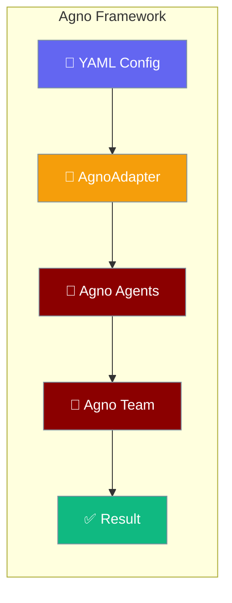
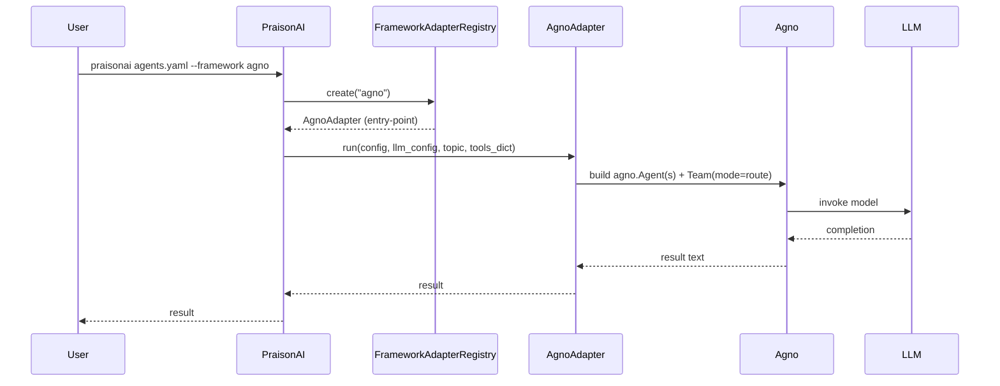

`framework: agno` connects PraisonAI's YAML and CLI to the [Agno](https://github.com/agno-agi/agno) multi-agent framework, routing tasks through Agno's `Team(mode=route)` with a single install.



## Quick Start

```python
from praisonaiagents import Agent

agent = Agent(
    name="Helper",
    instructions="Answer briefly.",
    llm="openai/gpt-4o-mini",
)

agent.start("Reply with exactly OK.")
```

The same task expressed as a `framework: agno` YAML runs through Agno's `Team(mode=route)` router — keep reading for YAML.

<Steps>

<Step title="Install">
```bash
pip install "praisonai[agno]"
```
</Step>

<Step title="Set API Key">
```bash
export OPENAI_API_KEY=your-key
```
</Step>

<Step title="Create agents.yaml">
```yaml
framework: agno
topic: Quick task
roles:
  helper:
    role: Helper
    goal: Answer briefly
    backstory: Helpful assistant
    tasks:
      answer:
        description: Reply with exactly OK.
        expected_output: OK
```
</Step>

<Step title="Run">
```bash
praisonai agents.yaml --framework agno
```
</Step>

</Steps>

<Note>
Requires `praisonai-frameworks` **0.1.8+**. Install with `pip install "praisonai[agno]"` or `pip install "praisonai-frameworks[agno]"`.
</Note>

---

## How Agno Works



Agno wraps each role into an `agno.Agent`, then assembles a `Team(mode=route)` that routes tasks to the appropriate specialist. For handoff topologies, the router agent delegates to sub-agents at runtime.

---

## Capabilities

| Capability | Supported |
|------------|-----------|
| `agent_creation` | ✅ |
| `tool_execution` | ✅ |
| `sequential_execution` | ✅ |
| `handoff` | ✅ |
| `tool_loop` | ✅ |

<Warning>
**Workflow YAML (steps-style) is not supported.** Using `framework: agno` in a workflow YAML raises:

```
ValueError: framework='agno' in workflow YAML is not supported for workflow execution
```

Use the `roles:` agents.yaml shape shown in the Quick Start above.
</Warning>

---

## Sequential Context (Task Chaining)

Tasks reference outputs of earlier tasks with `context: [task_name]`:

```yaml
framework: agno
topic: numbers
roles:
  writer:
    role: Writer
    goal: Write numbers only
    backstory: Concise writer
    tasks:
      draft:
        description: Reply with only the number 3.
        expected_output: "3"
      polish:
        description: Add 3 to the previous result. Reply with only the number.
        expected_output: "6"
        context:
          - draft
```

Multi-task configs without `handoff.to` run sequentially; context wires task outputs as inputs to subsequent tasks.

---

## Handoffs

Use `handoff.to` with a single router task; specialists are routed via Agno `Team(mode=route)`:

```yaml
framework: agno
topic: language help
roles:
  triage:
    role: Triage Agent
    handoff:
      to:
        - English Agent
    tasks:
      route:
        description: Help with {topic}
  english:
    role: English Agent
    goal: Reply in English only
    backstory: English specialist.
```

Multi-task configs with `handoff.to` fall back to sequential execution.

---

## Direct Adapter Use (Advanced)

Call the adapter without the CLI or YAML loader:

```python
from praisonai_frameworks.agno.adapter import AgnoAdapter

config = {
    "framework": "agno",
    "topic": "Quick test",
    "roles": {
        "helper": {
            "role": "Assistant",
            "goal": "Answer briefly",
            "backstory": "Helpful assistant",
            "tasks": {
                "answer": {
                    "description": "Reply with exactly the word OK.",
                    "expected_output": "OK",
                }
            },
        }
    },
}
llm_config = [{"model": "openai/gpt-4o-mini", "api_key": ""}]   # use $OPENAI_API_KEY
result = AgnoAdapter().run(config, llm_config, "Quick test", tools_dict={})
```

<Note>
Most users should use the CLI / YAML flow instead. Direct adapter calls are for advanced integration scenarios.
</Note>

---

## Verify Installation

Check availability via `praisonai doctor`:

```bash
$ praisonai doctor
✓ Runtime 'agno' available
  name: Agno
  capabilities: agent_creation, tool_execution, sequential_execution, handoff, tool_loop
```

Or check from Python:

```python
from praisonai._framework_availability import is_available

if is_available("agno"):
    print("Agno is installed and importable")
```

`_agno_probe()` checks three things in order:

1. `importlib.metadata.distribution("agno")` — the PyPI dist must be installed.
2. `importlib.util.find_spec("agno")` — the `agno` import namespace must be discoverable.
3. `from agno.agent import Agent` — the Agno `Agent` symbol must import without error.

`True` from `is_available("agno")` guarantees the adapter can run, not just that the package is on disk.

---

## Pip Extras Reference

| Extra | Installs | Required for |
|-------|----------|--------------|
| `praisonai[agno]` | `praisonai-frameworks[agno]>=0.1.8`, `praisonai-tools>=0.1.0` | Probe + doctor recognition + adapter dispatch for Agno |
| `praisonai-frameworks[agno]` (transitive) | Agno adapter implementation registered via entry-point group, plus the `agno` PyPI dist | Actually executing `framework: agno` |

<Note>
The install-hint key maps `agno` → `agno` (same name for both the YAML key and PyPI dist). The YAML key, CLI flag value, and probe name are all `agno`.
</Note>

---

## Troubleshooting

**`framework='agno' is not a valid choice`** — you are running a pre-PR-#2501 PraisonAI version. Upgrade: `pip install -U praisonai`.

**`Framework 'agno' was requested but is not installed`** — run `pip install 'praisonai[agno]'` (from your project rather than `praisonai-frameworks[agno]` alone, so `praisonai-tools` is also pulled in).

**`ValueError: framework='agno' in workflow YAML is not supported for workflow execution`** — switch the file to the `roles:` agents.yaml shape used in the Quick Start above.

**`agno` imports successfully but `is_available("agno")` returns `False`** — the probe also requires `agno` to be visible to `importlib.metadata.distribution(...)`. If the package was installed in editable or namespace-only mode without a real dist-info, the probe refuses. Install the published `agno` PyPI package.

---

## Best Practices

<AccordionGroup>
  <Accordion title="When to pick agno over other frameworks">
    Choose `agno` when you want Agno's `Team(mode=route)` routing semantics with OpenAI-compatible models. Agno supports handoffs, sequential tasks, and tool loops — making it a strong alternative to `autogen_v4` or `openai_agents` for multi-agent routing topologies.
  </Accordion>

  <Accordion title="When to use handoffs">
    Use `handoff.to` in your YAML when you need a router agent to delegate to specialists at runtime. Multi-task configs fall back to sequential execution. See [Handoffs](/docs/features/handoffs) for the full conceptual model and which frameworks support it.
  </Accordion>

  <Accordion title="Use the roles: format">
    Always use the `roles:` agents.yaml shape. The workflow `steps:` format raises a `ValueError` at validation time and is explicitly not supported for `framework: agno`.
  </Accordion>

  <Accordion title="Use context: to express task dependencies">
    Declare task dependencies with `context: [task_name]` in your YAML. This keeps the config declarative and lets the adapter wire task outputs as inputs automatically.
  </Accordion>

  <Accordion title="Sync execution only">
    The Agno adapter runs synchronously (`sync run()` only). Async task graphs are not supported in the current adapter version.
  </Accordion>
</AccordionGroup>

---

## Related

<CardGroup cols={2}>
  <Card title="Google ADK" icon="google" href="/docs/framework/google-adk">
    Google ADK framework integration — another multi-framework wrapper with handoff support
  </Card>
  <Card title="CrewAI" icon="users" href="/docs/framework/crewai">
    CrewAI framework integration
  </Card>
  <Card title="AutoGen" icon="robot" href="/docs/framework/autogen">
    AutoGen framework integration
  </Card>
  <Card title="Pydantic AI" icon="shield" href="/docs/framework/pydantic-ai">
    Pydantic AI framework integration
  </Card>
  <Card title="Framework Availability" icon="check-circle" href="/docs/features/framework-availability">
    Probe API for checking installed frameworks
  </Card>
  <Card title="Framework Adapter Plugins" icon="plug" href="/docs/features/framework-adapter-plugins">
    Register custom adapters via entry points
  </Card>
  <Card title="Handoffs" icon="arrow-right-arrow-left" href="/docs/features/handoffs">
    Handoff conceptual model and which frameworks support it
  </Card>
  <Card title="PraisonAI Agents" icon="user" href="/docs/framework/praisonaiagents">
    PraisonAI native agents framework
  </Card>
</CardGroup>
