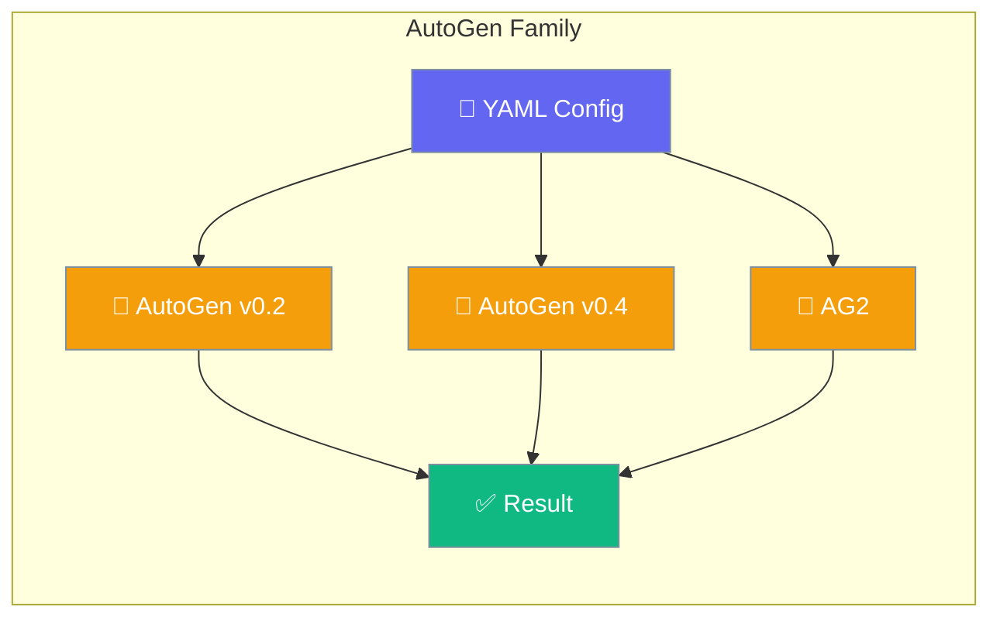
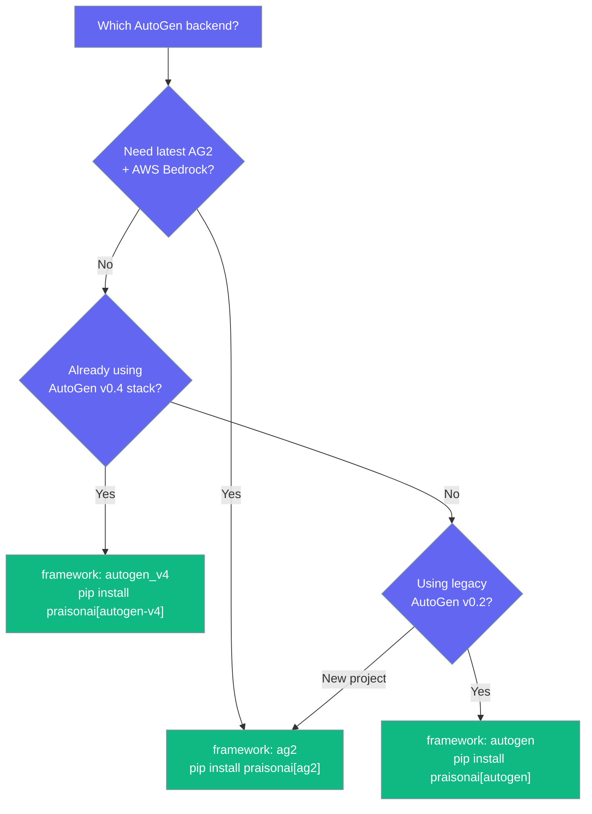
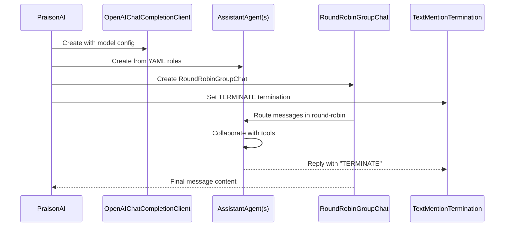
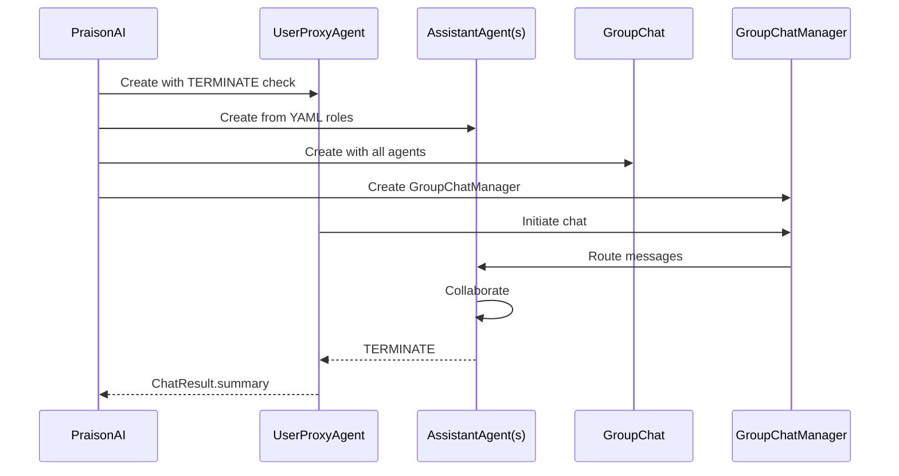

PraisonAI supports three AutoGen-family frameworks: AutoGen v0.2, AutoGen v0.4, and AG2. Each provides multi-agent collaboration with different implementations and capabilities.

<Note>
Need a framework that isn't listed here? See [Framework Adapter Plugins](/docs/features/framework-adapter-plugins) to register your own via Python entry points.
</Note>



## Which AutoGen Option to Choose

PraisonAI supports three AutoGen-family backends with different capabilities:



| Framework | Install | Best For |
|-----------|---------|----------|
| `framework: ag2` | `pip install "praisonai[ag2]"` | New projects, AWS Bedrock, latest features |
| `framework: autogen_v4` | `pip install "praisonai[autogen-v4]"` | AutoGen v0.4 stack (autogen-agentchat + autogen-ext) |
| `framework: autogen` | `pip install "praisonai[autogen]"` | Legacy AutoGen v0.2 projects |

### Async Usage

AutoGen v0.4 has a native async path — when called via `await praison.agenerate_crew_and_kickoff()`, it runs directly on the caller's loop without thread bridging. AutoGen v0.2 and AG2 work async too, but execute on a worker thread via the default `arun` implementation (transparent to the user).

See [Async Crew Kickoff](/docs/features/async-crew-kickoff) for running AutoGen crews from FastAPI, Jupyter, or other async contexts.

AutoGen availability is checked via cached `importlib.util.find_spec` — no `autogen` import during framework probes, so CLI startup stays fast even with the package installed.

---

## AutoGen v0.4

AutoGen v0.4 uses the new `autogen-agentchat` and `autogen-ext` packages with `OpenAIChatCompletionClient` and `RoundRobinGroupChat`.

<Steps>

<Step title="Install">
```bash
pip install "praisonai[autogen-v4]"
```
</Step>

<Step title="Create YAML file">
```yaml
framework: autogen_v4
topic: Research the latest developments in AI agents

roles:
  researcher:
    role: AI Research Specialist
    goal: Find and summarize recent AI agent developments
    backstory: Expert researcher with deep knowledge of AI trends.
    tasks:
      research_task:
        description: Research the latest developments in {topic}
        expected_output: Summary report with key findings
```
</Step>

<Step title="Run">
```bash
export OPENAI_API_KEY=your-key
praisonai agents.yaml --framework autogen_v4
```
</Step>

</Steps>

### How AutoGen v0.4 Works



### AutoGen v0.4 Features

- **Model Configuration**: Reads `llm_config[0]` for `model`, `api_key`, `base_url` (defaults: `gpt-4o-mini`, `OPENAI_API_KEY`, `https://api.openai.com/v1`)
- **Agent Creation**: One `AssistantAgent` per YAML role with `reflect_on_tool_use=True`
- **Agent Name Sanitization**: Non-alphanumeric characters become `_`, leading digits get `agent_` prefix, Python keywords get trailing `_`
- **Tool Registration**: Tools must expose `.run()` method, passed to `AssistantAgent(tools=...)`
- **Execution**: `RoundRobinGroupChat` with `TextMentionTermination("TERMINATE") | MaxMessageTermination(max_messages=20)`
- **Turn Limit**: `max_turns = len(agents) * 3` (currently hardcoded)

<Warning>
Agent names are auto-sanitized: `"Research Analyst!"` becomes `"Research_Analyst_"`. This ensures valid Python identifiers for AutoGen v0.4 internal usage.
</Warning>

---

## AG2 (Full)

AG2 is the community fork of AutoGen with enhanced features and AWS Bedrock support.

<Steps>

<Step title="Install">
```bash
pip install "praisonai[ag2]"
```
</Step>

<Step title="Create YAML file">
```yaml
framework: ag2
topic: Write a technical analysis report

roles:
  analyst:
    role: Technical Analyst
    goal: Analyze market data and trends
    backstory: Expert in financial analysis with 10 years experience.
    tasks:
      analysis_task:
        description: Analyze the technical indicators for {topic}
        expected_output: Detailed technical analysis with charts and recommendations
```
</Step>

<Step title="Run">
```bash
export OPENAI_API_KEY=your-key
praisonai agents.yaml --framework ag2
```
</Step>

</Steps>

### How AG2 Works



### AG2 Features

- **LLM Configuration**: Resolution order: top-level `llm.*` > first role's `llm.*` > `llm_config[0]` > environment > defaults
- **AWS Bedrock**: `api_type: bedrock` skips `api_key`, uses AWS SDK credential chain
- **Tool Registration**: Uses `assistant.register_for_llm()` + `user_proxy.register_for_execution()`
- **Agent Names**: Sanitized with `[^a-zA-Z0-9_\-]` → `_`
- **GroupChat**: Standard `GroupChat(max_round=12)` with `GroupChatManager`
- **Result Extraction**: Prefers `chat_result.summary`, falls back to scanning messages in reverse

### YAML `llm` Block Precedence

For AG2, the `llm:` configuration can be placed at the top level or under the first role:

| Location | Priority | Example |
|----------|----------|---------|
| Top-level | Highest | `llm: { model: "gpt-4o", api_key: "..." }` |
| First role | Medium | `roles: { analyst: { llm: { ... } } }` |
| Dispatcher | Lowest | `llm_config[0]` from command |

### AWS Bedrock with AG2

```yaml
framework: ag2
topic: Cloud architecture design

roles:
  cloud_architect:
    role: AWS Solutions Architect
    goal: Design scalable cloud architectures
    backstory: Expert in AWS services and serverless design.
    llm:
      model: bedrock/anthropic.claude-3-5-sonnet-20241022-v2:0
      api_type: bedrock
      aws_region: us-east-1
    tasks:
      design_task:
        description: Design a serverless architecture for {topic}
        expected_output: Architecture diagram with component descriptions
```

<Info>
With `api_type: bedrock`, no `api_key` is required. AG2 uses standard AWS credentials from `~/.aws/credentials`, environment variables, or IAM roles.
</Info>

---

## AutoGen v0.2 (Legacy)

Original AutoGen v0.2 support for existing projects.

<Steps>

<Step title="Install">
```bash
pip install "praisonai[autogen]"
```
</Step>

<Step title="Create YAML file">
```yaml
framework: autogen
topic: Create a movie script about cats on Mars

roles:
  researcher:
    role: Research Analyst
    goal: Gather information about Mars and cat behavior
    backstory: Skilled researcher with focus on accurate information.
    tasks:
      research_task:
        description: Research Mars environment and cat behavior for {topic}
        expected_output: Research findings document with key facts
```
</Step>

<Step title="Run">
```bash
export OPENAI_API_KEY=your-key
praisonai agents.yaml --framework autogen
```
</Step>

</Steps>

### AutoGen v0.2 Features

- **Simple Architecture**: `UserProxyAgent` + `AssistantAgent` with `initiate_chats`
- **Configuration**: Uses `config_list` format for LLM configuration
- **Code Execution**: Built-in `code_execution_config` with working directory
- **Termination**: Checks for "terminate" or "TERMINATE" in message content
- **Tool Support**: Limited compared to v0.4 and AG2

---

## Troubleshooting

### Installation Errors

- **AutoGen v0.4**: `pip install "praisonai[autogen-v4]"` — requires both `autogen-agentchat` and `autogen-ext`
- **AG2**: `pip install "praisonai[ag2]"` — requires AG2 distribution
- **AutoGen v0.2**: `pip install "praisonai[autogen]"` — requires legacy `autogen` package

### Import Errors

- **v0.4 missing `autogen_agentchat`**: Install `autogen-agentchat` package
- **v0.4 missing `autogen_ext`**: Install `autogen-ext` package
- **AG2 not detected**: Ensure both `ag2` distribution and `autogen` namespace are available

### Agent Name Issues

- **AG2**: `Research Analyst!` → `Research_Analyst_` (sanitization is intentional)
- **v0.4**: Names become valid Python identifiers (e.g., `"123Agent"` → `"agent_123Agent"`)

### Bedrock Configuration

- **Missing AWS credentials**: `api_type: bedrock` requires standard AWS credential setup
- **Wrong region**: Ensure `aws_region` matches your Bedrock model availability

### Message Generation

- **v0.4 "No messages generated"**: `MaxMessageTermination(20)` was hit; consider the hardcoded `max_turns = len(agents) * 3` limitation

**Not-yet-implemented adapters**: 
- `framework: autogen_v4` raises `NotImplementedError("AutoGen v0.4 adapter is not yet fully implemented. Please use 'autogen' framework for AutoGen v0.2 support.")`
- `framework: ag2` (the placeholder `AG2Adapter`, distinct from the working `ag2` backend) raises `NotImplementedError("AG2 adapter is not yet fully implemented. Please use 'autogen' framework for AutoGen/AG2 support.")`

Use `framework: autogen` (v0.2) or the fully-registered `framework: ag2` backend instead.

**Plugin authors**: Framework adapters now accept dispatcher kwargs (`tools_dict`, `agent_callback`, `task_callback`, `cli_config`). See [Framework Adapter Plugins](/docs/features/framework-adapter-plugins) for custom adapter development.

If the framework is not installed, PraisonAI now fails fast at CLI entry with:
```
Framework 'autogen' was requested but is not installed.
Install it with:
    pip install 'praisonai[autogen]'  # or: pip install pyautogen
```
The error appears **immediately**, before YAML parsing — so a typo in `--framework` is caught before any expensive setup runs.

---

## Best Practices

<AccordionGroup>
  <Accordion title="Choose the right backend for your needs">
    Use AG2 for new projects with Bedrock needs, AutoGen v0.4 for existing v0.4 stacks, and AutoGen v0.2 only for legacy compatibility.
  </Accordion>

  <Accordion title="Plan for agent name sanitization">
    Both AG2 and v0.4 sanitize agent names differently. Test your role names to understand the final agent identifiers.
  </Accordion>

  <Accordion title="Configure LLM settings appropriately">
    AG2 supports top-level `llm:` blocks for shared configuration. AutoGen v0.4 uses `llm_config[0]` from the dispatcher.
  </Accordion>

  <Accordion title="Use tools properly for each backend">
    AutoGen v0.4 requires tools with `.run()` methods. AG2 uses `register_for_llm`/`register_for_execution` pattern.
  </Accordion>
</AccordionGroup>

---

## Related

<CardGroup cols={2}>
  <Card title="CrewAI" icon="users" href="/framework/crewai">
    CrewAI framework integration
  </Card>
  <Card title="PraisonAI Agents" icon="user" href="/framework/praisonaiagents">
    PraisonAI native agents framework
  </Card>
</CardGroup>