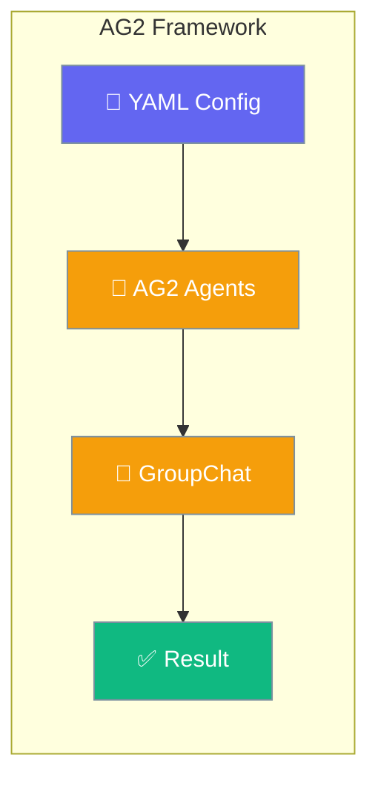
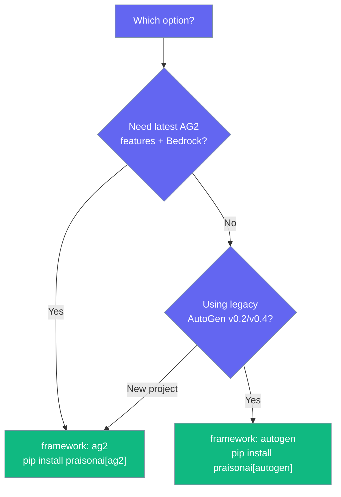
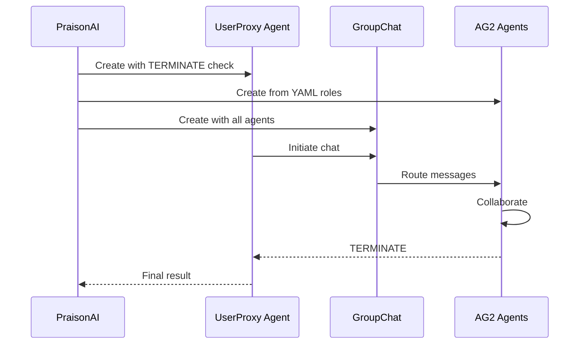

AG2 is the community fork of AutoGen. PraisonAI supports AG2 as a dedicated framework backend with GroupChat orchestration, automatic tool registration, and native AWS Bedrock support.



## Which AG2 Option to Choose

PraisonAI has two AG2-related framework options:



| Option | Install | When to Use |
|--------|---------|-------------|
| `framework: ag2` | `pip install "praisonai[ag2]"` | New projects, Bedrock support, latest AG2 |
| `framework: autogen` | `pip install "praisonai[autogen]"` | Existing AutoGen v0.2/v0.4 projects |

---

## Quick Start (AG2)

<Steps>

<Step title="Install">
```bash
pip install "praisonai[ag2]"
```
</Step>

<Step title="Create a YAML file">
```yaml
framework: ag2
topic: Research the latest developments in AI agents

roles:
  researcher:
    role: AI Research Specialist
    goal: Find and summarize recent AI agent developments
    backstory: Expert researcher with deep knowledge of AI trends.
    tasks:
      research_task:
        description: Research the latest developments in {topic}
        expected_output: Summary report with key findings
```
</Step>

<Step title="Run">
```bash
export OPENAI_API_KEY=your-key
praisonai agents.yaml --framework ag2
```
</Step>

</Steps>

---

## How AG2 Works



AG2 uses a **GroupChat** pattern: a `UserProxy` agent initiates the conversation, and a `GroupChatManager` routes messages between your defined agents. Agents collaborate until one says "TERMINATE".

---

## Multi-Agent Example

```yaml
framework: ag2
topic: Write a blog post about renewable energy

roles:
  researcher:
    role: Energy Research Analyst
    goal: Gather facts about renewable energy trends
    backstory: Expert in energy research and data analysis.
    tasks:
      research_task:
        description: Research current renewable energy trends for {topic}
        expected_output: Research brief with statistics and trends

  writer:
    role: Content Writer
    goal: Write engaging blog content based on research
    backstory: Skilled writer who turns technical research into readable content.
    tasks:
      writing_task:
        description: Write a blog post based on the research findings
        expected_output: Complete blog post with introduction, body, and conclusion
```

```bash
praisonai agents.yaml --framework ag2
```

---

## AWS Bedrock Support

AG2 natively supports AWS Bedrock models. No API key needed - uses your AWS credentials.

```yaml
framework: ag2

roles:
  cloud_architect:
    role: Cloud Solutions Architect
    goal: Design cloud architectures
    backstory: Expert in AWS cloud infrastructure.
    llm:
      model: bedrock/anthropic.claude-3-5-sonnet-20241022-v2:0
      api_type: bedrock
      aws_region: us-east-1
    tasks:
      design_task:
        description: Design a serverless architecture for a web app
        expected_output: Architecture diagram and component descriptions
```

Bedrock credentials come from your standard AWS setup (`~/.aws/credentials`, environment variables, or IAM role).

---

## Auto Mode

```bash
praisonai --framework ag2 --auto "Create a Movie Script About Cat in Mars"
```

---

## Legacy AutoGen (v0.2 / v0.4)

For existing projects using the older AutoGen package:

```bash
pip install "praisonai[autogen]"
```

```yaml
framework: autogen
topic: Create Movie Script About Cat in Mars

roles:
  researcher:
    role: Research Analyst
    goal: Gather information about Mars and cats
    backstory: Skilled in research, with a focus on gathering accurate and relevant information.
    tasks:
      research_task:
        description: Research about Mars environment and cat behavior
        expected_output: Research findings document with key facts
```

```bash
praisonai agents.yaml --framework autogen
```

### AutoGen Version Selection

```bash
# Use AutoGen v0.4 (default if available)
export AUTOGEN_VERSION=v0.4

# Use AutoGen v0.2
export AUTOGEN_VERSION=v0.2

# Auto-select (default: prefers v0.4)
export AUTOGEN_VERSION=auto
```

---

## Framework Selection Priority

1. **CLI flag** (`--framework ag2`) takes precedence
2. **YAML file** (`framework: ag2`) is used if no CLI flag
3. **Default**: praisonai framework

<Note>
The `roles` format YAML is required for both `ag2` and `autogen` frameworks. The newer `steps` + `agents` workflow format only supports the praisonai framework.
</Note>

<Warning>
Direct prompts always use the praisonai framework regardless of the `--framework` flag:

```bash
# This will use praisonai, NOT ag2
praisonai "What is 2+2?" --framework ag2
```

To use AG2, provide a YAML file with the `roles` format.
</Warning>

---

## Best Practices

<AccordionGroup>
  <Accordion title="Use AG2 for new projects">
    The dedicated `ag2` framework uses the latest AG2 package with `LLMConfig` support and native Bedrock. Use `autogen` only for existing codebases.
  </Accordion>

  <Accordion title="Keep agent roles focused">
    Each role should have a clear, distinct responsibility. The GroupChat manager routes messages based on role descriptions.
  </Accordion>

  <Accordion title="Use Bedrock for AWS environments">
    Set `api_type: bedrock` in the role's `llm` config. No API keys needed when running on AWS with proper IAM roles.
  </Accordion>
</AccordionGroup>

---

## Related

<CardGroup cols={2}>
  <Card title="CrewAI" icon="users" href="/framework/crewai">
    CrewAI framework integration
  </Card>
  <Card title="Agents" icon="user" href="/concepts/agents">
    PraisonAI native agents
  </Card>
</CardGroup>
