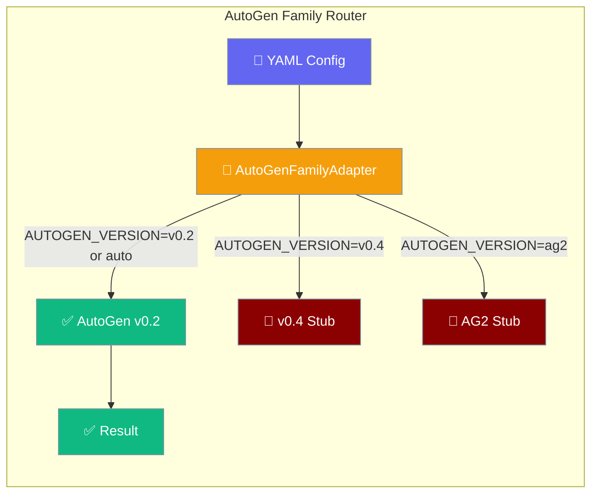
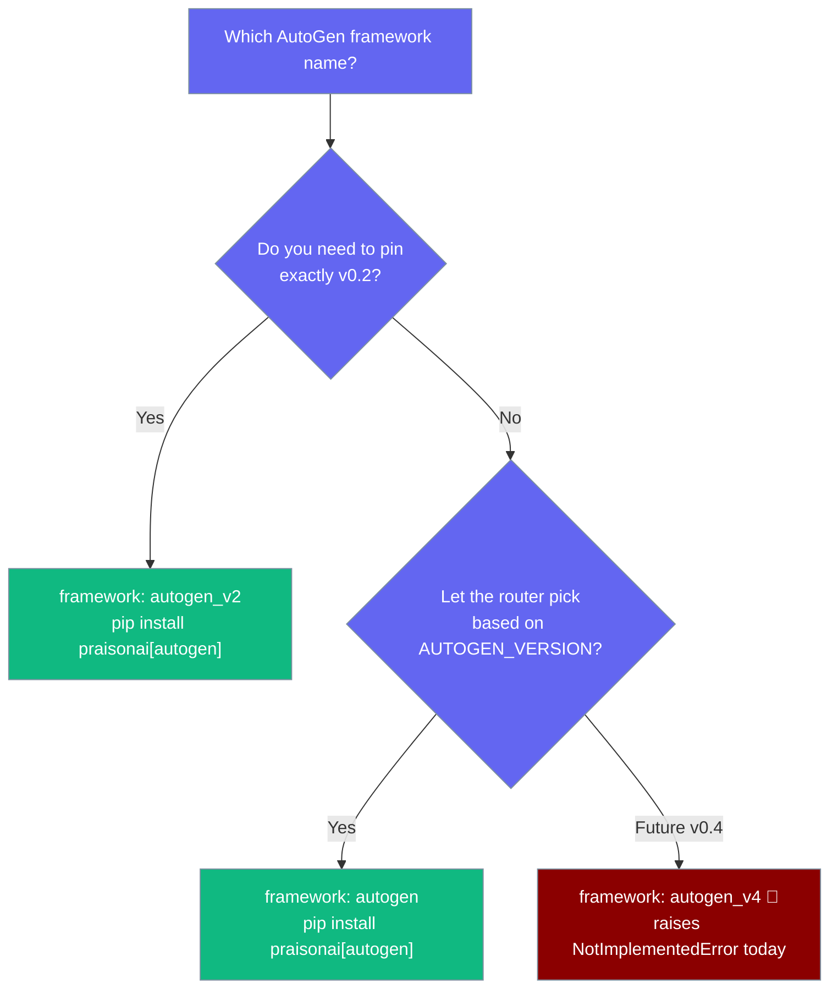
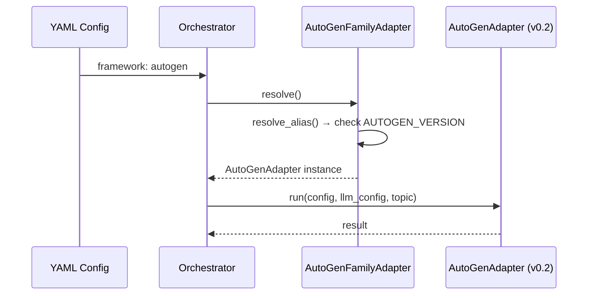

PraisonAI integrates with the AutoGen family via a version router that picks the right adapter at runtime.

<Warning>
AutoGen v0.4 (`framework: autogen_v4`) and the standalone AG2 adapter (`framework: ag2`) are **not yet implemented in PraisonAI**. Calling them raises `NotImplementedError` with a pointer to `framework: autogen` (v0.2). Track [issue #1590](https://github.com/MervinPraison/PraisonAI/issues/1590) for implementation status.
</Warning>

<Note>
Need a framework that isn't listed here? See [Framework Adapter Plugins](/docs/features/framework-adapter-plugins) to register your own via Python entry points.
</Note>



## Which AutoGen Option to Choose

Only AutoGen v0.2 is working today. Both v0.4 and AG2 adapters are stubs that raise `NotImplementedError`.



| Framework | Install | Best For | Status |
|-----------|---------|----------|--------|
| `framework: autogen` | `pip install "praisonai[autogen]"` | Family router — picks variant via `AUTOGEN_VERSION` | ✅ Working (v0.2 only) |
| `framework: autogen_v2` | `pip install "praisonai[autogen]"` | Pin v0.2 directly, skip the router | ✅ Working |
| `framework: autogen_v4` | `pip install "praisonai[autogen-v4]"` | Future AutoGen v0.4 support | 🚧 Stub — raises `NotImplementedError` |
| `framework: ag2` | `pip install "praisonai[ag2]"` | Future AG2 support | 🚧 Stub — raises `NotImplementedError` |

---

## Auto Version Selection

`framework: autogen` routes to a family adapter that picks the concrete version at runtime. Control it with the YAML `autogen_version` field (takes precedence) or `AUTOGEN_VERSION`:

| Source | Precedence |
|---|---|
| `autogen_version:` in team YAML | Highest — overrides env var |
| `$AUTOGEN_VERSION` env var | Used when YAML field is absent |
| `"auto"` | Default when neither is set |

```yaml
framework: autogen
autogen_version: v0.2   # "auto" | "v0.2" | "v0.4"
```

| `autogen_version` / `AUTOGEN_VERSION` | Behaviour |
|---|---|
| `auto` (default) | Pick `autogen_v2` if available, else `autogen_v4` (with warning), else `ag2`. If none available, raise `ImportError` with install hints. |
| `v0.2` | Force `autogen_v2`. Warns if not installed; still returns the name (caller hits `ImportError` at run). |
| `v0.4` | Force `autogen_v4`. **Currently raises `NotImplementedError` at run** — adapter is a stub. |
| `ag2` | Force `ag2`. **Currently raises `NotImplementedError` at run** — adapter is a stub. |

<Note>
`auto` no longer prefers v0.4. Until the v0.4 adapter is implemented (`implemented = True`), it is treated as unavailable and `auto` lands on v0.2.
</Note>

```bash
# Force v0.2 (default behaviour)
export AUTOGEN_VERSION=v0.2
praisonai agents.yaml --framework autogen

# Explicit v0.2 alias — skip the router entirely
praisonai agents.yaml --framework autogen_v2
```

<Note>
If you write `framework: autogen_v4` or `framework: autogen_v2` directly in YAML, the version-resolution step is skipped — you get exactly that adapter. The `AUTOGEN_VERSION` env var only applies when `framework: autogen` is used.
</Note>

If no AutoGen variant is installed, the family router raises:

```python
# No AutoGen variant installed → ImportError:
#   No AutoGen variant is available. Install with:
#     pip install 'praisonai[autogen]' for v0.2
#     pip install 'praisonai[autogen-v4]' for v0.4
#     pip install 'praisonai[ag2]' for AG2
```

---

## AutoGen v0.2

Original AutoGen v0.2 support — the only fully-working AutoGen adapter today.

<Steps>

<Step title="Install">
```bash
pip install "praisonai[autogen]"
```
</Step>

<Step title="Create YAML file">
```yaml
framework: autogen
topic: Create a movie script about cats on Mars

roles:
  researcher:
    role: Research Analyst
    goal: Gather information about Mars and cat behavior
    backstory: Skilled researcher with focus on accurate information.
    tasks:
      research_task:
        description: Research Mars environment and cat behavior for {topic}
        expected_output: Research findings document with key facts
```
</Step>

<Step title="Run">
```bash
export OPENAI_API_KEY=sk-...
praisonai agents.yaml --framework autogen
```
</Step>

</Steps>

### Pin v0.2 directly

Use `autogen_v2` to skip the family router and get AutoGen v0.2 unconditionally:

```yaml
framework: autogen_v2
topic: Create a movie script about cats on Mars

roles:
  researcher:
    role: Research Analyst
    goal: Gather information about Mars and cat behavior
    backstory: Skilled researcher with focus on accurate information.
    tasks:
      research_task:
        description: Research Mars environment and cat behavior for {topic}
        expected_output: Research findings document with key facts
```

```bash
praisonai agents.yaml --framework autogen_v2
```

### AutoGen v0.2 Features

- **Simple Architecture**: `UserProxyAgent` + `AssistantAgent` with `initiate_chats`
- **Configuration**: Uses `config_list` format for LLM configuration
- **Code Execution**: Built-in `code_execution_config` with working directory
- **Termination**: Checks for `"terminate"` or `"TERMINATE"` in message content

---

## AutoGen v0.4

<Warning>
The `autogen_v4` adapter is currently a stub. `framework: autogen_v4` raises `NotImplementedError` at runtime:

```
NotImplementedError: AutoGen v0.4 adapter is not yet implemented. Use framework='autogen' (v0.2) or pin AUTOGEN_VERSION=v0.2.
```

Use `framework: autogen` (or `framework: autogen_v2`) for working AutoGen support.
</Warning>

`AutoGenV4Adapter.implemented = False` causes `is_available()` to return `False`, so `framework: autogen` and `AUTOGEN_VERSION=auto` will not route to it.

When implemented, AutoGen v0.4 will use `autogen-agentchat` + `autogen-ext` with `OpenAIChatCompletionClient` and `RoundRobinGroupChat`.

Track [issue #1590](https://github.com/MervinPraison/PraisonAI/issues/1590) for implementation status.

---

## AG2

<Warning>
The standalone `AG2Adapter` is currently a stub. `framework: ag2` raises `NotImplementedError` at runtime:

```
NotImplementedError: AG2 adapter is not yet implemented. Use framework='autogen' (v0.2) or pin AUTOGEN_VERSION=v0.2.
```

Use `framework: autogen` for working AutoGen/AG2-family support via v0.2.
</Warning>

`AG2Adapter.implemented = False` causes `is_available()` to return `False`, so `AUTOGEN_VERSION=ag2` will log a warning and fall through.

Track [issue #1590](https://github.com/MervinPraison/PraisonAI/issues/1590) for implementation status.

---

## How the AutoGen Family Router Works

`AutoGenFamilyAdapter` (registered as `autogen`) is a router — it never runs directly. Instead it calls `resolve()` to get the concrete adapter, which the orchestrator then calls `.run()` on.



`AutoGenFamilyAdapter.run()` raises `RuntimeError` if called directly — this is intentional. Always go through the orchestrator.

---

## Troubleshooting

### Import Errors

When no AutoGen variant is installed and `framework: autogen` is used:

```
ImportError: No AutoGen variant is available. Install with:
  pip install 'praisonai[autogen]' for v0.2
  pip install 'praisonai[autogen-v4]' for v0.4
  pip install 'praisonai[ag2]' for AG2
```

Fix: `pip install "praisonai[autogen]"` for v0.2 (the only working option today).

### NotImplementedError on v0.4 or AG2

```
NotImplementedError: AutoGen v0.4 adapter is not yet implemented. Use framework='autogen' (v0.2) or pin AUTOGEN_VERSION=v0.2.
NotImplementedError: AG2 adapter is not yet implemented. Use framework='autogen' (v0.2) or pin AUTOGEN_VERSION=v0.2.
```

Switch to `framework: autogen` or `framework: autogen_v2`. Both adapters are stubs pending [issue #1590](https://github.com/MervinPraison/PraisonAI/issues/1590).

### Pinning AutoGen versions

Setting `AUTOGEN_VERSION=v0.4` or `AUTOGEN_VERSION=ag2` (or YAML `autogen_version: v0.4`) now raises `ImportError` if the requested variant is not registered, instead of silently falling back to v0.2. Workflow-level `autogen_version` in config/YAML takes precedence over the env var. Use `AUTOGEN_VERSION=auto` (or omit it) to allow fallback.

Since `autogen_v4` and `ag2` adapters are unregistered stubs by default, `--framework autogen` resolves to v0.2 unless you install an entry-point plugin that registers `autogen_v4` or `ag2`.

### AUTOGEN_VERSION=v0.4 warns but continues

When `AUTOGEN_VERSION=v0.4` is set but v0.4 is not installed (or is a stub), the router logs a warning and returns `"autogen_v4"` — the caller then hits `NotImplementedError` when `.run()` is invoked. This is expected behaviour; switch to `v0.2`.

**Plugin authors**: Framework adapters now accept dispatcher kwargs (`tools_dict`, `agent_callback`, `task_callback`, `cli_config`). See [Framework Adapter Plugins](/docs/features/framework-adapter-plugins) for custom adapter development.

---

## Best Practices

<AccordionGroup>
  <Accordion title="Use framework: autogen for new projects">
    `framework: autogen` is the recommended name — it routes through the family adapter and will automatically switch to v0.4 or AG2 once those adapters are implemented, without needing YAML changes.
  </Accordion>

  <Accordion title="Use framework: autogen_v2 to pin v0.2 explicitly">
    If you need to guarantee v0.2 regardless of `AUTOGEN_VERSION`, write `framework: autogen_v2`. This skips the family router entirely.
  </Accordion>

  <Accordion title="Do not use framework: autogen_v4 or framework: ag2 yet">
    Both raise `NotImplementedError` today. Using them will fail at runtime. Wait for [issue #1590](https://github.com/MervinPraison/PraisonAI/issues/1590).
  </Accordion>

  <Accordion title="Check adapter availability correctly">
    `is_available("autogen")` from `_framework_availability` tests whether the `autogen` Python package is importable. `AutoGenV4Adapter().is_available()` additionally folds in the `implemented = False` marker. Always use the adapter method to test dispatch-readiness.
  </Accordion>
</AccordionGroup>

---

## Related

<CardGroup cols={2}>
  <Card title="CrewAI" icon="users" href="/docs/framework/crewai">
    CrewAI framework integration
  </Card>
  <Card title="PraisonAI Agents" icon="user" href="/docs/framework/praisonaiagents">
    PraisonAI native agents framework
  </Card>
</CardGroup>
