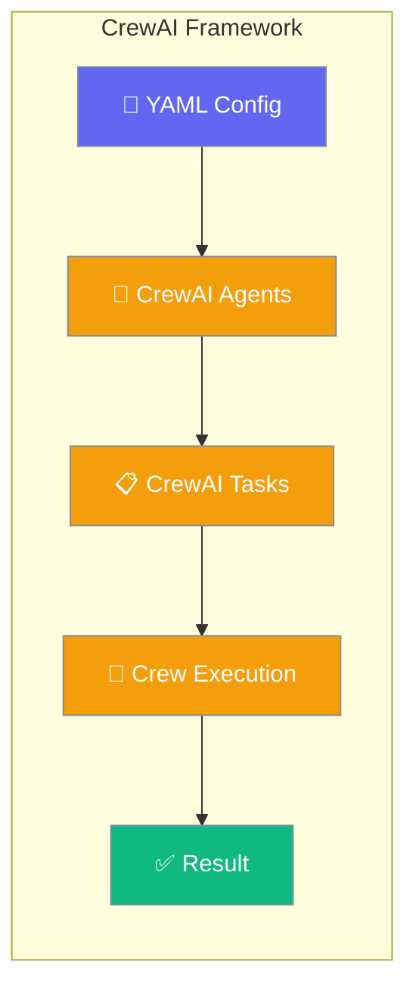
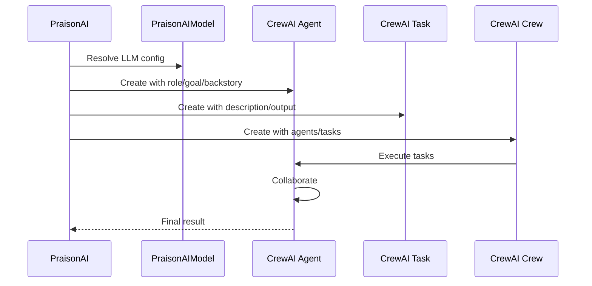

CrewAI framework integration with PraisonAI provides collaborative multi-agent workflows with advanced configuration options for agents, tasks, and execution.

<Note>
Need a framework that isn't listed here? See [Framework Adapter Plugins](/docs/features/framework-adapter-plugins) to register your own via Python entry points.
</Note>



## Quick Start

<Steps>

<Step title="Install">
```bash
pip install "praisonai[crewai]"
```
</Step>

<Step title="Create YAML file">
```yaml
framework: crewai
topic: Create Movie Script About Cat in Mars

roles:
  researcher:
    role: Research Analyst
    goal: Gather information about Mars and cats
    backstory: Skilled in research, with a focus on gathering accurate and relevant information.
    tasks:
      research_task:
        description: Research about Mars environment and cat behavior for the movie concept
        expected_output: Research findings document with key facts
```
</Step>

<Step title="Run">
```bash
export OPENAI_API_KEY=your-key
praisonai agents.yaml --framework crewai
```

<Note>
CrewAI is no longer the default framework. You must either pass `--framework crewai` or set `framework: crewai` in your YAML to use CrewAI.
</Note>
</Step>

</Steps>

---

## How CrewAI Works



---

## YAML Format for CrewAI

CrewAI requires the **`roles` format** YAML (not the `steps` workflow format):

```yaml
framework: crewai
topic: Create Movie Script About Cat in Mars

roles:
  researcher:
    role: Research Analyst
    goal: Gather information about Mars and cats
    backstory: Skilled in research, with a focus on gathering accurate and relevant information.
    tasks:
      research_task:
        description: Research about Mars environment and cat behavior
        expected_output: Research findings document with key facts
```

<Note>
The `--framework crewai` flag only works with YAML files using the `roles` format. The newer `steps` + `agents` workflow format only supports the praisonai framework.
</Note>

---

## Advanced YAML Fields

PraisonAI's CrewAI adapter supports extensive configuration options for both agents and tasks:

### Agent-Level Fields

Configure advanced agent behavior under each `roles.<name>`:

| YAML Key | Type | Default | Description | Maps to CrewAI |
|----------|------|---------|-------------|----------------|
| `llm` | object | inherits dispatcher | LLM configuration via `PraisonAIModel` | `llm=` |
| `function_calling_llm` | object | inherits dispatcher | Separate LLM for function calls | `function_calling_llm=` |
| `allow_delegation` | bool | `False` | Allow agent to delegate tasks | `allow_delegation=` |
| `max_iter` | int | `15` | Maximum iterations per agent | `max_iter=` |
| `max_rpm` | int | `None` | Requests per minute throttle | `max_rpm=` |
| `max_execution_time` | int | `None` | Execution timeout in seconds | `max_execution_time=` |
| `verbose` | bool | `True` | Enable verbose output | `verbose=` |
| `cache` | bool | `True` | Enable LLM response caching | `cache=` |
| `system_template` | str | `None` | Override system prompt template | `system_template=` |
| `prompt_template` | str | `None` | Override prompt template | `prompt_template=` |
| `response_template` | str | `None` | Override response template | `response_template=` |

### Task-Level Fields

Configure advanced task behavior under each `roles.<name>.tasks.<task_name>`:

| YAML Key | Type | Default | Description | Maps to CrewAI |
|----------|------|---------|-------------|----------------|
| `description` | str | required | Task description | `description=` |
| `expected_output` | str | required | Expected output format | `expected_output=` |
| `tools` | list[str] | `[]` | Tool names from `tools_dict` | `tools=` |
| `async_execution` | bool | `False` | Execute task asynchronously | `async_execution=` |
| `context` | list[str] | `[]` | Task dependencies by name | `context=` (resolved to Task objects) |
| `config` | object | `{}` | Free-form task configuration | `config=` |
| `output_json` | type | `None` | Pydantic schema for JSON output | `output_json=` |
| `output_pydantic` | type | `None` | Pydantic model class | `output_pydantic=` |
| `output_file` | str | `""` | Output file path | `output_file=` |
| `callback` | callable | `None` | Task completion callback | `callback=` |
| `human_input` | bool | `False` | Require human input | `human_input=` |
| `create_directory` | bool | `False` | Create parent directories | `create_directory=` |

---

## Advanced Configuration Example

```yaml
framework: crewai
topic: Quarterly report

roles:
  analyst:
    role: Financial Analyst
    goal: Extract Q3 numbers from the input docs
    backstory: Senior analyst, CFA, 10y experience.
    llm:
      model: openai/gpt-4o
    function_calling_llm:
      model: openai/gpt-4o-mini
    max_iter: 20
    verbose: true
    cache: true
    system_template: "You are a precise financial analyst. Never invent figures."
    tasks:
      extract_numbers:
        description: Pull revenue, COGS, opex for Q3 from {topic}
        expected_output: A JSON table with revenue, cogs, opex.
        tools: ["file_reader", "calculator"]
        async_execution: false

  writer:
    role: Report Writer
    goal: Write a narrative summary
    backstory: Equity-research writer.
    llm:
      model: openai/gpt-4o
    max_iter: 10
    verbose: false
    system_template: "You are a precise, hedge-friendly equity research writer."
    tasks:
      draft_summary:
        description: Draft a 200-word summary of the extracted numbers.
        expected_output: A 200-word markdown summary.
        context: [extract_numbers]
        output_file: out/q3_summary.md
        create_directory: true
        human_input: false
```

---

## LLM Configuration

### Model Resolution

The CrewAI adapter resolves LLM configuration in this order:

1. **Agent-level `llm`**: `roles.<agent>.llm.*`
2. **Global `llm_config`**: From CLI dispatcher
3. **Environment**: `MODEL_NAME` environment variable
4. **Default**: `openai/gpt-4o-mini`

### Function Calling LLM

Use `function_calling_llm` to specify a different model for tool calls:

```yaml
roles:
  researcher:
    role: Research Analyst
    llm:
      model: openai/gpt-4o          # For reasoning
    function_calling_llm:
      model: openai/gpt-4o-mini     # For tool calls (cheaper/faster)
```

---

## Task Dependencies

Use the `context` field to create task dependencies. Reference tasks by name:

```yaml
roles:
  researcher:
    tasks:
      research_phase:
        description: Research the topic thoroughly
        expected_output: Research findings

  analyst:
    tasks:
      analysis_phase:
        description: Analyze the research findings
        expected_output: Analysis report
        context: [research_phase]  # Wait for research_phase to complete
```

<Info>
The `context` field accepts a list of task names (strings), not Task objects. The adapter resolves them automatically after all tasks are created.
</Info>

---

## File Output

Use `output_file` with `create_directory` to save task results:

```yaml
tasks:
  report_task:
    description: Generate final report
    expected_output: Comprehensive report
    output_file: reports/final_report.md
    create_directory: true  # Creates 'reports/' directory if needed
```

---

## AgentOps Integration

When `agentops` is installed, the CrewAI adapter automatically calls `finalize_observability(self.name, status=…)` (from `praisonai.observability.hooks`) from a `finally` block after crew execution. `status` is derived from `sys.exc_info()`: `"Success"` on the happy path, `"Failure"` on any exception including cancellation. No configuration required. See [Observability Hooks](/docs/features/observability-hooks) for details.

```bash
pip install agentops
# AgentOps tracking is automatically enabled
```

---

## Framework Selection Priority

1. **CLI flag** (`--framework crewai`) takes precedence
2. **YAML file** (`framework: crewai`) is used if no CLI flag
3. **Default**: praisonai framework

---

## Auto Mode

```bash
praisonai --framework crewai --auto "Create a Movie Script About Cat in Mars"
```

---

## Troubleshooting

### Common Issues

**Task context not found**: If `context: [some_task]` fails, ensure `some_task` exists as a key under any role's `tasks:` block in the same YAML file.

**Function calling LLM inheritance**: `function_calling_llm` falls back to `MODEL_NAME` environment variable or `openai/gpt-4o-mini`, not the agent's main `llm` configuration.

**Direct prompt limitation**: Direct prompts (`praisonai "question" --framework crewai`) always use the praisonai framework. Use YAML files with `roles` format for CrewAI.

**Missing installation error**: If the framework is not installed, PraisonAI now fails fast at CLI entry with:
```
Framework 'crewai' was requested but is not installed.
Install it with:
    pip install 'praisonai[crewai]'   # or: pip install crewai
```
The error appears **immediately**, before YAML parsing — so a typo in `--framework` is caught before any expensive setup runs.

### Installation Errors

- **Missing CrewAI**: `pip install "praisonai[crewai]"`
- **Tool resolution issues**: Ensure tool names in `tools: []` exist in the global `tools_dict`

---

## Best Practices

<AccordionGroup>
  <Accordion title="Use function_calling_llm for cost optimization">
    Set a cheaper/faster model for `function_calling_llm` while using a more capable model for reasoning tasks.
  </Accordion>

  <Accordion title="Structure task dependencies clearly">
    Use descriptive task names in `context: []` lists. The order doesn't matter, but referenced tasks must exist.
  </Accordion>

  <Accordion title="Leverage output files for complex workflows">
    Use `output_file` with `create_directory: true` for tasks that produce artifacts other agents need to reference.
  </Accordion>

  <Accordion title="Configure timeouts appropriately">
    Set `max_execution_time` for long-running tasks and `max_iter` to prevent infinite loops.
  </Accordion>
</AccordionGroup>

---

## Related

<CardGroup cols={2}>
  <Card title="AutoGen" icon="robot" href="/docs/framework/autogen">
    AutoGen framework integration
  </Card>
  <Card title="PraisonAI Agents" icon="user" href="/docs/framework/praisonaiagents">
    PraisonAI native agents framework
  </Card>
</CardGroup>

