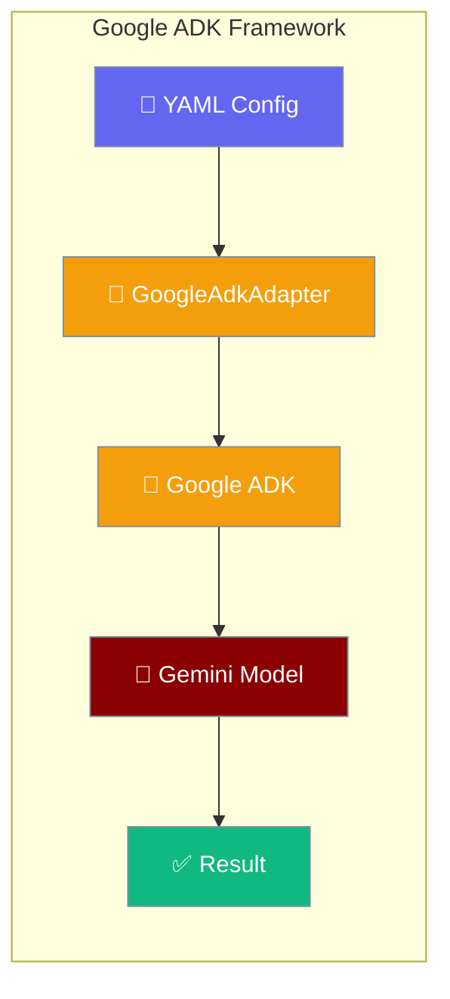
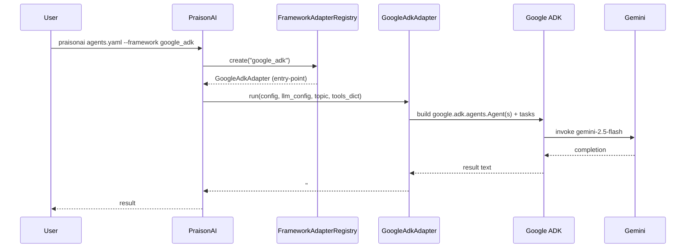

`framework: google_adk` connects PraisonAI's YAML and CLI to Google's Agent Development Kit, running your tasks against Gemini models with a single install.

<Note>
Need a framework that isn't listed here? See [Framework Adapter Plugins](/docs/features/framework-adapter-plugins) to register your own via Python entry points.
</Note>



## Quick Start

<Steps>

<Step title="Install">
```bash
pip install "praisonai[google-adk]"
# pulls praisonai-frameworks[google-adk]>=0.1.7 transitively
```
</Step>

<Step title="Create agents.yaml">
```yaml
framework: google_adk
topic: math
roles:
  calculator:
    role: Calculator
    goal: Compute exactly
    backstory: Return only the numeric answer.
    tasks:
      add:
        description: What is 3 + 3?
        expected_output: "6"
```
</Step>

<Step title="Run">
```bash
export GOOGLE_API_KEY=your-key   # or GEMINI_API_KEY=your-key — both are accepted
praisonai agents.yaml --framework google_adk
```
</Step>

</Steps>

<Note>
Pass `--framework google_adk` on the CLI **or** set `framework: google_adk` in your YAML — either alone is enough. When both are present the CLI flag takes precedence.
</Note>

<Note>
Both `GOOGLE_API_KEY` and `GEMINI_API_KEY` are accepted. The adapter checks `GOOGLE_API_KEY` first; if absent it falls back to `GEMINI_API_KEY`. You only need to set one.
</Note>

---

## How Google ADK Works



Every result begins with the sentinel prefix `### Google ADK Output ###`. Downstream parsers can split on this to extract only the run output.

---

## Sequential Context (Task Chaining)

Tasks reference outputs of earlier tasks with `context: [task_name]`:

```yaml
framework: google_adk
topic: numbers
roles:
  writer:
    role: Writer
    goal: Write numbers only
    backstory: Concise writer
    tasks:
      draft:
        description: Reply with only the number 3.
        expected_output: "3"
      polish:
        description: Add 3 to the previous result. Reply with only the number.
        expected_output: "6"
        context:
          - draft
```

<Info>
The `context:` semantics work the same way as in CrewAI, LangGraph, and OpenAI Agents wrappers. The Google ADK adapter wires the dependency list into the SDK's task-to-task input chain.
</Info>

---

## Capabilities and Limitations

<Warning>
`framework: google_adk` does **not** support agent-to-agent handoffs (`supports_handoff=False`). For topologies that need dynamic delegation, use `framework: praisonai`, `framework: autogen_v4`, or `framework: openai_agents` instead. See [Handoffs](/docs/features/handoffs) for the conceptual model.

| Capability | Supported |
|------------|-----------|
| `agent_creation` | ✅ |
| `tool_execution` | ✅ |
| `sequential_execution` | ✅ |
| `handoff` | ❌ |
| `tool_loop` | ✅ |
</Warning>

<Warning>
**Workflow YAML (steps-style) is not supported.** Using `framework: google_adk` in a workflow YAML raises:

```
ValueError: framework='google_adk' in workflow YAML is not supported for workflow execution
```

Use the `roles:` agents.yaml shape shown in the Quick Start above. The steps-style workflow engine only supports `framework: praisonai`.
</Warning>

---

## Direct Adapter Use (Advanced)

Call the adapter without the CLI or YAML loader:

```python
from praisonai_frameworks.google_adk.adapter import GoogleAdkAdapter

config = {
    "framework": "google_adk",
    "topic": "Quick test",
    "roles": {
        "helper": {
            "role": "Assistant",
            "goal": "Answer briefly",
            "backstory": "Helpful assistant",
            "tasks": {
                "answer": {
                    "description": "Reply with exactly the word OK.",
                    "expected_output": "OK",
                }
            },
        }
    },
}
llm_config = [{"model": "gemini-2.5-flash", "api_key": ""}]   # use $GOOGLE_API_KEY or $GEMINI_API_KEY
result = GoogleAdkAdapter().run(config, llm_config, "Quick test", tools_dict={})
# result starts with "### Google ADK Output ###"
```

<Note>
Most users should use the CLI / YAML flow instead. Direct adapter calls are for advanced integration scenarios.
</Note>

---

## Verify Installation

Check availability via `praisonai doctor`:

```bash
$ praisonai doctor
✓ Runtime 'google_adk' available
  name: Google ADK
  capabilities: agent_creation, tool_execution, sequential_execution
```

Or check from Python:

```python
from praisonai._framework_availability import is_available

if is_available("google_adk"):
    print("Google ADK is installed and importable")
```

`_google_adk_probe()` checks three things in order:

1. `importlib.metadata.distribution("google-adk")` — the PyPI dist must be installed.
2. `importlib.util.find_spec("google.adk")` — the `google.adk` import namespace must be discoverable.
3. `from google.adk.agents import Agent` **or** `from google.adk import Agent` — the ADK's `Agent` symbol must import without error (tries the submodule path first, falls back to the package root for older ADK layouts).

`True` from `is_available("google_adk")` guarantees the adapter can run, not just that the package is on disk.

---

## Pip Extras Reference

| Extra | Installs | Required for |
|-------|----------|--------------|
| `praisonai[google-adk]` | `praisonai-frameworks[google-adk]>=0.1.7`, `praisonai-tools>=0.1.0` | Probe + doctor recognition + adapter dispatch for Google ADK |
| `praisonai-frameworks[google-adk]` (transitive) | Google ADK adapter implementation registered via entry-point group, plus the `google-adk` PyPI dist | Actually executing `framework: google_adk` |

<Note>
The install-hint key maps `google_adk` (underscore) → `google-adk` (hyphen) because PyPI normalises the dist name. The YAML key, CLI flag value, and probe name are all `google_adk` with an underscore.
</Note>

---

## Troubleshooting

**`framework='google_adk' is not a valid choice`** — you are running a pre-PR-#2506 PraisonAI version. Upgrade: `pip install -U praisonai`.

**`Framework 'google_adk' was requested but is not installed`** — run `pip install 'praisonai[google-adk]'` (from your project rather than `praisonai-frameworks[google-adk]` alone, so `praisonai-tools` is also pulled in).

**`ValueError: framework='google_adk' in workflow YAML is not supported for workflow execution`** — switch the file to the `roles:` agents.yaml shape used in the Quick Start above.

**`google.adk` imports successfully but `is_available("google_adk")` returns `False`** — the probe also requires `google-adk` to be visible to `importlib.metadata.distribution(...)`. If the package was installed in editable or namespace-only mode without a real dist-info, the probe refuses. Install the published `google-adk` PyPI package.

**API key not found** — set either `GOOGLE_API_KEY` or `GEMINI_API_KEY`. The adapter checks `GOOGLE_API_KEY` first; if absent it falls back to `GEMINI_API_KEY`. If both are set, `GOOGLE_API_KEY` wins.

---

## Best Practices

<AccordionGroup>
  <Accordion title="When to pick google_adk over other frameworks">
    Choose `google_adk` when you are already on Gemini and want the official Google ADK semantics, or when sequential task graphs with tool calls are sufficient and handoffs are not needed. For handoffs or dynamic multi-agent delegation, use `praisonai`, `autogen_v4`, or `openai_agents` instead.
  </Accordion>

  <Accordion title="Use the roles: format">
    Always use the `roles:` agents.yaml shape. The workflow `steps:` format raises a `ValueError` at validation time and is explicitly not supported for `framework: google_adk`.
  </Accordion>

  <Accordion title="Use context: to express task dependencies">
    Declare task dependencies with `context: [task_name]` in your YAML. This keeps the config declarative and lets the adapter wire the SDK's task chain automatically — no adapter-level code required.
  </Accordion>

  <Accordion title="Parse the output sentinel">
    Every run returns text beginning with `### Google ADK Output ###`. Downstream code can split on this sentinel to extract only the run output, making it easy to chain Google ADK results into other systems.
  </Accordion>

  <Accordion title="Do not reach for handoffs">
    `google_adk` sets `supports_handoff=False` intentionally. A handoff-style YAML will not delegate between agents the way you expect. Choose a different framework if your topology requires agent-to-agent delegation.
  </Accordion>
</AccordionGroup>

---

## Related

<CardGroup cols={2}>
  <Card title="AutoGen" icon="robot" href="/docs/framework/autogen">
    AutoGen framework integration — adjacent multi-framework wrapper
  </Card>
  <Card title="CrewAI" icon="users" href="/docs/framework/crewai">
    CrewAI framework integration
  </Card>
  <Card title="PraisonAI Agents" icon="user" href="/docs/framework/praisonaiagents">
    PraisonAI native agents framework
  </Card>
  <Card title="Framework Availability" icon="check-circle" href="/docs/features/framework-availability">
    Probe API for checking installed frameworks
  </Card>
  <Card title="Framework Adapter Plugins" icon="plug" href="/docs/features/framework-adapter-plugins">
    Register custom adapters via entry points
  </Card>
  <Card title="Handoffs" icon="arrow-right-arrow-left" href="/docs/features/handoffs">
    Handoff conceptual model — explains why google_adk doesn't apply
  </Card>
</CardGroup>
