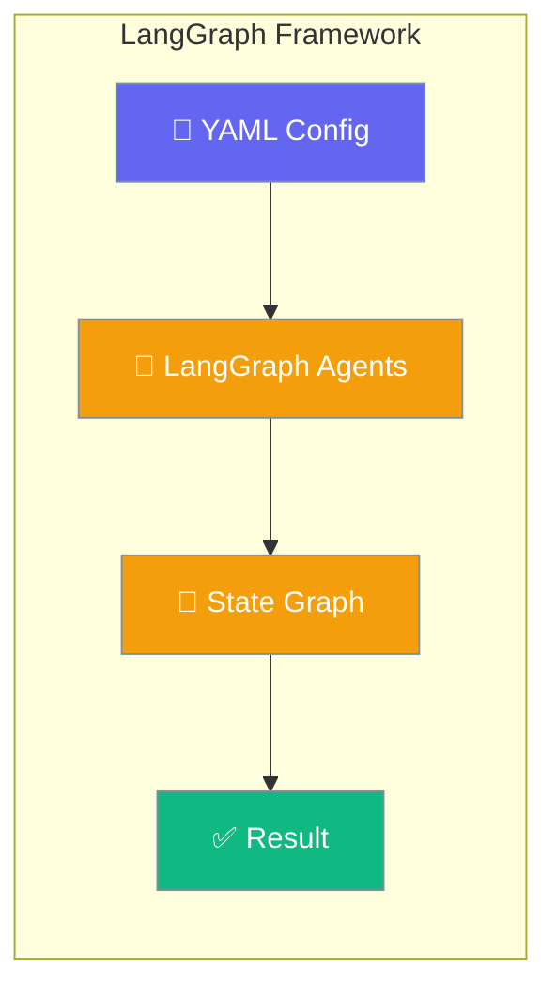
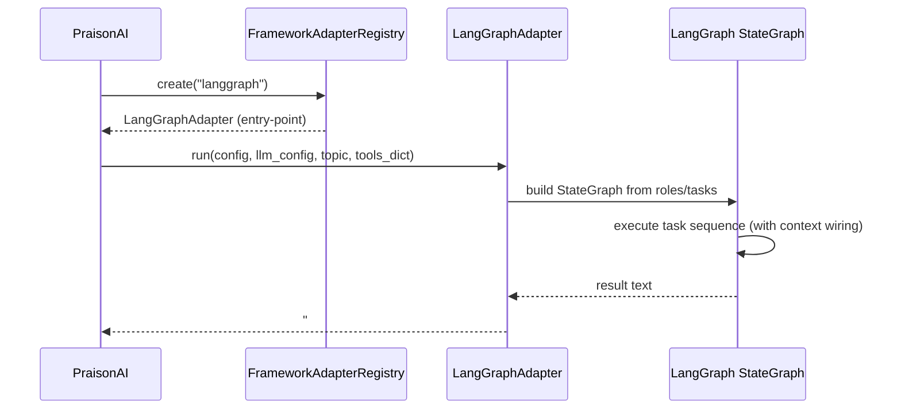

LangGraph integration lets you run LangGraph state graphs through PraisonAI's YAML configuration and CLI — no adapter code required.

<Note>
Need a framework that isn't listed here? See [Framework Adapter Plugins](/docs/features/framework-adapter-plugins) to register your own via Python entry points.
</Note>



## Quick Start

<Steps>

<Step title="Install">

Both extras are required for end-to-end use:

```bash
pip install "praisonai[langgraph]"
pip install "praisonai-frameworks[langgraph]"
```

</Step>

<Step title="Create agents.yaml">

```yaml
framework: langgraph
topic: Simple Question Answer

roles:
  researcher:
    role: Helper
    goal: Answer simple questions accurately
    backstory: I am a helpful assistant
    tasks:
      answer:
        description: What is the capital of France? Reply with just the city name.
        expected_output: Paris
```

</Step>

<Step title="Run">

```bash
export OPENAI_API_KEY=<your-key>
praisonai agents.yaml --framework langgraph
```

<Note>
You must either pass `--framework langgraph` on the CLI **or** set `framework: langgraph` in your YAML. If neither is set, PraisonAI uses its default framework.
</Note>

</Step>

</Steps>

---

## How LangGraph Works



---

## YAML Format for LangGraph

LangGraph requires the **`roles` format** (not the `steps` workflow format):

```yaml
framework: langgraph
topic: Planet facts

roles:
  researcher:
    role: Research_Analyst
    goal: Gather concise facts
    backstory: Expert researcher
    tasks:
      research:
        description: Name one planet in our solar system. Reply with only the planet name.
        expected_output: A planet name
      summarise:
        description: Write one short sentence describing that planet.
        expected_output: One sentence
        context:
          - research
```

<Info>
`context: [research]` creates a LangGraph edge from the `research` task node to the `summarise` task node — same semantic as in CrewAI. The output of `research` is injected into the `summarise` task's prompt automatically.
</Info>

---

## Direct Adapter Use

**Advanced — most users should use the CLI / YAML flow above.**

Call the adapter directly without the CLI or YAML loader:

```python
from praisonai_frameworks.langgraph.adapter import LangGraphAdapter

config = {
    "framework": "langgraph",
    "topic": "Quick test",
    "roles": {
        "helper": {
            "role": "Assistant",
            "goal": "Answer briefly",
            "backstory": "Helpful assistant",
            "tasks": {
                "answer": {
                    "description": "Reply with exactly the word OK.",
                    "expected_output": "OK",
                }
            },
        }
    },
}
llm_config = [{"model": "gpt-4o-mini", "api_key": "<OPENAI_API_KEY>"}]
result = LangGraphAdapter().run(config, llm_config, "Quick test", tools_dict={})
# result starts with "### LangGraph Output ###"
```

---

## Verify Installation

Use `praisonai doctor` to confirm LangGraph is detected:

```bash
$ praisonai doctor
✓ Runtime 'langgraph' available
  capabilities: agent_creation, tool_execution, sequential_execution
  supports_handoff: False
  supports_tool_loop: True
```

Probe programmatically via `_framework_availability`:

```python
from praisonai._framework_availability import is_available

if is_available("langgraph"):
    print("LangGraph is installed and importable")
```

---

## Pip Extras Reference

| Extra | Installs | Required for |
|-------|----------|--------------|
| `praisonai[langgraph]` | `langgraph>=0.2.0,<2`, `langgraph-prebuilt>=0.2.0,<2`, `langchain-core>=0.3.0,<2`, `langchain-openai>=0.2.0,<2`, `praisonai-tools>=0.1.0` | Probe + doctor recognition for LangGraph |
| `praisonai-frameworks[langgraph]` | LangGraph adapter implementation registered via entry-point group | Actually executing `framework: langgraph` |

<Warning>
**Both extras are needed.** Installing only `praisonai[langgraph]` makes `is_available("langgraph")` return `True` and the doctor pass, but `--framework langgraph` will fail at adapter dispatch because no adapter is registered under that name yet. This mirrors the AutoGen v0.4 "package vs adapter" distinction described in [Framework Availability](/docs/features/framework-availability).
</Warning>

---

## Troubleshooting

**`framework='langgraph' is not a valid choice`** — Pre-#2415 PraisonAI versions hardcode `choices=["praisonai","crewai","autogen"]`. Upgrade to a version that includes dynamic registry-driven CLI choices, or omit `--framework` and rely on `framework: langgraph` in your YAML instead.

**`Framework 'langgraph' was requested but is not installed`** — Install the extras listed above. The CLI emits an install hint from `get_install_hint("langgraph")` pointing to `praisonai-frameworks[langgraph]`.

**`tool_retry_policy` validation error on `praisonai.run()`** — Fixed in PraisonAI #2495 by normalising the `RetryPolicy` object into a dict before agent-config merge. If you are on a version before #2495, pass `tool_retry_policy` as a plain dict:

```python
tool_retry_policy = {"max_attempts": 3, "delay": 1.0, "backoff_factor": 2.0, "max_delay": 10.0}
```

---

## Best Practices

<AccordionGroup>
  <Accordion title="When to choose LangGraph over other frameworks">
    Choose LangGraph when you need explicit state graph control, conditional branching between tasks, or when your team already uses LangChain/LangGraph tooling. For simpler sequential workflows, PraisonAI native or CrewAI have lower overhead. For conversational multi-agent setups, AutoGen v0.2 is the more mature option today.
  </Accordion>

  <Accordion title="Use context: to express a graph">
    The `context:` field in task definitions maps directly to LangGraph edges. A task with `context: [task_a, task_b]` receives both task outputs as input context. Model your data dependencies as context lists rather than hard-coding them in task descriptions.
  </Accordion>

  <Accordion title="Keep the roles format, not steps">
    LangGraph via PraisonAI requires the `roles:` YAML format. The newer `steps:` + `agents:` workflow format is only supported by the native `praisonai` framework. If you migrate an existing `steps:` workflow to LangGraph, convert each step into a task under a role.
  </Accordion>

  <Accordion title="Parse the LangGraph Output sentinel">
    The adapter wraps its result in `### LangGraph Output ###\n...`. Downstream parsers and log scrapers can split on this sentinel to extract the LangGraph result separately from PraisonAI's own output lines.
  </Accordion>
</AccordionGroup>

---

## Related

<CardGroup cols={2}>
  <Card title="CrewAI" icon="users" href="/docs/framework/crewai">
    CrewAI framework integration
  </Card>
  <Card title="AutoGen" icon="robot" href="/docs/framework/autogen">
    AutoGen framework integration
  </Card>
  <Card title="PraisonAI Agents" icon="user" href="/docs/framework/praisonaiagents">
    PraisonAI native agents framework
  </Card>
  <Card title="Framework Availability" icon="check-circle" href="/docs/features/framework-availability">
    Probe API for detecting installed frameworks
  </Card>
  <Card title="Framework Adapter Plugins" icon="plug" href="/docs/features/framework-adapter-plugins">
    Register custom framework adapters via entry points
  </Card>
</CardGroup>
