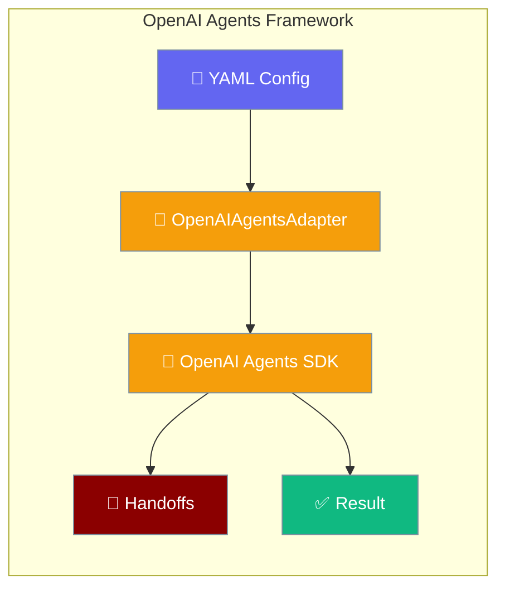
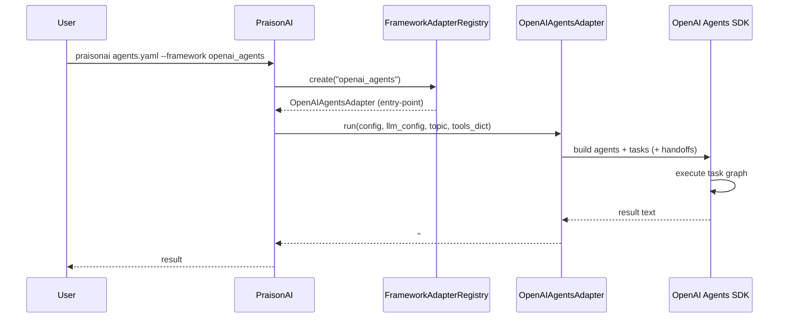

`framework: openai_agents` runs your agents YAML through the official OpenAI Agents SDK, with handoffs and task chaining from a single install.

<Note>
Need a framework that isn't listed here? See [Framework Adapter Plugins](/docs/features/framework-adapter-plugins) to register your own via Python entry points.
</Note>



## Quick Start

<Steps>

<Step title="Install">
```bash
pip install "praisonai[openai-agents]"
# pulls praisonai-frameworks[openai-agents]>=0.1.3 transitively
```
</Step>

<Step title="Create agents.yaml">
```yaml
framework: openai_agents
topic: Simple Question Answer

roles:
  researcher:
    role: Helper
    goal: Answer simple questions accurately
    backstory: I am a helpful assistant
    tasks:
      answer:
        description: What is the capital of France? Reply with just the city name.
        expected_output: Paris
```
</Step>

<Step title="Run">
```bash
export OPENAI_API_KEY=your-key
praisonai agents.yaml --framework openai_agents
```
</Step>

</Steps>

<Tip>
Pass `--framework openai_agents` on the CLI **or** set `framework: openai_agents` in your YAML — either alone is enough.
</Tip>

---

## How OpenAI Agents Works



Every result begins with the sentinel prefix `### OpenAI Agents Output ###`. Downstream parsers can split on this to extract only the run output.

---

## Sequential Context (Task Chaining)

Tasks reference outputs of earlier tasks with `context: [task_name]`:

```yaml
framework: openai_agents
topic: text processing

roles:
  writer:
    role: Writer
    goal: Transform text
    backstory: Professional writer
    tasks:
      draft:
        description: Write one word hello
        expected_output: hello
      polish:
        description: Uppercase the prior draft word only.
        expected_output: HELLO
        context:
          - draft
```

<Info>
The `context:` semantics match other framework wrappers (CrewAI, LangGraph, Google ADK). The OpenAI Agents adapter wires the dependency list into the SDK task graph.
</Info>

---

## Agent Handoffs via YAML

`framework: openai_agents` is one of three runtimes with first-class handoff support (alongside `praisonai` and `autogen_v4` — confirmed by `praisonai doctor`).

```yaml
framework: openai_agents
topic: greeting

roles:
  triage:
    role: Triage Agent
    goal: Route English requests to English Agent
    backstory: Delegate English to the English Agent.
    handoff:
      to:
        - English Agent
    tasks:
      route:
        description: User says hello in English. Delegate appropriately.
        expected_output: A friendly English reply
  english:
    role: English Agent
    goal: Reply in English only
    backstory: English specialist.
```

<Info>
`handoff.to` lists target agents by their `role:` value (here `"English Agent"`), not the YAML role key. Spaced role names such as `Triage Agent` are sanitised for internal task references, so human-readable labels stay in YAML.
</Info>

<Tip>
See [Agent Handoffs](/docs/features/handoffs) for the delegation model and [Handoff Tool Policy](/docs/features/handoff-tool-policy) for the tool-intersection rule applied on top of the SDK handoff mechanism.
</Tip>

<Warning>
`framework: openai_agents` is only valid in **agents YAML** with a `roles:` block. Using it in Workflow YAML (steps-style) raises `ValueError: framework='openai_agents' in workflow YAML is not supported for workflow execution` at load time.
</Warning>

---

## Verify Installation

```bash
praisonai doctor
```

When `praisonai[openai-agents]` is installed, the runtime table includes **OpenAI Agents SDK** with capabilities such as `agent_creation`, `tool_execution`, and optional `handoff_support`.

```python
from praisonai._framework_availability import is_available

if is_available("openai_agents"):
    print("OpenAI Agents SDK is installed and importable")
```

The probe checks, in order: the `openai-agents` distribution is installed, the `agents` import namespace exists, and `from agents import Runner` succeeds.

---

## Pip Extras

| Extra | Installs | Required for |
|-------|----------|--------------|
| `praisonai[openai-agents]` | `praisonai-frameworks[openai-agents]>=0.1.3`, `praisonai-tools>=0.1.0` | Doctor recognition and CLI/YAML dispatch |
| `praisonai-frameworks[openai-agents]` | Adapter entry point + OpenAI Agents PyPI package | Executing `framework: openai_agents` |

<Note>
The YAML/CLI key is `openai_agents` (underscore). Install hints use `openai-agents` (hyphen) to match PyPI normalisation.
</Note>

---

## Advanced — Direct Adapter Use

Most users should use the CLI/YAML flow above. To call the adapter directly:

```python
import os
from praisonai_frameworks.openai_agents.adapter import OpenAIAgentsAdapter

config = {
    "framework": "openai_agents",
    "topic": "Quick test",
    "roles": {
        "helper": {
            "role": "Assistant",
            "goal": "Answer briefly",
            "backstory": "Helpful assistant",
            "tasks": {
                "answer": {
                    "description": "Reply with exactly the word OK.",
                    "expected_output": "OK",
                }
            },
        }
    },
}
llm_config = [{"model": "gpt-4o-mini", "api_key": os.environ["OPENAI_API_KEY"]}]
result = OpenAIAgentsAdapter().run(config, llm_config, "Quick test", tools_dict={})
assert "### OpenAI Agents Output ###" in result
```

---

## Troubleshooting

| Symptom | Fix |
|---------|-----|
| `Framework 'openai_agents' was requested but is not installed` | `pip install "praisonai[openai-agents]"` or `pip install 'praisonai-frameworks[openai-agents]'` |
| `ValueError: framework='openai_agents' in workflow YAML is not supported for workflow execution` | Switch to agents YAML with `roles:` — not steps-style Workflow YAML |
| `framework='openai_agents' is not a valid choice` (older CLI) | Upgrade PraisonAI or set `framework: openai_agents` in YAML and omit `--framework` |
| Handoff target not found | Ensure `handoff.to` strings match another role's `role:` field exactly |

---

## Best Practices

<AccordionGroup>

<Accordion title="Prefer agents YAML with roles">
Use the `roles:` agents.yaml shape. The native Workflow YAML engine supports only `framework: praisonai`.
</Accordion>

<Accordion title="Use context for task dependencies">
Declare dependencies with `context: [prior_task]` instead of imperative wiring — the adapter builds the SDK task graph for you.
</Accordion>

<Accordion title="When to pick openai_agents">
Choose this framework when you want the official OpenAI Agents SDK semantics, especially SDK-native handoffs, rather than PraisonAI-native orchestration.
</Accordion>

<Accordion title="Parse on the output sentinel">
Split results on `### OpenAI Agents Output ###` when you need only the model text in downstream automation.
</Accordion>

</AccordionGroup>

---

## Related

<CardGroup cols={2}>
<Card title="AutoGen" icon="robot" href="/docs/framework/autogen">
  AutoGen family wrapper
</Card>
<Card title="CrewAI" icon="users" href="/docs/framework/crewai">
  CrewAI wrapper
</Card>
<Card title="PraisonAI Agents" icon="brain" href="/docs/framework/praisonaiagents">
  Native PraisonAI runtime
</Card>
<Card title="Agent Handoffs" icon="hand-holding-hand" href="/docs/features/handoffs">
  Delegation model and Python API
</Card>
<Card title="Handoff Tool Policy" icon="shield" href="/docs/features/handoff-tool-policy">
  Tool intersection on handoff
</Card>
<Card title="Framework Availability" icon="circle-check" href="/docs/features/framework-availability">
  Probe API and install hints
</Card>
</CardGroup>
