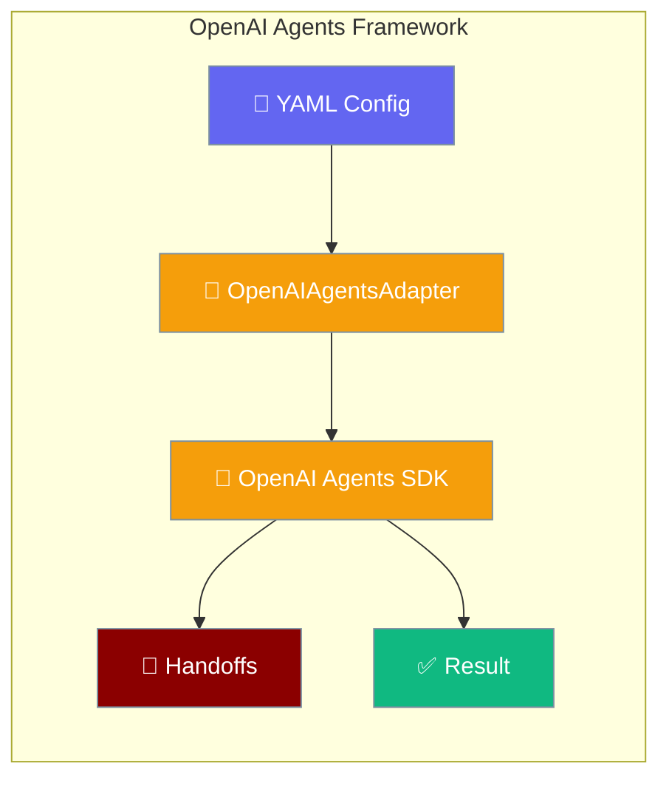
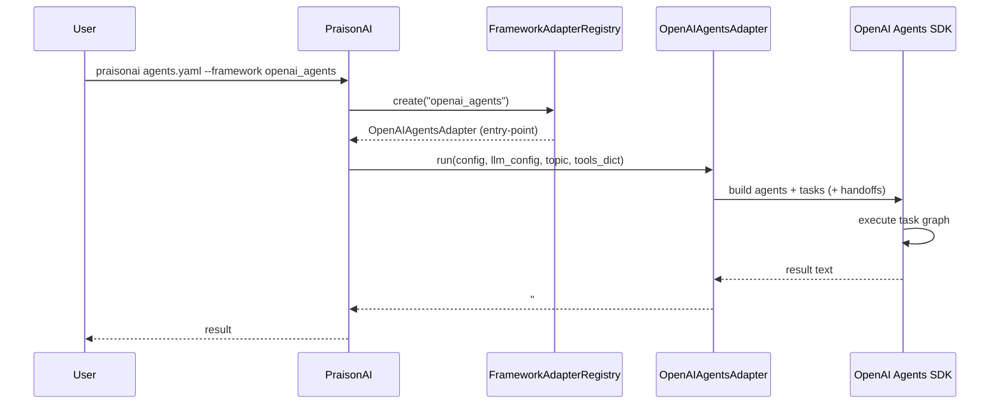

`framework: openai_agents` runs the official OpenAI Agents SDK inside PraisonAI's YAML and CLI, giving you agent handoffs and task chaining with a few lines of YAML.



<Note>
Need a framework that isn't listed here? See [Framework Adapter Plugins](/docs/features/framework-adapter-plugins) to register your own via Python entry points.
</Note>

---

## Quick Start

<Steps>

<Step title="Install">

```bash
pip install "praisonai[openai-agents]"
# pulls praisonai-frameworks[openai-agents]>=0.1.3 transitively
```

</Step>

<Step title="Create agents.yaml">

```yaml
framework: openai_agents
topic: Simple Question Answer

roles:
  researcher:
    role: Helper
    goal: Answer simple questions accurately
    backstory: I am a helpful assistant
    tasks:
      answer:
        description: What is the capital of France? Reply with just the city name.
        expected_output: Paris
```

</Step>

<Step title="Run">

```bash
export OPENAI_API_KEY=your-key
praisonai agents.yaml --framework openai_agents
```

</Step>

</Steps>

<Tip>
Pass `--framework openai_agents` on the CLI **or** set `framework: openai_agents` in your YAML — either works. When both are present, the CLI flag takes precedence.
</Tip>

---

## How OpenAI Agents Works



---

## Sequential Context (Task Chaining)

Tasks reference outputs of earlier tasks via `context: [task_name]`:

```yaml
framework: openai_agents
topic: text processing

roles:
  writer:
    role: Writer
    goal: Transform text
    backstory: Professional writer
    tasks:
      draft:
        description: Write one word hello
        expected_output: hello
      polish:
        description: Uppercase the prior draft word only.
        expected_output: HELLO
        context:
          - draft
```

<Info>
This is the same `context:` semantics as the other framework wrappers (CrewAI / LangGraph). The OpenAI Agents adapter converts the dependency list into the SDK's task-to-task input wiring.
</Info>

---

## Agent Handoffs via YAML

`framework: openai_agents` is one of only three runtimes that support handoffs — alongside `praisonai` and `autogen_v4`.

```yaml
framework: openai_agents
topic: greeting

roles:
  triage:
    role: Triage Agent
    goal: Route English requests to English Agent
    backstory: Delegate English to the English Agent.
    handoff:
      to:
        - English Agent
    tasks:
      route:
        description: User says hello in English. Delegate appropriately.
        expected_output: A friendly English reply
  english:
    role: English Agent
    goal: Reply in English only
    backstory: English specialist.
```

Three things to know:

1. **`handoff.to` lists target roles by `role:` value** (not by the YAML role key). The string `"English Agent"` here matches the value of the `english:` role's `role:` field.
2. **Spaced role names are safe.** Before PraisonAI commit `afa29d1`, `role: Triage Agent` would fail YAML validation because the validator auto-derived a task's `agent` field from `role` and rejected the space. As of `afa29d1` the value is sanitised through `re.sub(r'[^a-zA-Z0-9_-]+', '_', role.strip()).strip('_')` with `'agent'` fallback, so `Triage Agent` → `Triage_Agent` internally while the human-readable label stays intact.
3. **Workflow YAML (steps-style) is NOT supported.**

<Warning>
Using `framework: openai_agents` in a workflow (steps-style) YAML raises:

```
ValueError: framework='openai_agents' in workflow YAML is not supported for workflow execution.
```

Use the `roles:` agents.yaml shape shown in Quick Start instead. The steps-style workflow engine only supports `framework: praisonai`.
</Warning>

<Tip>
See [Handoffs](/docs/features/handoffs) for the conceptual model and [Handoff Tool Policy](/docs/features/handoff-tool-policy) for the tool-intersection rule that applies on top of the OpenAI Agents SDK's own handoff mechanism.
</Tip>

---

## Direct Adapter Use

<Note>
Advanced — most users should use the CLI / YAML flow above.
</Note>

Call the adapter directly without the CLI / YAML loader:

```python
from praisonai_frameworks.openai_agents.adapter import OpenAIAgentsAdapter

config = {
    "framework": "openai_agents",
    "topic": "Quick test",
    "roles": {
        "helper": {
            "role": "Assistant",
            "goal": "Answer briefly",
            "backstory": "Helpful assistant",
            "tasks": {
                "answer": {
                    "description": "Reply with exactly the word OK.",
                    "expected_output": "OK",
                }
            },
        }
    },
}
llm_config = [{"model": "gpt-4o-mini", "api_key": "<OPENAI_API_KEY>"}]
result = OpenAIAgentsAdapter().run(config, llm_config, "Quick test", tools_dict={})
# result starts with "### OpenAI Agents Output ###"
```

---

## Verify Installation

Check via the `doctor` command:

```bash
$ praisonai doctor
✓ Runtime 'openai_agents' available
  name: OpenAI Agents SDK
  capabilities: agent_creation, tool_execution
  optional: handoff_support
```

Or probe from Python:

```python
from praisonai._framework_availability import is_available

if is_available("openai_agents"):
    print("OpenAI Agents SDK is installed and importable")
```

`_openai_agents_probe()` checks three things in order:

1. `importlib.metadata.distribution("openai-agents")` — the PyPI dist must be installed.
2. `importlib.util.find_spec("agents")` — the `agents` import namespace must be discoverable.
3. `from agents import Runner` — the SDK's `Runner` symbol must import without error.

`True` from `is_available("openai_agents")` guarantees the adapter can run, not just that the package is on disk.

---

## Pip Extras Reference

| Extra | Installs | Required for |
|-------|----------|--------------|
| `praisonai[openai-agents]` | `praisonai-frameworks[openai-agents]>=0.1.3`, `praisonai-tools>=0.1.0` | Probe + doctor recognition + adapter dispatch for OpenAI Agents |
| `praisonai-frameworks[openai-agents]` (transitive) | OpenAI Agents adapter implementation registered via entry-point group, plus the `openai-agents` PyPI dist | Actually executing `framework: openai_agents` |

<Note>
The install-hint `extra_name` map in `registry.py` maps `openai_agents` → `openai-agents` (hyphen) because PyPI normalises the dist name. The YAML/CLI/probe key is always `openai_agents` (underscore).
</Note>

---

## Troubleshooting

**`framework='openai_agents' is not a valid choice`**

Pre-#2415 PraisonAI versions hardcoded `choices=["praisonai","crewai","autogen"]` for the CLI. Upgrade to a version that includes dynamic registry-driven choices, or omit `--framework` and rely on the `framework: openai_agents` YAML field.

**`Framework 'openai_agents' was requested but is not installed`**

Run the exact install hint: `pip install 'praisonai-frameworks[openai-agents]'`. From a user project, `pip install "praisonai[openai-agents]"` pulls it transitively.

**`ValueError: framework='openai_agents' in workflow YAML is not supported for workflow execution`**

Surfaced by `validate_workflow_framework`. Switch the file to the `roles:` agents.yaml shape — the steps-style workflow engine only supports `framework: praisonai`.

**YAML validation rejects `role: Triage Agent`**

Fixed in PraisonAI commit `afa29d1`. On older builds, use a single-word role (`role: Triage`) or set the task `agent:` field explicitly to a validator-safe identifier. After `afa29d1`, no workaround is needed.

---

## Best Practices

<AccordionGroup>
  <Accordion title="When to pick openai_agents over other frameworks">
    Choose `openai_agents` when you want the official OpenAI SDK's own handoff semantics, first-class handoff support, or you're already invested in the OpenAI Agents SDK ecosystem. Use `praisonai` (default) for the broadest feature coverage, or `crewai` for CrewAI-native task delegation.
  </Accordion>

  <Accordion title="Use the roles: format">
    Always use the `roles:` agents.yaml format with `framework: openai_agents`. The workflow `steps:` format is explicitly rejected at validation with a clear error message.
  </Accordion>

  <Accordion title="Use context: to express task dependencies">
    Use `context: [task_name]` to chain tasks declaratively. The adapter wires the SDK's task graph from the dependency list — no manual plumbing needed.
  </Accordion>

  <Accordion title="Output sentinel">
    Every run returns text beginning with `### OpenAI Agents Output ###`. Downstream parsers can split on this sentinel to extract just the run output without the adapter wrapper text.
  </Accordion>
</AccordionGroup>

---

## Related

<CardGroup cols={2}>
  <Card title="AutoGen" icon="robot" href="/docs/framework/autogen">
    AutoGen — adjacent multi-framework wrapper
  </Card>
  <Card title="CrewAI" icon="users" href="/docs/framework/crewai">
    CrewAI framework integration
  </Card>
  <Card title="PraisonAI Agents" icon="user" href="/docs/framework/praisonaiagents">
    PraisonAI native agents framework
  </Card>
  <Card title="Handoffs" icon="hand-holding-hand" href="/docs/features/handoffs">
    Handoff conceptual model
  </Card>
  <Card title="Handoff Tool Policy" icon="shield" href="/docs/features/handoff-tool-policy">
    Tool-intersection security boundary
  </Card>
  <Card title="Framework Availability" icon="check-circle" href="/docs/features/framework-availability">
    Probe API for framework detection
  </Card>
  <Card title="Framework Adapter Plugins" icon="plug" href="/docs/features/framework-adapter-plugins">
    Entry-point registration
  </Card>
</CardGroup>
