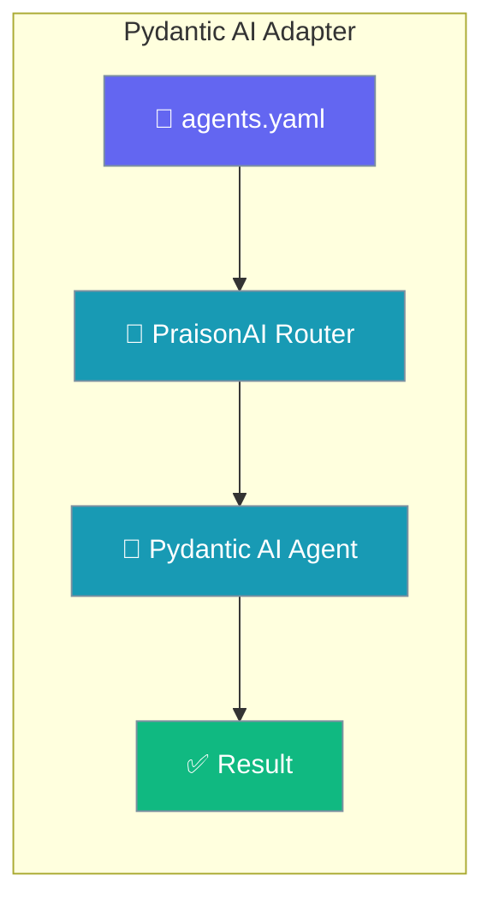
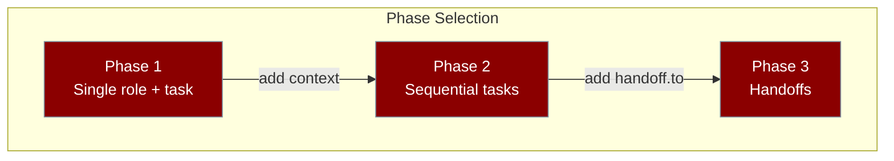

Run your agents YAML through [Pydantic AI](https://github.com/pydantic/pydantic-ai) by setting `framework: pydantic_ai`.



<Note>
Requires `praisonai-frameworks` **0.1.9+**. OpenAI models use `OPENAI_API_KEY`. Gemini uses `GOOGLE_API_KEY` or `GEMINI_API_KEY`.
</Note>

## Quick Start

<Steps>

<Step title="Install">
```bash
pip install "praisonai[pydantic-ai]"
export OPENAI_API_KEY=sk-...
```
</Step>

<Step title="Create agents.yaml">
```yaml
framework: pydantic_ai
topic: math
roles:
  calculator:
    role: Calculator
    goal: Compute exactly
    backstory: Return only the numeric answer.
    tasks:
      add:
        description: What is 3 + 3?
        expected_output: "6"
```
</Step>

<Step title="Run">
```bash
praisonai agents.yaml --framework pydantic_ai
```
</Step>

</Steps>

## Models

| Model | API key |
|-------|---------|
| `openai/gpt-4o-mini` | `OPENAI_API_KEY` |
| `gemini-2.0-flash` | `GOOGLE_API_KEY` or `GEMINI_API_KEY` |

## Supported Patterns



| Phase | Pattern | Status |
|-------|---------|--------|
| 1 | Single role, single task | Supported |
| 2 | Sequential tasks with `context:` | Supported |
| 3 | `handoff.to` (single task → delegation tools) | Supported |

## Handoffs

Use the same `handoff.to` pattern as OpenAI Agents — one router role with a single task, specialists without tasks:

```yaml
framework: pydantic_ai
topic: language help
roles:
  triage:
    role: Triage Agent
    handoff:
      to:
        - English Agent
    tasks:
      route:
        description: Help with {topic}
  english:
    role: English Agent
    goal: Reply in English only
    backstory: English specialist.
```

Multi-task configs with `handoff.to` fall back to sequential execution (OpenAI parity).

## Limitations

| Feature | Status |
|---------|--------|
| pydantic-graph workflows | Not used |
| Agent spec YAML bridge | Not supported |
| Built-in capabilities (WebSearch, Thinking) | Not mapped |
| Workflow YAML with `framework: pydantic_ai` | Not supported |
| `output_schema` / structured deps | Not mapped in v1 |
| A2A broker | Not supported |

## Best Practices

<AccordionGroup>
<Accordion title="Use Phase 1 for simple tasks">
Start with a single role and single task to validate your setup before adding complexity.
</Accordion>
<Accordion title="Use Phase 2 for dependent steps">
Add `context:` to tasks when each step needs output from the previous one.
</Accordion>
<Accordion title="Use Phase 3 for routing">
Keep the router role to a single task with `handoff.to`; multi-task routers fall back to sequential.
</Accordion>
<Accordion title="Match model to API key">
Set `OPENAI_API_KEY` for `openai/` prefixed models and `GOOGLE_API_KEY` for Gemini models to avoid auth errors.
</Accordion>
</AccordionGroup>

## Related

<CardGroup cols={2}>
<Card title="Agno" icon="robot" href="/docs/framework/agno">
  Run agents YAML through Agno framework
</Card>
<Card title="Google ADK" icon="google" href="/docs/framework/google-adk">
  Run agents YAML through Google Agent Development Kit
</Card>
<Card title="Framework Adapter Plugins" icon="plug" href="/docs/features/framework-adapter-plugins">
  All supported framework adapters
</Card>
<Card title="Agents YAML" icon="file-code" href="/docs/concepts/agents">
  agents YAML reference
</Card>
</CardGroup>
