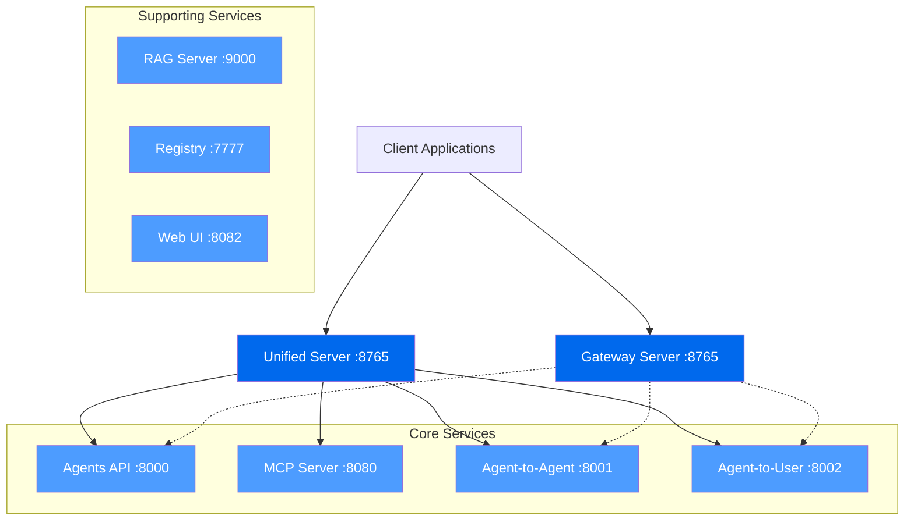

# Gateway & Control Plane Architecture

PraisonAI provides a **unified control plane** for managing multi-agent systems, tools, sessions, and integrations. This document serves as your single reference for understanding how PraisonAI's various HTTP surfaces compose into a coherent architecture.

<Info>
**Quick Start**: For most integrations, start with `praisonai serve unified` on port 8765. This provides all capabilities in a single endpoint.
</Info>

## Architecture Overview

PraisonAI exposes multiple HTTP surfaces that can be deployed independently or combined through the unified server. Here's the recommended production topology:



## Port & Protocol Matrix

| Service | Default Port | Protocol | Purpose | Install Requirement |
|---------|--------------|----------|---------|-------------------|
| **agents** | 8000 | HTTP/REST | Agent execution API | Core |
| **gateway** | 8765 | WebSocket | Multi-agent coordination | `praisonai[api]` |
| **unified** | 8765 | HTTP + WS | All providers combined | Core |
| **mcp** | 8080 | HTTP/SSE/STDIO | Model Context Protocol | `praisonaiagents[mcp]` |
| **a2a** | 8001 | JSON-RPC | Agent-to-Agent communication | Core |
| **a2u** | 8002 | SSE | Agent-to-User event stream | Core |
| **rag** | 9000 | HTTP | RAG query server | Core |
| **registry** | 7777 | HTTP | Package registry | Core |
| **ui** | 8082 | HTTP | Chainlit web interface | `praisonai[ui]` |

## Recommended Deployment Patterns

### 1. Single Gateway (OpenClaw-style)

For maximum simplicity, similar to OpenClaw's single gateway approach:

```bash
# Start unified server with all capabilities
praisonai serve unified --port 8765

# All features available at:
# - WebSocket: ws://localhost:8765/ws
# - HTTP API: http://localhost:8765/api/agents
# - MCP: http://localhost:8765/mcp
# - Events: http://localhost:8765/events
```

**Use this when:**
- You want a single entry point
- Building desktop clients or remote UIs
- Need session management with multi-agent coordination
- Want to minimize integration complexity

### 2. Modular Services

For production deployments requiring independent scaling:

```bash
# Core agent execution
praisonai serve agents --port 8000

# WebSocket coordination
praisonai serve gateway --port 8765

# Model Context Protocol
praisonai serve mcp --port 8080

# Optional: RAG and registry
praisonai serve rag --port 9000
praisonai serve registry --port 7777
```

**Use this when:**
- You need independent service scaling
- Building microservices architecture
- Different services have different resource requirements
- Want fine-grained monitoring and control

### 3. Development Setup

For local development and testing:

```bash
# Start unified server with reload
praisonai serve unified --reload

# Access all features:
# - Gateway UI: http://localhost:8765
# - Discovery: http://localhost:8765/__praisonai__/discovery
# - Health: http://localhost:8765/health
```

## Service Discovery

All HTTP servers expose a discovery endpoint at `/__praisonai__/discovery` that returns available endpoints and capabilities:

```bash
curl http://localhost:8765/__praisonai__/discovery
```

Example response:

```json
{
  "service": "praisonai-unified",
  "version": "2.0.0",
  "endpoints": {
    "agents": "/api/agents",
    "websocket": "/ws",
    "mcp": "/mcp",
    "events": "/events",
    "health": "/health"
  },
  "protocols": ["http", "websocket", "sse"],
  "capabilities": [
    "multi-agent",
    "session-management",
    "real-time-events",
    "model-context-protocol"
  ]
}
```

## Integration Patterns

### WebSocket Gateway Integration

For real-time multi-agent coordination:

```javascript
const ws = new WebSocket('ws://localhost:8765/ws');

ws.onopen = () => {
  ws.send(JSON.stringify({
    type: 'session.create',
    session_id: 'unique-session-id'
  }));
};

ws.onmessage = (event) => {
  const message = JSON.parse(event.data);
  console.log('Agent response:', message);
};
```

### HTTP API Integration

For standard REST API usage:

```bash
curl -X POST http://localhost:8000/api/agents/execute \
  -H "Content-Type: application/json" \
  -d '{
    "agent": "research-assistant",
    "prompt": "Research climate change impacts",
    "session_id": "unique-session-id"
  }'
```

### Model Context Protocol (MCP)

For IDE and tool integrations:

```json
{
  "mcpServers": {
    "praisonai": {
      "command": "praisonai",
      "args": ["serve", "mcp"],
      "env": {}
    }
  }
}
```

## Security & Authentication

### API Key Authentication

```bash
# Start with API key requirement
praisonai serve agents --api-key your-secret-key

# Use in requests
curl -H "Authorization: Bearer your-secret-key" \
     http://localhost:8000/api/agents/status
```

### Environment Variables

```bash
export PRAISONAI_API_KEY="your-secret-key"
export PRAISONAI_LOG_LEVEL="info"
export PRAISONAI_MAX_TOKENS="4000"
```

## Monitoring & Health Checks

All services provide health endpoints:

```bash
# Check service health
curl http://localhost:8765/health

# Check specific service status
praisonai serve status --json
```

## Migration from Legacy Patterns

If you're currently using deprecated gateway CLI paths:

### Before (Deprecated)
```bash
praisonai gateway start --port 8765
```

### After (Current)
```bash
praisonai serve gateway --port 8765
# OR for unified approach:
praisonai serve unified --port 8765
```

## Comparison with OpenClaw

| Aspect | OpenClaw | PraisonAI |
|--------|----------|-----------|
| **Control Plane** | Single WebSocket Gateway | Unified Server + Modular Services |
| **Entry Point** | One gateway port | One unified port OR multiple service ports |
| **Session Management** | WebSocket-centric | WebSocket + HTTP + SSE |
| **Protocol Support** | WebSocket primary | HTTP, WebSocket, SSE, STDIO |
| **Flexibility** | Single deployment model | Unified OR modular deployment |

## Next Steps

1. **Quick Start**: Use `praisonai serve unified` for immediate OpenClaw-style simplicity
2. **Discovery**: Hit `/__praisonai__/discovery` to explore available endpoints
3. **Scale**: Move to modular services (`praisonai serve <service>`) when needed
4. **Monitor**: Use `/health` endpoints and `praisonai serve status` for observability

## Related Documentation

- [Installation](/docs/installation) - Setup requirements for each service
- [API Reference](/docs/api) - Detailed API documentation
- [MCP Integration](/docs/mcp) - Model Context Protocol setup
- [Tools](/docs/tools) - Available tools and capabilities

<Tip>
**Pro Tip**: Start with the unified server for development, then split into modular services for production based on your scaling requirements.
</Tip>