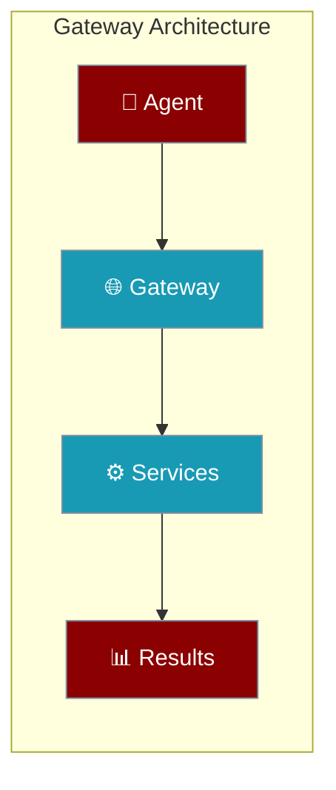
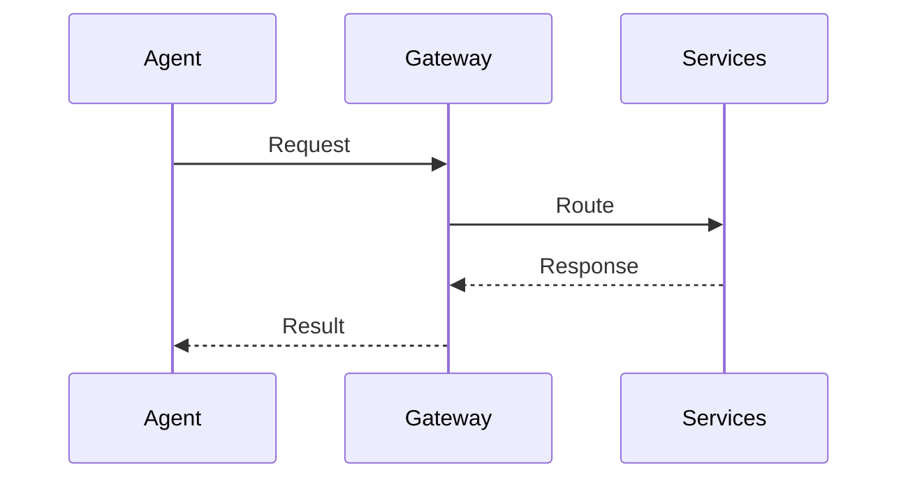
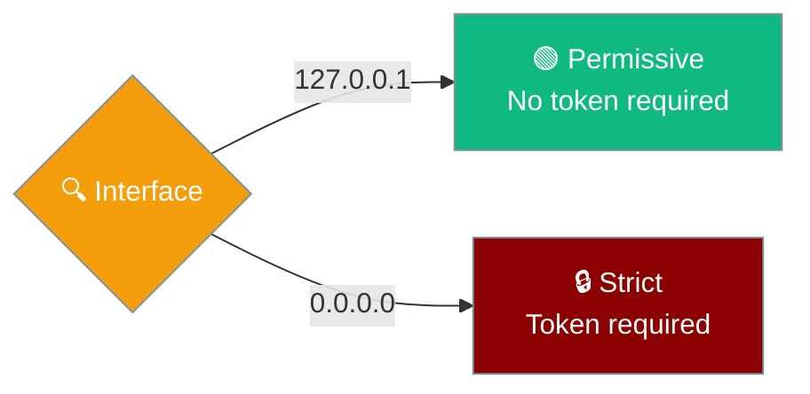
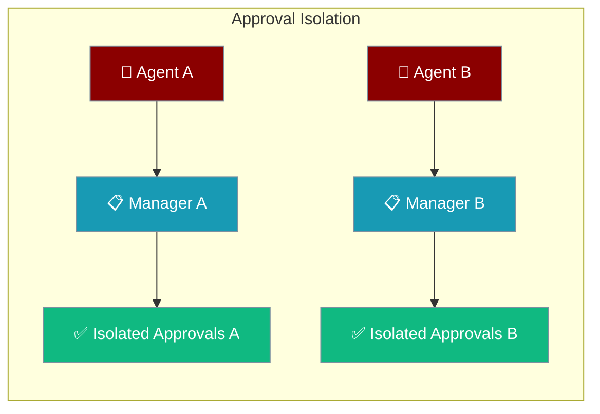

Agents can connect through a unified gateway providing single-entry access to multi-agent coordination, tools, and streaming events.



## Quick Start

<Steps>
<Step title="Simple Agent Gateway">
Deploy an agent through the unified gateway:

```python
from praisonaiagents import Agent

# Gateway enables unified access
agent = Agent(
    name="Gateway Agent",
    instructions="Connect through unified gateway",
    gateway=True
)

agent.start("Process through gateway")
```
</Step>

<Step title="Multi-Service Gateway">
Configure agents with full gateway capabilities:

```python
from praisonaiagents import Agent, GatewayConfig

agent = Agent(
    name="Gateway Agent",
    instructions="Multi-service coordination",
    gateway=GatewayConfig(
        unified=True,
        services=["agents", "mcp", "a2a", "a2u"]
    )
)
```
</Step>

---

## How It Works

Agents connect to services through gateway routing:



| Component | Purpose | Agent Access |
|-----------|---------|---------------|
| **Gateway** | Single entry point | `gateway=True` |
| **Unified** | All services combined | Default mode |
| **Services** | Independent scaling | Service-specific |

---

## Authentication

Authentication posture changes automatically based on the bind interface.



| Interface | Mode | Auth Required |
|-----------|------|---------------|
| **Loopback** (`127.0.0.1`, `localhost`, `::1`) | Permissive | No |
| **External** (`0.0.0.0`, LAN IPs, public IPs) | Strict | Yes |

<Card title="Bind-Aware Authentication" icon="shield" href="/docs/features/gateway-bind-aware-auth">
  Complete authentication security guide
</Card>

---

## Configuration Options

<Card title="Gateway Configuration" icon="code" href="/docs/sdk/reference/python/classes/GatewayConfig">
  Python gateway configuration options
</Card>

| Service | Default Port | Protocol | Agent Access |
|---------|--------------|----------|---------------|
| **unified** | 8765 | HTTP + WS | Default gateway |
| **agents** | 8000 | HTTP/REST | Direct API calls |
| **mcp** | 8080 | HTTP/SSE | Tool protocols |
| **a2a** | 8001 | JSON-RPC | Agent communication |
| **a2u** | 8002 | SSE | Event streams |
| **openai** | 8765 | HTTP + SSE | OpenAI API compatibility |

---

## Gateway Agent Defaults

Gateway agents loaded from YAML use chat-optimised defaults that differ from the Python SDK.

| YAML key | Gateway default | Why |
|---|---|---|
| `reflection` | `false` | Chat channels need sub-second replies; self-reflection adds ~8x latency on short prompts |
| `tool_choice` | `null` (auto) | Let the LLM decide when to call tools |
| `allow_delegation` | `false` | Prevents cross-agent routing unless explicitly opted in |

```yaml
agents:
  assistant:
    instructions: "You are a helpful AI assistant."
    model: gpt-4o-mini
    reflection: true   # opt-in: enables self-critique, ~8x slower
```

<Note>
Changed in PraisonAI v4.6.26: gateway agents now default to `reflection: false`. Previous versions defaulted to `true`. See [PR #1485](https://github.com/MervinPraison/PraisonAI/pull/1485).
</Note>

---

## Per-Agent Approval Isolation

Gateway supports isolated exec approval managers for multi-tenant environments where agents must not share approval state.



### Default vs Per-Agent Managers

| Manager Type | Use Case | Approval Sharing |
|-------------|----------|------------------|
| **Default** | CLI, single-agent setups | Shared process-wide |
| **Per-Agent** | Multi-tenant gateways | Isolated per instance |

```python
from praisonai.gateway.exec_approval import (
    get_default_exec_approval_manager,
    create_exec_approval_manager
)

# Default manager - shared across all agents
default_manager = get_default_exec_approval_manager(ttl=300.0)

# Per-agent manager - isolated approval state
agent1_manager = create_exec_approval_manager(ttl=120.0)
agent2_manager = create_exec_approval_manager(ttl=180.0)
```

### Multi-Agent Gateway with Isolation

```python
from praisonaiagents import Agent
from praisonai.gateway.exec_approval import create_exec_approval_manager

class IsolatedGateway:
    def __init__(self):
        self.agents = {}
        
    def add_agent(self, name, instructions, approval_ttl=300):
        # Each agent gets isolated approval manager
        manager = create_exec_approval_manager(ttl=approval_ttl)
        
        agent = Agent(
            name=name,
            instructions=instructions,
            exec_approval_manager=manager,
            gateway=True
        )
        
        self.agents[name] = {"agent": agent, "manager": manager}
        return agent
        
    def get_pending_approvals(self, agent_name):
        if agent_name in self.agents:
            manager = self.agents[agent_name]["manager"]
            return manager.list_pending()
        return []

# Usage
gateway = IsolatedGateway()

# Tenant A agent
tenant_a = gateway.add_agent(
    "TenantA_Assistant", 
    "Help tenant A users",
    approval_ttl=180  # 3 minutes
)

# Tenant B agent  
tenant_b = gateway.add_agent(
    "TenantB_Assistant",
    "Help tenant B users", 
    approval_ttl=600  # 10 minutes
)

# Isolated approval queues
pending_a = gateway.get_pending_approvals("TenantA_Assistant")
pending_b = gateway.get_pending_approvals("TenantB_Assistant")
```

<Note>
The `ttl` parameter controls how long approval requests wait before auto-expiring (default: 5 minutes). 
The `get_exec_approval_manager()` function is preserved as a backward-compatible alias for `get_default_exec_approval_manager()`.
</Note>

---

## Kanban Dispatcher

**Kanban dispatcher (v4.6.x):** Worker file descriptors are now released as soon as the subprocess starts (fixes a slow leak under sustained dispatch). `release_claim` failures are logged with full stack traces instead of being silently swallowed — orphaned `claimed` tasks now leave a clear log trail for triage. `KeyboardInterrupt` / `SystemExit` / asyncio cancellation propagate cleanly through dispatcher shutdown.

---

## Common Patterns

### Single Gateway Deployment
```python
from praisonaiagents import Agent

# Simple unified gateway
agent = Agent(
    name="Gateway Agent",
    gateway=True,  # Enables unified gateway
)

# CLI deployment
# praisonai serve unified --port 8765
```

### Multi-Agent Gateway
```python
from praisonaiagents import Agent, Task, PraisonAIAgents

agents = [
    Agent(name="Researcher", gateway=True),
    Agent(name="Writer", gateway=True),
]

# Multi-agent coordination through gateway
tasks = [Task(description="Research topic", agent=agents[0])]
crew = PraisonAIAgents(agents=agents, tasks=tasks)
```

### Development Gateway
```python
from praisonaiagents import Agent

agent = Agent(
    name="Dev Agent",
    gateway=True,
    debug=True  # Development features
)

# CLI: praisonai serve unified --reload
```

---

## Best Practices

<AccordionGroup>
<Accordion title="Start with Unified Gateway">
Use `praisonai serve unified` for simplicity. Agents connect automatically without configuration.
</Accordion>

<Accordion title="Development vs Production">
Enable `--reload` for development. Use separate services for production scaling.
</Accordion>

<Accordion title="Service Discovery">
All servers expose `/__praisonai__/discovery` for endpoint discovery. Agents can auto-discover capabilities.
</Accordion>

<Accordion title="Port Planning">
Reserve port 8765 for unified gateway. Use default ports for service-specific deployments.
</Accordion>
</AccordionGroup>

---

## Related

<CardGroup cols={2}>
<Card title="Agents" icon="user" href="/docs/concepts/agents">
  Core agent functionality
</Card>
<Card title="MCP Protocol" icon="plug" href="/docs/concepts/mcp">
  Model Context Protocol integration
</Card>
</CardGroup>