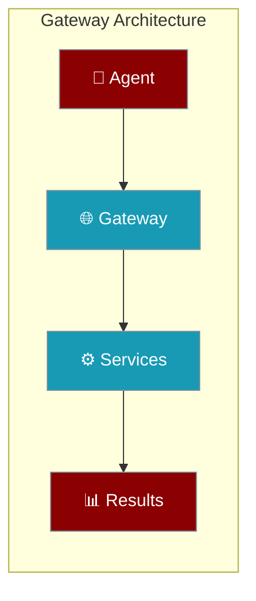
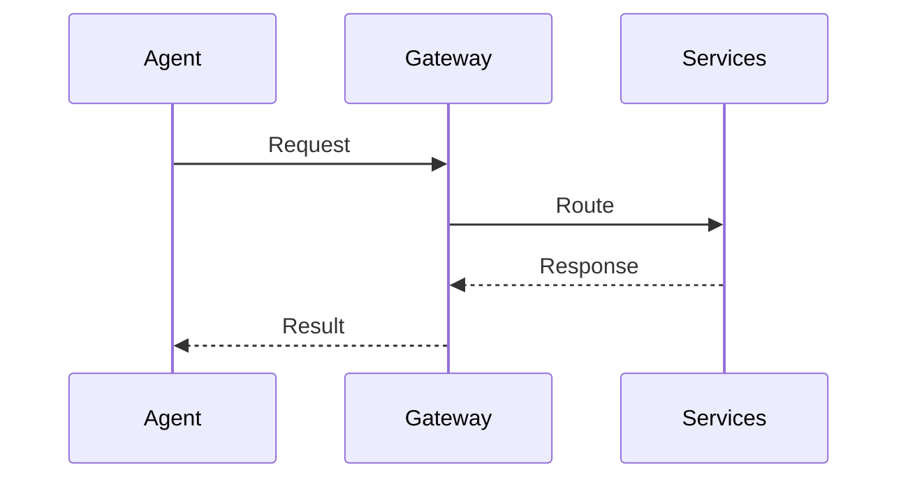

Agents can connect through a unified gateway providing single-entry access to multi-agent coordination, tools, and streaming events.



## Quick Start

<Steps>
<Step title="Simple Agent Gateway">
Deploy an agent through the unified gateway:

```python
from praisonaiagents import Agent

# Gateway enables unified access
agent = Agent(
    name="Gateway Agent",
    instructions="Connect through unified gateway",
    gateway=True
)

agent.start("Process through gateway")
```
</Step>

<Step title="Multi-Service Gateway">
Configure agents with full gateway capabilities:

```python
from praisonaiagents import Agent, GatewayConfig

agent = Agent(
    name="Gateway Agent",
    instructions="Multi-service coordination",
    gateway=GatewayConfig(
        unified=True,
        services=["agents", "mcp", "a2a", "a2u"]
    )
)
```
</Step>

---

## How It Works

Agents connect to services through gateway routing:



| Component | Purpose | Agent Access |
|-----------|---------|---------------|
| **Gateway** | Single entry point | `gateway=True` |
| **Unified** | All services combined | Default mode |
| **Services** | Independent scaling | Service-specific |

---

## Configuration Options

<Card title="Gateway Configuration" icon="code" href="/docs/sdk/reference/python/classes/GatewayConfig">
  Python gateway configuration options
</Card>

| Service | Default Port | Protocol | Agent Access |
|---------|--------------|----------|---------------|
| **unified** | 8765 | HTTP + WS | Default gateway |
| **agents** | 8000 | HTTP/REST | Direct API calls |
| **mcp** | 8080 | HTTP/SSE | Tool protocols |
| **a2a** | 8001 | JSON-RPC | Agent communication |
| **a2u** | 8002 | SSE | Event streams |

---

## Common Patterns

### Single Gateway Deployment
```python
from praisonaiagents import Agent

# Simple unified gateway
agent = Agent(
    name="Gateway Agent",
    gateway=True,  # Enables unified gateway
)

# CLI deployment
# praisonai serve unified --port 8765
```

### Multi-Agent Gateway
```python
from praisonaiagents import Agent, Task, PraisonAIAgents

agents = [
    Agent(name="Researcher", gateway=True),
    Agent(name="Writer", gateway=True),
]

# Multi-agent coordination through gateway
tasks = [Task(description="Research topic", agent=agents[0])]
crew = PraisonAIAgents(agents=agents, tasks=tasks)
```

### Development Gateway
```python
from praisonaiagents import Agent

agent = Agent(
    name="Dev Agent",
    gateway=True,
    debug=True  # Development features
)

# CLI: praisonai serve unified --reload
```

---

## Best Practices

<AccordionGroup>
<Accordion title="Start with Unified Gateway">
Use `praisonai serve unified` for simplicity. Agents connect automatically without configuration.
</Accordion>

<Accordion title="Development vs Production">
Enable `--reload` for development. Use separate services for production scaling.
</Accordion>

<Accordion title="Service Discovery">
All servers expose `/__praisonai__/discovery` for endpoint discovery. Agents can auto-discover capabilities.
</Accordion>

<Accordion title="Port Planning">
Reserve port 8765 for unified gateway. Use default ports for service-specific deployments.
</Accordion>
</AccordionGroup>

---

## Related

<CardGroup cols={2}>
<Card title="Agents" icon="user" href="/docs/concepts/agents">
  Core agent functionality
</Card>
<Card title="MCP Protocol" icon="plug" href="/docs/concepts/mcp">
  Model Context Protocol integration
</Card>
</CardGroup>