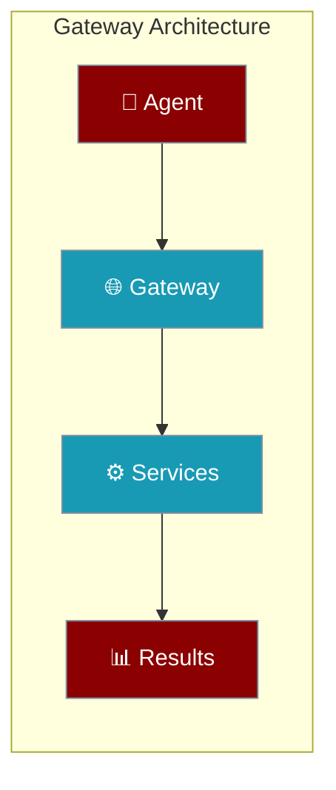
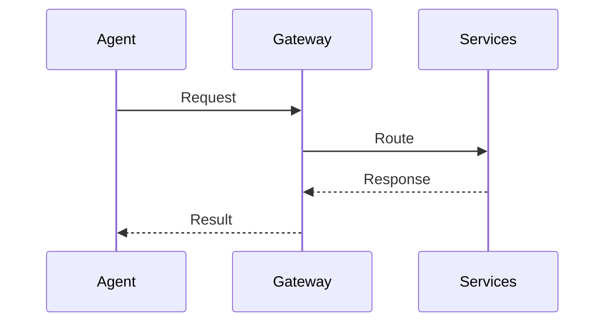
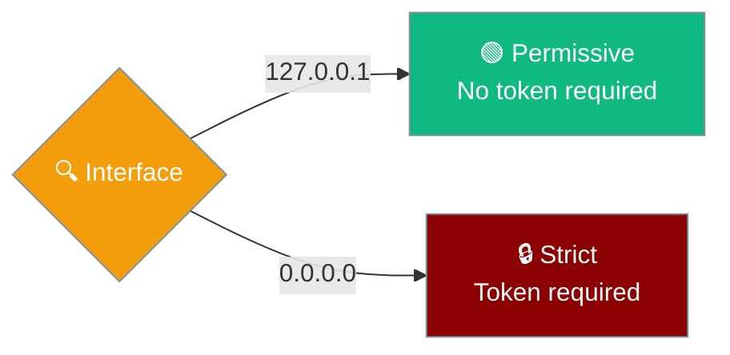
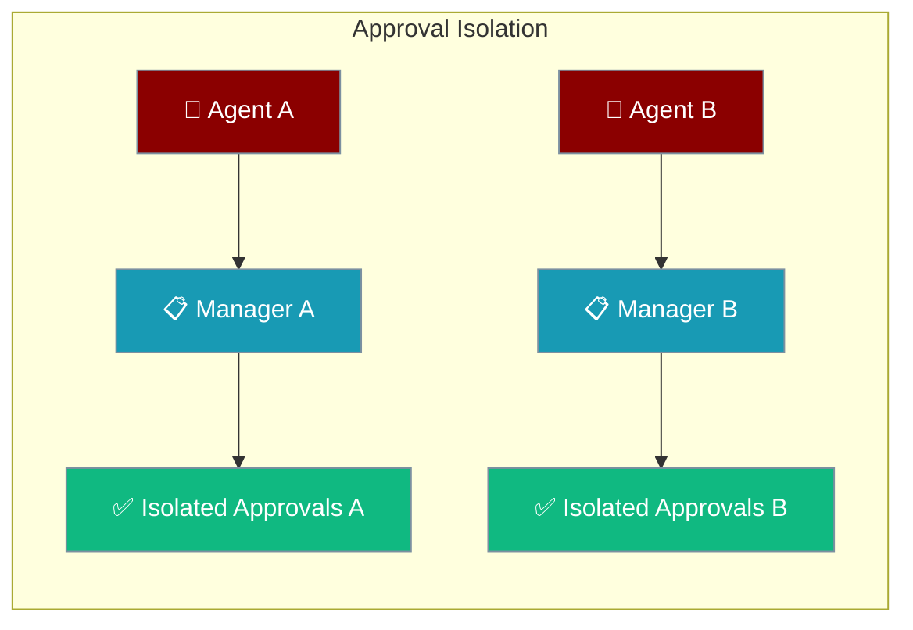
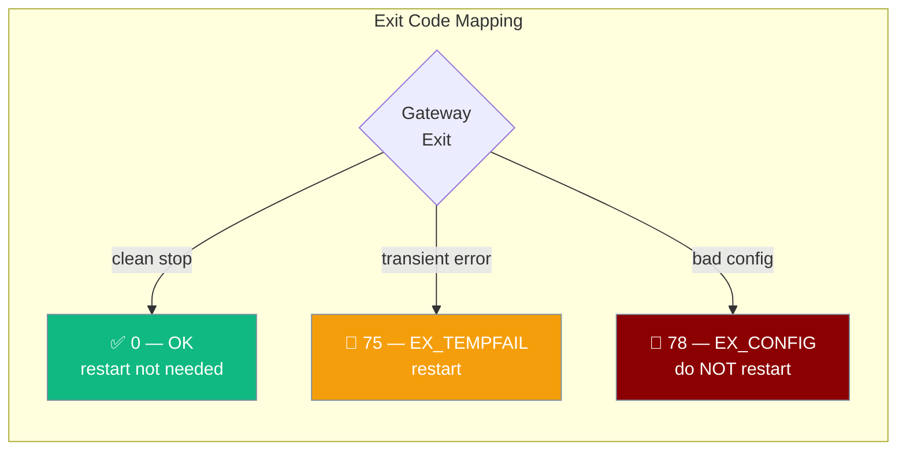
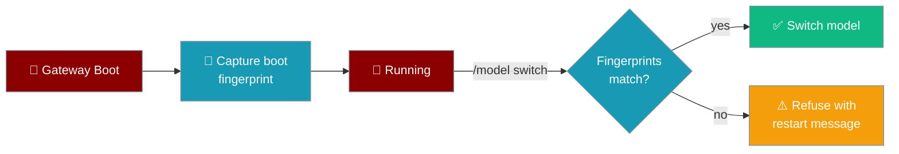

<Note>
The heavy gateway implementation (`WebSocketGateway`) lives in the **`praisonai_bot.gateway`** package. `praisonaiagents.gateway` holds only protocols and lightweight utilities. `praisonai serve gateway` and `from praisonai.gateway import WebSocketGateway` still work exactly as documented here via re-export shims; for a standalone install see [praisonai-bot Migration](/docs/guides/praisonai-bot-migration).
</Note>

Agents can connect through a unified gateway providing single-entry access to multi-agent coordination, tools, and streaming events.



## Quick Start

<Steps>
<Step title="Simple Agent Gateway">
Deploy an agent through the unified gateway:

```python
from praisonaiagents import Agent

# Gateway enables unified access
agent = Agent(
    name="Gateway Agent",
    instructions="Connect through unified gateway",
    gateway=True
)

agent.start("Process through gateway")
```
</Step>

<Step title="Multi-Service Gateway">
Configure agents with full gateway capabilities:

```python
from praisonaiagents import Agent, GatewayConfig

agent = Agent(
    name="Gateway Agent",
    instructions="Multi-service coordination",
    gateway=GatewayConfig(
        unified=True,
        services=["agents", "mcp", "a2a", "a2u"]
    )
)
```
</Step>

---

## How It Works

Agents connect to services through gateway routing:



| Component | Purpose | Agent Access |
|-----------|---------|---------------|
| **Gateway** | Single entry point | `gateway=True` |
| **Unified** | All services combined | Default mode |
| **Services** | Independent scaling | Service-specific |


<Tip>
For bot gateways, use the one-line **`reliability="production"`** preset on `BotOS`, gateway YAML, or `praisonai gateway start --reliability production` instead of tuning drain and admission separately. See [Gateway Reliability](/docs/features/gateway-reliability).
</Tip>

## Hot Reload

Edit `gateway.yaml` while the gateway is running — file watch (with optional `watchdog`) and `SIGHUP` share the same diff-driven reload path, with drain-coordinated channel restarts. Rotating `gateway.auth_token` in the same reload also revokes any live sessions on the old secret — see [Gateway Credential Rotation](/docs/features/gateway-credential-rotation). See [Gateway Config Reload](/docs/features/gateway-config-reload).

For proactive/scheduled outbound delivery routing — including friendly alias targets like `"family"` or `"ops"` — see [Friendly Aliases for Scheduled Delivery](/docs/features/proactive-delivery#friendly-aliases-for-scheduled-delivery).

### Voice notes

Voice messages sent to your gateway bot are transcribed automatically on
Telegram, Slack, and WhatsApp — no code changes required. Configure the
`stt:` block under each channel to force a language or opt out. See
[Voice Notes (Speech-to-Text)](/docs/features/gateway-stt).

---

## Authentication

Authentication posture changes automatically based on the bind interface.



| Interface | Mode | Auth Required |
|-----------|------|---------------|
| **Loopback** (`127.0.0.1`, `localhost`, `::1`) | Permissive | No |
| **External** (`0.0.0.0`, LAN IPs, public IPs) | Strict | Yes |

<Card title="Bind-Aware Authentication" icon="shield" href="/docs/features/gateway-bind-aware-auth">
  Complete authentication security guide
</Card>

### Rotating the shared secret

Change `gateway.auth_token` in the running `gateway.yaml` and hot-reload — every already-connected session that authenticated under the old secret is force-closed with WebSocket close code `4001` and reason `credentials_rotated`. New connections use the new secret. Defaults on; opt out with `gateway.revoke_on_secret_rotation: false`. See [Gateway Credential Rotation](/docs/features/gateway-credential-rotation) for the full behaviour matrix.

### Pre-auth edge protections

Two guards protect internet-exposed gateway deployments by default: a per-IP connection budget (`preauth_max_connections_per_ip=32`) that caps unauthenticated WebSocket slots before auth runs, and a per-connection flood guard (`max_unauthorized_frames=10`) that closes connections sending too many unauthorized frames. Loopback clients are always exempt. Both are disabled by setting the option to `0`.

<Card title="Gateway Edge Protections" icon="shield-halved" href="/docs/features/gateway-edge-protections">
  Per-IP connection budget, unauthorized-frame flood guard, and WebSocket close codes 4028 / 4029
</Card>

---

## Handshake and Version Negotiation

New WebSocket clients should send a `hello` frame to negotiate protocol version, capabilities, and policy limits in one round trip. The legacy `join` → `joined` flow remains supported for existing clients.

<Card title="Gateway Handshake Protocol" icon="handshake" href="/docs/features/gateway-handshake-protocol">
  Version negotiation, capabilities, and structured connection errors
</Card>

---

## Configuration Options

<Card title="Gateway Configuration" icon="code" href="/docs/sdk/reference/typescript/classes/GatewayConfig">
  Python gateway configuration options
</Card>

| Service | Default Port | Protocol | Agent Access |
|---------|--------------|----------|---------------|
| **unified** | 8765 | HTTP + WS | Default gateway |
| **agents** | 8000 | HTTP/REST | Direct API calls |
| **mcp** | 8080 | HTTP/SSE | Tool protocols |
| **a2a** | 8001 | JSON-RPC | Agent communication |
| **a2u** | 8002 | SSE | Event streams |
| **openai** | 8765 | HTTP + SSE | OpenAI API compatibility |

**Edge protection fields** (available on `GatewayConfig` and `gateway.yaml`):

| Option | Type | Default | Description |
|--------|------|---------|-------------|
| `preauth_max_connections_per_ip` | `int` | `32` | Max concurrent unauthenticated WS connections per source IP. `0` disables. Loopback exempt. |
| `max_unauthorized_frames` | `int` | `10` | Close the connection after N unauthorized frames. `0` disables. |
| `revoke_on_secret_rotation` | `bool` | `true` | Force-close live sessions when `auth_token` is rotated via config reload. `false` adopts the new secret for new connections only. See [Gateway Credential Rotation](/docs/features/gateway-credential-rotation). |
| `api.openai` | `bool` | `false` | When on, mounts `/v1/chat/completions`, `/v1/responses`, `/v1/models` on the same port and auth. See [Gateway API Endpoints](/docs/features/gateway-api-endpoints). |
| `api.mcp` | `bool` | `false` | When on, mounts an MCP JSON-RPC endpoint at `/mcp` on the same port and auth. See [Gateway API Endpoints](/docs/features/gateway-api-endpoints). |

---

## Gateway YAML Configuration

The `gateway.yaml` schema accepts three optional top-level blocks alongside `channels` and `agents`. All three are optional and ignored when not present.

### `gateway:` block

Global gateway settings — reliability preset, drain timeout, health monitor:

```yaml
gateway:
  reliability: production    # "production" | "default" | "off"
  drain_timeout: 15          # seconds to wait for in-flight turns on shutdown

channels:
  telegram:
    platform: telegram
    token: ${TELEGRAM_BOT_TOKEN}
    stt:
      enabled: true          # transcribe inbound voice notes (default on)
      echo_transcripts: true  # echo the recognised text back to the user
  discord:
    platform: discord
    token: ${DISCORD_BOT_TOKEN}
```

Inbound voice notes on Telegram, Slack, and WhatsApp are transcribed automatically — see [Voice Notes](/docs/features/gateway-voice-notes).

### `api:` block

Serve OpenAI-compatible and MCP HTTP endpoints from the same gateway process, sharing the live agents and sessions that chat users reach:

```yaml
gateway:
  api:
    openai: true    # mounts /v1/chat/completions, /v1/responses, /v1/models
    mcp: true       # mounts /mcp (JSON-RPC)
```

Both surfaces are opt-in and off by default. See [Gateway API Endpoints](/docs/features/gateway-api-endpoints) for the endpoint list, auth, and client examples.

### `hooks:` block

Register shell-command hooks that fire at gateway and message lifecycle events:

```yaml
hooks:
  - event: message_received
    command: /usr/local/bin/rate-check.sh
  - event: gateway_start
    command: "curl -s https://monitoring.example.com/ping"
```

### `BotOS.from_config` and tool names

`BotOS.from_config("botos.yaml")` now routes tool names through the standard `ToolResolver` chain:

1. Local `tools.py` in the working directory
2. Wrapper `ToolRegistry`
3. `praisonaiagents` built-in tools
4. `praisonai-tools` package
5. Installed plugins

This means a YAML bot referencing a `praisonai-tools` symbol or a local `tools.py` function just works — no ad-hoc `importlib` lookup required:

```yaml
# botos.yaml
agent:
  name: assistant
  instructions: You are a helpful assistant.
  tools:
    - web_search          # resolved via praisonai-tools
    - my_custom_tool      # resolved from local tools.py
platforms:
  telegram:
    token: ${TELEGRAM_BOT_TOKEN}
```

```python
from praisonai.bots import BotOS

botos = BotOS.from_config("botos.yaml")
botos.run()
```

---

## Gateway Agent Defaults

Gateway agents loaded from YAML use chat-optimised defaults that differ from the Python SDK.

| YAML key | Gateway default | Why |
|---|---|---|
| `reflection` | `false` | Chat channels need sub-second replies; self-reflection adds ~8x latency on short prompts |
| `tool_choice` | `null` (auto) | Let the LLM decide when to call tools |
| `allow_delegation` | `false` | Prevents cross-agent routing unless explicitly opted in |

```yaml
agents:
  assistant:
    instructions: "You are a helpful AI assistant."
    model: gpt-4o-mini
    reflection: true   # opt-in: enables self-critique, ~8x slower
```

<Note>
Changed in PraisonAI v4.6.26: gateway agents now default to `reflection: false`. Previous versions defaulted to `true`. See [PR #1485](https://github.com/MervinPraison/PraisonAI/pull/1485).
</Note>

---

## Per-Agent Approval Isolation

"Allow always" grants persist across gateway restart and default to being scoped to the approving agent, so one agent's approval never authorises another. Grants live in a durable SQLite store at `~/.praisonai/state/gateway/approvals.sqlite`.

<Card title="Gateway Scoped Approvals" icon="user-lock" href="/docs/features/gateway-scoped-approvals">
  Durable, agent-scoped allow-always grants, resolver scoping options, and the `/api/approval/allow-list` endpoint
</Card>

Gateway also supports isolated exec approval managers for multi-tenant environments where agents must not share approval state.



### Default vs Per-Agent Managers

| Manager Type | Use Case | Approval Sharing |
|-------------|----------|------------------|
| **Default** | CLI, single-agent setups | Shared process-wide |
| **Per-Agent** | Multi-tenant gateways | Isolated per instance |

```python
from praisonai.gateway.exec_approval import (
    get_default_exec_approval_manager,
    create_exec_approval_manager
)

# Default manager - shared across all agents
default_manager = get_default_exec_approval_manager(ttl=300.0)

# Per-agent manager - isolated approval state
agent1_manager = create_exec_approval_manager(ttl=120.0)
agent2_manager = create_exec_approval_manager(ttl=180.0)
```

### Multi-Agent Gateway with Isolation

```python
from praisonaiagents import Agent
from praisonai.gateway.exec_approval import create_exec_approval_manager

class IsolatedGateway:
    def __init__(self):
        self.agents = {}
        
    def add_agent(self, name, instructions, approval_ttl=300):
        # Each agent gets isolated approval manager
        manager = create_exec_approval_manager(ttl=approval_ttl)
        
        agent = Agent(
            name=name,
            instructions=instructions,
            exec_approval_manager=manager,
            gateway=True
        )
        
        self.agents[name] = {"agent": agent, "manager": manager}
        return agent
        
    def get_pending_approvals(self, agent_name):
        if agent_name in self.agents:
            manager = self.agents[agent_name]["manager"]
            return manager.list_pending()
        return []

# Usage
gateway = IsolatedGateway()

# Tenant A agent
tenant_a = gateway.add_agent(
    "TenantA_Assistant", 
    "Help tenant A users",
    approval_ttl=180  # 3 minutes
)

# Tenant B agent  
tenant_b = gateway.add_agent(
    "TenantB_Assistant",
    "Help tenant B users", 
    approval_ttl=600  # 10 minutes
)

# Isolated approval queues
pending_a = gateway.get_pending_approvals("TenantA_Assistant")
pending_b = gateway.get_pending_approvals("TenantB_Assistant")
```

<Note>
The `ttl` parameter controls how long approval requests wait before auto-expiring (default: 5 minutes). 
The `get_exec_approval_manager()` function is preserved as a backward-compatible alias for `get_default_exec_approval_manager()`.
</Note>

### Allow-list endpoint

`GET/POST/DELETE /api/approval/allow-list` manages allow-always grants. `POST` and `DELETE` accept an optional `agent_id`; `GET` returns a `grants` view alongside the legacy `allow_list`.

```json
{
  "allow_list": ["read_file"],
  "grants": [
    {"agent_id": "shell-bot", "tool_name": "shell_exec", "arg_signature": null, "created_at": 1720000000.0, "approver": "gateway:human"}
  ]
}
```

Omitting `agent_id` on `POST`/`DELETE` targets a legacy any-agent grant; supplying it scopes to that agent. See [Gateway Scoped Approvals](/docs/features/gateway-scoped-approvals) for full curl examples.

---

## Gateway lifecycle predicates

Core SDK exports three pure predicates for gateway lifecycle decisions. Each is side-effect free and testable in isolation; the wrapper owns the actual teardown.

| Symbol | Purpose | Documentation |
|--------|---------|---------------|
| `ScaleToZeroPolicy` | Quiesce when idle; wake on next inbound | [Scale to Zero](/docs/features/gateway-scale-to-zero) |
| `DrainTimeoutPolicy` | Bounded wait for in-flight turns on shutdown | [Session Continuity](/docs/features/gateway-session-continuity) |
| `DrainMarkerPolicy` + `current_epoch()` | Port-less, restart-safe external drain signal | [Drain Trigger](/docs/features/gateway-drain-trigger) |
| `classify_exit_reason` + `FatalConfigError` | Supervisor-friendly sysexits exit codes (0 / 75 / 78) | [Gateway Exit Codes](/docs/features/gateway-exit-codes) |

```python
from praisonaiagents.gateway import (
    ScaleToZeroPolicy,
    DrainTimeoutPolicy,
    DrainMarkerPolicy,
    current_epoch,
)
```

---

## Kanban Dispatcher

**Kanban dispatcher (v4.6.x):** Worker file descriptors are now released as soon as the subprocess starts (fixes a slow leak under sustained dispatch). `release_claim` failures are logged with full stack traces instead of being silently swallowed — orphaned `claimed` tasks now leave a clear log trail for triage. `KeyboardInterrupt` / `SystemExit` / asyncio cancellation propagate cleanly through dispatcher shutdown.

---

## Common Patterns

### Single Gateway Deployment
```python
from praisonaiagents import Agent

# Simple unified gateway
agent = Agent(
    name="Gateway Agent",
    gateway=True,  # Enables unified gateway
)

# CLI deployment
# praisonai serve unified --port 8765
```

### Multi-Agent Gateway
```python
from praisonaiagents import Agent, Task, PraisonAIAgents

agents = [
    Agent(name="Researcher", gateway=True),
    Agent(name="Writer", gateway=True),
]

# Multi-agent coordination through gateway
tasks = [Task(description="Research topic", agent=agents[0])]
crew = PraisonAIAgents(agents=agents, tasks=tasks)
```

### Development Gateway
```python
from praisonaiagents import Agent

agent = Agent(
    name="Dev Agent",
    gateway=True,
    debug=True  # Development features
)

# CLI: praisonai serve unified --reload
```

---

## Best Practices

<AccordionGroup>
<Accordion title="Start with Unified Gateway">
Use `praisonai serve unified` for simplicity. Agents connect automatically without configuration.
</Accordion>

<Accordion title="Development vs Production">
Enable `--reload` for development. Use separate services for production scaling.
</Accordion>

<Accordion title="Service Discovery">
All servers expose `/__praisonai__/discovery` for endpoint discovery. Agents can auto-discover capabilities.
</Accordion>

<Accordion title="Port Planning">
Reserve port 8765 for unified gateway. Use default ports for service-specific deployments.
</Accordion>
</AccordionGroup>

---

## Exit Codes & Supervisor Integration

`praisonai serve gateway` uses sysexits-based exit codes so process supervisors can distinguish a transient failure (restart) from a fatal misconfiguration (stop and fix).



| Code | Constant | Meaning | Supervisor action |
|------|----------|---------|-------------------|
| `0` | `GATEWAY_OK_EXIT_CODE` | Clean shutdown / success | No restart needed |
| `75` | `GATEWAY_RESTART_EXIT_CODE` (EX_TEMPFAIL) | Transient failure — network blip, recoverable upstream error | Restart |
| `78` | `GATEWAY_FATAL_CONFIG_EXIT_CODE` (EX_CONFIG) | Fatal misconfiguration — fix before restarting | **Do not restart** |

### What Triggers Fatal (78)

| Cause | Exit code |
|-------|-----------|
| Missing or malformed `gateway.yaml` (schema invalid / `ValueError`) | 78 |
| Missing or malformed `--agents` file | 78 |
| Missing required dependencies | 78 |
| Any `FatalConfigError` raised explicitly | 78 |
| Network blip at startup | 75 |
| Recoverable platform error | 75 |

### systemd Unit

```ini
[Unit]
Description=PraisonAI Gateway
After=network.target

[Service]
ExecStart=/usr/local/bin/praisonai serve gateway
Restart=on-failure
RestartSec=5

# Stop the crash-loop on fatal config — fix the config and start manually
RestartPreventExitStatus=78

[Install]
WantedBy=multi-user.target
```

### Kubernetes Restart Policy

```yaml
apiVersion: v1
kind: Pod
spec:
  containers:
    - name: praisonai-gateway
      image: praisonai:latest
      command: ["praisonai", "serve", "gateway"]
  restartPolicy: OnFailure
```

For Kubernetes, use a wrapper script that maps exit code 78 to success (`exit 0`) to prevent the pod from restarting on fatal config:

```bash
#!/bin/sh
praisonai serve gateway "$@"
code=$?
if [ $code -eq 78 ]; then
  echo "Fatal config error — not restarting (code 78)" >&2
  exit 0
fi
exit $code
```

---

## In-Place Code Updates and `/model`

When a running gateway's code changes on disk (via `git pull`, `pip install -U`, or an auto-update on a durable volume), the first-use lazy import triggered by a `/model` switch can hit a code mismatch and crash with a cryptic `ImportError`. The code-skew guard refuses with a clear message instead.

### How It Works

At startup, the gateway captures a fingerprint of the installed code (git SHA + newest `.py` mtime). Before each `/model` switch it compares this to the current on-disk fingerprint:



### User-Facing Message

When skew is detected, the user sees:

```
⚠️ Gateway code changed on disk since it started (<boot-short> → <disk-short>). Restart the gateway to apply updates before switching models.
```

Where `<boot-short>` and `<disk-short>` are 7-character shortened fingerprints (e.g. git SHAs or `mtime:` suffixes).

### Fail-Open

The guard is **best-effort and fail-open**: if the fingerprint cannot be determined (no git, unreadable directory), the guard returns `None` and the `/model` switch proceeds normally. Normal operation is never blocked by the guard itself.

### Opt-Out

Disable the guard for a session manager:

```python
session_manager.code_skew_guard = False
```

---

## Related

<CardGroup cols={2}>
<Card title="Agents" icon="user" href="/docs/concepts/agents">
  Core agent functionality
</Card>
<Card title="MCP Protocol" icon="plug" href="/docs/concepts/mcp">
  Model Context Protocol integration
</Card>
<Card title="Gateway CLI" icon="terminal" href="/docs/features/gateway-cli">
  CLI commands for managing the gateway
</Card>
<Card title="Gateway API Endpoints" icon="plug" href="/docs/features/gateway-api-endpoints">
  OpenAI-compat and MCP HTTP endpoints on the live gateway
</Card>
<Card title="Relay Transport" icon="arrow-left-right" href="/docs/features/relay-transport">
  Out-of-process platform connector relay
</Card>
<Card title="Bot Chat Commands" icon="terminal" href="/docs/features/bot-commands">
  Built-in and custom slash commands for gateway bots
</Card>
<Card title="Slash Command Menu" icon="list" href="/docs/features/bot-slash-command-menu">
  Native `/` autocomplete for Telegram and Discord bots
</Card>
<Card title="Voice Notes" icon="microphone" href="/docs/features/gateway-voice-notes">
  Automatic transcription of inbound voice messages
</Card>
<Card title="Run Status Controller" icon="gauge-simple" href="/docs/features/bot-run-status-controller">
  Transport-agnostic run-progress state machine with a stall watchdog
</Card>
</CardGroup>