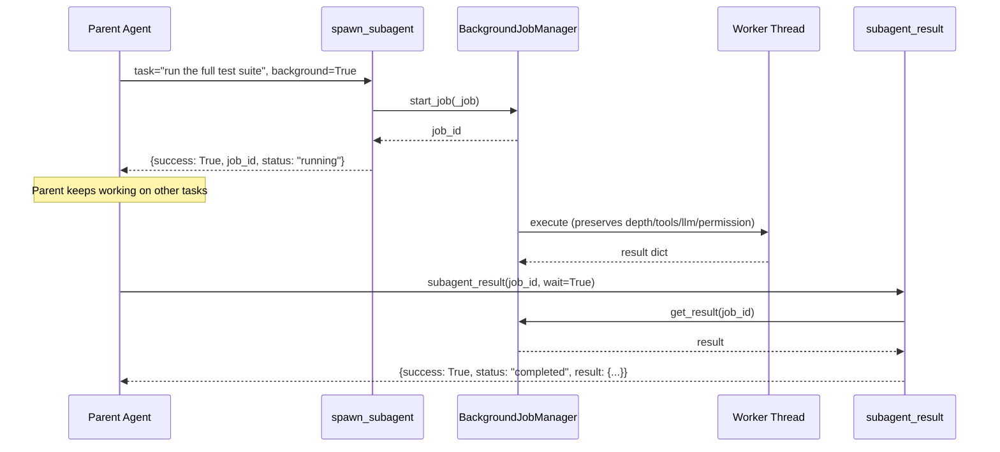
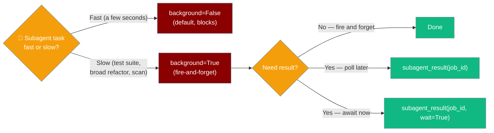

Kick off a slow subtask — full test suite, broad refactor, codebase scan — while the parent agent continues other work, then collect the result when ready.



## Quick Start

<Steps>

<Step title="Install">
```bash
pip install praisonaiagents
```
</Step>

<Step title="Kick off a background subagent">
```python
from praisonaiagents.tools.subagent_tool import create_subagent_tool

tool = create_subagent_tool()
spawn = tool["function"]

# Returns immediately — no blocking
handle = spawn(task="Run the full test suite", background=True)
print(handle["job_id"])   # e.g. "a3f2b1c9"
print(handle["status"])   # "running"
```
</Step>

<Step title="Keep working, then collect the result">
```python
collect = tool["result_tool"]["function"]

# Poll without blocking
check = collect(handle["job_id"])
print(check["status"])    # "running" or "completed"

# Or block until the subagent finishes
final = collect(handle["job_id"], wait=True)
if final["status"] == "completed":
    print(final["result"]["output"])
```
</Step>

<Step title="Handle errors">
```python
result = collect(handle["job_id"], wait=True)

if not result["success"]:
    # Worker crashed or job_id not found
    print("Job error:", result.get("error"))
elif result["result"]["success"] is False:
    # Subagent ran but reported a failure
    print("Subagent error:", result["result"]["error"])
else:
    print(result["result"]["output"])
```
</Step>

</Steps>

---

## Full Example: Test Suite in the Background

```python
from praisonaiagents.tools.subagent_tool import create_subagent_tool

tool = create_subagent_tool()
spawn = tool["function"]
collect = tool["result_tool"]["function"]

# 1. Kick off the slow job
handle = spawn(
    task="Run pytest on the whole repo and summarise failures",
    tools=["bash"],
    permission_mode="plan",
    background=True,
)
job_id = handle["job_id"]
print(f"Test run started: {job_id}")

# 2. Continue other work while tests run
print("Writing documentation...")
print("Reviewing a PR...")

# 3. Collect the result when ready
final = collect(job_id, wait=True)
if final["status"] == "completed" and final["result"]["success"]:
    print("Test results:", final["result"]["output"])
else:
    print("Something went wrong:", final.get("error") or final["result"].get("error"))
```

---

## Scoping is Preserved

Every constraint you pass to `spawn_subagent` is honoured identically on the background thread.

```python
handle = spawn(
    task="restricted exploration",
    tools=["read_file"],
    llm="gpt-4o-mini",
    permission_mode="plan",
    background=True,
)
final = collect(handle["job_id"], wait=True)
# final["result"]["permission_mode"] == "plan"
# final["result"]["llm"]             == "gpt-4o-mini"
```

- `max_depth` — tracked per-thread; concurrent background subagents do not corrupt each other's depth budget.
- `allowed_agents` — checked **before** the job is enqueued. A violation returns an immediate failure.
- `tools`, `llm`, `permission_mode` — captured in the closure and passed to the worker exactly as specified.

---

## Return Shapes at a Glance

| Call | Returned when | Shape |
|------|--------------|-------|
| `spawn(..., background=True)` | Immediately | `{success, job_id, status: "running", ...}` |
| `collect(job_id)` | Still running | `{success: True, job_id, status: "running"}` |
| `collect(job_id, wait=True)` | Completed | `{success: True, job_id, status: "completed", result: {...}}` |
| `collect(job_id, wait=True)` | Failed | `{success: False, job_id, status: "failed", error: "..."}` |
| `collect(unknown_id)` | Any time | `{success: False, job_id, error: "Job '...' not found"}` |

<Note>
When `status` is `"completed"`, the subagent's own result dict is under the `"result"` key. Check `result["result"]["success"]` for the inner outcome — an inner failure still appears as `status: "completed"` at the outer level.
</Note>

---

## When to Use Background Mode



---

## Best Practices

<AccordionGroup>

<Accordion title="Choose background mode for slow tasks only">
Synchronous mode (`background=False`, the default) is simpler and fine for sub-second subagent calls. Switch to `background=True` when the task could take more than a few seconds and the parent has other work to do.
</Accordion>

<Accordion title="Always handle the inner result">
`collect(job_id, wait=True)` returns `success: True` even when the subagent itself failed — the inner failure lives in `result["result"]["success"]`. Always check both levels.
</Accordion>

<Accordion title="Scope permissions to the minimum needed">
Pass `permission_mode="plan"` for read-only exploration. The scoping is enforced on the worker thread, so there is no way to accidentally escalate privileges in the background.
</Accordion>

<Accordion title="Use allowed_agents for safety">
If only specific agent types should run, set `allowed_agents` on `create_subagent_tool`. The check fires before the job is enqueued — you get an immediate failure, not a stuck job_id.
</Accordion>

</AccordionGroup>

---

## Related

<CardGroup cols={2}>
  <Card title="Subagent Tool" icon="robot" href="/docs/features/subagent-tool">
    Full API reference for spawn_subagent and subagent_result
  </Card>
  <Card title="Background Tasks" icon="clock" href="/docs/features/background-tasks">
    BackgroundJobManager and async task execution
  </Card>
  <Card title="Subagent Delegation" icon="users" href="/docs/features/subagent-delegation">
    Advanced multi-agent delegation with concurrency limits
  </Card>
  <Card title="Permission Modes" icon="shield-check" href="/docs/features/permission-modes">
    Control what subagents are allowed to do
  </Card>
</CardGroup>
