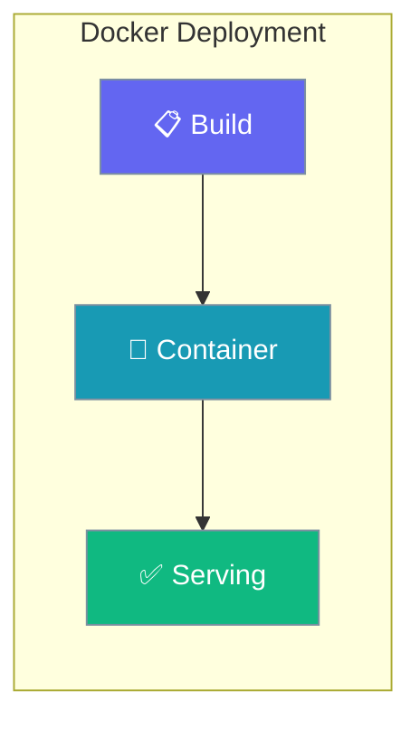
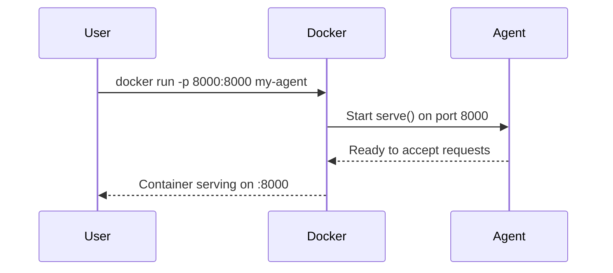

Deploy your agents using Docker containers.

```python
from praisonaiagents import Agent

agent = Agent(
    name="API Worker",
    instructions="Answer HTTP requests in a containerised deployment.",
)

agent.start("Health check: confirm the service is ready.")
```

The user builds a Docker image, runs the container, and reaches the agent through the exposed port.



## Quick Start

<Steps>
<Step title="Simple Usage">

Define an agent that answers requests inside the container.

```python
from praisonaiagents import Agent

agent = Agent(name="Worker", instructions="Answer HTTP requests.")
agent.start("Health check.")
```

</Step>

<Step title="With Configuration">

Add a Dockerfile that installs the SDK and exposes the serving port.

```dockerfile
FROM python:3.11-slim
WORKDIR /app
COPY . .
RUN pip install praisonaiagents
EXPOSE 8000
CMD ["python", "main.py"]
```

</Step>
</Steps>

---

## How It Works



---

## Dockerfile

```dockerfile
FROM python:3.11-slim

WORKDIR /app

COPY requirements.txt .
RUN pip install --no-cache-dir -r requirements.txt

COPY . .

EXPOSE 8000

CMD ["python", "main.py"]
```

## requirements.txt

```
praisonaiagents>=0.1.0
```

## main.py

```python
from praisonaiagents import Agent
from praisonaiagents.api import serve

agent = Agent(
    name="Production Agent",
    instructions="You are a helpful assistant."
)

if __name__ == "__main__":
    serve(agent, host="0.0.0.0", port=8000)
```

## Build and Run

```bash
# Build
docker build -t my-agent .

# Run
docker run -p 8000:8000 \
  -e OPENAI_API_KEY=$OPENAI_API_KEY \
  my-agent
```

## Docker Compose

```yaml
version: '3.8'

services:
  agent:
    build: .
    ports:
      - "8000:8000"
    environment:
      - OPENAI_API_KEY=${OPENAI_API_KEY}
      - DATABASE_URL=postgresql://postgres:postgres@db:5432/praisonai
    depends_on:
      - db

  db:
    image: postgres:15
    environment:
      - POSTGRES_PASSWORD=postgres
      - POSTGRES_DB=praisonai
    volumes:
      - postgres_data:/var/lib/postgresql/data

volumes:
  postgres_data:
```

## Run with Compose

```bash
docker-compose up -d
```

## Best Practices

<AccordionGroup>
<Accordion title="Pass secrets as environment variables">
Never bake API keys into the image. Set `OPENAI_API_KEY` at run time with `-e OPENAI_API_KEY=$OPENAI_API_KEY` so the same image runs across environments.
</Accordion>

<Accordion title="Pin the base image and SDK version">
Use `python:3.11-slim` and a pinned `praisonaiagents>=0.1.0` in `requirements.txt` for reproducible builds that survive upstream releases.
</Accordion>

<Accordion title="Expose one port and bind to 0.0.0.0">
`serve(agent, host="0.0.0.0", port=8000)` makes the agent reachable from outside the container. Map it with `-p 8000:8000`.
</Accordion>

<Accordion title="Use Compose for stateful stacks">
When the agent needs a database, define both services in `docker-compose.yml` and connect via `DATABASE_URL` so persistence survives container restarts.
</Accordion>
</AccordionGroup>

---

## Related

<CardGroup cols={2}>
  <Card title="Deployment Overview" icon="book" href="/docs/guides/deployment/overview">
    All deployment options
  </Card>
  <Card title="Deploy Module" icon="rocket" href="/docs/sdk/praisonai/deploy">
    Deploy API reference
  </Card>
</CardGroup>
