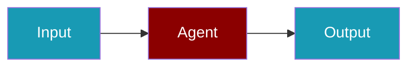

Learn how to deploy your agents to production environments.

```python
from praisonaiagents import Agent

agent = Agent(
    name="Production Agent",
    instructions="Handle live user requests reliably.",
)

agent.start("Process the next customer message.")
```

The user picks a deployment guide, ships the agent, then routes real traffic to it.




<CardGroup cols={2}>
  <Card title="24/7 Production Minimal" icon="rocket-launch" href="/docs/guides/deployment/production-minimal">
    **Start here** - Always-on deployment with process supervision
  </Card>
  <Card title="Overview" icon="book" href="/docs/guides/deployment/overview">
    All deployment options
  </Card>
  <Card title="Docker" icon="docker" href="/docs/guides/deployment/docker">
    Deploy with Docker
  </Card>
  <Card title="Advanced Production" icon="gear" href="/docs/tutorials/production-deployment">
    Comprehensive production setup
  </Card>
</CardGroup>
