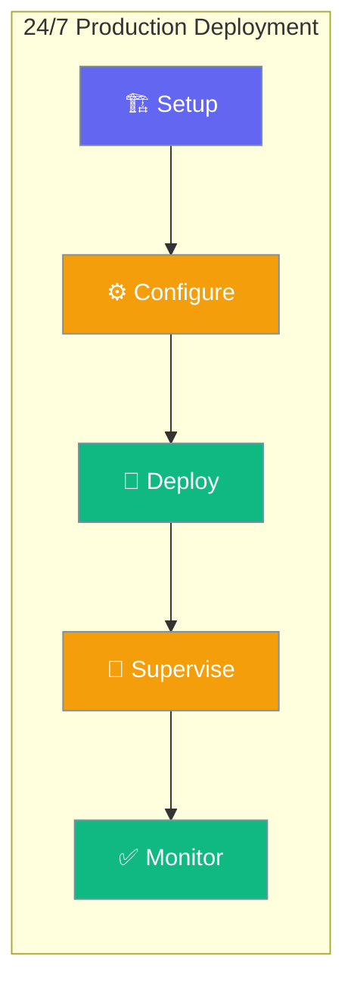

Deploy PraisonAI agents for always-on operation with automatic process supervision.



## Quick Start

<Steps>
<Step title="Choose Deployment Method">
  Select between Docker Compose (recommended) or System Services:
  
  ```python
  from praisonaiagents import Agent
  
  # Your agent for 24/7 deployment
  agent = Agent(
      name="Production Agent",
      instructions="Handle production tasks continuously",
  )
  
  agent.start("Deploy for production")
  ```
</Step>

<Step title="Configure Environment">
  Set up environment variables for production:
  
  ```bash
  # Required API key
  export OPENAI_API_KEY="sk-..."
  
  # Optional performance settings
  export PRAISONAI_MAX_WORKERS=4
  export PRAISONAI_LOG_LEVEL=INFO
  ```
</Step>
</Steps>

---

## Deployment Options

<CardGroup cols={2}>
  <Card title="Docker Compose" icon="docker" href="#docker-compose-production">
    Recommended for most users. Includes automatic restarts and health checks.
  </Card>
  <Card title="System Services" icon="gear" href="#system-services">
    Native OS integration with systemd, launchd, or Windows Service.
  </Card>
</CardGroup>

---

## Docker Compose Production

### Quick Setup (5 minutes)

<Steps>
  <Step title="Install Docker">
    ```bash
    # Linux/Ubuntu
    curl -fsSL https://get.docker.com -o get-docker.sh
    sudo sh get-docker.sh
    
    # macOS with Homebrew
    brew install --cask docker
    
    # Windows: Download from docker.com
    ```
  </Step>

  <Step title="Create deployment directory">
    ```bash
    mkdir praisonai-deploy && cd praisonai-deploy
    ```
  </Step>

  <Step title="Create environment file">
    ```bash
    cat > .env << EOF
    # Required: Your OpenAI API key
    OPENAI_API_KEY=sk-proj-example...
    
    # Optional: Additional providers
    # ANTHROPIC_API_KEY=ant-api-03-...
    # GOOGLE_API_KEY=AIza...
    
    # Performance settings
    PRAISONAI_MAX_WORKERS=4
    PRAISONAI_LOG_LEVEL=INFO
    EOF
    ```
  </Step>

  <Step title="Create docker-compose.yml">
    ```yaml
    version: '3.8'
    
    services:
      # PraisonAI Claw Dashboard (Recommended)
      claw:
        image: mervinpraison/praisonai:claw
        container_name: praisonai-claw
        ports:
          - "8082:8082"
        environment:
          - OPENAI_API_KEY=${OPENAI_API_KEY}
          - ANTHROPIC_API_KEY=${ANTHROPIC_API_KEY:-}
          - GOOGLE_API_KEY=${GOOGLE_API_KEY:-}
        volumes:
          - claw_data:/data
        restart: unless-stopped
        healthcheck:
          test: ["CMD", "curl", "-f", "http://localhost:8082/health"]
          interval: 30s
          timeout: 10s
          retries: 3
          start_period: 30s
        networks:
          - praisonai
    
      # PraisonAI API Service (Optional)
      api:
        image: mervinpraison/praisonai:api
        container_name: praisonai-api
        ports:
          - "8080:8080"
        environment:
          - OPENAI_API_KEY=${OPENAI_API_KEY}
          - PRAISONAI_MAX_WORKERS=${PRAISONAI_MAX_WORKERS}
        volumes:
          - praisonai_data:/root/.praison
        restart: unless-stopped
        healthcheck:
          test: ["CMD", "curl", "-f", "http://localhost:8080/health"]
          interval: 30s
          timeout: 10s
          retries: 3
        networks:
          - praisonai
    
    volumes:
      claw_data:
        driver: local
      praisonai_data:
        driver: local
    
    networks:
      praisonai:
        driver: bridge
    ```
  </Step>

  <Step title="Deploy and run 24/7">
    ```bash
    # Start services
    docker-compose up -d
    
    # Check status
    docker-compose ps
    
    # View logs
    docker-compose logs -f claw
    ```
    
    **Success!** Your PraisonAI is now running at:
    - **Dashboard**: http://localhost:8082 (Claw)
    - **API**: http://localhost:8080 (if enabled)
  </Step>
</Steps>

---

## Best Practices

<AccordionGroup>
<Accordion title="Use environment files for secrets">
  Never hardcode API keys in docker-compose.yml. Always use `.env` files and ensure they're in `.gitignore`.
</Accordion>

<Accordion title="Implement health checks">
  Configure health checks for automatic restarts. The `/health` endpoint returns service status.
</Accordion>

<Accordion title="Set up monitoring">
  Monitor logs and service status regularly. Use `docker-compose logs -f` or `journalctl -u praisonai -f`.
</Accordion>

<Accordion title="Configure automatic updates">
  Schedule weekly updates with crontab to pull latest images and restart services automatically.
</Accordion>
</AccordionGroup>

---

## System Services

For native OS integration without Docker:

### Linux (systemd)

<Steps>
  <Step title="Install PraisonAI">
    ```bash
    # Create dedicated user
    sudo useradd -r -s /bin/false praisonai
    sudo mkdir -p /opt/praisonai /var/log/praisonai
    sudo chown praisonai:praisonai /opt/praisonai /var/log/praisonai
    
    # Install in virtual environment
    sudo -u praisonai python3 -m venv /opt/praisonai/venv
    sudo -u praisonai /opt/praisonai/venv/bin/pip install "praisonai[claw]"
    ```
  </Step>

  <Step title="Create service configuration">
    ```bash
    # Environment file
    sudo tee /opt/praisonai/.env << EOF
    OPENAI_API_KEY=sk-proj-example...
    PRAISONAI_LOG_LEVEL=INFO
    PRAISONAI_HOST=127.0.0.1
    PRAISONAI_PORT=8082
    EOF
    
    sudo chown praisonai:praisonai /opt/praisonai/.env
    sudo chmod 600 /opt/praisonai/.env
    ```
  </Step>

  <Step title="Create systemd service">
    ```bash
    sudo tee /etc/systemd/system/praisonai.service << EOF
    [Unit]
    Description=PraisonAI Claw Dashboard
    After=network.target
    Requires=network.target
    
    [Service]
    Type=exec
    User=praisonai
    Group=praisonai
    WorkingDirectory=/opt/praisonai
    EnvironmentFile=/opt/praisonai/.env
    ExecStart=/opt/praisonai/venv/bin/praisonai claw --host \${PRAISONAI_HOST} --port \${PRAISONAI_PORT}
    ExecReload=/bin/kill -HUP \$MAINPID
    Restart=always
    RestartSec=10
    StartLimitIntervalSec=0
    
    # Security settings
    NoNewPrivileges=true
    ProtectSystem=strict
    ProtectHome=true
    ReadWritePaths=/opt/praisonai /var/log/praisonai
    
    # Logging
    StandardOutput=journal
    StandardError=journal
    SyslogIdentifier=praisonai
    
    [Install]
    WantedBy=multi-user.target
    EOF
    ```
  </Step>

  <Step title="Enable and start service">
    ```bash
    # Reload systemd and enable service
    sudo systemctl daemon-reload
    sudo systemctl enable praisonai
    sudo systemctl start praisonai
    
    # Check status
    sudo systemctl status praisonai
    
    # View logs
    sudo journalctl -u praisonai -f
    ```
  </Step>
</Steps>

### macOS (launchd)

<Steps>
  <Step title="Install PraisonAI">
    ```bash
    # Install via pip
    pip3 install "praisonai[claw]"
    
    # Create directories
    mkdir -p ~/Library/LaunchAgents
    mkdir -p ~/.praisonai
    ```
  </Step>

  <Step title="Create environment file">
    ```bash
    cat > ~/.praisonai/env << EOF
    export OPENAI_API_KEY="sk-proj-example..."
    export PRAISONAI_LOG_LEVEL="INFO"
    EOF
    
    chmod 600 ~/.praisonai/env
    ```
  </Step>

  <Step title="Create launch agent">
    ```xml
    <!-- ~/Library/LaunchAgents/ai.praison.claw.plist -->
    <?xml version="1.0" encoding="UTF-8"?>
    <!DOCTYPE plist PUBLIC "-//Apple//DTD PLIST 1.0//EN" "http://www.apple.com/DTDs/PropertyList-1.0.dtd">
    <plist version="1.0">
    <dict>
        <key>Label</key>
        <string>ai.praison.claw</string>
        <key>ProgramArguments</key>
        <array>
            <string>/bin/bash</string>
            <string>-c</string>
            <string>source ~/.praisonai/env && praisonai claw --host 127.0.0.1 --port 8082</string>
        </array>
        <key>RunAtLoad</key>
        <true/>
        <key>KeepAlive</key>
        <true/>
        <key>WorkingDirectory</key>
        <string>/Users/$(whoami)/.praisonai</string>
        <key>StandardOutPath</key>
        <string>/Users/$(whoami)/.praisonai/stdout.log</string>
        <key>StandardErrorPath</key>
        <string>/Users/$(whoami)/.praisonai/stderr.log</string>
    </dict>
    </plist>
    ```
  </Step>

  <Step title="Load and start service">
    ```bash
    # Load the service
    launchctl load ~/Library/LaunchAgents/ai.praison.claw.plist
    
    # Start the service
    launchctl start ai.praison.claw
    
    # Check status
    launchctl list | grep ai.praison.claw
    
    # View logs
    tail -f ~/.praisonai/stdout.log
    ```
  </Step>
</Steps>

### Windows Service

<Steps>
  <Step title="Install dependencies">
    ```powershell
    # Install Python and PraisonAI
    pip install "praisonai[claw]" pywin32
    
    # Create directories
    mkdir C:\PraisonAI
    mkdir C:\PraisonAI\logs
    ```
  </Step>

  <Step title="Create service script">
    ```python
    # C:\PraisonAI\praisonai_service.py
    import win32serviceutil
    import win32service
    import win32event
    import subprocess
    import os
    import sys
    
    class PraisonAIService(win32serviceutil.ServiceFramework):
        _svc_name_ = "PraisonAI"
        _svc_display_name_ = "PraisonAI Claw Dashboard"
        _svc_description_ = "PraisonAI AI agent dashboard service"
        
        def __init__(self, args):
            win32serviceutil.ServiceFramework.__init__(self, args)
            self.hWaitStop = win32event.CreateEvent(None, 0, 0, None)
            self.process = None
        
        def SvcStop(self):
            self.ReportServiceStatus(win32service.SERVICE_STOP_PENDING)
            if self.process:
                self.process.terminate()
            win32event.SetEvent(self.hWaitStop)
        
        def SvcDoRun(self):
            # Set environment variables
            os.environ['OPENAI_API_KEY'] = 'sk-proj-example...'
            os.environ['PRAISONAI_LOG_LEVEL'] = 'INFO'
            
            # Start PraisonAI
            self.process = subprocess.Popen([
                sys.executable, '-m', 'praisonai', 'claw',
                '--host', '127.0.0.1',
                '--port', '8082'
            ], cwd='C:\\PraisonAI')
            
            # Wait for stop signal
            win32event.WaitForSingleObject(self.hWaitStop, win32event.INFINITE)
    
    if __name__ == '__main__':
        win32serviceutil.HandleCommandLine(PraisonAIService)
    ```
  </Step>

  <Step title="Install and start service">
    ```powershell
    # Install service (run as Administrator)
    python C:\PraisonAI\praisonai_service.py install
    
    # Start service
    python C:\PraisonAI\praisonai_service.py start
    
    # Check status
    sc query PraisonAI
    
    # Set to start automatically
    sc config PraisonAI start=auto
    ```
  </Step>
</Steps>

---

## Verification & Management

### Health Check

```bash
# Check if service is running
curl http://localhost:8082/health

# Expected response:
# {"status": "healthy", "version": "x.x.x"}
```

### Service Management Commands

<Tabs>
  <Tab title="Docker Compose">
    ```bash
    # Status
    docker-compose ps
    
    # Stop
    docker-compose stop
    
    # Restart
    docker-compose restart
    
    # Update
    docker-compose pull && docker-compose up -d
    
    # Logs
    docker-compose logs -f
    ```
  </Tab>
  
  <Tab title="Linux (systemd)">
    ```bash
    # Status
    sudo systemctl status praisonai
    
    # Stop
    sudo systemctl stop praisonai
    
    # Restart
    sudo systemctl restart praisonai
    
    # Logs
    sudo journalctl -u praisonai -f
    
    # Disable
    sudo systemctl disable praisonai
    ```
  </Tab>
  
  <Tab title="macOS (launchd)">
    ```bash
    # Status
    launchctl list | grep ai.praison.claw
    
    # Stop
    launchctl stop ai.praison.claw
    
    # Restart
    launchctl stop ai.praison.claw && launchctl start ai.praison.claw
    
    # Unload
    launchctl unload ~/Library/LaunchAgents/ai.praison.claw.plist
    ```
  </Tab>
  
  <Tab title="Windows">
    ```powershell
    # Status
    sc query PraisonAI
    
    # Stop
    net stop PraisonAI
    
    # Start
    net start PraisonAI
    
    # Remove
    python C:\PraisonAI\praisonai_service.py remove
    ```
  </Tab>
</Tabs>

---

---

## Related

<CardGroup cols={2}>
  <Card title="Bot Integration" icon="robot" href="/docs/concepts/claw">
    Connect to Slack, Discord, Telegram, and WhatsApp
  </Card>
  <Card title="Advanced Deployment" icon="gear" href="/docs/tutorials/production-deployment">
    Scaling, monitoring, and advanced configurations
  </Card>
</CardGroup>

## Support

- 📚 [Full Documentation](https://docs.praison.ai)
- 🐛 [Report Issues](https://github.com/MervinPraison/PraisonAI/issues)
- 💬 [Community Discussions](https://github.com/MervinPraison/PraisonAI/discussions)