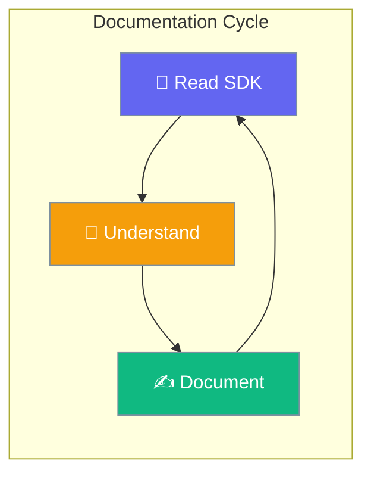
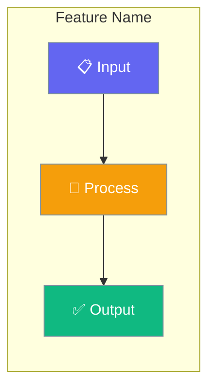
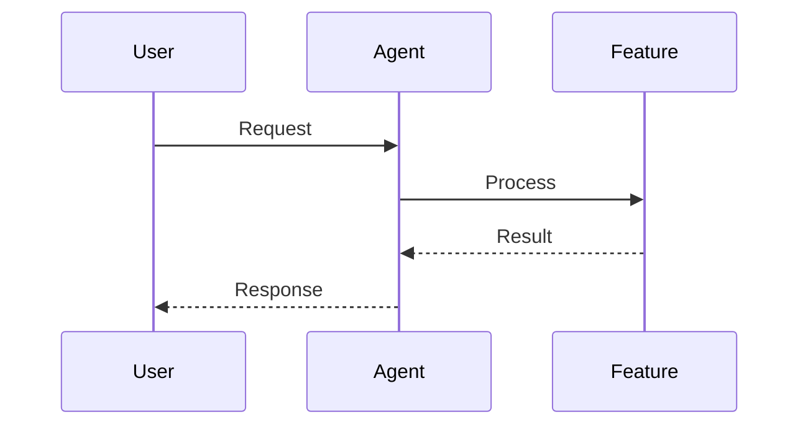
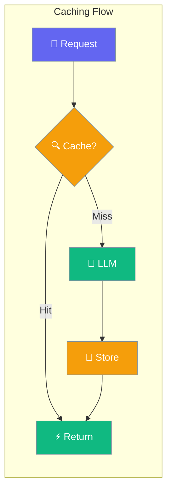
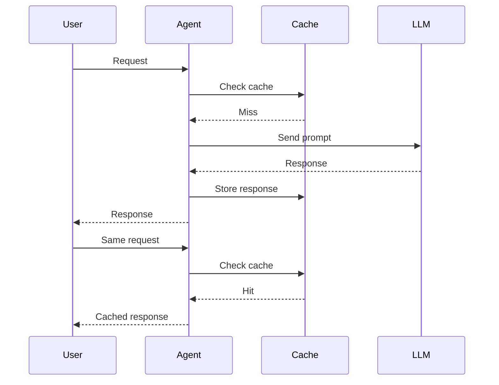

Every PraisonAI documentation page follows the same structure, component set, and visual language — this guide is both the reference and the example.



---

## Documentation Creation Process

Read the SDK source before writing anything — documentation must reflect SDK ground truth, not assumptions.

<Steps>
<Step title="Read SDK source">
Open and read the actual SDK implementation file in `praisonaiagents/` before writing a single word of documentation.

```python
# Example: reading agent source before documenting
# praisonaiagents/agent/agent.py  ← read this first
from praisonaiagents import Agent

agent = Agent(
    name="Research Agent",
    instructions="Research and summarize topics"
)
agent.start("What is agentic AI?")
```
</Step>

<Step title="Extract all parameters">
Pull every parameter, type, default value, and description from the SDK source or config class.

```python
# praisonaiagents/config/feature_configs.py
@dataclass
class CachingConfig:
    enabled: bool = True          # Extract: enabled, bool, True
    ttl: int = 3600               # Extract: ttl, int, 3600
    backend: str = "memory"       # Extract: backend, str, "memory"
```
</Step>

<Step title="Check existing docs">
Search `docs/` for related pages before creating a new one — avoid duplication, ensure consistency.
</Step>

<Step title="Write the page">
Follow the [Page Structure Template](#page-structure-template) and every rule in this guide.
</Step>
</Steps>

### SDK-First Cycle

Never batch-update multiple pages without reading source for each.

| Step | Action |
|------|--------|
| **READ** | Open the actual SDK source file |
| **UNDERSTAND** | Comprehend the implementation, APIs, and behaviour |
| **DOCUMENT** | Write documentation based on SDK truth |
| **REPEAT** | Move to the next feature and restart |

### File Locations

| Content Type | SDK Location | Docs Location |
|--------------|--------------|---------------|
| Feature configs | `praisonaiagents/config/feature_configs.py` | `docs/concepts/*.mdx` |
| Agent class | `praisonaiagents/agent/agent.py` | `docs/concepts/agents.mdx` |
| MCP integration | `praisonaiagents/mcp/mcp.py` | `docs/concepts/mcp.mdx` |
| Skills | `praisonaiagents/skills/` | `docs/concepts/skills.mdx` |
| Memory | `praisonaiagents/memory/` | `docs/concepts/memory.mdx` |
| Knowledge | `praisonaiagents/knowledge/` | `docs/concepts/knowledge.mdx` |

### Multi-SDK Reference

| SDK | Source Code Path | Documentation Path | Parity Tracker |
|-----|------------------|-------------------|----------------|
| **Python** | `praisonai-package/src/praisonai-agents/` | `docs/concepts/`, `docs/features/` | `docs/features/DOCS_PARITY.md` |
| **TypeScript/JS** | `praisonai-package/src/praisonai-ts/src/` | `docs/js/` | `docs/js/DOCS_PARITY.md` |
| **Rust** | `praisonai-package/src/praisonai-rust/src/` | `docs/rust/` | `docs/rust/DOCS_PARITY.md` |

<Tabs>
<Tab title="TypeScript SDK Structure">
```
praisonai-ts/src/
├── agents/           # Agent implementations
├── tools/            # Tool definitions
├── memory/           # Memory implementations
├── mcp/              # MCP protocol support
├── observability/    # Tracing integrations
└── index.ts          # Main exports
```
</Tab>
<Tab title="Rust SDK Structure">
```
praisonai-rust/src/
├── agent/            # Agent and config
├── llm/              # LLM provider
├── tools/            # Tool system
├── memory/           # Memory stores
├── mcp/              # MCP client
└── lib.rs            # Main exports
```
</Tab>
</Tabs>

---

## Folder Placement Rules

Where a file lives determines who can change it — AI agents have write access to most folders but never `docs/concepts/`.

<Warning>
**Critical folder rules — violations cause PRs to be rejected:**

- `docs/concepts/` is **HUMAN ONLY** — requires explicit human approval. Never create or modify files here.
- `docs/js/` and `docs/rust/` are **auto-generated** by the parity system — never edit manually.
- If an issue mentions "concepts", still place the file in `docs/features/`.
</Warning>

| Folder | Who Can Write | Purpose |
|--------|--------------|---------|
| `docs/concepts/` | **HUMAN ONLY** | Core architecture concepts |
| `docs/features/` | AI agents + humans | Feature documentation, guides, integrations |
| `docs/tools/` | AI agents + humans | Tool-specific documentation |
| `docs/guides/` | AI agents + humans | How-to guides and tutorials |
| `docs/js/`, `docs/rust/` | **Auto-generated ONLY** | Managed by parity system |

---

## AI Agent Behavioural Rules

<Warning>
**Mandatory for all AI agents working in this repository:**

1. ALWAYS read `AGENTS.md` before starting work
2. ALWAYS read the SDK source code before documenting a feature
3. NEVER guess API signatures — read the actual code
4. NEVER create placeholder content or stub pages
5. NEVER modify `docs.json` "Concepts" group entries
6. ALWAYS create a feature branch (never commit to main)
7. ALWAYS create a PR with `gh pr create`
8. ALWAYS verify `docs.json` is valid JSON after modifications
9. ALWAYS use Mintlify components (`Steps`, `AccordionGroup`, `CardGroup`)
10. ALWAYS include a hero Mermaid diagram with the standard colour scheme
</Warning>

---

## Page Structure Template

Every documentation page follows this exact skeleton.

```mdx
---
title: "Feature Name"
sidebarTitle: "Feature Name"
description: "One-line description of what this feature does"
icon: "icon-name"
---

{/* One sentence explaining the feature — what it does, not how */}

{/* Hero Mermaid diagram showing the concept visually */}

## Quick Start

<Steps>
<Step title="Simple Usage">
{/* Minimal code example — enable with True */}
</Step>

<Step title="With Configuration">
{/* Code example with config class */}
</Step>
</Steps>

---

## How It Works

{/* Sequence diagram or flow diagram */}

{/* Brief explanation table */}

---

## Configuration Options

{/* Link to auto-generated SDK reference — DO NOT duplicate SDK parameters here */}

<Card title="[Feature] API Reference" icon="code" href="/docs/sdk/reference/typescript/classes/[FeatureConfig]">
  TypeScript configuration options
</Card>

---

## Common Patterns

{/* 2–3 practical usage patterns */}

---

## Best Practices

<AccordionGroup>
{/* 3–4 best practices as accordions */}
</AccordionGroup>

---

## Related

<CardGroup cols={2}>
{/* 2 related concept pages */}
</CardGroup>
```

---

## Mermaid Diagram Standards

Every page starts with a hero Mermaid diagram using the standard colour scheme.

### Colour Scheme

| Colour | Hex | Use |
|--------|-----|-----|
| Dark Red | `#8B0000` | Agents, inputs, outputs, tasks |
| Teal | `#189AB4` | Tools, processes, middleware |
| Green | `#10B981` | Success, results, completion |
| Amber | `#F59E0B` | Warnings, planners, intermediate steps |
| Indigo | `#6366F1` | Configuration, settings, options |
| White | `#fff` | Text — always white on coloured backgrounds |
| Grey | `#7C90A0` | Stroke/border colour |

### Diagram Types by Use Case

| Use Case | Diagram Type |
|----------|-------------|
| Feature overview | `graph LR` — flow left-to-right |
| Process flow | `graph TB` — steps top-to-bottom |
| Interactions | `sequenceDiagram` — agent-user-system interactions |
| Options/modes | `graph TB` with subgraphs |

<Tabs>
<Tab title="Hero Diagram (rendered)">

</Tab>
<Tab title="Hero Diagram (source)">
```
graph LR
    subgraph "Feature Name"
        A[📋 Input] --> B[🧠 Process]
        B --> C[✅ Output]
    end

    classDef input fill:#6366F1,stroke:#7C90A0,color:#fff
    classDef process fill:#F59E0B,stroke:#7C90A0,color:#fff
    classDef output fill:#10B981,stroke:#7C90A0,color:#fff

    class A input
    class B process
    class C output
```
</Tab>
</Tabs>

<Tabs>
<Tab title="Sequence Diagram (rendered)">

</Tab>
<Tab title="Sequence Diagram (source)">
```
sequenceDiagram
    participant User
    participant Agent
    participant Feature

    User->>Agent: Request
    Agent->>Feature: Process
    Feature-->>Agent: Result
    Agent-->>User: Response
```
</Tab>
</Tabs>

---

## Mintlify Components Usage

Every page must use `<Steps>`, `<AccordionGroup>`, and `<CardGroup cols={2}>` — these are not optional.

### Required Components

| Component | Purpose | Required In |
|-----------|---------|------------|
| `<Steps>` | Sequential flows | Quick Start section |
| `<AccordionGroup>` | Grouped content | Best Practices section |
| `<CardGroup cols={2}>` | Related links | Related section |
| `<Tabs>` | Multi-language examples | Code comparison |
| `<Note>` / `<Warning>` / `<Tip>` | Callouts | Context-dependent |

### Component Syntax

**Steps:**
```mdx
<Steps>
<Step title="First Step">
Content here.
</Step>
<Step title="Second Step">
Content here.
</Step>
</Steps>
```

**AccordionGroup:**
```mdx
<AccordionGroup>
<Accordion title="Best Practice Title">
Content here.
</Accordion>
<Accordion title="Another Practice">
Content here.
</Accordion>
</AccordionGroup>
```

**CardGroup:**
```mdx
<CardGroup cols={2}>
<Card title="Card Title" icon="icon-name" href="/docs/path">
Card description.
</Card>
<Card title="Card Title" icon="icon-name" href="/docs/path">
Card description.
</Card>
</CardGroup>
```

**Tabs:**
```mdx
<Tabs>
<Tab title="Python">
```python
code here
```
</Tab>
<Tab title="TypeScript">
```typescript
code here
```
</Tab>
</Tabs>
```

---

## Code Example Standards

Every example must run without modification — copy-paste success is the bar.

<AccordionGroup>
<Accordion title="Code Quality Rules">
1. Run without modification (copy-paste success)
2. Include ALL necessary imports
3. Use realistic but simple data
4. Be the shortest way to accomplish the task
5. Show the feature being documented, not unrelated features
</Accordion>
<Accordion title="Import Patterns">
Use these exact imports — no complex sub-module paths:

```python
# Single agent
from praisonaiagents import Agent

# Agent with planning
from praisonaiagents import Agent, PlanningConfig

# Multi-agent
from praisonaiagents import Agent, Task, PraisonAIAgents

# MCP
from praisonaiagents import Agent
from praisonaiagents.mcp import MCP

# Workflows — use simple import, not sub-module
from praisonaiagents import when, parallel, loop
```
</Accordion>
<Accordion title="Simple Quick Start Example">
```python
from praisonaiagents import Agent

agent = Agent(
    name="Research Agent",
    instructions="Research and summarize topics",
    feature=True
)

agent.start("What is agentic AI?")
```
</Accordion>
<Accordion title="Config Class Example">
```python
from praisonaiagents import Agent, PlanningConfig

agent = Agent(
    name="Research Agent",
    instructions="Research and summarize topics",
    planning=PlanningConfig(
        model="gpt-4o",
        verbose=True
    )
)

agent.start("Plan a research strategy for AI safety")
```
</Accordion>
</AccordionGroup>

### Configuration Table Format

Document every SDK option in this format:

```markdown
| Option | Type | Default | Description |
|--------|------|---------|-------------|
| `option_name` | `type` | `default` | What it does |
```

---

## Writing Style

Concise, active voice, direct — after reading a page, users should think "is it really this easy?"

### Do / Don't

| Principle | Do | Don't |
|-----------|-----|-------|
| **Concise** | "Planning breaks tasks into steps" | "Planning is a feature that allows agents to break down complex tasks into smaller, more manageable steps" |
| **Active voice** | "Enable planning with `planning=True`" | "Planning can be enabled by setting the planning parameter to True" |
| **Direct** | "Use `gpt-4o` for planning" | "It is recommended that you consider using gpt-4o for planning" |
| **Specific** | "Set `timeout=60` for slow servers" | "Increase the timeout if needed" |

### Section Introductions

Each section starts with exactly one sentence — no multi-sentence preamble.

```
✅ Good: "Planning enables agents to think before acting."
❌ Bad:  "Planning is a powerful feature that enables agents to think before acting.
          It allows them to break down complex tasks into smaller steps."
```

<Warning>
**Forbidden phrases — never use these:**

- "In this section, we will…"
- "As you can see…"
- "It's important to note that…"
- "Please note that…"
- "Let's take a look at…"
- "The following example shows…"
</Warning>

---

## Configuration Documentation Pattern

Features support multiple configuration levels — document each level the feature actually supports.

**Precedence ladder:** `Instance > Config > Array > Dict > String > Bool > Default`

```python
# Level 1: Bool (simplest)
agent = Agent(feature=True)

# Level 2: String
agent = Agent(feature="option_name")

# Level 3: Dict
agent = Agent(feature={"option": "value", "enabled": True})

# Level 4: Array
agent = Agent(feature=["option1", "option2"])

# Level 5: Config class
agent = Agent(feature=FeatureConfig(option="value"))

# Level 6: Instance (full control)
feature_instance = Feature(option="value")
agent = Agent(feature=feature_instance)
```

### SDK Config Extraction

When reading `feature_configs.py`, extract every field:

```python
@dataclass
class FeatureConfig:
    option1: str = "default"       # Extract: option1, str, "default"
    option2: bool = False          # Extract: option2, bool, False
    option3: Optional[int] = None  # Extract: option3, int, None
```

Convert to documentation table:

| Option | Type | Default | Description |
|--------|------|---------|-------------|
| `option1` | `str` | `"default"` | Description from docstring |
| `option2` | `bool` | `False` | Description from docstring |
| `option3` | `int` | `None` | Description from docstring |

---

## Mintlify Frontmatter

All four fields are required on every page.

```yaml
---
title: "Feature Name"           # Display title
sidebarTitle: "Feature Name"    # Sidebar title (usually same as title)
description: "One-line desc"    # Meta description
icon: "icon-name"               # Lucide icon name
---
```

### Icon Selection

| Feature Type | Icon |
|--------------|------|
| Planning | `list-check` |
| Reflection | `rotate` |
| Skills | `puzzle-piece` |
| Hooks | `webhook` |
| Autonomy | `robot` |
| Output | `display` |
| Execution | `play` |
| Caching | `database` |
| Templates | `file-code` |
| Web | `globe` |
| MCP | `plug` |
| Memory | `brain` |
| Knowledge | `book` |
| Tools | `wrench` |
| Agents | `user` |

---

## Quality Checklist

Run through this before submitting any documentation page.

<AccordionGroup>
<Accordion title="Structure">
- [ ] Frontmatter complete (title, sidebarTitle, description, icon)
- [ ] Hero Mermaid diagram present
- [ ] Quick Start uses `<Steps>` component
- [ ] Configuration Options table complete
- [ ] Best Practices uses `<AccordionGroup>`
- [ ] Related section uses `<CardGroup cols={2}>`
</Accordion>
<Accordion title="SDK Accuracy">
- [ ] All config options documented
- [ ] Types match SDK exactly
- [ ] Defaults match SDK exactly
- [ ] Import paths are correct
- [ ] No undocumented features
</Accordion>
<Accordion title="Code Quality">
- [ ] All examples run without modification
- [ ] All imports included
- [ ] Examples are minimal (shortest way to accomplish the task)
- [ ] No placeholder values like `"your-key-here"`
</Accordion>
<Accordion title="Diagrams">
- [ ] Colour scheme matches standard (`#8B0000`, `#189AB4`, `#10B981`, `#F59E0B`, `#6366F1`)
- [ ] White text on coloured backgrounds (`color:#fff`)
- [ ] `classDef` declarations present
- [ ] Diagram explains the concept visually
</Accordion>
<Accordion title="Writing">
- [ ] One-sentence section intros
- [ ] No forbidden phrases
- [ ] Active voice throughout
- [ ] Concise explanations
</Accordion>
</AccordionGroup>

---

## Complete Page Example

A full Caching page demonstrating every rule in this guide.

````mdx
---
title: "Caching"
sidebarTitle: "Caching"
description: "Cache LLM responses to reduce costs and latency"
icon: "database"
---

Caching stores LLM responses to avoid redundant API calls, reducing costs and improving response times.



## Quick Start

<Steps>
<Step title="Enable Caching">
```python
from praisonaiagents import Agent

agent = Agent(
    name="Research Agent",
    instructions="Answer questions concisely",
    cache=True
)

agent.start("What is machine learning?")
```
</Step>

<Step title="Configure Cache">
```python
from praisonaiagents import Agent, CachingConfig

agent = Agent(
    name="Research Agent",
    instructions="Answer questions concisely",
    cache=CachingConfig(
        ttl=3600,
        backend="memory"
    )
)

agent.start("What is machine learning?")
```
</Step>
</Steps>

---

## How It Works



---

## Best Practices

<AccordionGroup>
<Accordion title="Set TTL based on data freshness">
Use short TTL (300s) for frequently changing data, longer TTL (3600s) for stable content.
</Accordion>
<Accordion title="Use disk backend for persistence">
Memory cache resets on restart — use `backend="disk"` to persist across sessions.
</Accordion>
</AccordionGroup>

---

## Related

<CardGroup cols={2}>
<Card title="Planning" icon="list-check" href="/docs/features/planning-mode">
  Plan before executing to improve accuracy.
</Card>
<Card title="Memory" icon="brain" href="/docs/features/advanced-memory">
  Store and retrieve long-term information.
</Card>
</CardGroup>
````

---

## Related

<CardGroup cols={2}>
<Card title="Contributing Guide" icon="code-branch" href="/docs/contributing">
  How to fork, clone, and submit pull requests to PraisonAI.
</Card>
<Card title="AGENTS.md on GitHub" icon="github" href="https://github.com/MervinPraison/PraisonAIDocs/blob/main/AGENTS.md">
  The source-of-truth instructions file this guide mirrors.
</Card>
</CardGroup>
