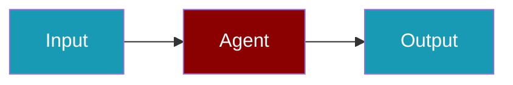

Learn how to build AI agents with PraisonAI through practical, step-by-step guides.

```python
from praisonaiagents import Agent

agent = Agent(
    name="Assistant",
    instructions="You are a helpful assistant.",
)

agent.start("Hello! What can you help me with?")
```

The user starts with a guide that matches their goal, runs the sample agent, then extends it step by step.


```mermaid
graph LR
    U[Input] --> A[Agent]
    A --> O[Output]

    classDef agent fill:#8B0000,color:#fff
    classDef tool fill:#189AB4,color:#fff

    class A agent
    class U,O tool
```


<CardGroup cols={2}>
  <Card title="Single Agent" icon="user" href="/guides/single-agent">
    Build your first AI agent
  </Card>
  <Card title="Multi-Agent Systems" icon="users" href="/guides/multi-agent">
    Orchestrate multiple agents working together
  </Card>
  <Card title="Workflows" icon="diagram-project" href="/guides/workflows/routing">
    Create complex agent workflows
  </Card>
  <Card title="RAG & Knowledge" icon="database" href="/guides/rag/knowledge-base">
    Add knowledge bases to your agents
  </Card>
  <Card title="Persistence" icon="floppy-disk" href="/guides/persistence/overview">
    Save and resume agent sessions
  </Card>
  <Card title="Deployment" icon="cloud" href="/guides/deployment/overview">
    Deploy agents to production
  </Card>
</CardGroup>


## Quick Start

<Steps>
<Step title="Install PraisonAI">
```bash
pip install praisonaiagents
export OPENAI_API_KEY=your_api_key
```
</Step>
<Step title="Create your first agent">
```python
from praisonaiagents import Agent

agent = Agent(
    name="Assistant",
    instructions="You are a helpful assistant.",
)

agent.start("Hello! What can you help me with?")
```
</Step>
</Steps>


## By Topic

### Agent Patterns

- [Single Agent](/guides/single-agent) - Build a single AI agent
- [Multi-Agent Systems](/guides/multi-agent) - Multiple agents working together

### Workflows

- [Routing Workflow](/guides/workflows/routing) - Route tasks to specialized agents
- [Parallel Workflow](/guides/workflows/parallel) - Run agents in parallel
- [Sequential Workflow](/guides/workflows/sequential) - Chain agents sequentially
- [Orchestrator Pattern](/guides/workflows/orchestrator) - Central orchestrator managing agents

### RAG & Knowledge

- [Knowledge Base Setup](/guides/rag/knowledge-base) - Create and configure knowledge bases
- [Chunking Strategies](/guides/rag/chunking) - Optimize document chunking
- [Retrieval Methods](/guides/rag/retrieval) - Configure retrieval strategies

### Persistence

- [Overview](/guides/persistence/overview) - Persistence concepts
- [Database Setup](/guides/persistence/databases) - Configure database backends
- [Session Resume](/guides/persistence/session-resume) - Resume interrupted sessions

### Deployment

- [Overview](/guides/deployment/overview) - Deployment options
- [Docker](/guides/deployment/docker) - Deploy with Docker


## Best Practices

<AccordionGroup>
  <Accordion title="Start with a single agent">
    Begin with one agent before building multi-agent systems. Get comfortable with instructions and tools first.
  </Accordion>
  <Accordion title="Use clear, specific instructions">
    Agent instructions should be specific and action-oriented. Vague instructions lead to inconsistent behavior.
  </Accordion>
  <Accordion title="Add tools incrementally">
    Add one tool at a time and verify each works before combining multiple tools in one agent.
  </Accordion>
  <Accordion title="Test with simple tasks first">
    Validate your agent with simple tasks before giving it complex, multi-step workflows.
  </Accordion>
</AccordionGroup>

