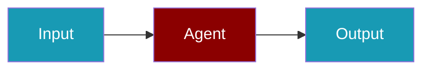

## Overview




PraisonAIUI runs **standalone** or **integrated** with the PraisonAI wrapper. Integration uses optional backend injection — no hard coupling.

## Pattern B — In-process host

```python
from praisonai.integration import build_host_app

app = build_host_app(pages=["chat", "sessions", "workflows"])
```

CLI:

```bash
praisonai dashboard --aiui
```

Wires `PraisonAISessionDataStore`, `PraisonAIProvider`, and L1 bridges before `create_app()`.

## Pattern C — Gateway + static SPA

```python
from praisonai.integration import run_integrated_gateway
import asyncio

asyncio.run(run_integrated_gateway(port=8080))
```

Or `AIUIGateway.start()` from `praisonaiui.integration` (calls the same bootstrap).

## Legacy rollback

Set `PRAISONAI_HOST_LEGACY=1` to skip provider wiring and use callback-only `@aiui.reply` handlers.

## Backend injection

The wrapper calls `praisonaiui.backends.set_backend()` for hooks, workflows, usage, and approvals. Standalone aiui uses SDK defaults when no backend is injected.

See also: [backend-integration](https://github.com/praisonai/praisonaiui/blob/main/docs/features/backend-integration.md) in the praisonaiui repo.
