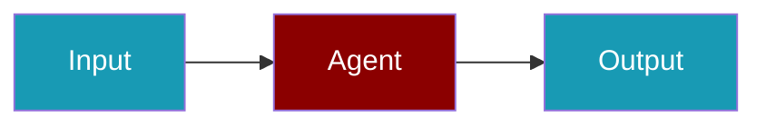

PraisonAIUI runs standalone or integrated with the PraisonAI wrapper using optional backend injection.

```python
from praisonaiagents import Agent

agent = Agent(
    name="Dashboard Assistant",
    instructions="Help users from the PraisonAIUI dashboard.",
)

agent.start("Summarise today's agent activity.")
```

Install packages, launch `praisonai dashboard --aiui`, and interact with the agent in the browser.



## Quick Start

<Steps>
<Step title="Install">
```bash
pip install praisonai praisonaiui
```
</Step>
<Step title="Run integrated mode">
```bash
praisonai dashboard --aiui
```
</Step>
</Steps>

## Pattern B — In-process host

```python
from praisonai.integration import build_host_app

app = build_host_app(pages=["chat", "sessions", "workflows"])
```

CLI:

```bash
praisonai dashboard --aiui
```

Wires `PraisonAISessionDataStore`, `PraisonAIProvider`, and L1 bridges before `create_app()`.

## Pattern C — Gateway + static SPA

```python
from praisonai.integration import run_integrated_gateway
import asyncio

asyncio.run(run_integrated_gateway(port=8080))
```

Or `AIUIGateway.start()` from `praisonaiui.integration` (calls the same bootstrap).

## Legacy rollback

Set `PRAISONAI_HOST_LEGACY=1` to skip provider wiring and use callback-only `@aiui.reply` handlers.

## Backend injection

The wrapper calls `praisonaiui.backends.set_backend()` for hooks, workflows, usage, and approvals. Standalone aiui uses SDK defaults when no backend is injected.

See also: [backend-integration](https://github.com/praisonai/praisonaiui/blob/main/docs/features/backend-integration.md) in the praisonaiui repo.


## Best Practices

<AccordionGroup>
  <Accordion title="Use Pattern B for in-process hosting">
    Pattern B (in-process host) is simpler to deploy and works well for most use cases.
  </Accordion>
  <Accordion title="Use Pattern C for microservices">
    Pattern C (Gateway + static SPA) scales better and enables independent UI and backend deployments.
  </Accordion>
  <Accordion title="Configure allowed origins">
    Always configure `allowed_origins` when deploying to non-localhost to prevent unauthorized access.
  </Accordion>
  <Accordion title="Use the onboarding wizard">
    Run `praisonai onboard` for guided setup — it handles credentials, ports, and daemon configuration.
  </Accordion>
</AccordionGroup>


## Related

<CardGroup cols={2}>
  <Card title="PraisonAIUI" icon="display" href="/docs/features/a2ui">
    Frontend UI for PraisonAI agents
  </Card>
  <Card title="Gateway" icon="tower-broadcast" href="/docs/features/gateway">
    Gateway configuration and setup
  </Card>
</CardGroup>

