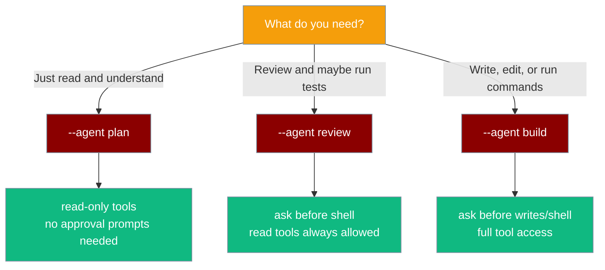

Open a read-only session to review code safely, then re-run with write permissions only when you are ready to apply changes.

```mermaid
sequenceDiagram
    participant User
    participant CLI as praisonai code
    participant Profile as .praisonai/agents/plan.md
    participant Agent

    User->>CLI: praisonai code --agent plan --thinking high "review auth.py"
    CLI->>Profile: load_agent_from_name("plan")
    Profile-->>CLI: tools=[read,grep,glob], permission=read-only
    CLI->>Agent: build with profile.tools + approval(read-only)
    CLI->>Agent: agent.thinking_budget = 16000
    User->>Agent: "review auth.py"
    Agent-->>User: review (edit attempts rejected by mode-rules)

    Note over User,Agent: Re-run with --agent build to apply edits
    User->>CLI: praisonai code --agent build "fix the bugs you found"
    CLI->>Agent: build with build.tools (incl. edit/shell), approval=ask
    Agent-->>User: edits applied
```



## Quick Start

<Steps>

<Step title="Review with read-only access">

Use the built-in `plan` profile to read and analyse — no file writes or shell commands are possible.

```bash
praisonai code --agent plan "review auth.py for security issues"
```

</Step>

<Step title="Add extended reasoning for complex analysis">

Combine `--agent plan` with `--thinking high` for deep review of critical modules.

```bash
praisonai code --agent plan --thinking high "review the authentication flow in auth.py"
```

</Step>

<Step title="Apply edits with the build profile">

Once you are satisfied with the review, re-run with `--agent build` to give the agent write and shell access.

```bash
praisonai code --agent build "fix the security issues you found in auth.py"
```

</Step>

<Step title="Combine agent and reasoning on build">

Use `--thinking medium` with `--agent build` for moderately complex implementation tasks.

```bash
praisonai code --agent build --thinking medium "implement the TODOs in cache.py"
```

</Step>

</Steps>

## Built-in profiles

Three profiles work without any configuration file:

| Profile | Tools | Permission | When to use |
|---------|-------|------------|-------------|
| `plan` | read, grep, glob | read-only | Safe review, no risk of modifications |
| `review` | read, grep | ask before shell | Code review that may run tests |
| `build` | read, write, edit, shell | ask before edits | Implementation and refactoring |

## Choosing the right profile



## Custom profiles

Define a custom profile by creating a Markdown file in `.praisonai/agents/`:

```markdown
<!-- .praisonai/agents/secure-reviewer.md -->
---
model: gpt-4o
role: Security Reviewer
tools:
  - read_file
  - grep
  - list_directory
mode: read-only
---

You are a security-focused code reviewer. Identify vulnerabilities, misconfigurations,
and data exposure risks. Never modify files.
```

Use the custom profile on `praisonai code`:

```bash
praisonai code --agent secure-reviewer --thinking high "audit the auth module"
```

See [Custom Agents & Commands](/docs/features/custom-agents-commands) for the full profile format.

## Thinking levels at a glance

| `--thinking` | Budget | Typical use |
|---|---|---|
| `off` | None | Fast lookups, no reasoning needed |
| `minimal` | 2,000 | Simple questions |
| `low` | 4,000 | Moderate complexity |
| `medium` | 8,000 | Refactoring, implementation |
| `high` | 16,000 | Security audits, architecture review |

## Best practices

<AccordionGroup>

<Accordion title="Start with plan, switch to build">
Always open sessions with `--agent plan` first to understand the codebase. Only switch to `--agent build` when you have a clear implementation plan. This prevents accidental modifications.
</Accordion>

<Accordion title="Use --thinking high for security reviews">
Security and architecture reviews benefit from extended reasoning. Use `--thinking high` with `--agent plan` to get thorough analysis without risking file modifications.
</Accordion>

<Accordion title="Define custom profiles for team workflows">
Commit `.praisonai/agents/` profiles to your repository so the whole team uses consistent tool scopes and permission levels. Name profiles after the workflow stage (e.g., `audit`, `implement`, `test`).
</Accordion>

<Accordion title="--model overrides profile LLM">
If a profile specifies a model but you want to use a different one, pass `--model` explicitly — it always wins over the profile's `llm` field.
</Accordion>

</AccordionGroup>

## Related

<CardGroup cols={2}>
  <Card title="Code CLI" icon="code" href="/docs/cli/code">
    Full --agent and --thinking flag reference
  </Card>
  <Card title="Custom Agents & Commands" icon="file-code" href="/docs/features/custom-agents-commands">
    Define custom agent profiles
  </Card>
  <Card title="Agent Presets & Modes" icon="shield-check" href="/docs/features/agent-presets-and-modes">
    Built-in preset profiles and permission scoping
  </Card>
  <Card title="Thinking Budgets" icon="brain" href="/docs/features/thinking-budgets">
    Extended reasoning token budgets
  </Card>
</CardGroup>
