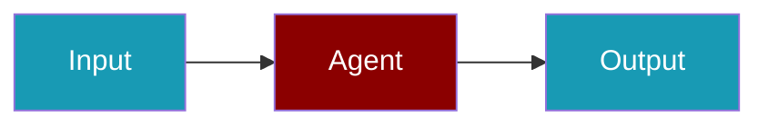

This guide shows you how to create systems where multiple agents collaborate to complete complex tasks.

```python
from praisonaiagents import Agent, Task, PraisonAIAgents

researcher = Agent(name="Researcher", instructions="Gather facts.")
writer = Agent(name="Writer", instructions="Draft clear prose.")

team = PraisonAIAgents(
    agents=[researcher, writer],
    tasks=[Task(description="Research AI trends", agent=researcher)],
)

team.start()
```

The user submits one goal; agents hand work off until the team returns a finished answer.




## Quick Start

<Steps>
<Step title="Install">
```bash
pip install praisonaiagents
export OPENAI_API_KEY=your_api_key
```
</Step>
<Step title="Create a multi-agent system">
```python
from praisonaiagents import Agent, Task, PraisonAIAgents

researcher = Agent(
    name="Researcher",
    instructions="Research topics thoroughly and provide key facts.",
)

writer = Agent(
    name="Writer",
    instructions="Write clear, engaging content based on research.",
)

research_task = Task(
    description="Research the latest AI developments",
    agent=researcher,
)

write_task = Task(
    description="Write a summary based on the research",
    agent=writer,
)

agents = PraisonAIAgents(
    agents=[researcher, writer],
    tasks=[research_task, write_task],
    process="sequential",
)
agents.start()
```
</Step>
</Steps>


## Prerequisites

```bash
pip install praisonaiagents
```

## Basic Multi-Agent Setup

```python
from praisonaiagents import Agent, Task, AgentTeam

# Create agents
researcher = Agent(
    name="Researcher",
    role="Research Specialist",
    goal="Find accurate information on topics",
    instructions="Search for and compile relevant information."
)

writer = Agent(
    name="Writer",
    role="Content Writer",
    goal="Write clear and engaging content",
    instructions="Write well-structured content based on research."
)

# Create tasks
research_task = Task(
    description="Research the latest AI developments",
    expected_output="A summary of key AI developments",
    agent=researcher
)

writing_task = Task(
    description="Write a blog post based on the research",
    expected_output="A 500-word blog post",
    agent=writer
)

# Run the agents
agents = AgentTeam(
    agents=[researcher, writer],
    tasks=[research_task, writing_task]
)

result = agents.start()
print(result)
```

## Process Types

### Sequential Process

Agents execute tasks one after another:

```python
from praisonaiagents import AgentTeam

agents = AgentTeam(
    agents=[researcher, writer, editor],
    tasks=[research_task, writing_task, editing_task],
    process="sequential"  # Default
)
```

### Hierarchical Process

A manager agent delegates to worker agents:

```python
from praisonaiagents import AgentTeam

agents = AgentTeam(
    agents=[researcher, writer, editor],
    tasks=[research_task, writing_task, editing_task],
    process="hierarchical",
    manager_llm="gpt-4o"
)
```

## Agent Handoffs

Enable agents to hand off tasks to each other:

```python
from praisonaiagents import Agent

# Define which agents can hand off to which
researcher = Agent(
    name="Researcher",
    instructions="Research topics. Hand off to Writer when done.",
    handoff=["Writer"]
)

writer = Agent(
    name="Writer",
    instructions="Write content. Hand off to Editor for review.",
    handoff=["Editor"]
)

editor = Agent(
    name="Editor",
    instructions="Edit and finalize content."
)
```

## Shared Memory

Agents can share memory for context:

```python
from praisonaiagents import Agent, Memory, AgentTeam

# Create shared memory
shared_memory = Memory()

researcher = Agent(name="Researcher", memory=shared_memory)
writer = Agent(name="Writer", memory=shared_memory)

# Both agents can access shared context
```

## Task Dependencies

Define task dependencies for complex workflows:

```python
from praisonaiagents import Task

research_task = Task(
    description="Research the topic",
    agent=researcher
)

analysis_task = Task(
    description="Analyze the research",
    agent=analyst,
    context=[research_task]  # Depends on research
)

writing_task = Task(
    description="Write based on analysis",
    agent=writer,
    context=[research_task, analysis_task]  # Depends on both
)
```

## Parallel Execution

Run independent tasks in parallel:

```python
from praisonaiagents import Task, AgentTeam

# Set async_execution=True on each task to fan them out in parallel
agents = AgentTeam(
    agents=[researcher1, researcher2, researcher3],
    tasks=[
        Task(description="Research AI", agent=researcher1, async_execution=True),
        Task(description="Research ML", agent=researcher2, async_execution=True),
        Task(description="Research NLP", agent=researcher3, async_execution=True)
    ],
    process="workflow"  # parallel fan-out via async_execution on tasks
)
```

<Note>
Parallel fan-out is achieved by setting `async_execution=True` on individual `Task` objects within a `"workflow"` or `"sequential"` process. `process="parallel"` is not a valid value and raises a `ValueError`.
</Note>

## YAML Configuration

Define multi-agent systems in YAML:

```yaml
# agents.yaml
agents:
  - name: Researcher
    role: Research Specialist
    goal: Find accurate information
    tools:
      - web_search
      
  - name: Writer
    role: Content Writer
    goal: Write engaging content
    
  - name: Editor
    role: Content Editor
    goal: Polish and finalize content

tasks:
  - description: Research the topic
    agent: Researcher
    expected_output: Research summary
    
  - description: Write a blog post
    agent: Writer
    expected_output: Draft blog post
    context:
      - Research the topic
      
  - description: Edit the blog post
    agent: Editor
    expected_output: Final blog post
    context:
      - Write a blog post
```

Run with:

```bash
praisonai agents agents.yaml
```

## Best Practices

<AccordionGroup>
<Accordion title="Clear roles">
Give each agent a distinct role and goal so handoffs stay predictable.
</Accordion>
<Accordion title="Specific instructions">
Provide detailed instructions for each agent rather than one vague team prompt.
</Accordion>
<Accordion title="Task dependencies">
Use `context` on tasks to define dependencies between agents.
</Accordion>
<Accordion title="Appropriate tools">
Give agents only the tools they need — fewer tools means fewer failure modes.
</Accordion>
</AccordionGroup>

## Next Steps

- [Workflows](/docs/guides/workflows/routing) - Advanced workflow patterns
- [Handoff](/docs/features/handoffs) - Agent handoff concepts
- [Agents Module Reference](/docs/sdk/praisonaiagents/agents/agents) - Full API reference


## Related

<CardGroup cols={2}>
  <Card title="Single Agent" icon="user" href="/docs/guides/single-agent">
    Build your first AI agent
  </Card>
  <Card title="Workflow Patterns" icon="diagram-project" href="/docs/features/workflow-patterns">
    Sequential, parallel, and hierarchical workflows
  </Card>
</CardGroup>

