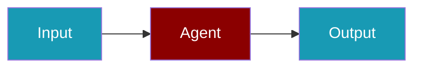

Learn how to persist agent state and resume interrupted sessions.

```python
from praisonaiagents import Agent, Session

session = Session(session_id="demo", persistence="sqlite")
agent = Agent(name="Assistant", session=session)

agent.start("Continue our conversation.")
```

Open a persistence guide, wire a session store, then resume work without losing context.




<CardGroup cols={2}>
  <Card title="Overview" icon="book" href="/docs/guides/persistence/overview">
    Persistence concepts
  </Card>
  <Card title="Database Setup" icon="database" href="/docs/guides/persistence/databases">
    Configure database backends
  </Card>
  <Card title="Session Resume" icon="rotate-right" href="/docs/guides/persistence/session-resume">
    Resume interrupted sessions
  </Card>
</CardGroup>
