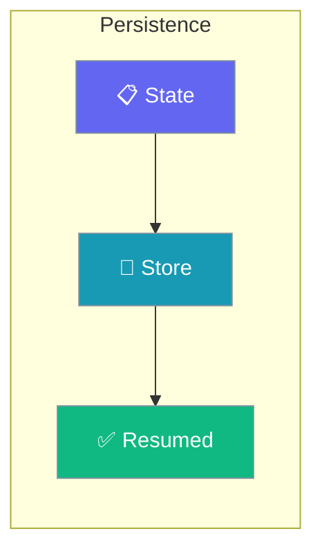
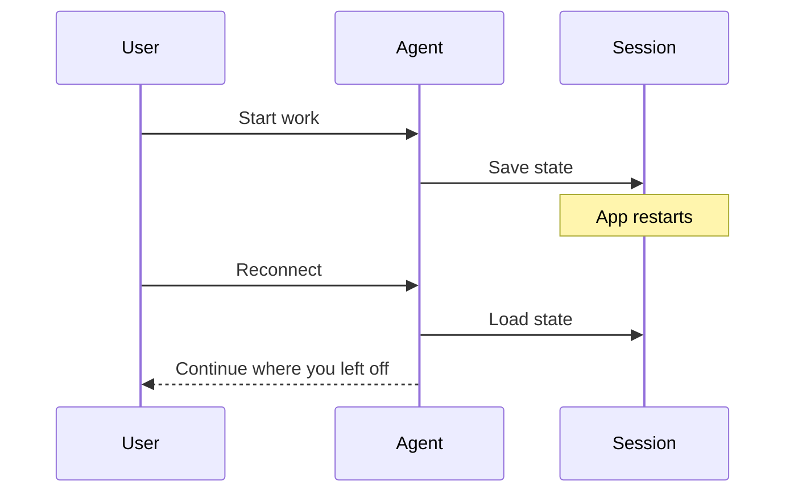

Learn how to persist agent state and resume interrupted sessions.

```python
from praisonaiagents import Agent, Session

session = Session(session_id="demo", persistence="sqlite")
agent = Agent(name="Assistant", session=session)

agent.start("Continue our conversation.")
```

The user opens a persistence guide, wires a session store, then resumes work without losing context.



## Quick Start

<Steps>
<Step title="Simple Usage">

Attach a session to the agent so its state survives a restart.

```python
from praisonaiagents import Agent, Session

session = Session(session_id="demo", persistence="sqlite")
agent = Agent(name="Assistant", session=session)
agent.start("Continue our conversation.")
```

</Step>

<Step title="With Configuration">

Reopen the same session ID later to pick up exactly where you left off.

```python
from praisonaiagents import Agent, Session

session = Session(session_id="demo", persistence="sqlite")
agent = Agent(name="Assistant", session=session)
agent.resume()
```

</Step>
</Steps>

---

## How It Works



---

## Guides

<CardGroup cols={2}>
  <Card title="Overview" icon="book" href="/docs/guides/persistence/overview">
    Persistence concepts
  </Card>
  <Card title="Database Setup" icon="database" href="/docs/guides/persistence/databases">
    Configure database backends
  </Card>
  <Card title="Session Resume" icon="rotate-right" href="/docs/guides/persistence/session-resume">
    Resume interrupted sessions
  </Card>
</CardGroup>

---

## Best Practices

<AccordionGroup>
<Accordion title="Choose a backend before you scale">
SQLite is perfect for a single process; move to PostgreSQL or Redis once several instances need to share the same sessions.
</Accordion>

<Accordion title="Treat session_id as the resume key">
The same `session_id` reconnects to the same history. Generate it per user or per task, and store it where you can look it up later.
</Accordion>

<Accordion title="Checkpoint long-running work">
Set `checkpoint_interval` so a crash mid-task resumes from the last checkpoint instead of the beginning.
</Accordion>
</AccordionGroup>
