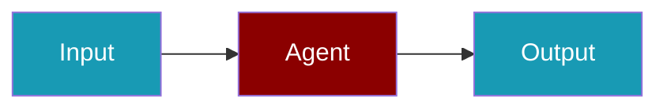

Persist agent state to resume sessions and maintain context across runs.

```python
from praisonaiagents import Agent, Session

session = Session(session_id="my-session", persistence="sqlite")
agent = Agent(name="Assistant", session=session)

agent.start("Pick up where we left off.")
```

The user runs the agent again; stored memory and checkpoints avoid repeating earlier steps.




## What Gets Persisted

- **Memory**: Conversation history and context
- **Session State**: Current task progress
- **Checkpoints**: Intermediate results
- **Configuration**: Agent settings

## Quick Start

<Steps>
<Step title="Simple Usage">
```python
from praisonaiagents import Agent, Session

# Create session with persistence
session = Session(
    session_id="my-session",
    persistence="sqlite"
)

agent = Agent(
    name="Assistant",
    session=session
)

# Run agent
agent.start("Hello!")

# Later, resume the same session
session = Session(session_id="my-session", persistence="sqlite")
agent = Agent(name="Assistant", session=session)
agent.start("What did we talk about?")  # Remembers previous context
```
</Step>

<Step title="With Configuration">
```python
from praisonaiagents import Agent, Session

session = Session(session_id="prod-session", persistence="postgresql")
agent = Agent(name="Assistant", session=session, llm="gpt-4o-mini")
agent.start("Continue from where we left off.")
```
</Step>
</Steps>
## Persistence Backends

| Backend | Use Case | Setup |
|---------|----------|-------|
| SQLite | Local development | `persistence="sqlite"` |
| PostgreSQL | Production | `persistence="postgresql"` |
| Redis | High-performance | `persistence="redis"` |
| MongoDB | Document storage | `persistence="mongodb"` |

## CLI Session Resume

`praisonai session resume <id>` is a first-class restore — it brings back chat history, model, and agent name. Use a follow-up prompt to continue immediately:

```bash
praisonai session resume my-session "What did we discuss?"
```

See [Session Command](/docs/cli/session#resume-a-session) for the full reference including `--transcript` and cross-store lookup behaviour.

## Related

<CardGroup cols={2}>
  <Card title="Database Setup" icon="database" href="/docs/guides/persistence/databases">
    Configure backends
  </Card>
  <Card title="Session Resume" icon="rotate" href="/docs/guides/persistence/session-resume">
    Resume sessions
  </Card>
</CardGroup>
