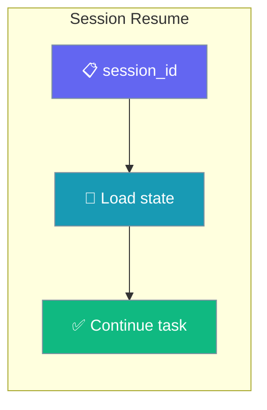
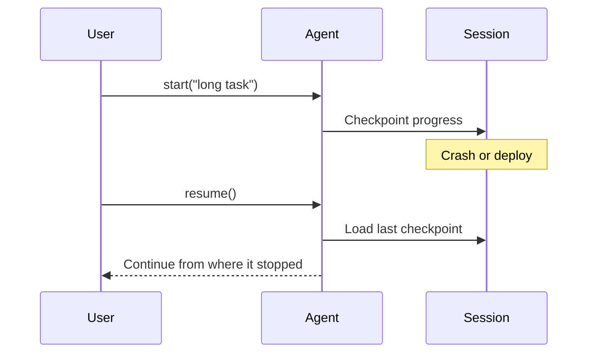

Resume interrupted sessions to continue where you left off.

```python
from praisonaiagents import Agent, Session

session = Session(session_id="task-123", persistence="sqlite")
agent = Agent(name="Worker", session=session)

agent.resume()
```

The user reopens the same session ID after a crash or deploy and the agent continues the in-flight task.



## Quick Start

<Steps>
<Step title="Simple Usage">

Reopen a session by its ID and call `resume()` to continue the in-flight task.

```python
from praisonaiagents import Agent, Session

session = Session(session_id="task-123", persistence="sqlite")
agent = Agent(name="Worker", session=session)
agent.resume()
```

</Step>

<Step title="With Configuration">

Add automatic checkpoints so long tasks resume from the latest step, not the start.

```python
from praisonaiagents import Agent, Session

session = Session(
    session_id="task-123",
    persistence="sqlite",
    checkpoint_interval=5,
)
agent = Agent(name="Worker", session=session)
agent.start("Process 1000 items...")
```

</Step>
</Steps>

---

## How It Works



---

## Basic Resume

```python
from praisonaiagents import Agent, Session

# Original session
session = Session(session_id="task-123", persistence="sqlite")
agent = Agent(name="Worker", session=session)
agent.start("Start a long task...")

# ... application crashes or restarts ...

# Resume session
session = Session(session_id="task-123", persistence="sqlite")
agent = Agent(name="Worker", session=session)
agent.resume()  # Continues from last checkpoint
```

## With Checkpoints

```python
from praisonaiagents import Agent, Session

session = Session(
    session_id="task-123",
    persistence="sqlite",
    checkpoint_interval=5  # Checkpoint every 5 steps
)

agent = Agent(name="Worker", session=session)

# Long-running task with automatic checkpoints
agent.start("Process 1000 items...")
```

## Manual Checkpoints

```python
from praisonaiagents import Agent, Session

session = Session(session_id="task-123", persistence="sqlite")
agent = Agent(name="Worker", session=session)

# Create checkpoint manually
session.checkpoint(
    state={"processed": 500, "remaining": 500},
    message="Halfway done"
)

# Resume from checkpoint
session.resume_from_checkpoint()
```

## List Sessions

```python
from praisonaiagents import Session

# List all sessions
sessions = Session.list_all(persistence="sqlite")
for s in sessions:
    print(f"{s.session_id}: {s.status}")
```

## Best Practices

<AccordionGroup>
<Accordion title="Keep the session_id stable across restarts">
`resume()` finds prior state by `session_id`. Store the ID (env var, queue message, or DB row) so a restarted process reopens the right session.
</Accordion>

<Accordion title="Tune checkpoint_interval to task length">
Frequent checkpoints cost writes but lose less on failure. For step-heavy tasks, a small interval like `checkpoint_interval=5` balances safety and overhead.
</Accordion>

<Accordion title="Use manual checkpoints at natural boundaries">
Call `session.checkpoint(state=..., message=...)` after a meaningful unit of work so `resume_from_checkpoint()` restarts at a clean point.
</Accordion>

<Accordion title="List sessions to reconcile state">
`Session.list_all(persistence=...)` shows every stored session and its status — useful for dashboards and cleanup jobs.
</Accordion>
</AccordionGroup>

---

## Related

<CardGroup cols={2}>
  <Card title="Session Module" icon="code" href="/docs/sdk/praisonaiagents/session">
    Session API reference
  </Card>
  <Card title="Checkpoints" icon="bookmark" href="/docs/sdk/praisonaiagents/checkpoints/checkpoints">
    Checkpoint API
  </Card>
</CardGroup>
