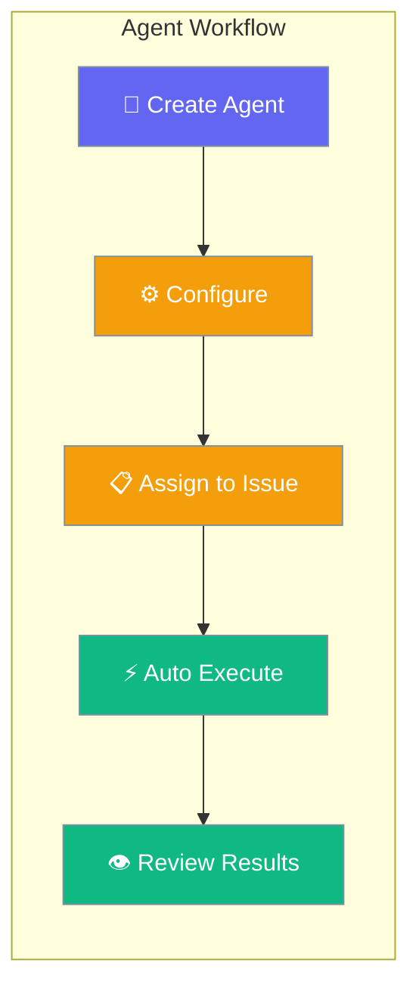

AI agents in PraisonAI Platform automate repetitive tasks, analyze issues, and assist with decision-making, enabling teams to focus on high-value work.



## Agent Types & Use Cases

### Code Analysis Agents

Perfect for code review, security analysis, and technical debt identification:

<Steps>
<Step title="Create Code Review Agent">
```python
import asyncio
from praisonai_platform.client import PlatformClient

async def create_code_review_agent():
    client = PlatformClient("http://localhost:8000", token="your-jwt-token")
    ws_id = "your-workspace-id"
    
    agent = await client.create_agent(
        ws_id,
        name="Senior Code Reviewer",
        description="AI agent specialized in code review and quality analysis",
        instructions="""
        You are a senior software engineer with expertise in code review.
        
        When assigned to an issue:
        1. Analyze any code snippets or repository links provided
        2. Check for common issues: security vulnerabilities, performance problems, code smells
        3. Review for best practices: SOLID principles, clean code, proper error handling
        4. Suggest specific improvements with code examples
        5. Rate severity: critical, high, medium, low
        6. Add your review as a structured comment
        
        Format your response as:
        ## Code Review Analysis
        **Severity**: [level]
        **Issues Found**: [number]
        
        ### Critical Issues
        - [specific issue with line numbers if available]
        
        ### Suggestions
        - [actionable recommendations]
        
        ### Code Examples
        ```[language]
        // Improved version
        [your suggested code]
        ```
        """,
        model="gpt-4o",
        auto_assign_labels=["code-reviewed", "ai-analyzed"],
        triggers={
            "on_assign": True,
            "on_label_added": ["needs-review", "pull-request"],
            "on_comment_keywords": ["@code-review", "review please"]
        }
    )
    
    print(f"✅ Created code review agent: {agent['name']}")
    return agent

code_agent = asyncio.run(create_code_review_agent())
```
</Step>

<Step title="Assign to Code Issues">
```python
async def assign_code_review():
    client = PlatformClient("http://localhost:8000", token="your-jwt-token")
    ws_id = "your-workspace-id"
    
    # Create a code-related issue
    code_issue = await client.create_issue(
        ws_id,
        title="Refactor authentication middleware",
        description="""
        Current authentication middleware has performance issues and security concerns.
        
        Current implementation:
        ```python
        def auth_middleware(request):
            token = request.headers.get('Authorization')
            if token:
                user = decode_token(token)  # Expensive DB call on every request
                if user and user.is_active:
                    request.user = user
                    return True
            return False
        ```
        
        Issues:
        - Database call on every request
        - No token caching
        - Missing rate limiting
        - No proper error handling
        """,
        labels=["backend", "security", "performance", "needs-review"],
        priority="high"
    )
    
    # Assign the code review agent
    await client.assign_issue_agent(ws_id, code_issue['id'], code_agent['id'])
    
    print(f"✅ Assigned code review agent to issue {code_issue['identifier']}")
    return code_issue

issue = asyncio.run(assign_code_review())
```
</Step>
</Steps>

### Bug Triage Agents

Automatically analyze and categorize bug reports:

<Steps>
<Step title="Create Bug Triage Agent">
```python
async def create_bug_triage_agent():
    client = PlatformClient("http://localhost:8000", token="your-jwt-token")
    ws_id = "your-workspace-id"
    
    agent = await client.create_agent(
        ws_id,
        name="Bug Triage Specialist",
        description="Analyzes bug reports and categorizes them for efficient resolution",
        instructions="""
        You are a QA specialist that triages incoming bug reports.
        
        For each bug report:
        1. Analyze severity based on impact and frequency
        2. Identify the likely component/system affected
        3. Suggest reproduction steps if missing
        4. Recommend initial debugging approach
        5. Assign appropriate priority and labels
        6. Determine if immediate escalation is needed
        
        Severity levels:
        - Critical: System down, security breach, data loss
        - High: Core functionality broken, many users affected
        - Medium: Feature not working, some users affected  
        - Low: Minor issue, cosmetic problems
        
        Always add these labels based on analysis:
        - Component: frontend, backend, database, api
        - Priority: critical, high, medium, low
        - Type: crash, performance, ui-bug, data-issue
        """,
        model="gpt-4o-mini",  # Faster model for triage
        auto_assign_labels=["triaged", "ai-categorized"],
        triggers={
            "on_assign": True,
            "on_label_added": ["bug", "issue"],
            "on_status_change": "reported"
        }
    )
    
    print(f"✅ Created bug triage agent: {agent['name']}")
    return agent

triage_agent = asyncio.run(create_bug_triage_agent())
```
</Step>

<Step title="Auto-Assign to Bug Reports">
```python
async def setup_auto_bug_triage():
    client = PlatformClient("http://localhost:8000", token="your-jwt-token")
    ws_id = "your-workspace-id"
    
    # Set up automatic assignment rule
    automation_rule = await client.create_automation_rule(
        ws_id,
        name="Auto Bug Triage",
        description="Automatically assign triage agent to new bug reports",
        triggers=[
            {
                "type": "issue_created",
                "conditions": {
                    "labels_include": ["bug"],
                    "status": "reported"
                }
            }
        ],
        actions=[
            {
                "type": "assign_agent",
                "agent_id": triage_agent['id']
            },
            {
                "type": "add_comment",
                "content": "🤖 Bug triage agent assigned. Analysis in progress..."
            }
        ]
    )
    
    # Test with a sample bug report
    bug_report = await client.create_issue(
        ws_id,
        title="App crashes when uploading large files",
        description="""
        **Steps to reproduce:**
        1. Go to file upload page
        2. Select file larger than 10MB
        3. Click upload button
        
        **Expected:** File uploads successfully
        **Actual:** App crashes with white screen
        
        **Additional info:**
        - Happens on both Chrome and Firefox
        - Only with files >10MB
        - Started after last update
        - Error in console: "Memory limit exceeded"
        """,
        labels=["bug"],
        status="reported"
    )
    
    print(f"✅ Created bug report {bug_report['identifier']} - agent will auto-assign")
    return automation_rule, bug_report

rule, bug = asyncio.run(setup_auto_bug_triage())
```
</Step>
</Steps>

### Content Generation Agents

Automate documentation, test cases, and content creation:

<Steps>
<Step title="Create Documentation Agent">
```python
async def create_docs_agent():
    client = PlatformClient("http://localhost:8000", token="your-jwt-token")
    ws_id = "your-workspace-id"
    
    agent = await client.create_agent(
        ws_id,
        name="Documentation Writer",
        description="Generates and updates technical documentation",
        instructions="""
        You are a technical writer that creates clear, comprehensive documentation.
        
        When assigned to documentation tasks:
        1. Analyze the feature/API that needs documentation
        2. Create structured documentation with:
           - Clear overview and purpose
           - Step-by-step usage instructions
           - Code examples with proper formatting
           - Common use cases and patterns
           - Troubleshooting section
           - Links to related resources
        
        Follow these standards:
        - Use Markdown formatting
        - Include runnable code examples
        - Add appropriate headers and structure
        - Use clear, jargon-free language
        - Include both basic and advanced usage
        
        For API documentation, always include:
        - Request/response examples
        - Parameter descriptions
        - Error codes and handling
        - Rate limiting information
        """,
        model="gpt-4o",
        auto_assign_labels=["documented", "ready-for-review"],
        file_access=True,  # Allow reading/writing documentation files
        triggers={
            "on_assign": True,
            "on_label_added": ["needs-docs", "api-change"]
        }
    )
    
    return agent

docs_agent = asyncio.run(create_docs_agent())
```
</Step>

<Step title="Generate API Documentation">
```python
async def generate_api_docs():
    client = PlatformClient("http://localhost:8000", token="your-jwt-token")
    ws_id = "your-workspace-id"
    
    # Create documentation request
    docs_issue = await client.create_issue(
        ws_id,
        title="Document new webhook API endpoints",
        description="""
        New webhook API endpoints need comprehensive documentation:
        
        **New Endpoints:**
        - POST /api/v1/webhooks - Create webhook
        - GET /api/v1/webhooks - List webhooks  
        - PUT /api/v1/webhooks/{id} - Update webhook
        - DELETE /api/v1/webhooks/{id} - Delete webhook
        
        **Requirements:**
        - Include request/response schemas
        - Add authentication examples
        - Document webhook event types
        - Provide testing instructions
        - Add troubleshooting guide
        
        **Target Audience:** External developers integrating with our API
        """,
        labels=["documentation", "api", "needs-docs"],
        priority="medium",
        assignee_type="agent",
        assignee_id=docs_agent['id']
    )
    
    print(f"✅ Documentation request created: {docs_issue['identifier']}")
    
    # Add additional context for the agent
    await client.add_issue_comment(
        ws_id,
        docs_issue['id'],
        """
        Additional context for documentation:
        
        **Webhook Event Types:**
        - issue.created, issue.updated, issue.deleted
        - project.created, project.updated
        - agent.assigned, agent.completed
        
        **Authentication:** Bearer token required
        **Rate Limits:** 100 requests/hour per webhook
        **Payload Size:** Maximum 1MB per webhook call
        """
    )
    
    return docs_issue

docs_task = asyncio.run(generate_api_docs())
```
</Step>
</Steps>

---

## Advanced Agent Configuration

### Multi-Agent Workflows

Set up agents that work together for complex tasks:

```python
async def create_multi_agent_workflow():
    client = PlatformClient("http://localhost:8000", token="your-jwt-token")
    ws_id = "your-workspace-id"
    
    # Agent 1: Initial Analysis
    analyzer = await client.create_agent(
        ws_id,
        name="Issue Analyzer",
        description="Analyzes issues and determines next steps",
        instructions="""
        Analyze the issue and determine what type of work is needed:
        - If it's a bug: assign to Bug Specialist
        - If it's a feature: assign to Feature Planner  
        - If it needs research: assign to Research Agent
        - If it's documentation: assign to Docs Writer
        
        Add appropriate labels and hand off to the right specialist.
        """,
        auto_assign_labels=["analyzed"],
        handoff_agents={
            "bug": "bug-specialist-id",
            "feature": "feature-planner-id", 
            "research": "research-agent-id",
            "docs": "docs-writer-id"
        }
    )
    
    # Agent 2: Bug Specialist
    bug_specialist = await client.create_agent(
        ws_id,
        name="Bug Specialist",
        description="Deep bug analysis and resolution planning",
        instructions="""
        Perform deep analysis of bugs:
        1. Create reproduction steps
        2. Identify root cause
        3. Suggest fix approach
        4. Estimate complexity
        5. Create subtasks if needed
        6. Hand back to human developer with detailed plan
        """,
        auto_assign_labels=["bug-analyzed", "ready-for-dev"]
    )
    
    # Set up workflow triggers
    workflow = await client.create_workflow(
        ws_id,
        name="Issue Processing Pipeline",
        steps=[
            {
                "agent": analyzer['id'],
                "triggers": ["issue.created", "issue.labeled:needs-analysis"],
                "next_step_conditions": {
                    "if_labels_include": ["bug"],
                    "then_assign": bug_specialist['id']
                }
            },
            {
                "agent": bug_specialist['id'],
                "triggers": ["agent.handoff"],
                "completion_actions": [
                    {"type": "notify_assignee"},
                    {"type": "update_status", "status": "ready-for-development"}
                ]
            }
        ]
    )
    
    print(f"✅ Multi-agent workflow created: {workflow['name']}")
    return analyzer, bug_specialist, workflow
```

### Agent Performance Monitoring

Track and optimize agent performance:

```python
async def monitor_agent_performance():
    client = PlatformClient("http://localhost:8000", token="your-jwt-token")
    ws_id = "your-workspace-id"
    
    # Get agent metrics
    agents = await client.list_agents(ws_id)
    
    for agent in agents:
        metrics = await client.get_agent_metrics(
            ws_id, 
            agent['id'],
            time_range="last_30_days"
        )
        
        print(f"\n📊 {agent['name']} Performance:")
        print(f"   Tasks completed: {metrics['tasks_completed']}")
        print(f"   Average response time: {metrics['avg_response_time']}s")
        print(f"   Success rate: {metrics['success_rate']}%")
        print(f"   User satisfaction: {metrics['satisfaction_score']}/5")
        
        # Identify improvement areas
        if metrics['success_rate'] < 0.8:
            print(f"   ⚠️ Low success rate - review instructions")
        
        if metrics['avg_response_time'] > 30:
            print(f"   ⚠️ Slow response - consider faster model")
        
        # Get recent failures for analysis
        if metrics['recent_failures']:
            print(f"   🔍 Recent failures: {len(metrics['recent_failures'])}")
            for failure in metrics['recent_failures'][:3]:
                print(f"      - {failure['issue']}: {failure['error'][:50]}...")

asyncio.run(monitor_agent_performance())
```

## Agent Best Practices

<AccordionGroup>
<Accordion title="Writing Effective Instructions">
**Clear Role Definition:**
```python
# Good: Specific role and expertise
instructions = """
You are a senior DevOps engineer with expertise in containerization and CI/CD.
Your role is to analyze deployment issues and recommend infrastructure solutions.
"""

# Avoid: Vague or overly broad role
instructions = "You help with technical issues."
```

**Structured Output Format:**
```python
instructions = """
Always format your response as:

## Analysis
[Your analysis here]

## Recommendations  
1. [Specific action]
2. [Another action]

## Next Steps
- [ ] [Actionable task]
- [ ] [Another task]
"""
```
</Accordion>

<Accordion title="Model Selection Strategy">
**Task Complexity Mapping:**
```python
model_selection = {
    "simple_triage": "gpt-4o-mini",     # Fast, cost-effective
    "code_review": "gpt-4o",            # High accuracy needed
    "documentation": "gpt-4o",          # Quality important
    "data_analysis": "gpt-4o",          # Complex reasoning
    "chat_support": "gpt-4o-mini",      # Quick responses
}

# Select based on task requirements
agent = await client.create_agent(
    ws_id,
    name="Bug Triager",
    model=model_selection["simple_triage"],
    # ... other config
)
```
</Accordion>

<Accordion title="Trigger Configuration">
**Smart Triggering:**
```python
triggers = {
    # Immediate action for critical issues
    "on_label_added": ["critical", "security"],
    
    # Batch processing for efficiency
    "on_schedule": "0 9 * * 1-5",  # Weekdays at 9 AM
    
    # Conditional triggers
    "on_comment_keywords": ["@agent", "help needed"],
    
    # Status-based triggers
    "on_status_change": ["reported", "needs-review"]
}
```

**Avoiding Trigger Loops:**
```python
# Prevent infinite loops
agent_config = {
    "triggers": {
        "on_label_added": ["needs-analysis"]
    },
    "auto_assign_labels": ["analyzed"],  # Different label
    "ignore_own_updates": True,  # Don't trigger on own changes
    "cooldown_period": "5m"  # Wait 5 minutes between runs
}
```
</Accordion>

<Accordion title="Error Handling & Recovery">
**Graceful Degradation:**
```python
agent_instructions = """
If you cannot complete the full analysis:
1. Provide what information you can gather
2. Clearly state what's missing or unclear
3. Suggest specific next steps for humans
4. Add the 'needs-human-review' label
5. Do not guess or make assumptions about missing information
"""

# Configure retry behavior
agent = await client.create_agent(
    ws_id,
    name="Robust Agent",
    max_retries=3,
    retry_delay="1m",
    fallback_action="notify_human",
    error_labels=["agent-failed", "needs-manual-review"]
)
```
</Accordion>
</AccordionGroup>

## Testing Agent Workflows

Validate agent behavior before deployment:

```python
async def test_agent_workflow():
    client = PlatformClient("http://localhost:8000", token="your-jwt-token")
    ws_id = "your-workspace-id"
    
    # Create test workspace for agent testing
    test_ws = await client.create_workspace(
        name="Agent Testing",
        description="Sandbox for testing agent configurations"
    )
    test_ws_id = test_ws['id']
    
    # Deploy agent to test workspace
    test_agent = await client.create_agent(
        test_ws_id,
        name="Test Code Reviewer",
        # ... agent configuration
    )
    
    # Create test scenarios
    test_scenarios = [
        {
            "name": "Simple Bug Report",
            "issue": {
                "title": "Button not clickable on mobile",
                "description": "The submit button doesn't respond to taps on iOS Safari",
                "labels": ["bug", "mobile"]
            },
            "expected_labels": ["triaged", "ui-bug", "mobile"],
            "expected_priority": "medium"
        },
        {
            "name": "Security Issue",
            "issue": {
                "title": "SQL injection vulnerability in search",
                "description": "User input not sanitized in search endpoint",
                "labels": ["bug", "security"]
            },
            "expected_labels": ["triaged", "security", "critical"],
            "expected_priority": "critical"
        }
    ]
    
    # Run test scenarios
    results = []
    for scenario in test_scenarios:
        print(f"🧪 Testing: {scenario['name']}")
        
        # Create test issue
        test_issue = await client.create_issue(test_ws_id, **scenario['issue'])
        
        # Assign agent
        await client.assign_issue_agent(test_ws_id, test_issue['id'], test_agent['id'])
        
        # Wait for processing
        await asyncio.sleep(5)
        
        # Check results
        updated_issue = await client.get_issue(test_ws_id, test_issue['id'])
        
        test_result = {
            "scenario": scenario['name'],
            "passed": all(label in updated_issue['labels'] for label in scenario['expected_labels']),
            "actual_labels": updated_issue['labels'],
            "expected_labels": scenario['expected_labels']
        }
        
        results.append(test_result)
        print(f"   {'✅ PASS' if test_result['passed'] else '❌ FAIL'}")
    
    # Cleanup test workspace
    await client.delete_workspace(test_ws_id)
    
    return results

test_results = asyncio.run(test_agent_workflow())
print(f"\nTest Summary: {sum(1 for r in test_results if r['passed'])}/{len(test_results)} passed")
```

## Related Guides

<CardGroup cols={2}>
<Card title="Issue Organization" icon="list-check" href="/docs/guides/platform/organize-issues">
  Structure work for optimal agent assignment
</Card>

<Card title="Platform API" icon="code" href="/docs/features/platform/agents">
  Complete agent management API reference
</Card>

<Card title="Workflow Automation" icon="workflow" href="/docs/features/workflows">
  Advanced automation and orchestration
</Card>

<Card title="Integration Patterns" icon="puzzle-piece" href="/docs/guides/recipes">
  Common integration and deployment patterns
</Card>
</CardGroup>