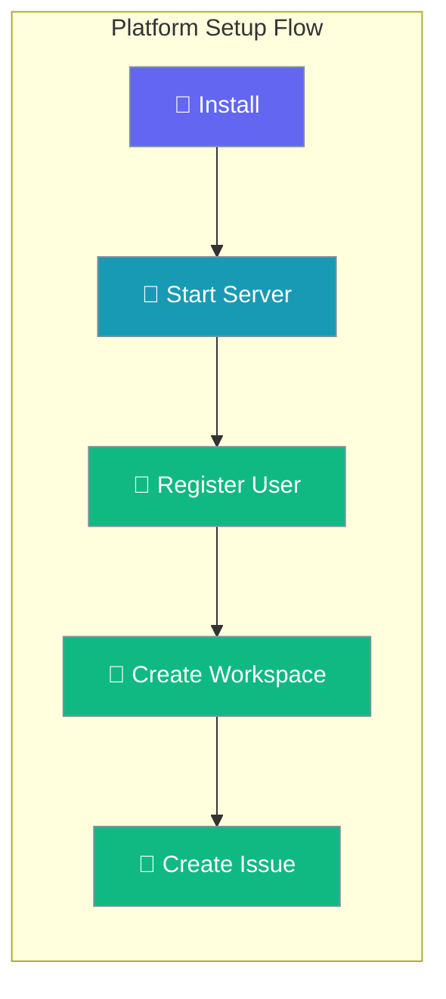

Walk from zero to a running PraisonAI Platform server with your first API call — no prior knowledge assumed.



## What is the PraisonAI Platform?

PraisonAI Platform is a multi-tenant workspace for organizing AI agent work. It provides issue tracking, project management, and team collaboration — all built for AI agents. Access everything through a REST API and Python SDK.

## Prerequisites

<Steps>
<Step title="System Requirements">
- Python 3.10 or higher
- pip or uv package manager  
- Terminal (macOS/Linux/Windows)
</Step>
</Steps>

---

## Install

<Steps>
<Step title="Install PraisonAI Platform">
Copy-paste this one-liner into your terminal:

```bash
pip install praisonai-platform
```

This installs the complete platform package including the API server and CLI tools.
</Step>
</Steps>

---

## Start the Server

<Steps>
<Step title="Launch the Platform Server">
Start the server with this command:

```bash
uvicorn praisonai_platform.api.app:create_app --factory --port 8000
```

**What happens:**
- SQLite database auto-created in current directory
- Server listens on port 8000
- All endpoints available at `http://localhost:8000`

**Expected output:**
```
INFO:     Started server process [12345]
INFO:     Waiting for application startup.
INFO:     Application startup complete.
INFO:     Uvicorn running on http://0.0.0.0:8000 (Press CTRL+C to quit)
```
</Step>

<Step title="Verify Server Health">
Test the server is running:

```bash
curl http://localhost:8000/health
```

**Expected response:**
```json
{"status": "ok"}
```

Your Platform server is now ready for API calls.
</Step>
</Steps>

---

## Register Your First User

<Steps>
<Step title="Create User Account">
Register a new user account:

```bash
curl -s -X POST http://localhost:8000/api/v1/auth/register \
  -H "Content-Type: application/json" \
  -d '{"email":"me@example.com","password":"mypassword","name":"My Name"}' \
  --max-time 10
```

**Expected response:**
```json
{
  "access_token": "eyJhbGciOiJIUzI1NiIs...",
  "token_type": "bearer",
  "user": {
    "id": 1,
    "email": "me@example.com",
    "name": "My Name"
  }
}
```

<Note>
**Save the token!** Copy the `access_token` value — you'll use it for all future API requests.
</Note>
</Step>
</Steps>

---

## Create Your First Workspace

<Steps>
<Step title="Set Your Token">
Export your token as an environment variable:

```bash
TOKEN="paste-your-token-here"
```

Replace `paste-your-token-here` with your actual token from the registration response.
</Step>

<Step title="Create Workspace">
Create your first workspace:

```bash
curl -s -X POST http://localhost:8000/api/v1/workspaces/ \
  -H "Authorization: Bearer $TOKEN" \
  -H "Content-Type: application/json" \
  -d '{"name":"My First Workspace"}' \
  --max-time 10
```

**Expected response:**
```json
{
  "id": 1,
  "name": "My First Workspace",
  "created_at": "2024-01-15T10:30:00Z",
  "owner_id": 1
}
```

Your workspace is ready for organizing AI agent projects.
</Step>
</Steps>

---

## Create Your First Issue

<Steps>
<Step title="Set Workspace ID">
Export your workspace ID:

```bash
WS_ID="1"
```

Use the `id` value from your workspace creation response.
</Step>

<Step title="Create Issue">
Create your first issue in the workspace:

```bash
curl -s -X POST http://localhost:8000/api/v1/workspaces/$WS_ID/issues/ \
  -H "Authorization: Bearer $TOKEN" \
  -H "Content-Type: application/json" \
  -d '{"title":"Hello from the platform!","priority":"medium"}' \
  --max-time 10
```

**Expected response:**
```json
{
  "id": 1,
  "identifier": "ISS-1",
  "title": "Hello from the platform!",
  "priority": "medium",
  "status": "open",
  "workspace_id": 1,
  "created_at": "2024-01-15T10:35:00Z"
}
```

<Tip>
Notice the auto-generated `identifier` field: **ISS-1**. This is your issue's human-readable ID for tracking and reference.
</Tip>
</Step>
</Steps>

---

## Next Steps

You now have a running PraisonAI Platform with your first workspace and issue. Here's what to explore next:

<CardGroup cols={2}>
<Card title="Quick Tutorial" icon="graduation-cap" href="/docs/guides/platform/quick-tutorial">
  Learn core Platform concepts with hands-on examples
</Card>

<Card title="Agent Management" icon="robot" href="/docs/features/platform/agents">
  Connect and manage AI agents in your workspace
</Card>

<Card title="Python SDK" icon="code" href="/docs/features/platform/sdk-client">
  Use the Python SDK for programmatic Platform access
</Card>

<Card title="API Reference" icon="book" href="/docs/api/platform">
  Complete REST API documentation and examples
</Card>
</CardGroup>

## Key Concepts Explained

<AccordionGroup>
<Accordion title="What is a token?">
A token is your authentication credential — like a password for API requests. Include it in the `Authorization: Bearer <token>` header for all API calls.
</Accordion>

<Accordion title="What is an endpoint?">
An endpoint is a URL that accepts API requests. For example, `POST /api/v1/workspaces/` creates a new workspace. Each endpoint performs a specific action.
</Accordion>

<Accordion title="What is JSON?">
JSON is a data format for sending structured information. It uses key-value pairs like `{"name": "value"}`. APIs often accept and return JSON data.
</Accordion>

<Accordion title="What does curl do?">
curl is a command-line tool for making HTTP requests. The `-X POST` sends data to create something, `-H` adds headers, and `-d` sends the JSON data.
</Accordion>
</AccordionGroup>
