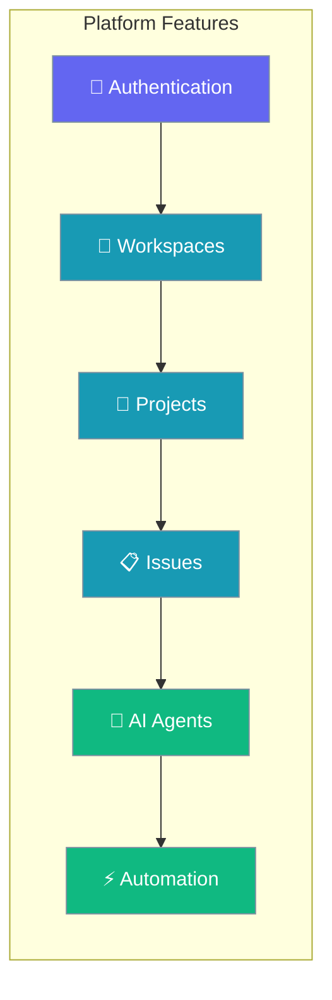
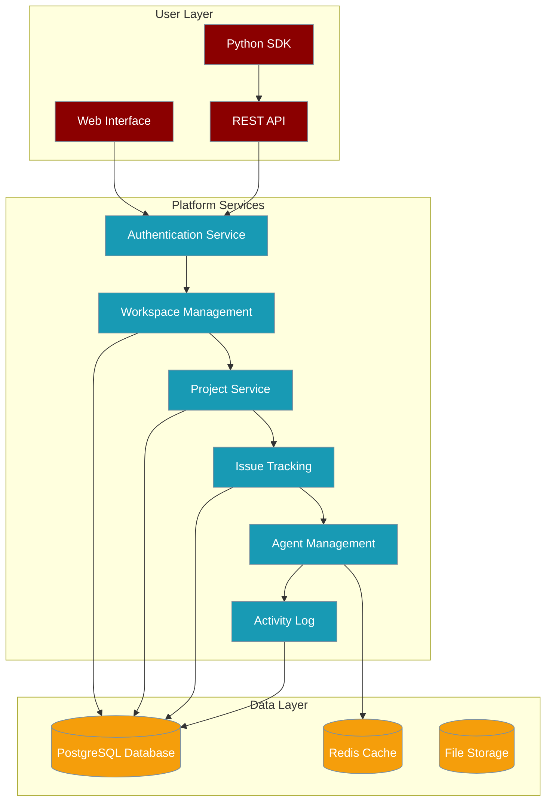

PraisonAI Platform provides enterprise-grade project management with AI agent integration, enabling teams to collaborate efficiently while leveraging automation.



## Getting Started

<CardGroup cols={2}>
<Card title="Quick Start" icon="rocket" href="/docs/guides/platform/getting-started">
  Set up your first workspace and create your first AI-powered project
</Card>

<Card title="5-Minute Tutorial" icon="clock" href="/docs/guides/platform/quick-tutorial">
  Complete walkthrough from workspace creation to agent automation
</Card>
</CardGroup>

## Core Workflows

<CardGroup cols={2}>
<Card title="Assign AI Agents" icon="robot" href="/docs/guides/platform/assign-agents">
  Configure and deploy AI agents to automate issue resolution
</Card>

<Card title="Organize Issues" icon="list-check" href="/docs/guides/platform/organize-issues">
  Structure work with projects, labels, and intelligent workflows
</Card>
</CardGroup>

## Platform Architecture



## Feature Overview

| Feature | Description | Use Cases |
|---------|-------------|-----------|
| **Workspaces** | Isolated environments for teams | Multi-tenant organization, team separation |
| **Projects** | Hierarchical work organization | Sprint planning, feature development, campaigns |
| **Issues** | Trackable work items | Bug reports, feature requests, tasks |
| **Labels** | Flexible categorization system | Priority levels, team ownership, issue types |
| **Comments** | Threaded discussions | Collaboration, decision tracking, status updates |
| **AI Agents** | Automated task execution | Code review, testing, content generation |
| **Activity Logs** | Comprehensive audit trail | Compliance, debugging, team transparency |
| **Members & RBAC** | Role-based access control | Security, permissions, team management |

## Common Integration Patterns

<AccordionGroup>
<Accordion title="CI/CD Integration">
Integrate platform with continuous integration workflows:

```yaml
# .github/workflows/platform-integration.yml
name: Platform Integration
on: [push, pull_request]

jobs:
  create-issue:
    runs-on: ubuntu-latest
    if: failure()
    steps:
      - uses: actions/checkout@v3
      - name: Create Platform Issue
        run: |
          curl -X POST ${{ secrets.PLATFORM_URL }}/api/v1/workspaces/${{ secrets.WORKSPACE_ID }}/issues \
            -H "Authorization: Bearer ${{ secrets.PLATFORM_TOKEN }}" \
            -H "Content-Type: application/json" \
            -d '{
              "title": "CI Failure: ${{ github.workflow }} #${{ github.run_number }}",
              "description": "Build failed on ${{ github.sha }}",
              "labels": ["ci-failure", "priority-high"],
              "assignee_id": "${{ secrets.DEVOPS_AGENT_ID }}"
            }'
```
</Accordion>

<Accordion title="Webhook Automation">
Set up webhooks for external system integration:

```python
# webhook_handler.py
from fastapi import FastAPI, Request
import httpx

app = FastAPI()

@app.post("/webhooks/platform")
async def handle_platform_webhook(request: Request):
    payload = await request.json()
    
    if payload['event'] == 'issue.created':
        # Auto-assign agent for specific issue types
        if 'bug' in payload['data']['labels']:
            await assign_bug_triage_agent(payload['data']['id'])
    
    elif payload['event'] == 'issue.commented':
        # Analyze sentiment and escalate if needed
        await analyze_comment_sentiment(payload['data'])
    
    return {"status": "processed"}

async def assign_bug_triage_agent(issue_id):
    """Automatically assign bug triage agent to new bugs"""
    async with httpx.AsyncClient() as client:
        await client.post(
            f"{PLATFORM_URL}/api/v1/issues/{issue_id}/assign",
            headers={"Authorization": f"Bearer {PLATFORM_TOKEN}"},
            json={"agent_id": "bug-triage-agent"}
        )
```
</Accordion>

<Accordion title="Slack Integration">
Connect platform notifications to Slack:

```python
# slack_integration.py
import asyncio
from slack_sdk.webhook import WebhookClient
from praisonai_platform.client import PlatformClient

async def sync_platform_to_slack():
    platform = PlatformClient(PLATFORM_URL, token=PLATFORM_TOKEN)
    slack = WebhookClient(SLACK_WEBHOOK_URL)
    
    # Get recent high-priority issues
    issues = await platform.list_issues(
        WORKSPACE_ID,
        labels=["priority-high"],
        status="todo"
    )
    
    # Send daily digest to Slack
    if issues:
        message = {
            "text": f"🚨 {len(issues)} high-priority issues need attention:",
            "blocks": [
                {
                    "type": "section",
                    "text": {"type": "mrkdwn", "text": f"*High Priority Issues ({len(issues)})*"}
                }
            ]
        }
        
        for issue in issues[:5]:  # Show top 5
            message["blocks"].append({
                "type": "section",
                "text": {
                    "type": "mrkdwn", 
                    "text": f"• <{issue['url']}|{issue['identifier']}>: {issue['title']}"
                }
            })
        
        slack.send(**message)

# Run daily
if __name__ == "__main__":
    asyncio.run(sync_platform_to_slack())
```
</Accordion>
</AccordionGroup>

## Security & Compliance

### Authentication & Authorization

The platform implements enterprise-grade security:

- **JWT-based authentication** with configurable token expiry
- **Role-based access control (RBAC)** with fine-grained permissions
- **Workspace isolation** ensuring data separation between teams
- **API rate limiting** preventing abuse and ensuring fair usage

### Data Protection

- **End-to-end encryption** for sensitive data transmission
- **Audit logging** for all user actions and system events
- **Data retention policies** for compliance with regulations
- **Backup and recovery** procedures for business continuity

### Compliance Features

- **SOC 2 Type II** compatible audit trails
- **GDPR compliance** with data export and deletion capabilities
- **HIPAA-ready** deployment options for healthcare use cases
- **Custom compliance** reporting and data governance controls

## Performance & Scaling

### Architecture Highlights

- **Microservices design** for horizontal scaling
- **Database optimization** with proper indexing and query optimization
- **Caching strategies** using Redis for frequently accessed data
- **CDN integration** for static asset delivery

### Monitoring & Observability

- **Health check endpoints** for all services
- **Performance metrics** collection and alerting
- **Distributed tracing** for request flow analysis
- **Log aggregation** with structured logging standards

## Next Steps

<CardGroup cols={3}>
<Card title="Getting Started" icon="play" href="/docs/guides/platform/getting-started">
  Begin your platform journey
</Card>

<Card title="API Reference" icon="code" href="/docs/features/platform/authentication">
  Explore the complete API
</Card>

<Card title="Agent Integration" icon="robot" href="/docs/guides/platform/assign-agents">
  Add AI automation to your workflows
</Card>
</CardGroup>