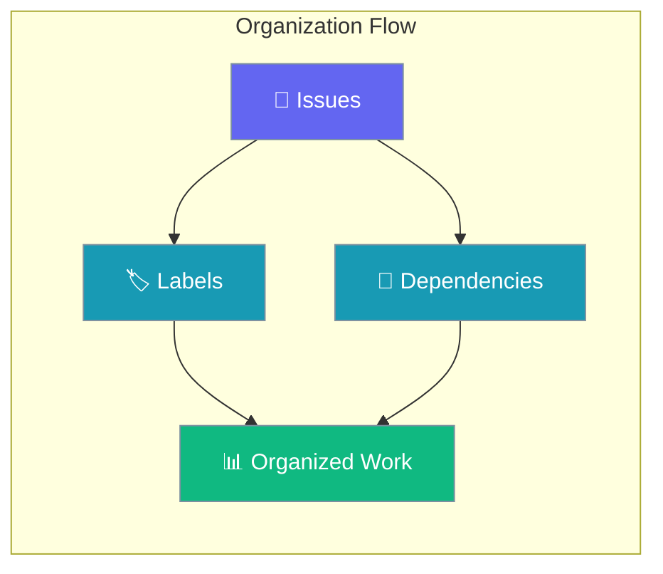
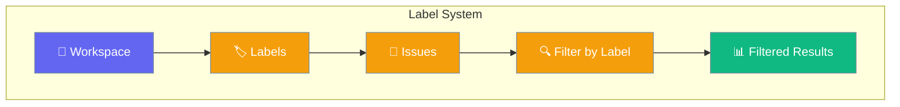
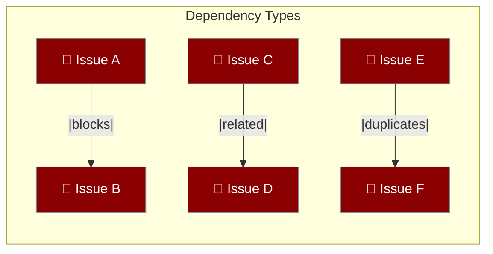
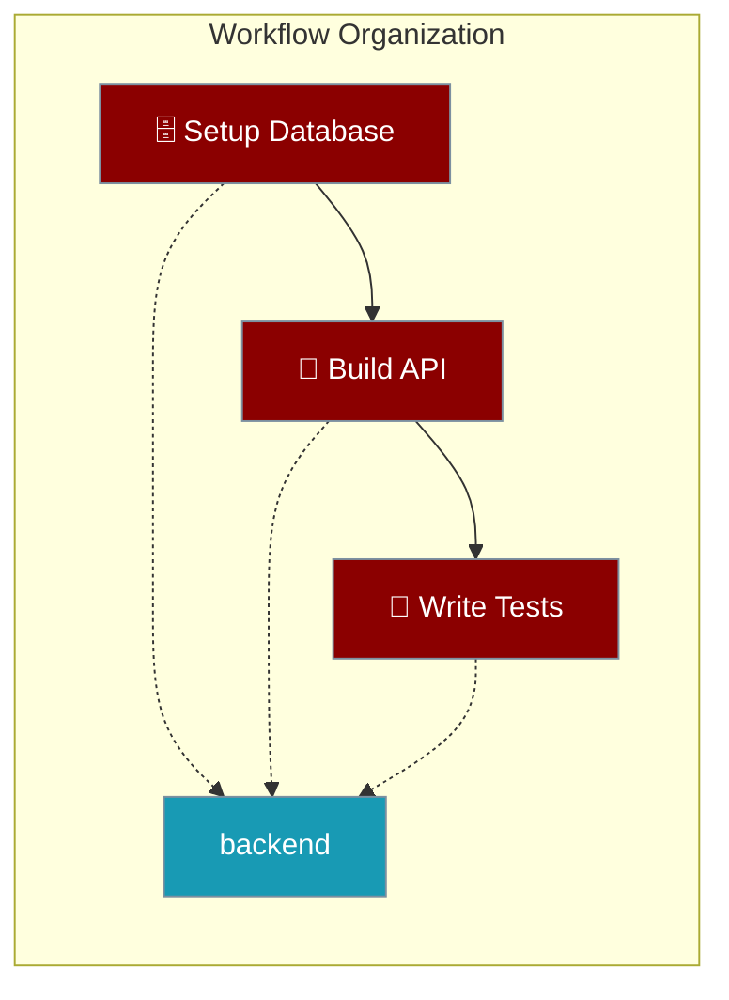

As your workspace grows, labels and dependencies help you categorize and prioritize work.



## Quick Start

<Steps>
<Step title="Create Labels">
Create color-coded tags to categorize issues across your workspace.

<Tabs>
<Tab title="curl">
```bash
# Create "bug" label (red)
curl -s -X POST http://localhost:8000/api/v1/workspaces/$WS_ID/labels \
  -H "Authorization: Bearer $TOKEN" \
  -H "Content-Type: application/json" \
  -d '{"name":"bug","color":"#FF0000"}' \
  --max-time 10

# Create "feature" label (blue)
curl -s -X POST http://localhost:8000/api/v1/workspaces/$WS_ID/labels \
  -H "Authorization: Bearer $TOKEN" \
  -H "Content-Type: application/json" \
  -d '{"name":"feature","color":"#0066FF"}' \
  --max-time 10
```
</Tab>
<Tab title="Python">
```python
import asyncio, httpx

async def create_labels():
    base = "http://localhost:8000/api/v1"
    headers = {"Authorization": "Bearer YOUR_TOKEN", "Content-Type": "application/json"}
    ws_id = "your-ws-id"

    async with httpx.AsyncClient() as client:
        # Create bug label
        bug_label = await client.post(f"{base}/workspaces/{ws_id}/labels",
            json={"name": "bug", "color": "#FF0000"}, headers=headers)
        
        # Create feature label
        feature_label = await client.post(f"{base}/workspaces/{ws_id}/labels",
            json={"name": "feature", "color": "#0066FF"}, headers=headers)

asyncio.run(create_labels())
```
</Tab>
</Tabs>
</Step>

<Step title="Link Dependencies">
Connect related issues to show workflow relationships.

<Tabs>
<Tab title="curl">
```bash
# Issue A blocks Issue B
curl -s -X POST http://localhost:8000/api/v1/workspaces/$WS_ID/issues/$ISSUE_A/dependencies/ \
  -H "Authorization: Bearer $TOKEN" \
  -H "Content-Type: application/json" \
  -d '{"depends_on_issue_id":"ISSUE_B_ID","type":"blocks"}' \
  --max-time 10
```
</Tab>
<Tab title="Python">
```python
async def create_dependency():
    base = "http://localhost:8000/api/v1"
    headers = {"Authorization": "Bearer YOUR_TOKEN", "Content-Type": "application/json"}
    ws_id = "your-ws-id"

    async with httpx.AsyncClient() as client:
        await client.post(f"{base}/workspaces/{ws_id}/issues/{issue_a_id}/dependencies/",
            json={"depends_on_issue_id": issue_b_id, "type": "blocks"}, headers=headers)
```
</Tab>
</Tabs>
</Step>
</Steps>

---

## How Labels Work

Labels are color-coded tags you attach to issues for easy categorization and filtering.



### Label Management

| Action | Description |
|--------|-------------|
| **Create** | Define workspace-wide labels with colors |
| **Tag** | Attach labels to issues |
| **Filter** | Find issues by label |
| **Remove** | Untag labels from issues |

### Tag an Issue

<Tabs>
<Tab title="curl">
```bash
curl -s -X POST http://localhost:8000/api/v1/workspaces/$WS_ID/issues/$ISSUE_ID/labels/$LABEL_ID \
  -H "Authorization: Bearer $TOKEN" \
  --max-time 10
```
</Tab>
<Tab title="Python">
```python
async def tag_issue():
    await client.post(f"{base}/workspaces/{ws_id}/issues/{issue_id}/labels/{label_id}", 
        headers=headers)
```
</Tab>
</Tabs>

### List Issue Labels

<Tabs>
<Tab title="curl">
```bash
curl -s http://localhost:8000/api/v1/workspaces/$WS_ID/issues/$ISSUE_ID/labels \
  -H "Authorization: Bearer $TOKEN" \
  --max-time 10
```
</Tab>
<Tab title="Python">
```python
async def get_issue_labels():
    response = await client.get(f"{base}/workspaces/{ws_id}/issues/{issue_id}/labels", 
        headers=headers)
    return response.json()
```
</Tab>
</Tabs>

---

## How Dependencies Work

Dependencies link issues to show relationships and execution order.



### Dependency Types

| Type | Description | Use Case |
|------|-------------|----------|
| `blocks` | Must finish before dependent can start | Sequential work |
| `related` | Connected but not blocking | Context sharing |
| `duplicates` | Same work, different issues | Issue cleanup |

### View Dependencies

<Tabs>
<Tab title="curl">
```bash
curl -s http://localhost:8000/api/v1/workspaces/$WS_ID/issues/$ISSUE_A/dependencies/ \
  -H "Authorization: Bearer $TOKEN" \
  --max-time 10
```
</Tab>
<Tab title="Python">
```python
async def get_dependencies():
    response = await client.get(f"{base}/workspaces/{ws_id}/issues/{issue_id}/dependencies/", 
        headers=headers)
    return response.json()
```
</Tab>
</Tabs>

---

## Putting It Together

Organize a complete workflow using labels and dependencies.



### Example: Backend Feature Pipeline

<Tabs>
<Tab title="curl">
```bash
# Create backend label
curl -s -X POST http://localhost:8000/api/v1/workspaces/$WS_ID/labels \
  -H "Authorization: Bearer $TOKEN" \
  -H "Content-Type: application/json" \
  -d '{"name":"backend","color":"#6366F1"}' \
  --max-time 10

# Create three issues
curl -s -X POST http://localhost:8000/api/v1/workspaces/$WS_ID/issues/ \
  -H "Authorization: Bearer $TOKEN" \
  -H "Content-Type: application/json" \
  -d '{"title":"Setup Database"}' \
  --max-time 10

curl -s -X POST http://localhost:8000/api/v1/workspaces/$WS_ID/issues/ \
  -H "Authorization: Bearer $TOKEN" \
  -H "Content-Type: application/json" \
  -d '{"title":"Build API"}' \
  --max-time 10

curl -s -X POST http://localhost:8000/api/v1/workspaces/$WS_ID/issues/ \
  -H "Authorization: Bearer $TOKEN" \
  -H "Content-Type: application/json" \
  -d '{"title":"Write Tests"}' \
  --max-time 10

# Tag all with backend label
curl -s -X POST http://localhost:8000/api/v1/workspaces/$WS_ID/issues/$DB_ISSUE_ID/labels/$BACKEND_LABEL_ID \
  -H "Authorization: Bearer $TOKEN" \
  --max-time 10

# Create dependency chain: DB blocks API blocks Tests
curl -s -X POST http://localhost:8000/api/v1/workspaces/$WS_ID/issues/$DB_ISSUE_ID/dependencies/ \
  -H "Authorization: Bearer $TOKEN" \
  -H "Content-Type: application/json" \
  -d '{"depends_on_issue_id":"API_ISSUE_ID","type":"blocks"}' \
  --max-time 10

curl -s -X POST http://localhost:8000/api/v1/workspaces/$WS_ID/issues/$API_ISSUE_ID/dependencies/ \
  -H "Authorization: Bearer $TOKEN" \
  -H "Content-Type: application/json" \
  -d '{"depends_on_issue_id":"TESTS_ISSUE_ID","type":"blocks"}' \
  --max-time 10
```
</Tab>
<Tab title="Python">
```python
import asyncio, httpx

async def organize_workflow():
    base = "http://localhost:8000/api/v1"
    headers = {"Authorization": "Bearer YOUR_TOKEN", "Content-Type": "application/json"}
    ws_id = "your-ws-id"

    async with httpx.AsyncClient() as client:
        # Create backend label
        label_response = await client.post(f"{base}/workspaces/{ws_id}/labels",
            json={"name": "backend", "color": "#6366F1"}, headers=headers)
        label = label_response.json()

        # Create three issues
        db_response = await client.post(f"{base}/workspaces/{ws_id}/issues/",
            json={"title": "Setup Database"}, headers=headers)
        db_issue = db_response.json()

        api_response = await client.post(f"{base}/workspaces/{ws_id}/issues/",
            json={"title": "Build API"}, headers=headers)
        api_issue = api_response.json()

        tests_response = await client.post(f"{base}/workspaces/{ws_id}/issues/",
            json={"title": "Write Tests"}, headers=headers)
        tests_issue = tests_response.json()

        # Tag all with backend label
        for issue in [db_issue, api_issue, tests_issue]:
            await client.post(f"{base}/workspaces/{ws_id}/issues/{issue['id']}/labels/{label['id']}", 
                headers=headers)

        # Create dependency chain
        await client.post(f"{base}/workspaces/{ws_id}/issues/{db_issue['id']}/dependencies/",
            json={"depends_on_issue_id": api_issue["id"], "type": "blocks"}, headers=headers)

        await client.post(f"{base}/workspaces/{ws_id}/issues/{api_issue['id']}/dependencies/",
            json={"depends_on_issue_id": tests_issue["id"], "type": "blocks"}, headers=headers)

asyncio.run(organize_workflow())
```
</Tab>
</Tabs>

---

## Best Practices

<AccordionGroup>
<Accordion title="Use Consistent Label Names">
Create standard labels like "bug", "feature", "urgent" that team members recognize. Avoid duplicate labels with similar meanings.
</Accordion>

<Accordion title="Color Code by Priority">
Use red for urgent issues, blue for features, green for improvements. Consistent colors help visual scanning.
</Accordion>

<Accordion title="Plan Dependencies Early">
Map blocking relationships before starting work. This prevents bottlenecks and clarifies execution order.
</Accordion>

<Accordion title="Review Dependencies Regularly">
Check if blocking issues are resolved and update dependency status. Remove outdated links to keep the graph clean.
</Accordion>
</AccordionGroup>

---

## Related

<CardGroup cols={2}>
<Card title="Platform Issues" icon="list" href="/docs/features/platform/issues">
  Create and manage issues in your workspace
</Card>
<Card title="Issue IDs" icon="hashtag" href="/docs/features/platform/issue-ids">
  Understanding issue identification and references
</Card>
</CardGroup>