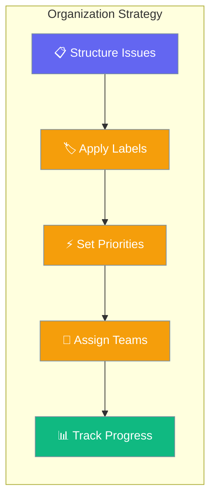

Effective issue organization is crucial for team productivity. Learn how to structure work using projects, labels, priorities, and workflows for maximum efficiency.



## Issue Organization Framework

### Project-Based Organization

Structure issues hierarchically using projects and milestones:

<Steps>
<Step title="Create Project Structure">
```python
import asyncio
from praisonai_platform.client import PlatformClient

async def setup_project_structure():
    client = PlatformClient("http://localhost:8000", token="your-jwt-token")
    ws_id = "your-workspace-id"
    
    # Create main project
    main_project = await client.create_project(
        ws_id,
        name="E-commerce Platform v3.0",
        description="Major platform upgrade with new features and performance improvements",
        start_date="2025-02-01T00:00:00Z",
        due_date="2025-08-31T23:59:59Z"
    )
    
    # Create feature-based milestones
    milestones = [
        {
            "title": "User Authentication Overhaul",
            "description": "Implement OAuth2, 2FA, and improved security",
            "due_date": "2025-03-15T23:59:59Z"
        },
        {
            "title": "Performance Optimization",
            "description": "Database optimization, caching, CDN implementation",
            "due_date": "2025-04-30T23:59:59Z"
        },
        {
            "title": "Mobile App Integration",
            "description": "API updates for mobile app, push notifications",
            "due_date": "2025-06-15T23:59:59Z"
        },
        {
            "title": "Advanced Analytics",
            "description": "User behavior tracking, business intelligence dashboard",
            "due_date": "2025-07-31T23:59:59Z"
        }
    ]
    
    created_milestones = []
    for milestone_data in milestones:
        milestone = await client.create_milestone(
            ws_id,
            main_project['id'],
            **milestone_data
        )
        created_milestones.append(milestone)
        print(f"✅ Created milestone: {milestone['title']}")
    
    return main_project, created_milestones

project, milestones = asyncio.run(setup_project_structure())
```
</Step>

<Step title="Create Cross-Functional Issue Templates">
```python
async def create_issue_templates():
    client = PlatformClient("http://localhost:8000", token="your-jwt-token")
    ws_id = "your-workspace-id"
    
    # Define issue templates for different work types
    templates = {
        "bug_report": {
            "title_template": "[BUG] {component}: {brief_description}",
            "description_template": """
## Bug Description
{detailed_description}

## Steps to Reproduce
1. {step_1}
2. {step_2}
3. {step_3}

## Expected Behavior
{expected_behavior}

## Actual Behavior
{actual_behavior}

## Environment
- OS: {operating_system}
- Browser: {browser_version}
- App Version: {app_version}

## Additional Context
{additional_info}
            """,
            "default_labels": ["bug", "needs-triage"],
            "default_priority": "medium"
        },
        
        "feature_request": {
            "title_template": "[FEATURE] {feature_area}: {feature_name}",
            "description_template": """
## Feature Overview
{feature_overview}

## User Story
As a {user_type}, I want {desired_functionality} so that {benefit}.

## Acceptance Criteria
- [ ] {criteria_1}
- [ ] {criteria_2}
- [ ] {criteria_3}

## Technical Requirements
{technical_requirements}

## Design Considerations
{design_notes}

## Definition of Done
- [ ] Feature implemented and tested
- [ ] Documentation updated
- [ ] Code reviewed and approved
- [ ] QA testing completed
            """,
            "default_labels": ["enhancement", "needs-planning"],
            "default_priority": "low"
        },
        
        "technical_debt": {
            "title_template": "[TECH DEBT] {area}: {improvement_summary}",
            "description_template": """
## Current State
{current_implementation}

## Issues with Current Approach
{problems_identified}

## Proposed Solution
{proposed_improvement}

## Benefits
- {benefit_1}
- {benefit_2}
- {benefit_3}

## Implementation Plan
1. {step_1}
2. {step_2}
3. {step_3}

## Risk Assessment
{risks_and_mitigation}
            """,
            "default_labels": ["technical-debt", "improvement"],
            "default_priority": "low"
        }
    }
    
    # Create template issues
    template_issues = {}
    for template_name, template_config in templates.items():
        template_issue = await client.create_issue_template(
            ws_id,
            name=template_name,
            **template_config
        )
        template_issues[template_name] = template_issue
        print(f"✅ Created template: {template_name}")
    
    return template_issues

templates = asyncio.run(create_issue_templates())
```
</Step>
</Steps>

### Label Taxonomy System

Create a comprehensive labeling system for efficient categorization:

<Steps>
<Step title="Design Label Taxonomy">
```python
async def create_label_taxonomy():
    client = PlatformClient("http://localhost:8000", token="your-jwt-token")
    ws_id = "your-workspace-id"
    
    # Define comprehensive label system
    label_categories = {
        "priority": {
            "color_base": "#dc2626",  # Red family
            "labels": [
                {"name": "priority:critical", "color": "#dc2626", "description": "System down, security breach, data loss"},
                {"name": "priority:high", "color": "#f97316", "description": "Core functionality broken, many users affected"},
                {"name": "priority:medium", "color": "#eab308", "description": "Feature not working, some users affected"},
                {"name": "priority:low", "color": "#22c55e", "description": "Minor issue, cosmetic problems"}
            ]
        },
        
        "type": {
            "color_base": "#3b82f6",  # Blue family
            "labels": [
                {"name": "type:bug", "color": "#dc2626", "description": "Something isn't working correctly"},
                {"name": "type:enhancement", "color": "#059669", "description": "New feature or improvement request"},
                {"name": "type:task", "color": "#3b82f6", "description": "General work item or maintenance task"},
                {"name": "type:research", "color": "#8b5cf6", "description": "Investigation or research needed"},
                {"name": "type:documentation", "color": "#6366f1", "description": "Documentation work required"}
            ]
        },
        
        "team": {
            "color_base": "#059669",  # Green family
            "labels": [
                {"name": "team:frontend", "color": "#3b82f6", "description": "Frontend development team"},
                {"name": "team:backend", "color": "#059669", "description": "Backend development team"},
                {"name": "team:devops", "color": "#f59e0b", "description": "DevOps and infrastructure team"},
                {"name": "team:design", "color": "#ec4899", "description": "UI/UX design team"},
                {"name": "team:qa", "color": "#8b5cf6", "description": "Quality assurance team"},
                {"name": "team:product", "color": "#06b6d4", "description": "Product management team"}
            ]
        },
        
        "component": {
            "color_base": "#8b5cf6",  # Purple family
            "labels": [
                {"name": "component:auth", "color": "#ef4444", "description": "Authentication and authorization"},
                {"name": "component:api", "color": "#f97316", "description": "API endpoints and services"},
                {"name": "component:database", "color": "#eab308", "description": "Database and data layer"},
                {"name": "component:ui", "color": "#22c55e", "description": "User interface components"},
                {"name": "component:mobile", "color": "#3b82f6", "description": "Mobile app functionality"},
                {"name": "component:integration", "color": "#8b5cf6", "description": "Third-party integrations"}
            ]
        },
        
        "status": {
            "color_base": "#6b7280",  # Gray family
            "labels": [
                {"name": "status:blocked", "color": "#ef4444", "description": "Cannot proceed due to external dependency"},
                {"name": "status:needs-info", "color": "#f59e0b", "description": "Waiting for additional information"},
                {"name": "status:ready", "color": "#10b981", "description": "Ready for development work"},
                {"name": "status:in-review", "color": "#3b82f6", "description": "Under code or design review"},
                {"name": "status:testing", "color": "#8b5cf6", "description": "In QA testing phase"}
            ]
        }
    }
    
    # Create all labels
    created_labels = {}
    for category, config in label_categories.items():
        created_labels[category] = []
        for label_data in config["labels"]:
            label = await client.create_label(ws_id, **label_data)
            created_labels[category].append(label)
            print(f"✅ Created {category} label: {label['name']}")
    
    return created_labels

labels = asyncio.run(create_label_taxonomy())
```
</Step>

<Step title="Apply Smart Label Rules">
```python
async def setup_smart_labeling():
    client = PlatformClient("http://localhost:8000", token="your-jwt-token")
    ws_id = "your-workspace-id"
    
    # Create automation rules for smart labeling
    labeling_rules = [
        {
            "name": "Auto-label security issues",
            "description": "Automatically apply security labels to issues mentioning security keywords",
            "triggers": [
                {
                    "type": "issue_created",
                    "conditions": {
                        "title_contains": ["security", "vulnerability", "exploit", "breach"],
                        "description_contains": ["password", "token", "auth", "sql injection", "xss"]
                    }
                }
            ],
            "actions": [
                {"type": "add_labels", "labels": ["priority:critical", "type:bug", "component:auth"]},
                {"type": "set_priority", "priority": "critical"},
                {"type": "notify_security_team"}
            ]
        },
        
        {
            "name": "Performance issue detection",
            "description": "Detect and label performance-related issues",
            "triggers": [
                {
                    "type": "issue_created",
                    "conditions": {
                        "content_contains": ["slow", "timeout", "performance", "lag", "memory", "cpu"]
                    }
                }
            ],
            "actions": [
                {"type": "add_labels", "labels": ["type:bug", "component:performance"]},
                {"type": "assign_team", "team": "backend"}
            ]
        },
        
        {
            "name": "UI/UX issue classification",
            "description": "Classify user interface and experience issues",
            "triggers": [
                {
                    "type": "issue_created", 
                    "conditions": {
                        "content_contains": ["ui", "ux", "design", "layout", "mobile", "responsive"]
                    }
                }
            ],
            "actions": [
                {"type": "add_labels", "labels": ["team:design", "component:ui"]},
                {"type": "add_labels_conditional", "if_mobile": ["component:mobile"]}
            ]
        }
    ]
    
    # Create automation rules
    created_rules = []
    for rule_config in labeling_rules:
        rule = await client.create_automation_rule(ws_id, **rule_config)
        created_rules.append(rule)
        print(f"✅ Created labeling rule: {rule['name']}")
    
    return created_rules

rules = asyncio.run(setup_smart_labeling())
```
</Step>
</Steps>

---

## Workflow Organization Patterns

### Sprint-Based Organization

Organize work using agile sprint methodology:

<AccordionGroup>
<Accordion title="Sprint Planning Workflow">
```python
async def setup_sprint_workflow():
    client = PlatformClient("http://localhost:8000", token="your-jwt-token")
    ws_id = "your-workspace-id"
    
    # Create sprint project
    sprint_project = await client.create_project(
        ws_id,
        name="Sprint 2025-02",
        description="February 2025 sprint - User authentication and mobile improvements",
        start_date="2025-02-01T00:00:00Z",
        due_date="2025-02-14T23:59:59Z"
    )
    
    # Define sprint backlog with story points
    sprint_backlog = [
        {
            "title": "Implement OAuth2 Google login",
            "description": "Add Google OAuth2 authentication option to login page",
            "story_points": 8,
            "labels": ["type:enhancement", "component:auth", "team:backend"],
            "priority": "high"
        },
        {
            "title": "Add two-factor authentication",
            "description": "Implement TOTP-based 2FA for enhanced security",
            "story_points": 13,
            "labels": ["type:enhancement", "component:auth", "team:backend"],
            "priority": "high"
        },
        {
            "title": "Fix mobile navigation drawer",
            "description": "Navigation drawer doesn't close properly on mobile devices",
            "story_points": 3,
            "labels": ["type:bug", "component:mobile", "team:frontend"],
            "priority": "medium"
        },
        {
            "title": "Update password reset flow",
            "description": "Modernize password reset UI and add better error handling",
            "story_points": 5,
            "labels": ["type:enhancement", "component:auth", "team:frontend"],
            "priority": "medium"
        }
    ]
    
    # Create sprint issues
    sprint_issues = []
    total_story_points = 0
    
    for issue_data in sprint_backlog:
        # Add sprint-specific labels
        issue_data["labels"].extend(["sprint:2025-02", f"points:{issue_data['story_points']}"])
        
        issue = await client.create_issue(
            ws_id,
            project_id=sprint_project['id'],
            **{k: v for k, v in issue_data.items() if k != 'story_points'}
        )
        
        # Add story points as custom field
        await client.update_issue_custom_fields(
            ws_id, 
            issue['id'],
            {"story_points": issue_data['story_points']}
        )
        
        sprint_issues.append(issue)
        total_story_points += issue_data['story_points']
        print(f"✅ Added to sprint: {issue['identifier']} ({issue_data['story_points']} pts)")
    
    print(f"\n📊 Sprint Summary:")
    print(f"   Total issues: {len(sprint_issues)}")
    print(f"   Total story points: {total_story_points}")
    print(f"   Sprint capacity: 30 story points")
    print(f"   Sprint load: {(total_story_points/30)*100:.1f}%")
    
    return sprint_project, sprint_issues

sprint, issues = asyncio.run(setup_sprint_workflow())
```
</Accordion>

<Accordion title="Kanban Board Organization">
```python
async def setup_kanban_workflow():
    client = PlatformClient("http://localhost:8000", token="your-jwt-token")
    ws_id = "your-workspace-id"
    
    # Define Kanban board columns
    kanban_columns = [
        {"name": "Backlog", "status": "backlog", "wip_limit": None},
        {"name": "Ready", "status": "ready", "wip_limit": 10},
        {"name": "In Progress", "status": "in_progress", "wip_limit": 6},
        {"name": "Code Review", "status": "review", "wip_limit": 8},
        {"name": "Testing", "status": "testing", "wip_limit": 5},
        {"name": "Done", "status": "done", "wip_limit": None}
    ]
    
    # Create workflow automation for Kanban
    kanban_automation = await client.create_workflow(
        ws_id,
        name="Kanban Flow Automation",
        description="Automates issue flow through Kanban board stages",
        columns=kanban_columns,
        rules=[
            {
                "trigger": "status_change_to_in_progress",
                "conditions": {"assignee_required": True},
                "actions": [
                    {"type": "add_label", "label": "status:in-progress"},
                    {"type": "start_time_tracking"},
                    {"type": "notify_assignee"}
                ]
            },
            {
                "trigger": "status_change_to_review",
                "conditions": {"pull_request_required": True},
                "actions": [
                    {"type": "add_label", "label": "status:in-review"},
                    {"type": "assign_reviewer"},
                    {"type": "notify_team", "team": "code-reviewers"}
                ]
            },
            {
                "trigger": "column_wip_limit_exceeded",
                "actions": [
                    {"type": "block_new_assignments"},
                    {"type": "notify_team_lead"},
                    {"type": "highlight_bottleneck"}
                ]
            }
        ]
    )
    
    # Create sample issues in different Kanban stages
    sample_issues = [
        {"title": "Research user authentication patterns", "status": "backlog"},
        {"title": "Design new dashboard layout", "status": "ready"},
        {"title": "Implement search functionality", "status": "in_progress", "assignee": "dev-1"},
        {"title": "Fix payment processing bug", "status": "review", "assignee": "dev-2"},
        {"title": "Test mobile responsiveness", "status": "testing", "assignee": "qa-1"}
    ]
    
    created_issues = []
    for issue_data in sample_issues:
        issue = await client.create_issue(ws_id, **issue_data)
        created_issues.append(issue)
        print(f"✅ Created {issue_data['status']} issue: {issue['title']}")
    
    # Generate Kanban board metrics
    board_metrics = await client.get_kanban_metrics(ws_id, kanban_automation['id'])
    
    print(f"\n📋 Kanban Board Status:")
    for column in kanban_columns:
        count = board_metrics['column_counts'].get(column['status'], 0)
        wip_status = f"/{column['wip_limit']}" if column['wip_limit'] else ""
        print(f"   {column['name']}: {count}{wip_status} issues")
    
    return kanban_automation, created_issues

kanban, board_issues = asyncio.run(setup_kanban_workflow())
```
</Accordion>
</AccordionGroup>

### Team-Based Organization

Organize issues by team ownership and collaboration patterns:

```python
async def setup_team_organization():
    client = PlatformClient("http://localhost:8000", token="your-jwt-token")
    ws_id = "your-workspace-id"
    
    # Define team structure and responsibilities
    teams = {
        "frontend": {
            "name": "Frontend Team",
            "responsibilities": ["ui", "ux", "mobile", "web"],
            "default_labels": ["team:frontend"],
            "escalation_path": ["frontend-lead", "tech-lead"]
        },
        "backend": {
            "name": "Backend Team", 
            "responsibilities": ["api", "database", "auth", "performance"],
            "default_labels": ["team:backend"],
            "escalation_path": ["backend-lead", "tech-lead"]
        },
        "devops": {
            "name": "DevOps Team",
            "responsibilities": ["infrastructure", "deployment", "monitoring", "security"],
            "default_labels": ["team:devops"],
            "escalation_path": ["devops-lead", "cto"]
        },
        "product": {
            "name": "Product Team",
            "responsibilities": ["requirements", "planning", "research", "documentation"],
            "default_labels": ["team:product"],
            "escalation_path": ["product-manager", "head-of-product"]
        }
    }
    
    # Create team-based issue routing
    team_routing_rules = []
    for team_id, team_config in teams.items():
        rule = await client.create_automation_rule(
            ws_id,
            name=f"Route {team_config['name']} Issues",
            description=f"Automatically route issues to {team_config['name']}",
            triggers=[
                {
                    "type": "issue_created",
                    "conditions": {
                        "labels_include_any": [f"component:{resp}" for resp in team_config['responsibilities']],
                        "or_content_contains": team_config['responsibilities']
                    }
                }
            ],
            actions=[
                {"type": "add_labels", "labels": team_config['default_labels']},
                {"type": "assign_to_team", "team": team_id},
                {"type": "notify_team_lead", "team": team_id}
            ]
        )
        team_routing_rules.append(rule)
        print(f"✅ Created routing rule for {team_config['name']}")
    
    # Create cross-team collaboration workflow
    collaboration_workflow = await client.create_workflow(
        ws_id,
        name="Cross-Team Collaboration",
        description="Manages issues requiring multiple teams",
        rules=[
            {
                "trigger": "multiple_team_labels_detected",
                "conditions": {"team_labels_count": ">=2"},
                "actions": [
                    {"type": "add_label", "label": "cross-team"},
                    {"type": "create_coordination_issue"},
                    {"type": "notify_team_leads"},
                    {"type": "schedule_sync_meeting"}
                ]
            },
            {
                "trigger": "team_capacity_exceeded",
                "conditions": {"team_active_issues": ">=team_capacity"},
                "actions": [
                    {"type": "add_label", "label": "needs-prioritization"},
                    {"type": "notify_team_lead"},
                    {"type": "suggest_issue_delegation"}
                ]
            }
        ]
    )
    
    # Create team dashboards
    team_dashboards = {}
    for team_id, team_config in teams.items():
        dashboard = await client.create_dashboard(
            ws_id,
            name=f"{team_config['name']} Dashboard",
            description=f"Issue tracking for {team_config['name']}",
            filters={
                "team": team_id,
                "status": ["backlog", "ready", "in_progress", "review"]
            },
            widgets=[
                {"type": "issue_count", "title": "Active Issues"},
                {"type": "priority_breakdown", "title": "Priority Distribution"},
                {"type": "age_histogram", "title": "Issue Age Distribution"},
                {"type": "velocity_chart", "title": "Team Velocity"},
                {"type": "blocked_issues", "title": "Blocked Items"}
            ]
        )
        team_dashboards[team_id] = dashboard
        print(f"✅ Created dashboard for {team_config['name']}")
    
    return teams, team_routing_rules, collaboration_workflow, team_dashboards

teams, routing, collaboration, dashboards = asyncio.run(setup_team_organization())
```

## Issue Lifecycle Management

### Automated Status Transitions

Set up intelligent status management:

```python
async def setup_lifecycle_automation():
    client = PlatformClient("http://localhost:8000", token="your-jwt-token")
    ws_id = "your-workspace-id"
    
    # Define issue lifecycle stages
    lifecycle_stages = {
        "intake": {
            "statuses": ["reported", "triaged"],
            "required_fields": ["title", "description", "reporter"],
            "auto_actions": ["assign_triage_agent", "add_triage_label"]
        },
        "planning": {
            "statuses": ["backlog", "ready"],
            "required_fields": ["priority", "labels", "estimated_effort"],
            "auto_actions": ["add_to_roadmap", "notify_product_team"]
        },
        "development": {
            "statuses": ["in_progress", "review"],
            "required_fields": ["assignee", "branch", "pull_request"],
            "auto_actions": ["start_time_tracking", "link_code_changes"]
        },
        "validation": {
            "statuses": ["testing", "verification"],
            "required_fields": ["test_plan", "qa_assignee"],
            "auto_actions": ["run_automated_tests", "assign_qa_tester"]
        },
        "completion": {
            "statuses": ["done", "deployed"],
            "required_fields": ["resolution", "deployment_info"],
            "auto_actions": ["update_metrics", "notify_stakeholders"]
        }
    }
    
    # Create lifecycle automation rules
    lifecycle_rules = []
    for stage, config in lifecycle_stages.items():
        for status in config["statuses"]:
            rule = await client.create_automation_rule(
                ws_id,
                name=f"Lifecycle: {stage.title()} - {status.title()}",
                description=f"Automates {stage} stage when issue moves to {status}",
                triggers=[
                    {
                        "type": "status_change_to",
                        "status": status
                    }
                ],
                conditions=[
                    {
                        "type": "required_fields_present",
                        "fields": config["required_fields"]
                    }
                ],
                actions=[
                    {"type": "add_label", "label": f"stage:{stage}"},
                    *[{"type": action} for action in config["auto_actions"]]
                ],
                failure_actions=[
                    {"type": "add_label", "label": "incomplete-transition"},
                    {"type": "notify_assignee", "message": f"Required fields missing for {stage}"},
                    {"type": "revert_status"}
                ]
            )
            lifecycle_rules.append(rule)
    
    print(f"✅ Created {len(lifecycle_rules)} lifecycle automation rules")
    
    # Create quality gates
    quality_gates = await client.create_quality_gates(
        ws_id,
        gates=[
            {
                "name": "Ready for Development",
                "conditions": [
                    {"field": "priority", "operator": "is_set"},
                    {"field": "assignee", "operator": "is_set"},
                    {"field": "labels", "operator": "includes", "value": "team:*"},
                    {"field": "estimated_effort", "operator": "is_set"}
                ],
                "required_for": ["in_progress"]
            },
            {
                "name": "Ready for Review",
                "conditions": [
                    {"field": "pull_request", "operator": "is_linked"},
                    {"field": "automated_tests", "operator": "passing"},
                    {"field": "description", "operator": "min_length", "value": 50}
                ],
                "required_for": ["review"]
            },
            {
                "name": "Ready for Deployment",
                "conditions": [
                    {"field": "code_review", "operator": "approved"},
                    {"field": "qa_testing", "operator": "passed"},
                    {"field": "security_scan", "operator": "passed"},
                    {"field": "documentation", "operator": "updated"}
                ],
                "required_for": ["deployed"]
            }
        ]
    )
    
    return lifecycle_rules, quality_gates

rules, gates = asyncio.run(setup_lifecycle_automation())
```

## Advanced Organization Strategies

<AccordionGroup>
<Accordion title="Dependency Management">
```python
async def setup_dependency_tracking():
    client = PlatformClient("http://localhost:8000", token="your-jwt-token")
    ws_id = "your-workspace-id"
    
    # Create issues with dependencies
    parent_issue = await client.create_issue(
        ws_id,
        title="Implement new payment system",
        description="Complete overhaul of payment processing"
    )
    
    # Create dependent issues
    dependencies = [
        {
            "title": "Research payment providers",
            "description": "Evaluate Stripe, PayPal, Square APIs",
            "depends_on": [],
            "blocks": ["API integration", "UI updates"]
        },
        {
            "title": "Design payment API interface",
            "description": "Define internal API for payment processing",
            "depends_on": ["Research payment providers"],
            "blocks": ["API integration"]
        },
        {
            "title": "Implement payment API integration",
            "description": "Connect to selected payment provider",
            "depends_on": ["Design payment API interface"],
            "blocks": ["UI updates", "Testing"]
        },
        {
            "title": "Update payment UI components",
            "description": "Create new payment forms and confirmation pages",
            "depends_on": ["Design payment API interface"],
            "blocks": ["Testing"]
        },
        {
            "title": "Create automated payment tests",
            "description": "Test suite for payment flows",
            "depends_on": ["Implement payment API integration", "Update payment UI components"],
            "blocks": []
        }
    ]
    
    created_issues = {}
    
    # Create all dependency issues
    for dep_data in dependencies:
        issue = await client.create_issue(
            ws_id,
            title=dep_data["title"],
            description=dep_data["description"],
            parent_issue_id=parent_issue['id']
        )
        created_issues[dep_data["title"]] = issue
    
    # Link dependencies
    for dep_data in dependencies:
        current_issue = created_issues[dep_data["title"]]
        
        # Add blocking relationships
        for blocker_title in dep_data["depends_on"]:
            if blocker_title in created_issues:
                await client.add_issue_dependency(
                    ws_id,
                    current_issue['id'],
                    created_issues[blocker_title]['id'],
                    dependency_type="blocks"
                )
    
    # Create dependency visualization
    dependency_map = await client.generate_dependency_graph(
        ws_id,
        parent_issue['id'],
        format="mermaid"
    )
    
    print("✅ Dependency tracking set up")
    print(f"📊 Dependency graph:\n{dependency_map}")
    
    return parent_issue, created_issues

parent, deps = asyncio.run(setup_dependency_tracking())
```
</Accordion>

<Accordion title="Automated Triage System">
```python
async def setup_intelligent_triage():
    client = PlatformClient("http://localhost:8000", token="your-jwt-token")
    ws_id = "your-workspace-id"
    
    # Create AI-powered triage agent
    triage_agent = await client.create_agent(
        ws_id,
        name="Intelligent Triage System",
        description="AI system for automatic issue classification and routing",
        instructions="""
        Analyze incoming issues and:
        
        1. Determine severity based on:
           - Impact on users (critical, high, medium, low)
           - Business criticality 
           - Security implications
        
        2. Classify issue type:
           - Bug (functional, performance, security, ui)
           - Feature request (enhancement, new feature)
           - Technical debt (refactoring, optimization)
           - Question (support, clarification)
        
        3. Route to appropriate team:
           - Frontend: UI, UX, mobile issues
           - Backend: API, database, server issues
           - DevOps: Infrastructure, deployment, monitoring
           - Security: Authentication, authorization, vulnerabilities
        
        4. Set initial labels and priority
        5. Assign to appropriate team lead or specialist
        6. Add estimated effort if possible
        
        Always explain your reasoning in the analysis comment.
        """,
        model="gpt-4o",
        auto_assign_labels=["triaged", "ai-analyzed"],
        triggers={
            "on_issue_created": True,
            "on_label_added": ["needs-triage"]
        }
    )
    
    # Create escalation rules
    escalation_rules = await client.create_automation_rule(
        ws_id,
        name="Critical Issue Escalation",
        description="Automatically escalate critical issues to appropriate leadership",
        triggers=[
            {
                "type": "issue_labeled",
                "label": "priority:critical"
            },
            {
                "type": "issue_age",
                "condition": "older_than_hours",
                "value": 2,
                "status": "reported"
            }
        ],
        actions=[
            {"type": "notify_on_call"},
            {"type": "create_incident"},
            {"type": "add_to_leadership_dashboard"},
            {"type": "start_sla_tracking"}
        ]
    )
    
    # Set up SLA tracking
    sla_config = await client.configure_sla_tracking(
        ws_id,
        rules=[
            {
                "priority": "critical",
                "response_time": "15m",
                "resolution_time": "4h",
                "business_hours_only": False
            },
            {
                "priority": "high", 
                "response_time": "2h",
                "resolution_time": "24h", 
                "business_hours_only": True
            },
            {
                "priority": "medium",
                "response_time": "8h",
                "resolution_time": "72h",
                "business_hours_only": True
            },
            {
                "priority": "low",
                "response_time": "24h",
                "resolution_time": "2w",
                "business_hours_only": True
            }
        ]
    )
    
    print("✅ Intelligent triage system configured")
    return triage_agent, escalation_rules, sla_config

triage, escalation, sla = asyncio.run(setup_intelligent_triage())
```
</Accordion>
</AccordionGroup>

## Metrics and Optimization

Track and improve your issue organization:

```python
async def generate_organization_metrics():
    client = PlatformClient("http://localhost:8000", token="your-jwt-token")
    ws_id = "your-workspace-id"
    
    # Get comprehensive metrics
    metrics = await client.get_workspace_metrics(
        ws_id,
        time_range="last_30_days",
        include=[
            "issue_flow",
            "team_performance", 
            "label_effectiveness",
            "automation_impact"
        ]
    )
    
    # Calculate organization effectiveness scores
    organization_score = {
        "label_coverage": metrics['labeled_issues'] / metrics['total_issues'],
        "team_assignment": metrics['assigned_issues'] / metrics['total_issues'],
        "priority_distribution": {
            "critical": metrics['priority_counts']['critical'],
            "high": metrics['priority_counts']['high'],
            "medium": metrics['priority_counts']['medium'],
            "low": metrics['priority_counts']['low']
        },
        "resolution_time": {
            "critical": metrics['avg_resolution_time']['critical'],
            "high": metrics['avg_resolution_time']['high'],
            "medium": metrics['avg_resolution_time']['medium'],
            "low": metrics['avg_resolution_time']['low']
        },
        "automation_effectiveness": metrics['automated_actions'] / metrics['total_actions']
    }
    
    # Generate improvement recommendations
    recommendations = []
    
    if organization_score['label_coverage'] < 0.9:
        recommendations.append("Improve label coverage - many issues lack proper categorization")
    
    if organization_score['team_assignment'] < 0.8:
        recommendations.append("Increase team assignment rate for better ownership")
    
    if organization_score['automation_effectiveness'] < 0.3:
        recommendations.append("Add more automation rules to reduce manual work")
    
    # Print report
    print("📊 Organization Effectiveness Report")
    print("=" * 50)
    print(f"Label Coverage: {organization_score['label_coverage']:.1%}")
    print(f"Team Assignment Rate: {organization_score['team_assignment']:.1%}")
    print(f"Automation Rate: {organization_score['automation_effectiveness']:.1%}")
    
    print(f"\n🎯 Priority Distribution:")
    for priority, count in organization_score['priority_distribution'].items():
        print(f"  {priority.title()}: {count} issues")
    
    print(f"\n⏱️ Average Resolution Time:")
    for priority, time in organization_score['resolution_time'].items():
        print(f"  {priority.title()}: {time}")
    
    if recommendations:
        print(f"\n💡 Recommendations:")
        for i, rec in enumerate(recommendations, 1):
            print(f"  {i}. {rec}")
    
    return organization_score, recommendations

score, recs = asyncio.run(generate_organization_metrics())
```

## Related Guides

<CardGroup cols={2}>
<Card title="AI Agent Assignment" icon="robot" href="/docs/guides/platform/assign-agents">
  Automate issue handling with intelligent agents
</Card>

<Card title="Team Collaboration" icon="users" href="/docs/features/platform/members">
  Manage team permissions and workflows
</Card>

<Card title="Project Management" icon="folder" href="/docs/features/platform/projects">
  Organize work with projects and milestones
</Card>

<Card title="Advanced Workflows" icon="workflow" href="/docs/features/workflows">
  Create sophisticated automation workflows
</Card>
</CardGroup>