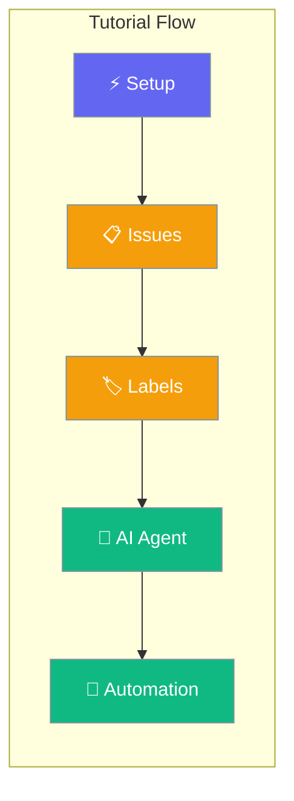

This hands-on tutorial walks you through the core PraisonAI Platform features in 5 minutes, from workspace creation to deploying your first AI agent.



## Tutorial Prerequisites

This tutorial assumes you have:
- PraisonAI Platform server running at `http://localhost:8000`
- A registered user account with authentication token
- 5 minutes to complete the walkthrough

<Note>
If you haven't set up the platform yet, complete the [Getting Started guide](/docs/guides/platform/getting-started) first.
</Note>

## Tutorial Script

Copy this complete script and run it step by step:

```python
import asyncio
from praisonai_platform.client import PlatformClient

# Configuration
PLATFORM_URL = "http://localhost:8000"
TOKEN = "your-jwt-token"  # Replace with your actual token

async def tutorial_walkthrough():
    """Complete 5-minute platform tutorial"""
    client = PlatformClient(PLATFORM_URL, token=TOKEN)
    
    print("🚀 Starting PraisonAI Platform Tutorial...")
    print("=" * 50)
    
    # Step 1: Create Tutorial Workspace
    print("\n📋 Step 1: Creating tutorial workspace...")
    workspace = await client.create_workspace(
        name="Tutorial Workspace",
        description="Learning PraisonAI Platform features"
    )
    ws_id = workspace['id']
    print(f"✅ Workspace created: {workspace['name']}")
    print(f"   ID: {ws_id}")
    
    # Step 2: Create Project with Issues
    print("\n📁 Step 2: Setting up project with issues...")
    project = await client.create_project(
        ws_id,
        name="Bug Tracker Tutorial",
        description="Learning issue management and AI automation"
    )
    
    # Create sample issues
    issues_data = [
        {
            "title": "Login page crashes on mobile",
            "description": "Users report crashes when accessing login page on mobile devices. Need to investigate and fix.",
            "priority": "high"
        },
        {
            "title": "Add dark mode toggle", 
            "description": "Users requested dark mode option in settings. Should be persistent across sessions.",
            "priority": "medium"
        },
        {
            "title": "Improve search performance",
            "description": "Search queries taking too long, especially with large datasets. Need optimization.",
            "priority": "low"
        }
    ]
    
    created_issues = []
    for issue_data in issues_data:
        issue = await client.create_issue(
            ws_id,
            project_id=project['id'],
            **issue_data
        )
        created_issues.append(issue)
        print(f"✅ Created issue {issue['identifier']}: {issue['title']}")
    
    # Step 3: Add Organizing Labels  
    print("\n🏷️  Step 3: Adding organization labels...")
    labels_data = [
        {"name": "bug", "color": "#dc2626", "description": "Something isn't working"},
        {"name": "enhancement", "color": "#059669", "description": "New feature request"},
        {"name": "priority-high", "color": "#dc2626", "description": "High priority item"},
        {"name": "priority-medium", "color": "#f59e0b", "description": "Medium priority item"},
        {"name": "mobile", "color": "#3b82f6", "description": "Mobile-related issue"},
        {"name": "performance", "color": "#8b5cf6", "description": "Performance improvement"}
    ]
    
    created_labels = []
    for label_data in labels_data:
        label = await client.create_label(ws_id, **label_data)
        created_labels.append(label)
        print(f"✅ Created label: {label['name']}")
    
    # Apply labels to issues
    await client.add_issue_labels(ws_id, created_issues[0]['id'], ["bug", "priority-high", "mobile"])
    await client.add_issue_labels(ws_id, created_issues[1]['id'], ["enhancement", "priority-medium"])
    await client.add_issue_labels(ws_id, created_issues[2]['id'], ["enhancement", "performance", "priority-low"])
    
    print("✅ Applied labels to issues")
    
    # Step 4: Add Comments and Collaboration
    print("\n💬 Step 4: Adding collaboration with comments...")
    await client.add_issue_comment(
        ws_id,
        created_issues[0]['id'],
        "I can reproduce this on iOS Safari. Stack trace shows memory allocation issue."
    )
    
    await client.add_issue_comment(
        ws_id,
        created_issues[1]['id'], 
        "Should we use system preference or allow manual toggle? Looking at Material Design guidelines."
    )
    
    print("✅ Added collaboration comments")
    
    # Step 5: Create and Deploy AI Agent
    print("\n🤖 Step 5: Creating AI agent for automation...")
    
    # Create a bug analysis agent
    agent = await client.create_agent(
        ws_id,
        name="Bug Analyzer",
        description="AI agent that analyzes bug reports and suggests solutions",
        instructions="""
        You are a senior software engineer that analyzes bug reports.
        When assigned to an issue:
        1. Analyze the description for technical details
        2. Identify likely root causes
        3. Suggest debugging steps
        4. Recommend potential solutions
        5. Add your analysis as a comment
        """,
        model="gpt-4o",
        auto_assign_labels=["analyzed", "ai-reviewed"]
    )
    print(f"✅ Created AI agent: {agent['name']}")
    
    # Assign agent to first issue
    await client.assign_issue_agent(ws_id, created_issues[0]['id'], agent['id'])
    print(f"✅ Assigned agent to issue {created_issues[0]['identifier']}")
    
    # Step 6: Trigger Automation
    print("\n⚡ Step 6: Triggering AI automation...")
    
    # Update issue to trigger agent analysis
    await client.update_issue(
        ws_id,
        created_issues[0]['id'],
        status="in_progress",
        comment="Starting investigation. Agent assigned for analysis."
    )
    
    # Simulate agent processing (in real platform, this happens automatically)
    await asyncio.sleep(2)  # Give agent time to process
    
    # Check agent's work
    issue_with_analysis = await client.get_issue(ws_id, created_issues[0]['id'])
    agent_comments = [c for c in issue_with_analysis.get('comments', []) if c.get('author', {}).get('type') == 'agent']
    
    if agent_comments:
        print("✅ Agent analysis completed:")
        print(f"   Comment: {agent_comments[-1]['content'][:100]}...")
    else:
        print("⏳ Agent is processing (may take a moment in production)")
    
    # Step 7: View Results Dashboard
    print("\n📊 Step 7: Viewing progress dashboard...")
    
    # Get workspace activity
    activities = await client.get_workspace_activity(ws_id, limit=10)
    print(f"✅ Recent activities: {len(activities)} events")
    
    # Get issue statistics
    all_issues = await client.list_issues(ws_id)
    issue_stats = {
        'total': len(all_issues),
        'high_priority': len([i for i in all_issues if 'priority-high' in i.get('labels', [])]),
        'with_agents': len([i for i in all_issues if i.get('assignee_type') == 'agent']),
        'in_progress': len([i for i in all_issues if i.get('status') == 'in_progress'])
    }
    
    print(f"📈 Tutorial workspace stats:")
    print(f"   Total issues: {issue_stats['total']}")
    print(f"   High priority: {issue_stats['high_priority']}")
    print(f"   Agent-assigned: {issue_stats['with_agents']}")
    print(f"   In progress: {issue_stats['in_progress']}")
    
    # Tutorial completion
    print("\n" + "=" * 50)
    print("🎉 Tutorial Complete! Here's what you accomplished:")
    print(f"   ✅ Created workspace: {workspace['name']}")
    print(f"   ✅ Set up project: {project['name']}")
    print(f"   ✅ Created {len(created_issues)} sample issues")
    print(f"   ✅ Organized with {len(created_labels)} labels")
    print(f"   ✅ Deployed AI agent: {agent['name']}")
    print(f"   ✅ Automated bug analysis workflow")
    
    print(f"\n🌐 Access your workspace at:")
    print(f"   {workspace.get('url', 'http://localhost:8000/workspace/' + ws_id)}")
    
    return {
        'workspace': workspace,
        'project': project,
        'issues': created_issues,
        'labels': created_labels,
        'agent': agent,
        'stats': issue_stats
    }

# Run the tutorial
if __name__ == "__main__":
    # Update TOKEN with your actual token before running
    if TOKEN == "your-jwt-token":
        print("❌ Please update TOKEN variable with your actual authentication token")
        print("   Get your token from the getting started guide")
    else:
        results = asyncio.run(tutorial_walkthrough())
        print("\n🎯 Next steps:")
        print("   1. Open the web interface and explore your new workspace")
        print("   2. Try creating more issues and assigning different agents")
        print("   3. Set up webhooks for external integrations")
        print("   4. Invite team members and configure permissions")
```

## Running the Tutorial

<Steps>
<Step title="Prepare Your Environment">
Make sure you have your authentication token ready:

```python
# Get your token (if you don't have it saved)
from praisonai_platform.client import PlatformClient

async def get_token():
    client = PlatformClient("http://localhost:8000")
    result = await client.login("your-email@example.com", "your-password")
    return result['token']

import asyncio
token = asyncio.run(get_token())
print(f"Your token: {token}")
```
</Step>

<Step title="Run the Complete Tutorial">
Update the TOKEN variable and run the tutorial script:

```python
# Update this line in the script above
TOKEN = "your-actual-jwt-token-here"

# Then run the complete tutorial
python tutorial_walkthrough.py
```
</Step>

<Step title="Explore the Web Interface">
Visit `http://localhost:8000` and log in to see:

- Your new tutorial workspace
- Project with organized issues
- Labels and their color coding
- AI agent assignments and analysis
- Activity timeline showing all events
</Step>
</Steps>

## Tutorial Outcomes

After completing this tutorial, you'll have hands-on experience with:

<AccordionGroup>
<Accordion title="Workspace Management">
**What you learned:**
- Creating isolated workspaces for different teams/projects
- Understanding workspace-level permissions and settings
- Organizing multiple projects within a workspace

**Real-world applications:**
- Separate workspaces for different clients or business units
- Development, staging, and production environment separation
- Team-specific collaboration spaces
</Accordion>

<Accordion title="Issue Organization">
**What you learned:**
- Creating structured issues with proper descriptions
- Using labels for categorization and filtering
- Applying priority levels and team ownership tags

**Real-world applications:**
- Bug tracking and feature request management
- Sprint planning with priority-based organization
- Cross-team coordination with clear categorization
</Accordion>

<Accordion title="AI Agent Integration">
**What you learned:**
- Creating specialized AI agents for specific tasks
- Assigning agents to automate repetitive work
- Configuring agent behavior with instructions

**Real-world applications:**
- Automated code review and analysis
- Bug triage and initial investigation
- Content generation and documentation updates
- Test case generation and validation
</Accordion>

<Accordion title="Workflow Automation">
**What you learned:**
- Triggering agent actions through issue updates
- Monitoring automated processes through activity logs
- Integrating AI decisions with human workflows

**Real-world applications:**
- Automated issue routing based on content analysis
- Intelligent priority assignment using historical data
- Proactive notification and escalation systems
- Integration with CI/CD pipelines for deployment automation
</Accordion>
</AccordionGroup>

## Common Tutorial Extensions

Try these variations to explore more platform features:

### Multi-Agent Workflow
```python
# Create specialized agents for different tasks
agents = [
    {
        "name": "Security Analyzer",
        "instructions": "Analyze issues for security implications and vulnerabilities",
        "auto_assign_labels": ["security-reviewed"]
    },
    {
        "name": "Performance Optimizer", 
        "instructions": "Review performance-related issues and suggest optimizations",
        "auto_assign_labels": ["perf-reviewed"]
    },
    {
        "name": "Documentation Bot",
        "instructions": "Generate documentation updates for feature requests",
        "auto_assign_labels": ["docs-generated"]
    }
]

for agent_config in agents:
    agent = await client.create_agent(ws_id, **agent_config)
    print(f"Created specialized agent: {agent['name']}")
```

### Webhook Integration
```python
# Set up webhook for external system integration
webhook = await client.create_webhook(
    ws_id,
    url="https://your-app.com/webhooks/platform",
    events=["issue.created", "issue.updated", "agent.completed"],
    filters={"labels": ["priority-high"]}
)
print(f"Webhook configured: {webhook['id']}")
```

### Advanced Filtering
```python
# Practice advanced issue queries
high_priority_bugs = await client.list_issues(
    ws_id,
    labels=["bug", "priority-high"],
    assignee_type="agent",
    status="in_progress"
)

enhancement_requests = await client.list_issues(
    ws_id,
    labels=["enhancement"],
    created_after="2025-01-01T00:00:00Z"
)

print(f"Found {len(high_priority_bugs)} critical bugs under AI review")
print(f"Found {len(enhancement_requests)} recent enhancement requests")
```

## Next Steps

<CardGroup cols={2}>
<Card title="Advanced Agent Setup" icon="robot" href="/docs/guides/platform/assign-agents">
  Learn to create sophisticated AI automation workflows
</Card>

<Card title="Team Collaboration" icon="users" href="/docs/guides/platform/organize-issues">
  Master issue organization and team coordination
</Card>

<Card title="Platform APIs" icon="code" href="/docs/features/platform/authentication">
  Dive deep into the complete platform API
</Card>

<Card title="Production Deployment" icon="server" href="/docs/deployment/overview">
  Deploy platform for production use
</Card>
</CardGroup>

<Info>
**Tutorial Complete!** You now have practical experience with the core platform features. The tutorial workspace you created serves as a sandbox for further experimentation.
</Info>