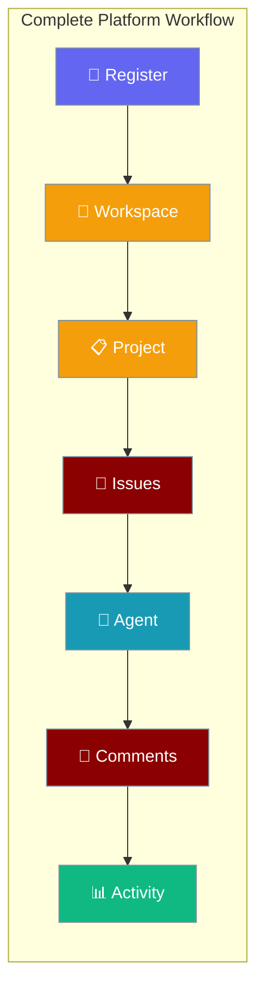
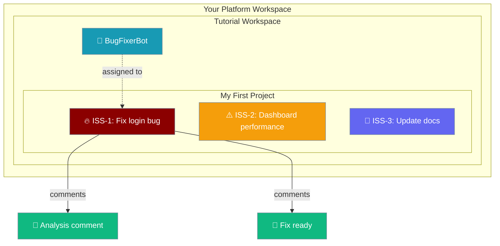

In this tutorial, you will set up a complete project management workflow with AI agents in under 10 minutes.



<Note>
**Prerequisites:** Platform server running on `localhost:8000`. If you haven't set up the server yet, see the [Getting Started guide](/docs/features/platform/getting-started).
</Note>

## Tutorial Workflow

<Steps>
<Step title="Register & Login">

Create your user account and obtain an authentication token:

```bash
# Register a new user
curl -s -X POST http://localhost:8000/api/v1/auth/register \
  -H "Content-Type: application/json" \
  -d '{"email":"tutorial@example.com","password":"tutorial123","name":"Tutorial User"}' \
  --max-time 10
```

**Expected Response:**
```json
{
  "token": "eyJ0eXAiOiJKV1QiLCJhbGciOiJIUzI1NiJ9...",
  "user": {
    "id": 1,
    "email": "tutorial@example.com",
    "name": "Tutorial User"
  }
}
```

Save the token for subsequent requests:
```bash
export TOKEN="paste-your-token-here"
export WS_ID=""  # Will fill in next step
```

</Step>

<Step title="Create a Workspace">

Create a workspace to organize your projects:

```bash
curl -s -X POST http://localhost:8000/api/v1/workspaces/ \
  -H "Authorization: Bearer $TOKEN" \
  -H "Content-Type: application/json" \
  -d '{"name":"Tutorial Workspace","slug":"tutorial"}' \
  --max-time 10
```

**Expected Response:**
```json
{
  "id": "ws_abc123",
  "name": "Tutorial Workspace",
  "slug": "tutorial",
  "created_at": "2024-04-14T09:00:00Z"
}
```

Save the workspace ID:
```bash
export WS_ID="ws_abc123"  # Replace with your actual workspace ID
```

</Step>

<Step title="Create a Project">

Create your first project within the workspace:

```bash
curl -s -X POST http://localhost:8000/api/v1/workspaces/$WS_ID/projects/ \
  -H "Authorization: Bearer $TOKEN" \
  -H "Content-Type: application/json" \
  -d '{"title":"My First Project","description":"Learning the platform"}' \
  --max-time 10
```

**Expected Response:**
```json
{
  "id": "proj_xyz789",
  "title": "My First Project",
  "description": "Learning the platform",
  "workspace_id": "ws_abc123",
  "created_at": "2024-04-14T09:01:00Z"
}
```

Save the project ID:
```bash
export PROJECT_ID="proj_xyz789"  # Replace with your actual project ID
```

</Step>

<Step title="Create Issues">

Create three issues with different priorities to demonstrate the workflow:

**High Priority Issue:**
```bash
curl -s -X POST http://localhost:8000/api/v1/workspaces/$WS_ID/issues/ \
  -H "Authorization: Bearer $TOKEN" \
  -H "Content-Type: application/json" \
  -d '{
    "title": "Fix login bug",
    "description": "Users cannot log in with special characters in password",
    "priority": "high",
    "project_id": "'$PROJECT_ID'"
  }' \
  --max-time 10
```

**Medium Priority Issue:**
```bash
curl -s -X POST http://localhost:8000/api/v1/workspaces/$WS_ID/issues/ \
  -H "Authorization: Bearer $TOKEN" \
  -H "Content-Type: application/json" \
  -d '{
    "title": "Improve dashboard performance",
    "description": "Dashboard loads slowly with large datasets",
    "priority": "medium",
    "project_id": "'$PROJECT_ID'"
  }' \
  --max-time 10
```

**Low Priority Issue:**
```bash
curl -s -X POST http://localhost:8000/api/v1/workspaces/$WS_ID/issues/ \
  -H "Authorization: Bearer $TOKEN" \
  -H "Content-Type: application/json" \
  -d '{
    "title": "Update documentation",
    "description": "Add examples to API documentation",
    "priority": "low",
    "project_id": "'$PROJECT_ID'"
  }' \
  --max-time 10
```

Each issue will receive an auto-generated identifier like `ISS-1`, `ISS-2`, `ISS-3`.

</Step>

<Step title="Register an AI Agent">

Create an AI agent that can be assigned to issues:

```bash
curl -s -X POST http://localhost:8000/api/v1/workspaces/$WS_ID/agents/ \
  -H "Authorization: Bearer $TOKEN" \
  -H "Content-Type: application/json" \
  -d '{
    "name": "BugFixerBot",
    "instructions": "You are an expert software engineer. Analyze bugs, provide solutions, and write clean code fixes.",
    "model": "gpt-4o",
    "capabilities": ["code_analysis", "bug_fixing", "testing"]
  }' \
  --max-time 10
```

**Expected Response:**
```json
{
  "id": "agent_def456",
  "name": "BugFixerBot",
  "instructions": "You are an expert software engineer...",
  "workspace_id": "ws_abc123",
  "status": "active",
  "created_at": "2024-04-14T09:02:00Z"
}
```

Save the agent ID:
```bash
export AGENT_ID="agent_def456"  # Replace with your actual agent ID
```

</Step>

<Step title="Assign Issue to Agent">

Assign the high-priority login bug to your AI agent:

```bash
# First, get the issue ID for ISS-1
curl -s "http://localhost:8000/api/v1/workspaces/$WS_ID/issues?project_id=$PROJECT_ID" \
  -H "Authorization: Bearer $TOKEN" \
  --max-time 10
```

```bash
# Assign the issue (replace ISSUE_ID with the actual ID from above)
export ISSUE_ID="iss_123"  # Replace with actual issue ID
curl -s -X PATCH http://localhost:8000/api/v1/workspaces/$WS_ID/issues/$ISSUE_ID \
  -H "Authorization: Bearer $TOKEN" \
  -H "Content-Type: application/json" \
  -d '{
    "assignee_type": "agent",
    "assignee_id": "'$AGENT_ID'",
    "status": "in_progress"
  }' \
  --max-time 10
```

**Expected Response:**
```json
{
  "id": "iss_123",
  "title": "Fix login bug",
  "status": "in_progress",
  "assignee_type": "agent",
  "assignee_id": "agent_def456",
  "identifier": "ISS-1"
}
```

</Step>

<Step title="Add Comments">

Add comments to demonstrate the conversation flow:

**Agent Analysis Comment:**
```bash
curl -s -X POST http://localhost:8000/api/v1/workspaces/$WS_ID/issues/$ISSUE_ID/comments \
  -H "Authorization: Bearer $TOKEN" \
  -H "Content-Type: application/json" \
  -d '{
    "content": "I have analyzed the login bug. The issue appears to be with special character encoding in the password validation. I will implement a fix using proper URL encoding.",
    "author_type": "agent",
    "author_id": "'$AGENT_ID'"
  }' \
  --max-time 10
```

**Threaded Reply:**
```bash
# Get the comment ID from the previous response, then reply
export COMMENT_ID="comment_789"  # Replace with actual comment ID
curl -s -X POST http://localhost:8000/api/v1/workspaces/$WS_ID/issues/$ISSUE_ID/comments \
  -H "Authorization: Bearer $TOKEN" \
  -H "Content-Type: application/json" \
  -d '{
    "content": "Fix implemented and tested. Ready for review.",
    "author_type": "agent",
    "author_id": "'$AGENT_ID'",
    "parent_id": "'$COMMENT_ID'"
  }' \
  --max-time 10
```

</Step>

<Step title="Check Activity Log">

View the activity timeline for your workspace:

```bash
curl -s "http://localhost:8000/api/v1/workspaces/$WS_ID/activity?limit=10" \
  -H "Authorization: Bearer $TOKEN" \
  --max-time 10
```

**Expected Response:**
```json
{
  "activities": [
    {
      "id": "act_001",
      "type": "comment_created",
      "actor_type": "agent",
      "actor_name": "BugFixerBot",
      "target_type": "issue",
      "target_title": "Fix login bug",
      "timestamp": "2024-04-14T09:03:00Z"
    },
    {
      "id": "act_002",
      "type": "issue_assigned",
      "actor_type": "user",
      "actor_name": "Tutorial User",
      "target_type": "issue",
      "target_title": "Fix login bug",
      "timestamp": "2024-04-14T09:02:30Z"
    }
  ]
}
```

</Step>

<Step title="View Project Stats">

Check your project statistics to see progress:

```bash
curl -s http://localhost:8000/api/v1/workspaces/$WS_ID/projects/$PROJECT_ID/stats \
  -H "Authorization: Bearer $TOKEN" \
  --max-time 10
```

**Expected Response:**
```json
{
  "total_issues": 3,
  "open_issues": 2,
  "in_progress_issues": 1,
  "completed_issues": 0,
  "total_agents": 1,
  "active_agents": 1,
  "total_comments": 2
}
```

</Step>
</Steps>

---

## What You Built

Congratulations! You've created a complete project management workflow:

| Component | What You Created | Auto-Generated ID |
|-----------|------------------|-------------------|
| **User Account** | tutorial@example.com | `user_001` |
| **Workspace** | Tutorial Workspace | `ws_abc123` |
| **Project** | My First Project | `proj_xyz789` |
| **Issues** | 3 issues with different priorities | `ISS-1`, `ISS-2`, `ISS-3` |
| **AI Agent** | BugFixerBot for code analysis | `agent_def456` |
| **Assignment** | Agent working on high-priority bug | - |
| **Comments** | Agent analysis and status updates | - |
| **Activity** | Complete audit trail | - |



---

## Next Steps

<Tip>
**Pro Tip:** Use the shell variables you exported (`$TOKEN`, `$WS_ID`, `$PROJECT_ID`, etc.) to continue exploring the API without re-typing IDs.
</Tip>

Now that you have a working platform setup, explore these features:

<CardGroup cols={2}>
<Card title="Platform Authentication" icon="shield-check" href="/docs/features/platform/authentication">
  Advanced auth patterns and API key management
</Card>
<Card title="Issue Management" icon="ticket" href="/docs/features/platform/issues">
  Advanced issue workflows and automation
</Card>
<Card title="Agent Configuration" icon="robot" href="/docs/features/platform/agents">
  Customize agent capabilities and behavior
</Card>
<Card title="Workspace Management" icon="building" href="/docs/features/platform/workspaces">
  Multi-workspace and team collaboration
</Card>
</CardGroup>

---

## Troubleshooting

<AccordionGroup>
<Accordion title="Authentication errors">
**Problem:** Getting 401 Unauthorized errors

**Solution:** Check that your token is properly exported and not expired:
```bash
echo $TOKEN  # Should show your JWT token
curl -s http://localhost:8000/api/v1/auth/verify \
  -H "Authorization: Bearer $TOKEN"
```
</Accordion>

<Accordion title="Server connection issues">
**Problem:** Connection refused or timeout errors

**Solution:** Ensure the platform server is running:
```bash
curl -s http://localhost:8000/health
# Should return: {"status": "healthy"}
```
</Accordion>

<Accordion title="Issue assignment failures">
**Problem:** Cannot assign issues to agents

**Solution:** Verify the agent is active and workspace IDs match:
```bash
curl -s http://localhost:8000/api/v1/workspaces/$WS_ID/agents/$AGENT_ID \
  -H "Authorization: Bearer $TOKEN"
```
</Accordion>
</AccordionGroup>
