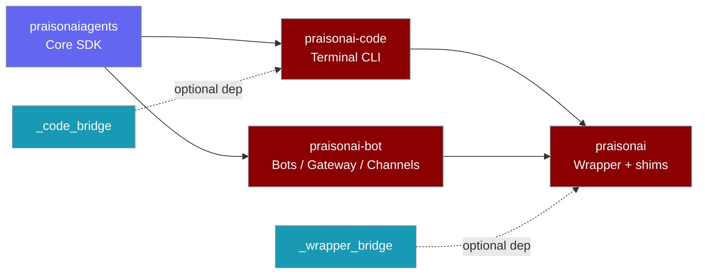
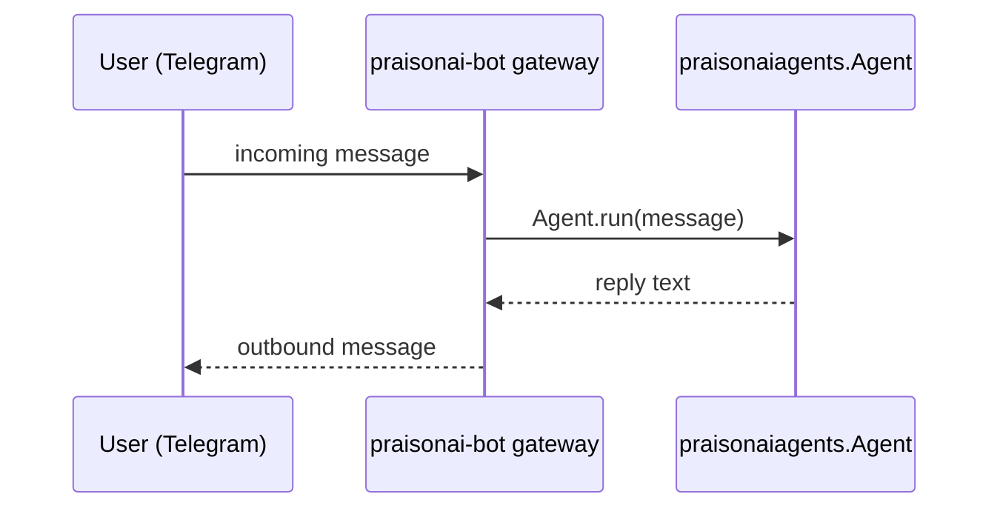
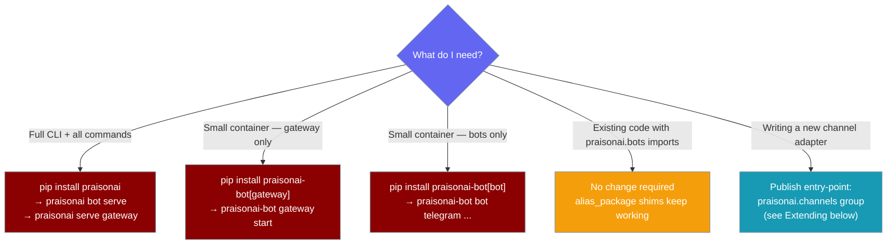

`praisonai-bot` is a new sibling PyPI package holding the bots, gateway, and channel CLI — extracted from the `praisonai` wrapper — and every existing import still works via `alias_package` shims.

```python
from praisonaiagents import Agent

agent = Agent(
    name="Support",
    instructions="Answer support questions from users on Telegram, Slack, and Discord.",
    llm="gpt-4o-mini",
)
agent.start("Hello — reply if you see this.")
```

A gateway process running `praisonai-bot gateway start` routes each Telegram/Slack/Discord message to this agent and posts the reply back.



## Quick Start

<Steps>
<Step title="Nothing changes if you install the wrapper">

`pip install praisonai` pulls in `praisonai-bot` transitively. Every existing command still works:

```bash
pip install praisonai
praisonai bot serve --config bot.yaml
praisonai serve gateway --config gateway.yaml
```

</Step>

<Step title="Standalone install for headless workers or containers">

Install only what your container needs:

```bash
pip install praisonai-bot[gateway,bot]
praisonai-bot gateway start --config gateway.yaml
praisonai-bot bot start --config bot.yaml
```

</Step>

<Step title="Agent-centric example — route messages from any channel">

```python
from praisonaiagents import Agent

agent = Agent(
    name="Support",
    instructions="Answer support questions from users on Telegram, Slack, and Discord.",
    llm="gpt-4o-mini",
)
agent.start("Hello — reply if you see this.")
```

Run the gateway alongside it:

```bash
praisonai-bot gateway start --agents agents.yaml
```

Messages arrive from any configured channel, the agent replies, and the gateway posts the response back.

</Step>
</Steps>

---

## How It Works



The gateway is the only process that holds channel credentials. Agents never talk directly to Telegram, Slack, or Discord — they receive plain text and return plain text. The gateway handles platform-specific formatting, rate-limiting, and delivery guarantees.

---

## Which install shape is right for me?



---

## Compatibility Guarantees

Every existing import path continues to resolve. No code changes required.

| Old path (still works) | Resolves to |
|---|---|
| `from praisonai.bots import Bot` | `praisonai_bot.bots.Bot` |
| `from praisonai.bots.telegram import TelegramBot` | `praisonai_bot.bots.telegram.TelegramBot` |
| `from praisonai.gateway import GatewayConfig` | `praisonai_bot.gateway.GatewayConfig` |
| `from praisonai.gateway.server import GatewayServer` | `praisonai_bot.gateway.server.GatewayServer` |
| `from praisonai.daemon import ...` | `praisonai_bot.daemon.*` |
| CLI command modules (bot / gateway / channels) | `praisonai_bot.cli.commands.*` |

- `pip install praisonai` remains the canonical user-facing install.
- `praisonai.bots.*`, `praisonai.gateway.*`, `praisonai.daemon.*` are stable API — they are `alias_package` shims backed by `praisonai_bot.*`.
- `praisonai-bot` has **no** hard PyPI dependency on `praisonai` — no import cycle.
- Any access that `praisonai-bot` needs into the wrapper goes through `_wrapper_bridge` at call time, degrading gracefully when the wrapper is absent.

---

## New CLI: `praisonai-bot`

The `praisonai-bot` binary is separate from the `praisonai` binary. It exposes:

```
praisonai-bot
├── bot         Start messaging bots with full agent capabilities
│   ├── start       Start a bot from a YAML config file (zero-code)
│   ├── telegram    Start a Telegram bot
│   ├── discord     Start a Discord bot
│   ├── slack       Start a Slack bot
│   └── ...
├── gateway     Manage the PraisonAI gateway server
│   ├── start       Start the gateway server
│   ├── stop        Stop a running gateway instance
│   └── status      Check gateway and daemon status
├── pairing     Manage bot pairing
├── identity    Manage bot identity
├── onboard     Onboard a new bot
├── kanban      Kanban integration
├── claw        Channel-agnostic bot operations
└── mint_link   Mint magic links
```

Examples:

```bash
praisonai-bot gateway start --config gateway.yaml
praisonai-bot gateway start --agents agents.yaml --port 9000
praisonai-bot gateway stop
praisonai-bot gateway status

praisonai-bot bot start --config bot.yaml
praisonai-bot bot telegram --token $TELEGRAM_BOT_TOKEN --model gpt-4o-mini
praisonai-bot bot slack --token $SLACK_BOT_TOKEN --memory
```

<Note>
The existing `praisonai serve gateway` and `praisonai bot serve` wrapper commands still work and are the recommended entry point for users who installed via `pip install praisonai`.
</Note>

---

## Extending: Register a New Channel

`praisonai-bot` discovers channel adapters via the `praisonai.channels` entry-point group at startup. No changes to `praisonai-bot` itself are needed.

To publish a third-party channel adapter, add an entry-point in your package's `pyproject.toml`:

```toml
[project.entry-points."praisonai.channels"]
mattermost = "my_pkg.mattermost:MattermostBot"
```

The gateway/bot loader calls `entry_points(group="praisonai.channels")` on startup and registers every discovered adapter automatically.

---

## Built-in Channels

| Entry-point key | Class |
|---|---|
| `telegram` | `praisonai_bot.bots.telegram:TelegramBot` |
| `discord` | `praisonai_bot.bots.discord:DiscordBot` |
| `slack` | `praisonai_bot.bots.slack:SlackBot` |
| `whatsapp` | `praisonai_bot.bots.whatsapp:WhatsAppBot` |
| `linear` | `praisonai_bot.bots.linear:LinearBot` |
| `email` | `praisonai_bot.bots.email:EmailBot` |
| `agentmail` | `praisonai_bot.bots.agentmail:AgentMailBot` |

---

## Best Practices

<AccordionGroup>
<Accordion title="Keep using praisonai.bots / praisonai.gateway in library code">

Application and library code should continue to import from `praisonai.bots`, `praisonai.gateway`, and `praisonai.daemon`. These paths are the stable public API backed by `alias_package` shims. `praisonai_bot.*` is an alternative available path, not a replacement — the shim layer allows the physical package layout to evolve without breaking callers.

</Accordion>

<Accordion title="Use praisonai-bot extras for headless workers">

For containers or workers that don't need the full `praisonai` wrapper, install only the extras you need:

- `pip install praisonai-bot[gateway]` — WebSocket gateway only (~200 MB fewer transitive deps than the full wrapper).
- `pip install praisonai-bot[bot]` — messaging platform adapters only.
- `pip install praisonai-bot[gateway,bot]` — full inbound-and-outbound flow.
- `pip install praisonai-bot[all]` — shortcut for `[gateway,bot]`.

</Accordion>

<Accordion title="Extras are additive — install only what you need">

`[gateway]` pulls in FastAPI, uvicorn, SSE-starlette, websockets, watchdog, and redis. `[bot]` pulls in python-telegram-bot, discord.py, slack_sdk, slack-bolt, and psutil. Installing both is safe and additive. `[bot-whatsapp-web]` adds neonize and qrcode for WhatsApp Web support.

</Accordion>

<Accordion title="Alias shims are load-bearing — do not remove them as cleanup">

`praisonai.bots`, `praisonai.gateway`, and `praisonai.daemon` are `alias_package` shims in the wrapper. Removing or rewriting imports away from these paths in your own code is not a "cleanup" — they are the stable API. `praisonai_bot.*` is a new alternative surface for users who want the standalone install shape.

</Accordion>
</AccordionGroup>

---

## Related

<CardGroup cols={2}>
<Card title="praisonai-code Migration" icon="package" href="/docs/guides/praisonai-code-migration">
  The C0–C6 sibling extraction that moved the agentic terminal CLI into its own package
</Card>
<Card title="Python Wrapper" icon="box" href="/docs/developers/wrapper">
  The praisonai wrapper — four-tier architecture reference for contributors
</Card>
<Card title="Gateway" icon="gateway" href="/docs/gateway">
  Gateway and control plane — WebSocket server, config, and deployment
</Card>
<Card title="Messaging Bots" icon="robot" href="/docs/features/messaging-bots">
  Bot platform documentation — Telegram, Discord, Slack, WhatsApp, and more
</Card>
</CardGroup>
