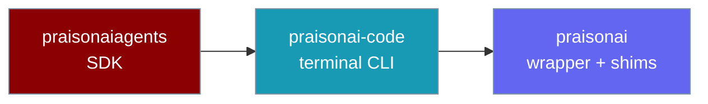
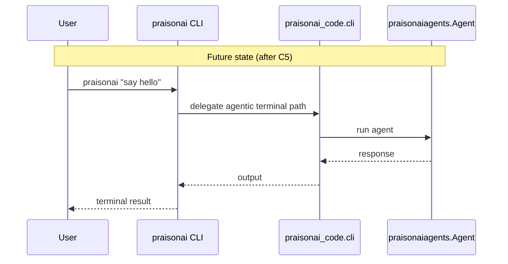
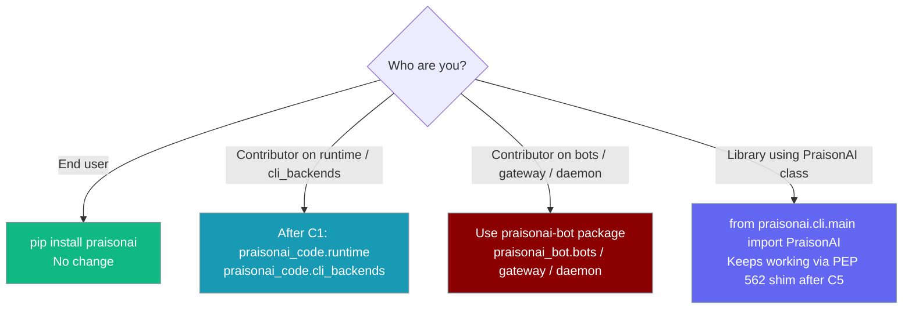

`praisonai-code` is a new sibling package that will host the agentic terminal CLI, extracted incrementally from the `praisonai` wrapper without breaking any existing install or import path.

```python
from praisonaiagents import Agent

agent = Agent(
    name="CLI Assistant",
    instructions="Answer prompts from the terminal CLI.",
)

agent.start("Say hello from praisonai run")
```

The user keeps using `pip install praisonai`; the extracted `praisonai-code` package powers the same CLI entry points.



## Quick Start

<Steps>
<Step title="Nothing changes for users">

```bash
pip install praisonai
praisonai "say hello"
```

</Step>

<Step title="Optional: install praisonai-code for development">

From the [PraisonAI](https://github.com/MervinPraison/PraisonAI) monorepo root:

```bash
pip install -e src/praisonai-code
python -c "import praisonai_code; print(praisonai_code.__version__)"
```

</Step>
</Steps>

---

## How It Works

Dependency flow is one-way: **`praisonai` → `praisonai-code` → `praisonaiagents`**. The `praisonai-code` package never declares a dependency on `praisonai`, which avoids a PyPI cycle. Bot, gateway, and daemon code moved to `praisonai-bot` in C9.



| Layer | Package | Role |
|-------|---------|------|
| SDK | `praisonaiagents` | Agents, tools, memory, workflows |
| Terminal CLI | `praisonai-code` | `run`, `chat`, `code`, warm runtime, CLI backends |
| User install | `praisonai` | `pip install praisonai`, PEP 562 shims (bots/gateway/daemon moved to `praisonai-bot` in C9) |

---

## Where should I work?



---

## Roadmap

| Step | Scope | Files | Status |
|------|-------|------:|--------|
| **C0** | Scaffold (this PR) | 5 | ✅ [PR #2539](https://github.com/MervinPraison/PraisonAI/pull/2539) |
| C1 | `runtime/` + `cli_backends/` | 8 | ⏳ |
| C2 | `interactive/`, `execution/`, `ui/`, `output/`, `state/` | 30 | ⏳ |
| C3 | 80 agentic commands (9 bot-channel commands stay in main) | 80 | ⏳ |
| C4 | 158 agentic features (5 bot-channel features stay in main) | 158 | ⏳ |
| C5 | `main.py`, `app.py`, config/session/utils + PEP 562 shims | 26 | ⏳ |
| C6 | Integration gate (smoke tests, import graph assertions, real agentic run) | — | ⏳ |

Tracking issue: [PraisonAI#2512](https://github.com/MervinPraison/PraisonAI/issues/2512).

---

## Compatibility guarantees

- **`pip install praisonai` remains the only user-facing install.** `praisonai-code` is not published to PyPI standalone during migration.
- **Existing import paths keep working** — PEP 562 shims at old `praisonai.*` paths land as code moves in C1–C5. `from praisonai.cli.main import PraisonAI` continues unchanged (154+ tests depend on it).
- **Console entry unchanged** — `praisonai = "praisonai.__main__:main"`.
- **One-way dependencies** — `praisonai` → `praisonai-code` → `praisonaiagents`; `praisonai-code` never depends on `praisonai`.
- **Scope split** — `praisonai-code` covers only the agentic terminal product; `bots/`, `gateway/`, and `daemon/` moved to `praisonai-bot` in C9 (see [praisonai-bot Migration](/docs/guides/praisonai-bot-migration)).

---

## Best Practices

<AccordionGroup>
<Accordion title="Do not import praisonai_code in library code (during migration)">

Application and library code should keep using `import praisonai` and `from praisonaiagents import Agent`. Direct `praisonai_code` imports are for contributors working inside the monorepo until the public surface is explicitly documented after C5.

</Accordion>

<Accordion title="Bot-channel modules moved to praisonai-bot (C9)">

As of C9, the following CLI commands and features live in `praisonai-bot`, not `praisonai-code`: `gateway`, `bot`, `onboard`, `pairing`, `identity`, `kanban`, `mint_link`, `claw`. The `praisonai.bots`, `praisonai.gateway`, and `praisonai.daemon` paths remain as `alias_package` shims. See [praisonai-bot Migration](/docs/guides/praisonai-bot-migration).

</Accordion>

<Accordion title="New agentic CLI features go into praisonai_code.cli.* (after C5)">

Once C5 lands the layout, new terminal-agent commands and features belong under `praisonai_code.cli.*`, with shims left at the old `praisonai.cli.*` paths for compatibility.

</Accordion>

<Accordion title="PEP 562 shims are load-bearing">

Removing shims would break 154+ tests and every `from praisonai.cli.main import PraisonAI` importer. Shim removal is tracked as a **5.0.0**-track breaking change on [issue #2512](https://github.com/MervinPraison/PraisonAI/issues/2512).

</Accordion>
</AccordionGroup>

---

## Related

<CardGroup cols={2}>
<Card title="Python wrapper" icon="box" href="/docs/developers/wrapper">
  Public `praisonai.run`, `PraisonAI`, and `praisonai.arun` surface
</Card>
<Card title="Development setup" icon="wrench" href="/docs/developers/development-setup">
  Clone the monorepo and install editable packages with uv
</Card>
<Card title="praisonai-bot Migration" icon="package" href="/docs/guides/praisonai-bot-migration">
  The sibling extraction that moves bots/gateway/daemon out of the wrapper
</Card>
</CardGroup>
