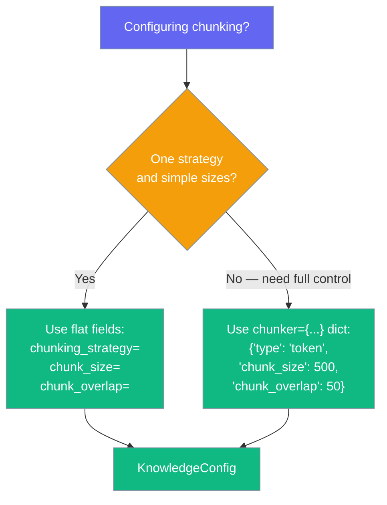

Optimise how documents are split into chunks for better retrieval quality.

```python
from praisonaiagents import Agent, KnowledgeConfig

agent = Agent(
    name="Researcher",
    instructions="Answer using retrieved document chunks.",
    knowledge=KnowledgeConfig(
        sources=["docs/"],
        chunking_strategy="recursive",   # default
        chunk_size=512,                   # default
        chunk_overlap=50,                 # default
    ),
)

agent.start("What does our deployment guide say about Docker?")
```

The user uploads documents; they are chunked and embedded, and the agent retrieves the best slices for each question.


## Two ways to configure chunking

Set the three flat fields, or pass a single `chunker={...}` dict — the dict wins when both are set.



<Tabs>
<Tab title="Flat fields">

```python
from praisonaiagents import Agent, KnowledgeConfig

agent = Agent(
    instructions="Answer from the docs.",
    knowledge=KnowledgeConfig(
        sources=["docs/"],
        chunking_strategy="recursive",
        chunk_size=512,
        chunk_overlap=50,
    ),
)
```

</Tab>
<Tab title="chunker= dict">

```python
from praisonaiagents import Agent, KnowledgeConfig

agent = Agent(
    instructions="Answer from the docs.",
    knowledge=KnowledgeConfig(
        sources=["docs/"],
        chunker={"type": "token", "chunk_size": 500, "chunk_overlap": 50},
    ),
)
```

</Tab>
</Tabs>

## Strategies

`recursive` is the default. Set `chunking_strategy=` to any name below.

| Strategy | Notes |
|---|---|
| `recursive` | **Default.** General-purpose text splitting; keeps paragraph boundaries when possible. |
| `token` | Fixed token-count chunks. `"fixed"` is a backward-compat alias. |
| `semantic` | Embeds each chunk to find semantic boundaries. Costs one embedding call per chunk. |
| `sentence` | Splits on sentence boundaries. |
| `paragraph` | Alias for `recursive`. |
| `sdpm`, `late`, `code`, `neural`, `slumber` | Additional chunkers exposed by the underlying `Chunking` class — see the [SDK reference](/sdk/praisonaiagents/knowledge/chunking) for details. |

<Note>
Passing an unknown strategy (e.g. `"wordwise"`) now raises a `ValueError` listing valid presets, instead of silently falling back to `recursive`.
</Note>

<Note>
`"fixed"` and `"paragraph"` remain valid names — they now map onto `token` and `recursive` respectively. Existing code that used them keeps working.
</Note>

## Best Practices

<AccordionGroup>
<Accordion title="Match chunk size to content">
Technical docs: 500–800 tokens with 50–100 overlap (semantic). FAQs: 200–400 with 20–50 overlap (fixed).
</Accordion>
<Accordion title="Long articles">
Use 800–1200 token chunks with 100–200 overlap and semantic splitting for narrative content.
</Accordion>
<Accordion title="Code and mixed media">
Keep code chunks around 300–500 tokens with ~50 overlap; prefer fixed splitting for source files.
</Accordion>
</AccordionGroup>

## Related

<CardGroup cols={2}>
  <Card title="Knowledge Base" icon="book" href="/guides/rag/knowledge-base">
    Build a knowledge base
  </Card>
  <Card title="Knowledge Module" icon="code" href="/sdk/praisonaiagents/knowledge/knowledge">
    Full API reference
  </Card>
</CardGroup>
