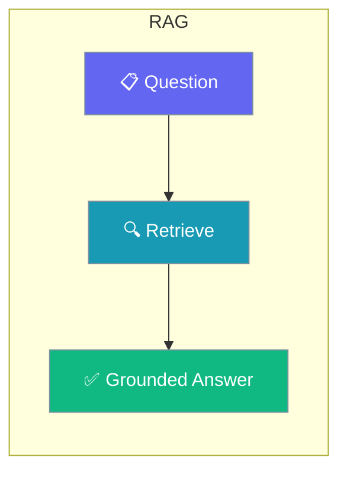
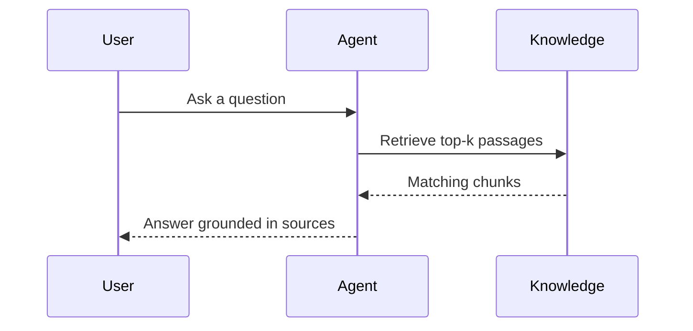

Learn how to enhance your agents with knowledge bases and retrieval-augmented generation (RAG).

```python
from praisonaiagents import Agent, KnowledgeConfig

agent = Agent(
    name="Knowledge Assistant",
    instructions="Answer from the knowledge base.",
    knowledge=KnowledgeConfig(sources=["./docs"]),
)

agent.start("Find the section about session persistence.")
```

The user attaches a knowledge source, asks a question, and the agent grounds its reply in retrieved passages.



## Quick Start

<Steps>
<Step title="Simple Usage">

Point the agent at a folder of documents and it answers from them.

```python
from praisonaiagents import Agent, KnowledgeConfig

agent = Agent(
    name="Knowledge Assistant",
    instructions="Answer from the knowledge base.",
    knowledge=KnowledgeConfig(sources=["./docs"]),
)
agent.start("Find the section about session persistence.")
```

</Step>

<Step title="With Configuration">

Tune how many passages come back and how similar they must be.

```python
from praisonaiagents import Agent, KnowledgeConfig

agent = Agent(
    name="Knowledge Assistant",
    instructions="Cite retrieved passages.",
    knowledge=KnowledgeConfig(sources=["./docs"], top_k=5, similarity_threshold=0.7),
)
agent.start("Summarise the security section.")
```

</Step>
</Steps>

---

## How It Works



---

## Guides

<CardGroup cols={2}>
  <Card title="Knowledge Base Setup" icon="database" href="/docs/guides/rag/knowledge-base">
    Create and configure knowledge bases
  </Card>
  <Card title="Chunking Strategies" icon="scissors" href="/docs/guides/rag/chunking">
    Optimize document chunking
  </Card>
  <Card title="Retrieval Methods" icon="magnifying-glass" href="/docs/guides/rag/retrieval">
    Configure retrieval strategies
  </Card>
</CardGroup>

---

## Best Practices

<AccordionGroup>
<Accordion title="Start with a folder of clean sources">
`KnowledgeConfig(sources=["./docs"])` indexes a directory directly. Remove boilerplate and duplicates first so retrieval returns signal, not noise.
</Accordion>

<Accordion title="Raise the similarity threshold to cut noise">
A higher `similarity_threshold` filters weak matches. Start at `0.7` and adjust based on whether answers miss context or cite irrelevant passages.
</Accordion>

<Accordion title="Keep top_k small for focused answers">
Fewer, stronger passages usually beat many weak ones. Increase `top_k` only when answers lack coverage.
</Accordion>
</AccordionGroup>
