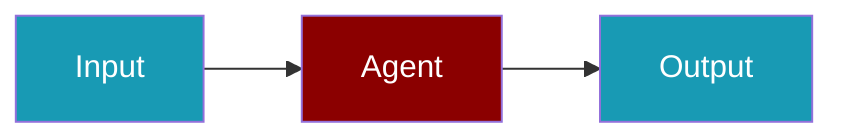

# RAG & Knowledge

Learn how to enhance your agents with knowledge bases and retrieval-augmented generation (RAG).

<CardGroup cols={2}>
  <Card title="Knowledge Base Setup" icon="database" href="/docs/guides/rag/knowledge-base">
    Create and configure knowledge bases
  </Card>
  <Card title="Chunking Strategies" icon="scissors" href="/docs/guides/rag/chunking">
    Optimize document chunking
  </Card>
  <Card title="Retrieval Methods" icon="magnifying-glass" href="/docs/guides/rag/retrieval">
    Configure retrieval strategies
  </Card>
</CardGroup>
