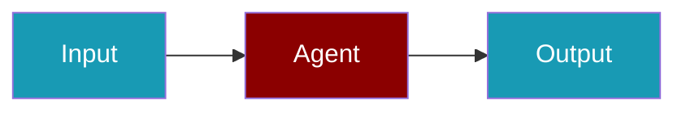

# Knowledge Base Setup




Add domain-specific knowledge to your agents using knowledge bases.

## Quick Start

<Steps>
<Step title="Simple Usage">
```python
from praisonaiagents import Agent, Knowledge

# Create knowledge base from files
knowledge = Knowledge(
    sources=["docs/", "data.pdf", "faq.txt"]
)

# Create agent with knowledge
agent = Agent(
    name="Support Agent",
    instructions="Answer questions using the knowledge base.",
    knowledge=knowledge
)

result = agent.start("What is your refund policy?")
```
</Step>

<Step title="With Configuration">
```python
from praisonaiagents import Agent, Knowledge

knowledge = Knowledge(
    sources=["docs/"],
    chunk_size=500,
    chunk_overlap=50,
)

agent = Agent(
    name="Support Agent",
    instructions="Answer using the knowledge base.",
    knowledge=knowledge,
)
agent.start("Summarise the onboarding guide.")
```
</Step>
</Steps>
## Knowledge Sources

### From Files

```python
knowledge = Knowledge(
    sources=[
        "documents/",      # Directory
        "manual.pdf",      # PDF
        "faq.md",          # Markdown
        "data.csv"         # CSV
    ]
)
```

### From URLs

```python
knowledge = Knowledge(
    sources=[
        "https://docs.example.com/api",
        "https://example.com/faq"
    ]
)
```

### From Text

```python
knowledge = Knowledge(
    sources=[],
    texts=[
        "Company policy: All refunds within 30 days.",
        "Support hours: 9 AM - 5 PM EST"
    ]
)
```

## Configuration

```python
knowledge = Knowledge(
    sources=["docs/"],
    chunk_size=500,           # Characters per chunk
    chunk_overlap=50,         # Overlap between chunks
    embedding_model="text-embedding-3-small",
    vector_store="chroma",    # or "faiss", "qdrant"
    top_k=5                   # Results to retrieve
)
```

## Related

<CardGroup cols={2}>
  <Card title="Chunking Strategies" icon="scissors" href="/docs/guides/rag/chunking">
    Optimise chunking
  </Card>
  <Card title="Knowledge Module" icon="code" href="/docs/sdk/praisonaiagents/knowledge/knowledge">
    Full API reference
  </Card>
</CardGroup>
