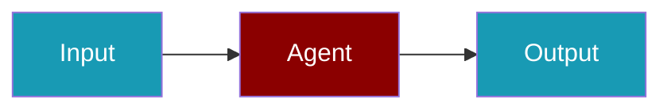

Tune top-k, similarity thresholds, and reranking so retrieval quality matches your use case.

```python
from praisonaiagents import Agent, KnowledgeConfig

agent = Agent(
    name="Researcher",
    instructions="Cite retrieved passages in every answer.",
    knowledge=KnowledgeConfig(sources=["docs/"], top_k=5, similarity_threshold=0.7),
)
agent.start("Summarise the security section of our handbook.")
```

The user submits a query; the agent pulls the best-matching passages before composing a reply.


Configure how your agents retrieve information from knowledge bases.

## Basic Retrieval

```python
from praisonaiagents import Knowledge

knowledge = Knowledge(
    sources=["docs/"],
    top_k=5,                    # Number of results
    similarity_threshold=0.7    # Minimum similarity
)
```

## Retrieval Strategies

### Similarity Search

```python
knowledge = Knowledge(
    sources=["docs/"],
    retrieval_strategy="similarity",
    top_k=5
)
```

### MMR (Maximal Marginal Relevance)

```python
knowledge = Knowledge(
    sources=["docs/"],
    retrieval_strategy="mmr",
    top_k=5,
    diversity=0.3  # Balance relevance vs diversity
)
```

### Hybrid Search

```python
knowledge = Knowledge(
    sources=["docs/"],
    retrieval_strategy="hybrid",
    keyword_weight=0.3,
    semantic_weight=0.7
)
```

## Query Enhancement

Use QueryRewriterAgent for better retrieval:

```python
from praisonaiagents import Agent, Knowledge, QueryRewriterAgent

# Rewrite queries for better retrieval
rewriter = QueryRewriterAgent()

knowledge = Knowledge(sources=["docs/"])

agent = Agent(
    name="Assistant",
    knowledge=knowledge,
    query_rewriter=rewriter
)
```

## Related

<CardGroup cols={2}>
  <Card title="Knowledge Module" icon="code" href="/docs/sdk/praisonaiagents/knowledge/knowledge">
    Full API reference
  </Card>
  <Card title="QueryRewriterAgent" icon="wand-magic-sparkles" href="/docs/sdk/praisonaiagents/agent/query_rewriter_agent">
    Query optimisation
  </Card>
</CardGroup>