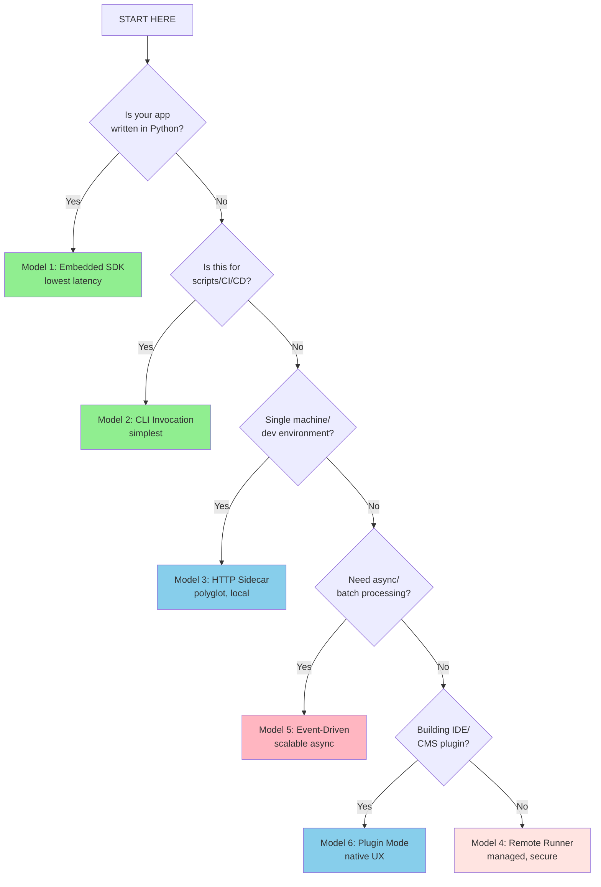

# Decision Guide

This guide helps you choose the right integration model for your use case.

## Quick Decision Tree



## Comparison Matrix

| Criteria | Model 1 | Model 2 | Model 3 | Model 4 | Model 5 | Model 6 |
|----------|---------|---------|---------|---------|---------|---------|
| **Latency** | Lowest | Low | Medium | Medium | Variable | Low |
| **Language** | Python | Any | Any | Any | Any | Platform |
| **Complexity** | Low | Low | Medium | High | High | Medium |
| **Multi-tenant** | ❌ | ❌ | ❌ | ✅ | ✅ | ❌ |
| **Async** | ❌ | ❌ | ❌ | ❌ | ✅ | ❌ |
| **Auth built-in** | ❌ | ❌ | ✅ | ✅ | ✅ | ❌ |
| **Streaming** | ✅ | ✅ | ✅ | ✅ | ❌ | ✅ |

## By Use Case

| Use Case | Primary Model | Alternative |
|----------|---------------|-------------|
| SaaS support replies | Model 3/4 | Model 1 |
| Meeting notes | Model 2/5 | Model 1 |
| SQL assistant | Model 1 | Model 3 |
| Code review | Model 6/2 | Model 3 |
| Marketing content | Model 3 | Model 5 |
| Customer onboarding | Model 4 | Model 3 |
| Fraud detection | Model 5 | Model 4 |
| Document Q&A | Model 1/3 | Model 4 |
| Sales coaching | Model 5 | Model 2 |
| Data migration | Model 2 | Model 1 |
| Multi-agent router | Model 1/3 | Model 4 |
| Localization | Model 5/2 | Model 3 |

## By Environment

### Development
- **Recommended**: Model 1 (SDK) or Model 2 (CLI)
- **Why**: Fast iteration, easy debugging

### Staging
- **Recommended**: Model 3 (HTTP Sidecar)
- **Why**: Mimics production, tests HTTP integration

### Production
- **Recommended**: Model 4 (Remote Runner) or Model 5 (Event-Driven)
- **Why**: Scalable, secure, monitored

## Configuration Consolidation

### Using agents.yaml for All Config

You can consolidate serve configuration into your existing `agents.yaml` file instead of maintaining a separate `serve.yaml`:

```yaml
# agents.yaml - unified configuration
framework: praisonai
topic: My Application

# Agent definitions
roles:
  assistant:
    role: AI Assistant
    goal: Help users
    tasks:
      respond:
        description: Respond to {query}

# Server configuration (optional section)
serve:
  host: 127.0.0.1
  port: 8765
  auth: api-key
  preload: true
  recipes:
    - my-recipe
    - another-recipe
```

Then start the server:
```bash
praisonai serve recipe --config agents.yaml
```

This approach:
- ✅ Single configuration file
- ✅ Agent definitions + server config together
- ✅ Easier to manage
- ✅ Version control friendly

## Next Steps

- Review detailed [Integration Models](/docs/guides/recipes/integration-models)
- Explore [Use Cases](/docs/guides/recipes/use-cases) for patterns
- Check [Personas](/docs/guides/recipes/personas) for role guidance
