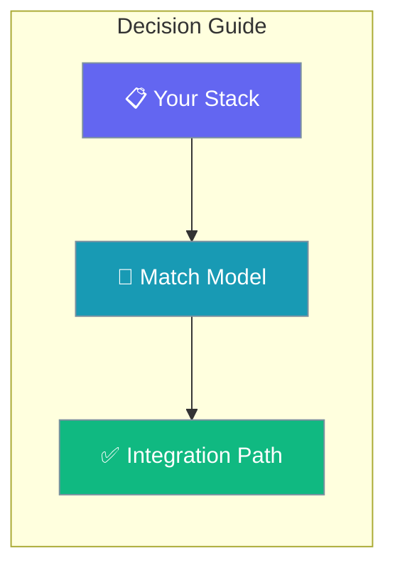
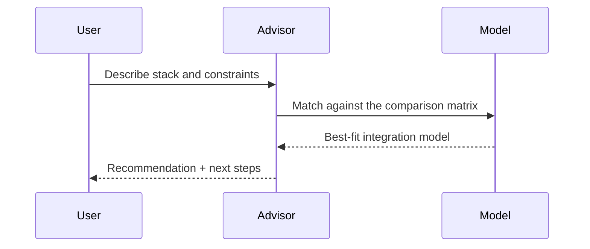
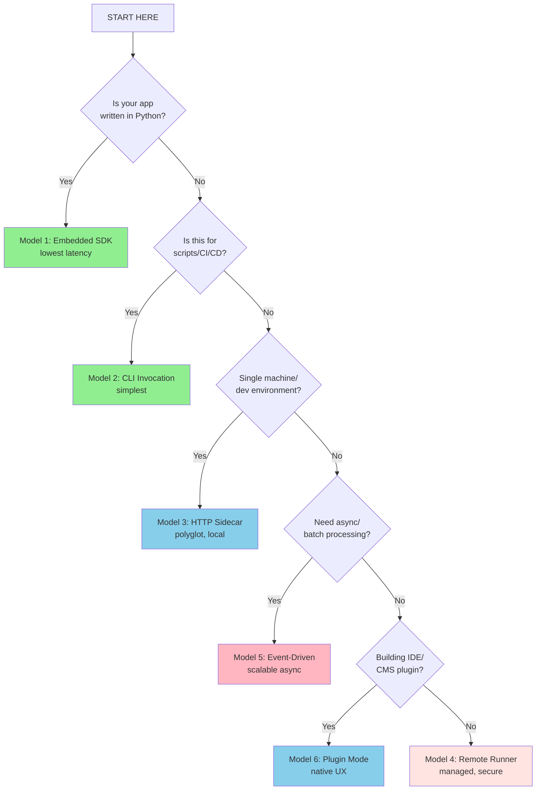

Pick the integration model that fits your stack, latency budget, and operational constraints.

```python
from praisonaiagents import Agent

agent = Agent(
    name="Integration Advisor",
    instructions="Recommend a PraisonAI recipe integration model for the described app.",
)
agent.start("We need recipes from a Node.js microservice on one machine.")
```

The user describes their environment; you map it to the right recipe integration pattern below.


```mermaid
graph LR
    subgraph "Decision Guide"
        U[📋 Your Stack] --> A[🧭 Match Model]
        A --> O[✅ Integration Path]
    end

    classDef input fill:#6366F1,stroke:#7C90A0,color:#fff
    classDef process fill:#189AB4,stroke:#7C90A0,color:#fff
    classDef output fill:#10B981,stroke:#7C90A0,color:#fff

    class U input
    class A process
    class O output
```

## Quick Start

<Steps>
<Step title="Simple Usage">

Describe your environment and let the advisor recommend a model.

```python
from praisonaiagents import Agent

agent = Agent(name="Integration Advisor", instructions="Recommend a recipe integration model.")
agent.start("We need recipes from a Node.js microservice on one machine.")
```

</Step>

<Step title="With Configuration">

Once you pick the sidecar model, serve recipes locally.

```bash
praisonai serve recipe --config agents.yaml
```

</Step>
</Steps>

---

## How It Works


```mermaid
sequenceDiagram
    participant User
    participant Advisor
    participant Model

    User->>Advisor: Describe stack and constraints
    Advisor->>Model: Match against the comparison matrix
    Model-->>Advisor: Best-fit integration model
    Advisor-->>User: Recommendation + next steps
```

---

## Quick Decision Tree


```mermaid
flowchart TD
    A[START HERE] --> B{Is your app<br/>written in Python?}
    B -->|Yes| C[Model 1: Embedded SDK<br/>lowest latency]
    B -->|No| D{Is this for<br/>scripts/CI/CD?}
    D -->|Yes| E[Model 2: CLI Invocation<br/>simplest]
    D -->|No| F{Single machine/<br/>dev environment?}
    F -->|Yes| G[Model 3: HTTP Sidecar<br/>polyglot, local]
    F -->|No| H{Need async/<br/>batch processing?}
    H -->|Yes| I[Model 5: Event-Driven<br/>scalable async]
    H -->|No| J{Building IDE/<br/>CMS plugin?}
    J -->|Yes| K[Model 6: Plugin Mode<br/>native UX]
    J -->|No| L[Model 4: Remote Runner<br/>managed, secure]
    
    style C fill:#90EE90
    style E fill:#90EE90
    style G fill:#87CEEB
    style I fill:#FFB6C1
    style K fill:#87CEEB
    style L fill:#FFE4E1
```

## Comparison Matrix

| Criteria | Model 1 | Model 2 | Model 3 | Model 4 | Model 5 | Model 6 |
|----------|---------|---------|---------|---------|---------|---------|
| **Latency** | Lowest | Low | Medium | Medium | Variable | Low |
| **Language** | Python | Any | Any | Any | Any | Platform |
| **Complexity** | Low | Low | Medium | High | High | Medium |
| **Multi-tenant** | ❌ | ❌ | ❌ | ✅ | ✅ | ❌ |
| **Async** | ❌ | ❌ | ❌ | ❌ | ✅ | ❌ |
| **Auth built-in** | ❌ | ❌ | ✅ | ✅ | ✅ | ❌ |
| **Streaming** | ✅ | ✅ | ✅ | ✅ | ❌ | ✅ |

## By Use Case

| Use Case | Primary Model | Alternative |
|----------|---------------|-------------|
| SaaS support replies | Model 3/4 | Model 1 |
| Meeting notes | Model 2/5 | Model 1 |
| SQL assistant | Model 1 | Model 3 |
| Code review | Model 6/2 | Model 3 |
| Marketing content | Model 3 | Model 5 |
| Customer onboarding | Model 4 | Model 3 |
| Fraud detection | Model 5 | Model 4 |
| Document Q&A | Model 1/3 | Model 4 |
| Sales coaching | Model 5 | Model 2 |
| Data migration | Model 2 | Model 1 |
| Multi-agent router | Model 1/3 | Model 4 |
| Localization | Model 5/2 | Model 3 |

## By Environment

### Development
- **Recommended**: Model 1 (SDK) or Model 2 (CLI)
- **Why**: Fast iteration, easy debugging

### Staging
- **Recommended**: Model 3 (HTTP Sidecar)
- **Why**: Mimics production, tests HTTP integration

### Production
- **Recommended**: Model 4 (Remote Runner) or Model 5 (Event-Driven)
- **Why**: Scalable, secure, monitored

## Configuration Consolidation

### Using agents.yaml for All Config

You can consolidate serve configuration into your existing `agents.yaml` file instead of maintaining a separate `serve.yaml`:

```yaml
# agents.yaml - unified configuration
framework: praisonai
topic: My Application

# Agent definitions
roles:
  assistant:
    role: AI Assistant
    goal: Help users
    tasks:
      respond:
        description: Respond to {query}

# Server configuration (optional section)
serve:
  host: 127.0.0.1
  port: 8765
  auth: api-key
  preload: true
  recipes:
    - my-recipe
    - another-recipe
```

Then start the server:
```bash
praisonai serve recipe --config agents.yaml
```

This approach:
- ✅ Single configuration file
- ✅ Agent definitions + server config together
- ✅ Easier to manage
- ✅ Version control friendly

## Best Practices

<AccordionGroup>
<Accordion title="Let language decide the first branch">
Python apps get the Embedded SDK's lowest latency; anything else starts at CLI, Sidecar, or Remote Runner.
</Accordion>

<Accordion title="Match the model to the environment, not just the app">
Dev favours SDK/CLI for fast iteration; production favours Remote Runner or Event-Driven for scale, auth, and monitoring.
</Accordion>

<Accordion title="Consolidate config in agents.yaml">
A `serve:` section in `agents.yaml` keeps agent and server settings in one version-controlled file instead of a separate `serve.yaml`.
</Accordion>

<Accordion title="Reach for async models for batch work">
Event-Driven is the only model with built-in async, so choose it when throughput and queued processing matter more than latency.
</Accordion>
</AccordionGroup>

---

## Related

<CardGroup cols={2}>
  <Card title="Integration Models" icon="diagram-project" href="/docs/guides/recipes/integration-models">
    Detailed setup for each model
  </Card>
  <Card title="Use Cases" icon="lightbulb" href="/docs/guides/recipes/use-cases">
    See which model fits each scenario
  </Card>
</CardGroup>