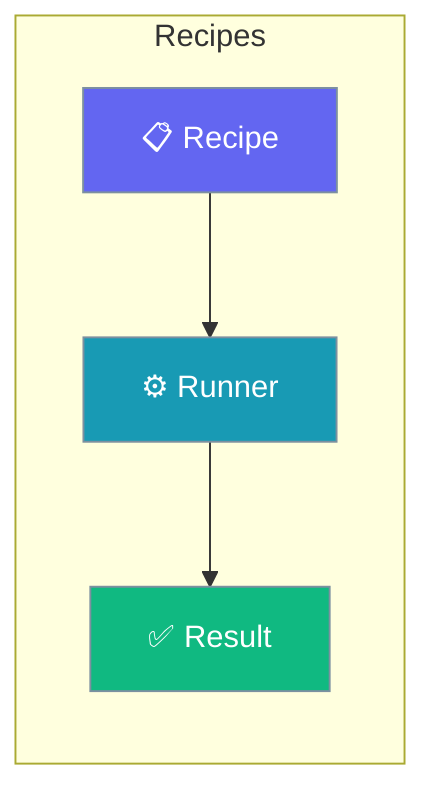
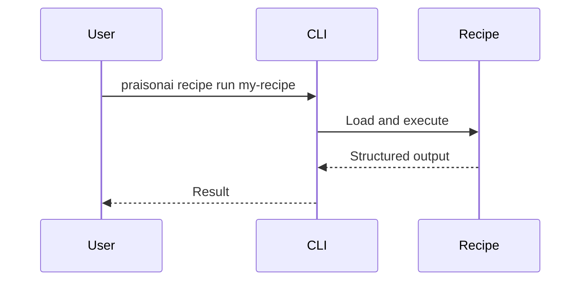

Navigate personas, integration models, and use cases for shipping PraisonAI recipes in production.

```python
from praisonaiagents import Agent

agent = Agent(
    name="Recipe Guide",
    instructions="Point developers to the right recipe integration docs.",
)
agent.start("Where should I start integrating a customer-support recipe?")
```

The user picks a path below—models, personas, or use cases—to implement recipes in their app.



## Quick Start

<Steps>
<Step title="Simple Usage">

List and run a recipe from the CLI.

```bash
praisonai recipe list
praisonai recipe run my-recipe --input '{"query": "Hello"}'
```

</Step>

<Step title="With Configuration">

Serve recipes over HTTP so any language can call them.

```bash
praisonai serve recipe --port 8765
```

</Step>
</Steps>

---

## How It Works



---

## Quick Navigation

<CardGroup cols={2}>
  <Card title="Integration Models" icon="diagram-project" href="/docs/guides/recipes/integration-models">
    6 ways to integrate recipes into your stack
  </Card>
  <Card title="Use Cases" icon="lightbulb" href="/docs/guides/recipes/use-cases">
    12 real-world implementation patterns
  </Card>
  <Card title="Personas" icon="users" href="/docs/guides/recipes/personas">
    Who uses recipes and how
  </Card>
  <Card title="Decision Guide" icon="compass" href="/docs/guides/recipes/decision-guide">
    When to use which integration model
  </Card>
</CardGroup>

## What Are Recipes?

Recipes are pre-packaged, reusable AI workflows that encapsulate:
- Agent configurations
- Tool assignments
- Workflow logic
- Input/output schemas
- Security policies

## Key Benefits

- **Reusability**: Package once, deploy anywhere
- **Consistency**: Same behavior across environments
- **Security**: Built-in policy enforcement
- **Observability**: Structured logging and tracing
- **Versioning**: Track and rollback changes

## Getting Started

```bash
# List available recipes
praisonai recipe list

# Run a recipe
praisonai recipe run my-recipe --input '{"query": "Hello"}'

# Start the recipe server
praisonai serve recipe --port 8765
```

## Best Practices

<AccordionGroup>
<Accordion title="Pick the integration model before writing code">
Six models trade latency, language, and operational complexity. The [Decision Guide](/docs/guides/recipes/decision-guide) maps your stack to the right one.
</Accordion>

<Accordion title="Version recipes like code">
Recipes package agents, tools, and policies together. Keep them in source control so behaviour stays consistent across environments and rolls back cleanly.
</Accordion>

<Accordion title="Serve over HTTP for polyglot stacks">
`praisonai serve recipe` exposes recipes to any language via REST. Reach for the sidecar model when the caller is not Python.
</Accordion>
</AccordionGroup>

---

## Next Steps

1. Review the [Integration Models](/docs/guides/recipes/integration-models) to choose your approach
2. Explore [Use Cases](/docs/guides/recipes/use-cases) for implementation patterns
3. Follow the step-by-step tutorials for your chosen model