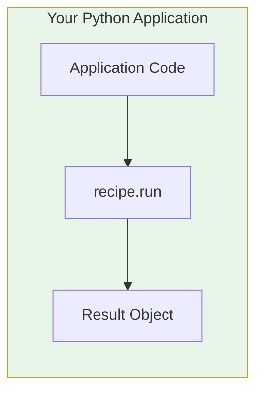
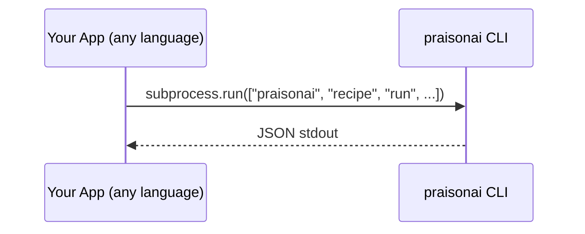
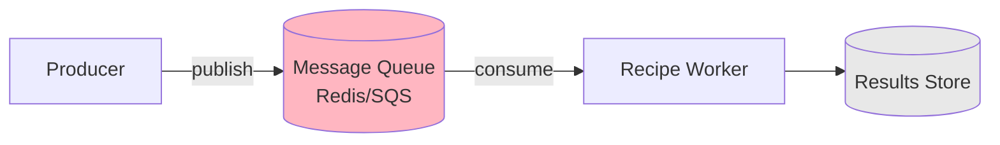
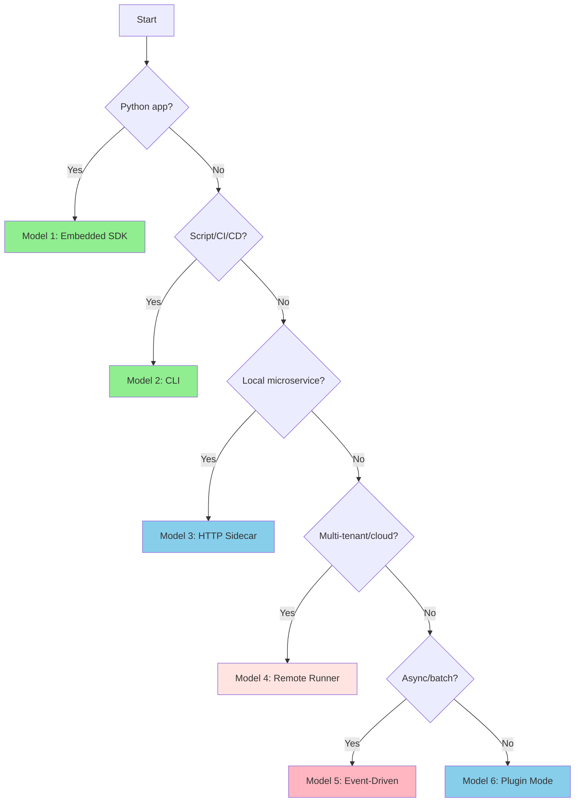

# Integration Models

PraisonAI recipes can be integrated into your applications using six distinct models. Each model has specific use cases, trade-offs, and implementation patterns.

## Model Overview

| Model | Latency | Complexity | Best For |
|-------|---------|------------|----------|
| 1. Embedded SDK | Lowest | Low | Python apps, notebooks |
| 2. CLI Invocation | Low | Low | Scripts, CI/CD |
| 3. Local HTTP Sidecar | Medium | Medium | Microservices, polyglot |
| 4. Remote Managed Runner | Medium | High | Multi-tenant, cloud |
| 5. Event-Driven | Variable | High | Async workflows |
| 6. Plugin Mode | Low | Medium | IDE/CMS extensions |

---

## Model 1 — Embedded Python SDK (In-Process)

### When to Use
- Python application (backend, notebook, script)
- Need lowest latency (no network hop)
- Single-tenant or trusted environment
- Direct access to recipe outputs

### How It Works



### Pros
- Zero network latency
- Direct memory access to results
- Simplest integration
- Full Python ecosystem available

### Cons
- Python-only
- Recipe runs in same process (resource sharing)
- No built-in multi-tenancy

### Step-by-Step Tutorial

<Steps>
  <Step title="Install PraisonAI">
    ```bash
    pip install praisonai
    ```
  </Step>
  <Step title="Set API Keys">
    ```bash
    export OPENAI_API_KEY=your-key
    ```
  </Step>
  <Step title="Run a Recipe">
    ```python
    from praisonai import recipe

    # List available recipes
    recipes = recipe.list_recipes()
    print(f"Found {len(recipes)} recipes")

    # Run a recipe
    result = recipe.run(
        "my-recipe",
        input={"query": "Summarize this document"},
        options={"timeout_sec": 60}
    )

    if result.ok:
        print(f"Success: {result.output}")
    else:
        print(f"Error: {result.error}")
    ```
  </Step>
  <Step title="Stream Results">
    ```python
    for event in recipe.run_stream("my-recipe", input={"query": "Hello"}):
        print(f"[{event.event_type}] {event.data}")
    ```
  </Step>
</Steps>

### Troubleshooting
- **ImportError**: Ensure `pip install praisonai` completed
- **Recipe not found**: Run `praisonai recipe list` to see available recipes
- **API key error**: Verify `OPENAI_API_KEY` is set

---

## Model 2 — CLI Invocation (Subprocess)

### When to Use
- Shell scripts, CI/CD pipelines
- Language-agnostic invocation
- Quick prototyping
- Batch processing

### How It Works



### Pros
- Works from any language
- Simple JSON output parsing
- No SDK dependency in calling app
- Easy to debug

### Cons
- Process spawn overhead
- Stdout/stderr parsing required
- No streaming (unless using --stream)

### Step-by-Step Tutorial

<Steps>
  <Step title="Verify CLI Installation">
    ```bash
    praisonai --help
    ```
  </Step>
  <Step title="List Recipes">
    ```bash
    praisonai recipe list --json
    ```
  </Step>
  <Step title="Run Recipe with JSON Output">
    ```bash
    praisonai recipe run my-recipe \
      --input '{"query": "Hello"}' \
      --json
    ```
  </Step>
  <Step title="Parse Output in Your App">
    ```python
    import subprocess
    import json

    result = subprocess.run(
        ["praisonai", "recipe", "run", "my-recipe",
         "--input", '{"query": "Hello"}', "--json"],
        capture_output=True,
        text=True
    )
    
    data = json.loads(result.stdout)
    print(f"Run ID: {data['run_id']}")
    print(f"Output: {data['output']}")
    ```
  </Step>
</Steps>

### Troubleshooting
- **Command not found**: Add praisonai to PATH or use full path
- **JSON parse error**: Ensure `--json` flag is used
- **Exit code non-zero**: Check stderr for error details

---

## Model 3 — Local HTTP "Recipe Runner" Sidecar

### When to Use
- Microservices architecture
- Non-Python services need recipe access
- Want HTTP API without cloud deployment
- Development/staging environments

### How It Works


### Pros
- Language-agnostic (HTTP)
- Supports streaming (SSE)
- Process isolation
- Easy to scale horizontally

### Cons
- Network latency (localhost)
- Need to manage server lifecycle
- Port management

### Step-by-Step Tutorial

<Steps>
  <Step title="Install Serve Dependencies">
    ```bash
    pip install praisonai[serve]
    ```
  </Step>
  <Step title="Start the Server">
    ```bash
    praisonai recipe serve --port 8765
    ```
  </Step>
  <Step title="Check Health">
    ```bash
    curl http://localhost:8765/health
    ```
  </Step>
  <Step title="List Recipes via HTTP">
    ```bash
    curl http://localhost:8765/v1/recipes
    ```
  </Step>
  <Step title="Run Recipe via HTTP">
    ```bash
    curl -X POST http://localhost:8765/v1/recipes/run \
      -H "Content-Type: application/json" \
      -d '{"recipe": "my-recipe", "input": {"query": "Hello"}}'
    ```
  </Step>
  <Step title="Use Endpoints CLI">
    ```bash
    # Health check
    praisonai endpoints health

    # List endpoints
    praisonai endpoints list --format json

    # Invoke endpoint
    praisonai endpoints invoke my-recipe \
      --input-json '{"query": "Hello"}' \
      --json
    ```
  </Step>
</Steps>

### Troubleshooting
- **Connection refused**: Ensure server is running
- **Port in use**: Use `--port` to specify different port
- **Missing deps**: Run `pip install praisonai[serve]`

---

## Model 4 — Remote Managed Runner (Self-Hosted or Cloud)

### When to Use
- Production multi-tenant deployments
- Need authentication/authorization
- Centralized recipe management
- Cloud-native architecture

### How It Works


### Pros
- Centralized management
- Built-in auth/audit
- Scalable infrastructure
- Multi-tenant support

### Cons
- Network latency
- Infrastructure complexity
- Requires auth setup

### Step-by-Step Tutorial

<Steps>
  <Step title="Start Server with Auth">
    ```bash
    # Set API key
    export PRAISONAI_API_KEY=your-secret-key

    # Start with auth enabled
    praisonai recipe serve \
      --host 0.0.0.0 \
      --port 8765 \
      --auth api-key
    ```
  </Step>
  <Step title="Configure Client">
    ```bash
    export PRAISONAI_ENDPOINTS_URL=https://api.example.com
    export PRAISONAI_ENDPOINTS_API_KEY=your-secret-key
    ```
  </Step>
  <Step title="Invoke with Auth">
    ```bash
    praisonai endpoints invoke my-recipe \
      --input-json '{"query": "Hello"}' \
      --api-key your-secret-key \
      --url https://api.example.com
    ```
  </Step>
  <Step title="HTTP with Auth Header">
    ```bash
    curl -X POST https://api.example.com/v1/recipes/run \
      -H "Content-Type: application/json" \
      -H "X-API-Key: your-secret-key" \
      -d '{"recipe": "my-recipe", "input": {"query": "Hello"}}'
    ```
  </Step>
</Steps>

### Troubleshooting
- **401 Unauthorized**: Check API key header
- **Connection timeout**: Verify network/firewall
- **TLS errors**: Ensure valid certificates

---

## Model 5 — Event-Driven Invocation (Queue/Stream)

### When to Use
- Asynchronous processing
- High-volume batch jobs
- Decoupled architectures
- Long-running workflows

### How It Works



### Pros
- Fully async
- Handles backpressure
- Retry/dead-letter support
- Scales independently

### Cons
- Infrastructure complexity
- Eventual consistency
- Debugging harder

### Step-by-Step Tutorial

<Steps>
  <Step title="Define Worker Script">
    ```python
    # worker.py
    import redis
    import json
    from praisonai import recipe

    r = redis.Redis()
    pubsub = r.pubsub()
    pubsub.subscribe('recipe-jobs')

    for message in pubsub.listen():
        if message['type'] == 'message':
            job = json.loads(message['data'])
            result = recipe.run(
                job['recipe'],
                input=job['input']
            )
            r.publish('recipe-results', json.dumps({
                'job_id': job['job_id'],
                'result': result.to_dict()
            }))
    ```
  </Step>
  <Step title="Publish Job">
    ```python
    import redis
    import json
    import uuid

    r = redis.Redis()
    job_id = str(uuid.uuid4())

    r.publish('recipe-jobs', json.dumps({
        'job_id': job_id,
        'recipe': 'my-recipe',
        'input': {'query': 'Process this'}
    }))
    ```
  </Step>
  <Step title="Consume Results">
    ```python
    pubsub = r.pubsub()
    pubsub.subscribe('recipe-results')

    for message in pubsub.listen():
        if message['type'] == 'message':
            result = json.loads(message['data'])
            print(f"Job {result['job_id']}: {result['result']}")
    ```
  </Step>
</Steps>

---

## Model 6 — Plugin Mode (CMS/IDE/Chat Extensions)

### When to Use
- IDE extensions (VS Code, JetBrains)
- CMS plugins (WordPress, Strapi)
- Chat integrations (Slack, Discord)
- Browser extensions

### How It Works


### Pros
- Native UX integration
- Leverages host app features
- User-friendly
- Context-aware

### Cons
- Platform-specific
- Sandboxing limitations
- Update management

### Step-by-Step Tutorial

<Steps>
  <Step title="Create Plugin Manifest">
    ```json
    {
      "name": "praisonai-plugin",
      "version": "1.0.0",
      "recipes": ["code-review", "doc-generator"],
      "endpoints": {
        "base_url": "http://localhost:8765"
      }
    }
    ```
  </Step>
  <Step title="Implement Plugin Handler">
    ```javascript
    // plugin.js
    async function invokeRecipe(recipeName, input) {
      const response = await fetch(
        `${config.endpoints.base_url}/v1/recipes/run`,
        {
          method: 'POST',
          headers: { 'Content-Type': 'application/json' },
          body: JSON.stringify({ recipe: recipeName, input })
        }
      );
      return response.json();
    }

    // Register command
    registerCommand('praisonai.runRecipe', async () => {
      const result = await invokeRecipe('code-review', {
        code: getSelectedText()
      });
      showOutput(result.output);
    });
    ```
  </Step>
</Steps>

---

## Decision Guide

Use this flowchart to choose the right model:



## Next Steps

- Explore [Use Cases](/docs/guides/recipes/use-cases) for real-world patterns
- Review [Personas](/docs/guides/recipes/personas) for role-specific guidance
- Check the [CLI Reference](/docs/cli/endpoints) for command details
