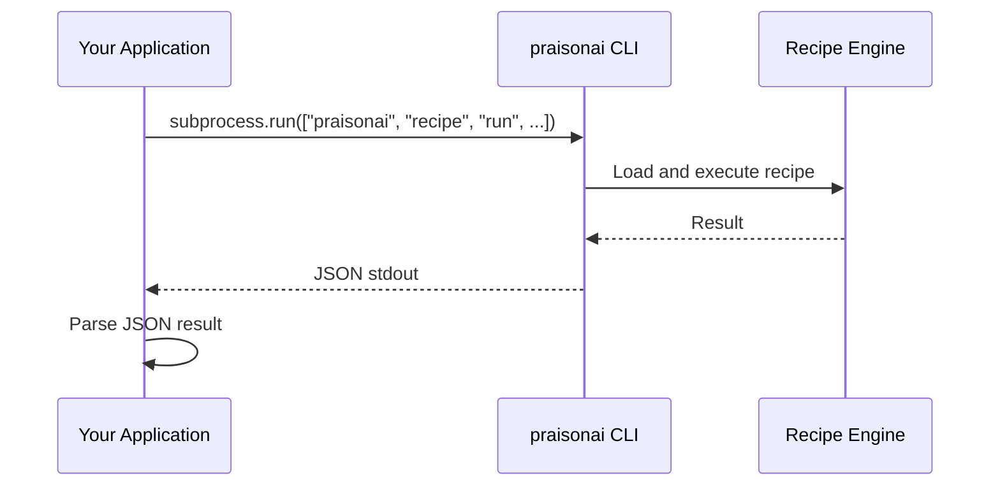

# Model 2: CLI Invocation (Subprocess)

<Callout type="info">
**When to Use**: Shell scripts, CI/CD pipelines, batch processing, or when you need language-agnostic recipe invocation without running a server.
</Callout>

## How It Works



The CLI model spawns a subprocess to run recipes. Output is captured via stdout in JSON format for easy parsing.

## Pros & Cons

<Tabs>
  <Tab title="Pros">
    - **Language-agnostic** - Works from any language that can spawn processes
    - **Simple JSON output** - Easy to parse in any language
    - **No SDK dependency** - Calling app doesn't need praisonai installed
    - **Process isolation** - Recipe runs in separate process
    - **Easy debugging** - Run commands manually to test
  </Tab>
  <Tab title="Cons">
    - **Process spawn overhead** - ~100-500ms per invocation
    - **Stdout/stderr parsing** - Need to handle output parsing
    - **No streaming** - Unless using `--stream` flag
    - **Environment setup** - CLI must be in PATH
  </Tab>
</Tabs>

## Step-by-Step Tutorial

<Steps>
  <Step title="Verify CLI Installation">
    ```bash
    praisonai --help
    ```
    
    If not found, install:
    ```bash
    pip install praisonai
    ```
  </Step>
  
  <Step title="List Available Recipes">
    ```bash
    # Human-readable format
    praisonai recipe list
    
    # JSON format for parsing
    praisonai recipe list --json
    ```
  </Step>
  
  <Step title="Get Recipe Info">
    ```bash
    praisonai recipe info my-recipe --json
    ```
  </Step>
  
  <Step title="Run Recipe with JSON Output">
    ```bash
    praisonai recipe run my-recipe \
      --input '{"query": "Hello"}' \
      --json
    ```
  </Step>
  
  <Step title="Parse Output in Your Application">
    <CodeGroup>
    ```python Python
    import subprocess
    import json

    result = subprocess.run(
        ["praisonai", "recipe", "run", "my-recipe",
         "--input", '{"query": "Hello"}', "--json"],
        capture_output=True,
        text=True,
        timeout=60
    )

    if result.returncode == 0:
        data = json.loads(result.stdout)
        print(f"Run ID: {data['run_id']}")
        print(f"Output: {data['output']}")
    else:
        print(f"Error: {result.stderr}")
    ```

    ```javascript Node.js
    const { execSync } = require('child_process');

    try {
      const result = execSync(
        'praisonai recipe run my-recipe --input \'{"query": "Hello"}\' --json',
        { encoding: 'utf-8', timeout: 60000 }
      );
      const data = JSON.parse(result);
      console.log(`Run ID: ${data.run_id}`);
      console.log(`Output: ${data.output}`);
    } catch (error) {
      console.error(`Error: ${error.message}`);
    }
    ```

    ```bash Bash
    result=$(praisonai recipe run my-recipe \
      --input '{"query": "Hello"}' \
      --json)
    
    echo "$result" | jq '.output'
    ```

    ```go Go
    package main

    import (
        "encoding/json"
        "os/exec"
    )

    func runRecipe(name string, input map[string]interface{}) (map[string]interface{}, error) {
        inputJSON, _ := json.Marshal(input)
        cmd := exec.Command("praisonai", "recipe", "run", name,
            "--input", string(inputJSON), "--json")
        
        output, err := cmd.Output()
        if err != nil {
            return nil, err
        }
        
        var result map[string]interface{}
        json.Unmarshal(output, &result)
        return result, nil
    }
    ```
    </CodeGroup>
  </Step>
</Steps>

## Production-Ready Example

```python
import subprocess
import json
import logging
from typing import Any, Dict, Optional

logging.basicConfig(level=logging.INFO)
logger = logging.getLogger(__name__)

class RecipeCLIClient:
    """Production-ready CLI client for recipe invocation."""
    
    def __init__(self, timeout: int = 60, retries: int = 3):
        self.timeout = timeout
        self.retries = retries
    
    def run(
        self,
        recipe_name: str,
        input_data: Dict[str, Any],
        dry_run: bool = False
    ) -> Dict[str, Any]:
        """Run a recipe via CLI with retries."""
        
        cmd = [
            "praisonai", "recipe", "run", recipe_name,
            "--input", json.dumps(input_data),
            "--json"
        ]
        
        if dry_run:
            cmd.append("--dry-run")
        
        last_error = None
        
        for attempt in range(self.retries):
            try:
                result = subprocess.run(
                    cmd,
                    capture_output=True,
                    text=True,
                    timeout=self.timeout
                )
                
                if result.returncode == 0:
                    data = json.loads(result.stdout)
                    logger.info(f"Recipe {recipe_name} completed: {data.get('run_id')}")
                    return data
                else:
                    logger.warning(f"Recipe failed (attempt {attempt + 1}): {result.stderr}")
                    last_error = result.stderr
                    
            except subprocess.TimeoutExpired:
                logger.error(f"Recipe timeout (attempt {attempt + 1})")
                last_error = "Timeout"
            except json.JSONDecodeError as e:
                logger.error(f"JSON parse error: {e}")
                last_error = str(e)
        
        raise RuntimeError(f"Recipe {recipe_name} failed: {last_error}")
    
    def list_recipes(self) -> list:
        """List available recipes."""
        result = subprocess.run(
            ["praisonai", "recipe", "list", "--json"],
            capture_output=True,
            text=True,
            timeout=30
        )
        
        if result.returncode == 0:
            return json.loads(result.stdout)
        return []


# Usage
if __name__ == "__main__":
    client = RecipeCLIClient(timeout=60, retries=3)
    
    # List recipes
    recipes = client.list_recipes()
    print(f"Found {len(recipes)} recipes")
    
    # Run a recipe
    result = client.run(
        "support-reply-drafter",
        {"ticket_id": "T-123", "message": "I need help"}
    )
    print(result["output"])
```

## CI/CD Integration

### GitHub Actions

```yaml
name: Run Recipe
on: [push]

jobs:
  run-recipe:
    runs-on: ubuntu-latest
    steps:
      - uses: actions/checkout@v4
      
      - name: Set up Python
        uses: actions/setup-python@v5
        with:
          python-version: '3.11'
      
      - name: Install PraisonAI
        run: pip install praisonai
      
      - name: Run Recipe
        env:
          OPENAI_API_KEY: ${{ secrets.OPENAI_API_KEY }}
        run: |
          praisonai recipe run code-review \
            --input '{"diff": "..."}' \
            --json > result.json
      
      - name: Upload Result
        uses: actions/upload-artifact@v4
        with:
          name: recipe-result
          path: result.json
```

### GitLab CI

```yaml
run-recipe:
  image: python:3.11
  script:
    - pip install praisonai
    - praisonai recipe run my-recipe --input '{"query": "test"}' --json
  variables:
    OPENAI_API_KEY: $OPENAI_API_KEY
```

## Troubleshooting

<Accordion title="Command not found: praisonai">
Add praisonai to your PATH or use the full path:
```bash
# Find installation path
python -c "import praisonai; print(praisonai.__file__)"

# Or use python -m
python -m praisonai recipe run my-recipe --json
```
</Accordion>

<Accordion title="JSON parse error">
Ensure you're using the `--json` flag and only parsing stdout:
```python
result = subprocess.run(cmd, capture_output=True, text=True)
# Only parse stdout, not stderr
data = json.loads(result.stdout)
```
</Accordion>

<Accordion title="Exit code non-zero">
Check stderr for error details:
```python
if result.returncode != 0:
    print(f"Exit code: {result.returncode}")
    print(f"Error: {result.stderr}")
```

Common exit codes:
- `1`: General error
- `2`: Validation error
- `7`: Recipe not found
</Accordion>

<Accordion title="Environment variables not passed">
Explicitly pass environment variables:
```python
import os

result = subprocess.run(
    cmd,
    capture_output=True,
    text=True,
    env={**os.environ, "OPENAI_API_KEY": "sk-..."}
)
```
</Accordion>

## Security & Ops Notes

<Callout type="warning">
**Security Considerations**
</Callout>

- **Input sanitization**: Never pass unsanitized user input directly to CLI
- **Shell injection**: Use list form of subprocess.run, not shell=True
- **API keys**: Pass via environment variables, not command line arguments
- **Timeouts**: Always set timeouts to prevent hanging processes

```python
# GOOD: List form, env vars
subprocess.run(
    ["praisonai", "recipe", "run", name, "--input", json.dumps(data)],
    env={"OPENAI_API_KEY": key}
)

# BAD: Shell form, key in command
subprocess.run(
    f"OPENAI_API_KEY={key} praisonai recipe run {name}",
    shell=True  # Dangerous!
)
```

## CLI Reference

```bash
praisonai recipe run <name> [options]

Options:
  --input <json>      Input data as JSON string
  --output <dir>      Output directory
  --json              Output as JSON
  --dry-run           Show what would be done
  --write             Execute (for dry-run-default recipes)
  --force             Force execution despite missing deps
  --consent           Acknowledge consent requirements
  --skip-checks       Skip dependency checks
```

## Next Steps

- [Local HTTP Sidecar](/docs/guides/recipes/integration-models/local-http-sidecar) - For HTTP-based integration
- [Remote Managed Runner](/docs/guides/recipes/integration-models/remote-managed-runner) - For production deployments
- [Use Cases](/docs/guides/recipes/use-cases) - Real-world implementation patterns
