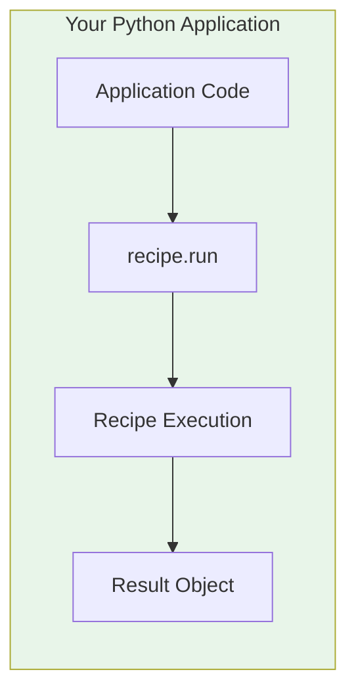

# Model 1: Embedded SDK (In-Process)

<Callout type="info">
**When to Use**: Python applications, Jupyter notebooks, data pipelines, or any scenario where you need the lowest possible latency and direct memory access to results.
</Callout>

## How It Works



The Embedded SDK runs recipes directly in your Python process. No network calls, no serialization overhead—just direct function calls.

## Pros & Cons

<Tabs>
  <Tab title="Pros">
    - **Zero network latency** - Direct in-process execution
    - **Direct memory access** - Work with Python objects directly
    - **Simplest integration** - Just import and call
    - **Full Python ecosystem** - Use any Python library alongside recipes
    - **Streaming support** - Real-time event streaming
  </Tab>
  <Tab title="Cons">
    - **Python-only** - Not available for other languages
    - **Shared resources** - Recipe runs in same process (memory, CPU)
    - **No built-in multi-tenancy** - Single-tenant by design
    - **No process isolation** - Errors can affect host process
  </Tab>
</Tabs>

## Step-by-Step Tutorial

<Steps>
  <Step title="Install PraisonAI">
    ```bash
    pip install praisonai
    ```
  </Step>
  
  <Step title="Set API Keys">
    ```bash
    export OPENAI_API_KEY=your-key
    ```
  </Step>
  
  <Step title="List Available Recipes">
    ```python
    from praisonai import recipe

    # List all available recipes
    recipes = recipe.list_recipes()
    for r in recipes:
        print(f"{r.name}: {r.description}")
    ```
  </Step>
  
  <Step title="Run a Recipe (Sync)">
    ```python
    from praisonai import recipe

    result = recipe.run(
        "my-recipe",
        input={"query": "Summarize this document"},
        options={"timeout_sec": 60}
    )

    if result.ok:
        print(f"Success: {result.output}")
    else:
        print(f"Error: {result.error}")
    ```
  </Step>
  
  <Step title="Run a Recipe (Streaming)">
    ```python
    from praisonai import recipe

    for event in recipe.run_stream("my-recipe", input={"query": "Hello"}):
        if event.event_type == "progress":
            print(f"[{event.data.get('step')}] {event.data.get('message')}")
        elif event.event_type == "completed":
            print(f"Done: {event.data.get('output')}")
    ```
  </Step>
</Steps>

## Production-Ready Example

```python
import logging
from praisonai import recipe
from praisonai.recipe import RecipeError, RecipeResult

logging.basicConfig(level=logging.INFO)
logger = logging.getLogger(__name__)

def process_with_recipe(
    recipe_name: str,
    input_data: dict,
    timeout_sec: int = 60,
    retries: int = 3
) -> RecipeResult:
    """
    Production-ready recipe invocation with retries and error handling.
    """
    last_error = None
    
    for attempt in range(retries):
        try:
            result = recipe.run(
                recipe_name,
                input=input_data,
                options={
                    "timeout_sec": timeout_sec,
                    "trace_id": f"req-{attempt}",
                }
            )
            
            if result.ok:
                logger.info(f"Recipe {recipe_name} completed: run_id={result.run_id}")
                return result
            else:
                logger.warning(f"Recipe failed (attempt {attempt + 1}): {result.error}")
                last_error = result.error
                
        except RecipeError as e:
            logger.error(f"Recipe error (attempt {attempt + 1}): {e}")
            last_error = str(e)
    
    # All retries exhausted
    raise RuntimeError(f"Recipe {recipe_name} failed after {retries} attempts: {last_error}")


# Usage
if __name__ == "__main__":
    result = process_with_recipe(
        "support-reply-drafter",
        input_data={"ticket_id": "T-123", "message": "I need help"},
        timeout_sec=30,
        retries=3
    )
    print(result.output)
```

## Troubleshooting

<Accordion title="ImportError: No module named 'praisonai'">
Ensure PraisonAI is installed in your Python environment:
```bash
pip install praisonai
```

If using a virtual environment, make sure it's activated.
</Accordion>

<Accordion title="Recipe not found">
Check available recipes:
```bash
praisonai recipe list
```

Recipes are discovered from:
1. `~/.praison/templates`
2. `~/.config/praison/templates`
3. `./.praison/templates` (current directory)
</Accordion>

<Accordion title="API key error">
Verify your API key is set:
```python
import os
print(os.environ.get("OPENAI_API_KEY", "NOT SET"))
```

Set it in your environment:
```bash
export OPENAI_API_KEY=sk-...
```
</Accordion>

<Accordion title="Timeout errors">
Increase the timeout or check if the recipe is hanging:
```python
result = recipe.run(
    "my-recipe",
    input=data,
    options={"timeout_sec": 120}  # 2 minutes
)
```
</Accordion>

## Security & Ops Notes

<Callout type="warning">
**Security Considerations**
</Callout>

- **Process isolation**: Recipes run in your process—malicious recipes could access your memory
- **API keys**: Ensure API keys are not logged or exposed
- **Input validation**: Validate inputs before passing to recipes
- **Resource limits**: Consider memory/CPU limits for long-running recipes

## API Reference

### `recipe.run()`

```python
def run(
    name: str,
    input: dict = None,
    config: dict = None,
    session_id: str = None,
    options: dict = None
) -> RecipeResult
```

| Parameter | Type | Description |
|-----------|------|-------------|
| `name` | str | Recipe name |
| `input` | dict | Input data for the recipe |
| `config` | dict | Recipe configuration overrides |
| `session_id` | str | Session ID for stateful recipes |
| `options` | dict | Execution options (timeout_sec, trace_id, etc.) |

### `recipe.run_stream()`

```python
def run_stream(
    name: str,
    input: dict = None,
    config: dict = None,
    session_id: str = None,
    options: dict = None
) -> Iterator[RecipeEvent]
```

Returns an iterator of `RecipeEvent` objects with:
- `event_type`: "started", "progress", "completed", "error"
- `data`: Event-specific data dictionary

## Next Steps

- [CLI Invocation](/docs/guides/recipes/integration-models/cli-invocation) - For scripts and automation
- [Local HTTP Sidecar](/docs/guides/recipes/integration-models/local-http-sidecar) - For polyglot environments
- [Use Cases](/docs/guides/recipes/use-cases) - Real-world implementation patterns
