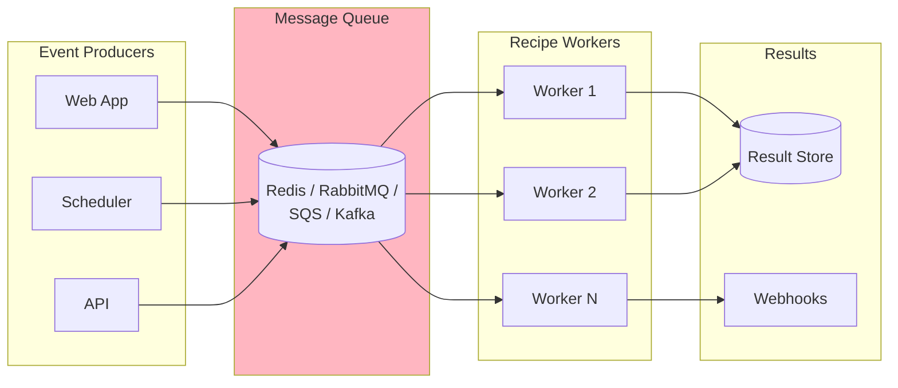

# Model 5: Event-Driven

<Callout type="info">
**When to Use**: High-volume batch processing, decoupled architectures, or when you need async recipe execution with guaranteed delivery and retry semantics.
</Callout>

## How It Works



The Event-Driven model decouples recipe invocation from execution. Producers publish recipe requests to a queue, and workers consume and process them asynchronously.

<Callout type="warning">
**Note**: PraisonAI does not include built-in queue support. This model documents an integration pattern using external message queues. You implement the producer/consumer logic in your application.
</Callout>

## Pros & Cons

<Tabs>
  <Tab title="Pros">
    - **Async at scale** - Process thousands of recipes concurrently
    - **Decoupled** - Producers don't wait for results
    - **Guaranteed delivery** - Queue handles retries
    - **Horizontal scaling** - Add workers as needed
    - **Fault tolerant** - Failed jobs can be retried
    - **Backpressure handling** - Queue buffers during spikes
  </Tab>
  <Tab title="Cons">
    - **Complexity** - Requires queue infrastructure
    - **No real-time response** - Results delivered async
    - **Eventual consistency** - Results may be delayed
    - **Debugging harder** - Distributed tracing needed
    - **Infrastructure cost** - Queue service costs
  </Tab>
</Tabs>

## Step-by-Step Tutorial

<Steps>
  <Step title="Choose a Message Queue">
    | Queue | Best For | Complexity |
    |-------|----------|------------|
    | Redis (rq) | Simple, low volume | Low |
    | Celery | Python-native, flexible | Medium |
    | RabbitMQ | Enterprise, reliable | Medium |
    | AWS SQS | Serverless, managed | Low |
    | Kafka | High throughput, streaming | High |
  </Step>
  
  <Step title="Install Dependencies">
    ```bash
    # For Redis Queue (rq)
    pip install rq redis praisonai
    
    # For Celery
    pip install celery praisonai
    ```
  </Step>
  
  <Step title="Define Worker Task">
    <CodeGroup>
    ```python Redis Queue (rq)
    # worker.py
    from rq import Worker, Queue
    from redis import Redis
    from praisonai import recipe
    import json

    def run_recipe_task(recipe_name: str, input_data: dict, callback_url: str = None):
        """Execute a recipe and optionally send results to callback."""
        result = recipe.run(recipe_name, input=input_data)
        
        if callback_url:
            import requests
            requests.post(callback_url, json=result.to_dict())
        
        return result.to_dict()

    if __name__ == "__main__":
        redis_conn = Redis()
        queue = Queue("recipes", connection=redis_conn)
        worker = Worker([queue], connection=redis_conn)
        worker.work()
    ```

    ```python Celery
    # tasks.py
    from celery import Celery
    from praisonai import recipe

    app = Celery('recipes', broker='redis://localhost:6379/0')

    @app.task(bind=True, max_retries=3)
    def run_recipe_task(self, recipe_name: str, input_data: dict):
        """Execute a recipe with automatic retries."""
        try:
            result = recipe.run(recipe_name, input=input_data)
            return result.to_dict()
        except Exception as e:
            self.retry(exc=e, countdown=2 ** self.request.retries)
    ```
    </CodeGroup>
  </Step>
  
  <Step title="Create Producer">
    <CodeGroup>
    ```python Redis Queue Producer
    # producer.py
    from rq import Queue
    from redis import Redis
    from worker import run_recipe_task

    redis_conn = Redis()
    queue = Queue("recipes", connection=redis_conn)

    # Enqueue a recipe job
    job = queue.enqueue(
        run_recipe_task,
        "support-reply-drafter",
        {"ticket_id": "T-123", "message": "Help needed"},
        callback_url="https://myapp.com/webhook/recipe-result"
    )

    print(f"Job ID: {job.id}")
    print(f"Status: {job.get_status()}")
    ```

    ```python Celery Producer
    # producer.py
    from tasks import run_recipe_task

    # Async invocation
    result = run_recipe_task.delay(
        "support-reply-drafter",
        {"ticket_id": "T-123", "message": "Help needed"}
    )

    print(f"Task ID: {result.id}")
    print(f"Status: {result.status}")

    # Wait for result (optional)
    output = result.get(timeout=60)
    print(output)
    ```
    </CodeGroup>
  </Step>
  
  <Step title="Start Workers">
    ```bash
    # Redis Queue
    rq worker recipes
    
    # Celery
    celery -A tasks worker --loglevel=info
    ```
  </Step>
</Steps>

## Production-Ready Example

```python
# event_driven_recipes.py
import os
import json
import logging
from typing import Any, Dict, Optional
from dataclasses import dataclass
from datetime import datetime
import uuid

logging.basicConfig(level=logging.INFO)
logger = logging.getLogger(__name__)

@dataclass
class RecipeJob:
    """Recipe job metadata."""
    job_id: str
    recipe_name: str
    input_data: Dict[str, Any]
    callback_url: Optional[str] = None
    created_at: str = None
    
    def __post_init__(self):
        if not self.created_at:
            self.created_at = datetime.utcnow().isoformat()

class RecipeJobProducer:
    """Producer for recipe jobs."""
    
    def __init__(self, redis_url: str = "redis://localhost:6379"):
        from rq import Queue
        from redis import Redis
        
        self.redis = Redis.from_url(redis_url)
        self.queue = Queue("recipes", connection=self.redis)
    
    def submit(
        self,
        recipe_name: str,
        input_data: Dict[str, Any],
        callback_url: str = None,
        priority: str = "normal"
    ) -> str:
        """Submit a recipe job to the queue."""
        job_id = str(uuid.uuid4())
        
        job = self.queue.enqueue(
            "worker.run_recipe_task",
            recipe_name,
            input_data,
            callback_url,
            job_id=job_id,
            job_timeout=300,  # 5 minutes
            result_ttl=86400,  # Keep results for 24 hours
        )
        
        logger.info(f"Submitted job {job_id} for recipe {recipe_name}")
        return job_id
    
    def get_status(self, job_id: str) -> Dict[str, Any]:
        """Get job status."""
        from rq.job import Job
        
        try:
            job = Job.fetch(job_id, connection=self.redis)
            return {
                "job_id": job_id,
                "status": job.get_status(),
                "result": job.result if job.is_finished else None,
                "error": str(job.exc_info) if job.is_failed else None,
            }
        except Exception:
            return {"job_id": job_id, "status": "not_found"}
    
    def get_result(self, job_id: str, timeout: int = 60) -> Optional[Dict]:
        """Wait for and return job result."""
        from rq.job import Job
        import time
        
        start = time.time()
        while time.time() - start < timeout:
            job = Job.fetch(job_id, connection=self.redis)
            if job.is_finished:
                return job.result
            if job.is_failed:
                raise RuntimeError(f"Job failed: {job.exc_info}")
            time.sleep(0.5)
        
        raise TimeoutError(f"Job {job_id} did not complete in {timeout}s")


class RecipeJobWorker:
    """Worker for processing recipe jobs."""
    
    def __init__(self, redis_url: str = "redis://localhost:6379"):
        from redis import Redis
        self.redis = Redis.from_url(redis_url)
    
    def run(self, queues: list = None):
        """Start the worker."""
        from rq import Worker, Queue
        
        queues = queues or ["recipes"]
        queue_objs = [Queue(q, connection=self.redis) for q in queues]
        
        worker = Worker(queue_objs, connection=self.redis)
        worker.work()


# Worker task function
def run_recipe_task(
    recipe_name: str,
    input_data: dict,
    callback_url: str = None
) -> dict:
    """Execute a recipe and handle results."""
    from praisonai import recipe
    import requests
    
    logger.info(f"Processing recipe: {recipe_name}")
    
    try:
        result = recipe.run(recipe_name, input=input_data)
        result_dict = result.to_dict()
        
        if callback_url:
            try:
                requests.post(
                    callback_url,
                    json=result_dict,
                    timeout=10
                )
                logger.info(f"Sent result to callback: {callback_url}")
            except Exception as e:
                logger.error(f"Callback failed: {e}")
        
        return result_dict
        
    except Exception as e:
        logger.error(f"Recipe execution failed: {e}")
        raise


# Usage example
if __name__ == "__main__":
    import sys
    
    if len(sys.argv) > 1 and sys.argv[1] == "worker":
        # Start worker
        worker = RecipeJobWorker()
        worker.run()
    else:
        # Submit job
        producer = RecipeJobProducer()
        
        job_id = producer.submit(
            "support-reply-drafter",
            {"ticket_id": "T-123", "message": "I need help"},
            callback_url="https://myapp.com/webhook/result"
        )
        
        print(f"Submitted job: {job_id}")
        
        # Wait for result
        result = producer.get_result(job_id, timeout=60)
        print(f"Result: {result}")
```

## AWS SQS Integration

```python
# sqs_worker.py
import boto3
import json
from praisonai import recipe

sqs = boto3.client('sqs')
QUEUE_URL = "https://sqs.us-east-1.amazonaws.com/123456789/recipe-jobs"

def process_messages():
    """Poll SQS and process recipe jobs."""
    while True:
        response = sqs.receive_message(
            QueueUrl=QUEUE_URL,
            MaxNumberOfMessages=10,
            WaitTimeSeconds=20,
        )
        
        for message in response.get("Messages", []):
            try:
                body = json.loads(message["Body"])
                
                result = recipe.run(
                    body["recipe_name"],
                    input=body["input_data"]
                )
                
                # Store result or send to callback
                print(f"Completed: {result.run_id}")
                
                # Delete processed message
                sqs.delete_message(
                    QueueUrl=QUEUE_URL,
                    ReceiptHandle=message["ReceiptHandle"]
                )
                
            except Exception as e:
                print(f"Error processing message: {e}")
                # Message will be retried after visibility timeout

if __name__ == "__main__":
    process_messages()
```

## Troubleshooting

<Accordion title="Jobs stuck in queue">
Check worker status and logs:
```bash
# Redis Queue
rq info

# Celery
celery -A tasks inspect active
```
</Accordion>

<Accordion title="Jobs failing silently">
Enable detailed logging:
```python
import logging
logging.basicConfig(level=logging.DEBUG)
```

Check failed job queue:
```bash
rq info --failed
```
</Accordion>

<Accordion title="Memory issues with large payloads">
Store large data externally and pass references:
```python
# Instead of:
queue.enqueue(task, large_data)

# Do:
data_id = store_in_s3(large_data)
queue.enqueue(task, data_id)
```
</Accordion>

<Accordion title="Callback failures">
Implement retry logic for callbacks:
```python
import requests
from requests.adapters import HTTPAdapter
from urllib3.util.retry import Retry

session = requests.Session()
retries = Retry(total=3, backoff_factor=0.5)
session.mount("https://", HTTPAdapter(max_retries=retries))
```
</Accordion>

## Security & Ops Notes

<Callout type="warning">
**Security Considerations**
</Callout>

- **Message encryption** - Encrypt sensitive data in messages
- **Queue authentication** - Secure queue access with credentials
- **Callback validation** - Validate callback URLs before sending
- **Dead letter queues** - Handle failed jobs properly
- **Rate limiting** - Prevent queue flooding

```python
# Validate callback URL
from urllib.parse import urlparse

def is_valid_callback(url: str) -> bool:
    parsed = urlparse(url)
    return (
        parsed.scheme in ("https",) and
        parsed.netloc and
        not parsed.netloc.startswith("localhost")
    )
```

## Monitoring

Key metrics to track:
- **Queue depth** - Number of pending jobs
- **Processing time** - Job execution duration
- **Failure rate** - Percentage of failed jobs
- **Worker utilization** - Active vs idle workers

```python
# Prometheus metrics example
from prometheus_client import Counter, Histogram

JOBS_TOTAL = Counter('recipe_jobs_total', 'Total jobs', ['recipe', 'status'])
JOB_DURATION = Histogram('recipe_job_duration_seconds', 'Job duration')

@JOB_DURATION.time()
def run_recipe_task(recipe_name, input_data):
    try:
        result = recipe.run(recipe_name, input=input_data)
        JOBS_TOTAL.labels(recipe=recipe_name, status='success').inc()
        return result
    except Exception:
        JOBS_TOTAL.labels(recipe=recipe_name, status='failed').inc()
        raise
```

## Next Steps

- [Plugin Mode](/docs/guides/recipes/integration-models/plugin-mode) - For IDE/CMS integration
- [Platform/DevOps Persona](/docs/guides/recipes/personas/platform-devops) - Infrastructure patterns
- [Use Cases](/docs/guides/recipes/use-cases) - Real-world implementations
