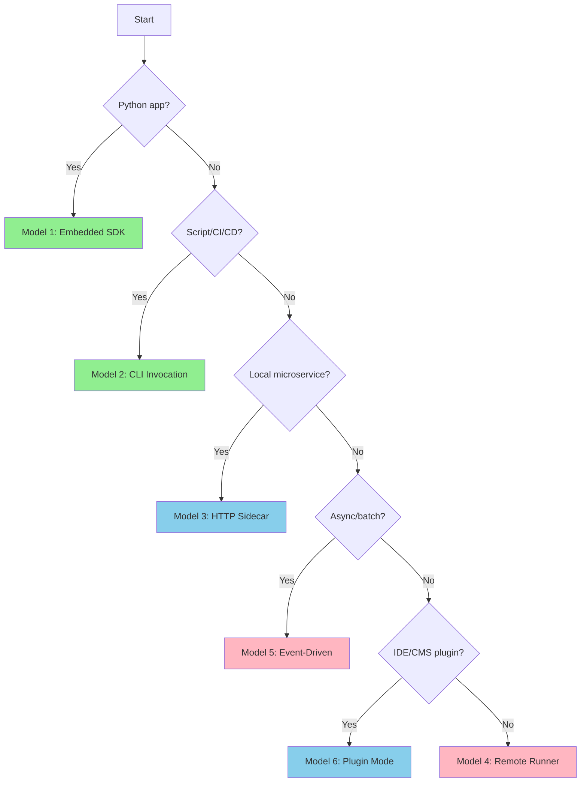

# Integration Models Overview

PraisonAI recipes can be integrated into your applications using six distinct models. Each model has specific use cases, trade-offs, and implementation patterns.

## Quick Comparison

<Tabs>
  <Tab title="By Latency">
    | Model | Latency | Best For |
    |-------|---------|----------|
    | Embedded SDK | **Lowest** | Python apps, notebooks |
    | CLI Invocation | Low | Scripts, CI/CD |
    | Plugin Mode | Low | IDE/CMS extensions |
    | Local HTTP Sidecar | Medium | Microservices, polyglot |
    | Remote Managed Runner | Medium | Multi-tenant, cloud |
    | Event-Driven | Variable | Async workflows |
  </Tab>
  <Tab title="By Complexity">
    | Model | Complexity | Setup Time |
    |-------|------------|------------|
    | Embedded SDK | Low | Minutes |
    | CLI Invocation | Low | Minutes |
    | Plugin Mode | Medium | Hours |
    | Local HTTP Sidecar | Medium | Hours |
    | Remote Managed Runner | High | Days |
    | Event-Driven | High | Days |
  </Tab>
  <Tab title="Local vs Remote">
    | Model | Deployment | Network Required |
    |-------|------------|------------------|
    | Embedded SDK | In-process | No |
    | CLI Invocation | Local subprocess | No |
    | Plugin Mode | Local/Remote | Optional |
    | Local HTTP Sidecar | Local container | Localhost only |
    | Remote Managed Runner | Cloud/Self-hosted | Yes |
    | Event-Driven | Distributed | Yes |
  </Tab>
</Tabs>

## Decision Guide



## Choose Your Integration Model

<CardGroup cols={2}>
  <Card title="Model 1: Embedded SDK" icon="python" href="/docs/guides/recipes/integration-models/embedded-sdk">
    **Lowest latency** - Direct Python integration with zero network overhead. Best for Python applications and notebooks.
  </Card>
  <Card title="Model 2: CLI Invocation" icon="terminal" href="/docs/guides/recipes/integration-models/cli-invocation">
    **Language-agnostic** - Invoke recipes from any language via subprocess. Perfect for scripts and CI/CD pipelines.
  </Card>
  <Card title="Model 3: Local HTTP Sidecar" icon="server" href="/docs/guides/recipes/integration-models/local-http-sidecar">
    **Polyglot friendly** - HTTP API running locally. Ideal for microservices and non-Python applications.
  </Card>
  <Card title="Model 4: Remote Managed Runner" icon="cloud" href="/docs/guides/recipes/integration-models/remote-managed-runner">
    **Production-ready** - Centralized, authenticated recipe execution. Built for multi-tenant cloud deployments.
  </Card>
  <Card title="Model 5: Event-Driven" icon="bolt" href="/docs/guides/recipes/integration-models/event-driven">
    **Async at scale** - Queue-based invocation for high-volume batch processing and decoupled architectures.
  </Card>
  <Card title="Model 6: Plugin Mode" icon="puzzle-piece" href="/docs/guides/recipes/integration-models/plugin-mode">
    **Native UX** - Embed recipes into IDEs, CMS platforms, and chat applications.
  </Card>
</CardGroup>

## Feature Matrix

| Feature | SDK | CLI | Sidecar | Remote | Event | Plugin |
|---------|-----|-----|---------|--------|-------|--------|
| **Streaming** | ✅ | ✅ | ✅ | ✅ | ❌ | ✅ |
| **Multi-tenant** | ❌ | ❌ | ❌ | ✅ | ✅ | ❌ |
| **Auth built-in** | ❌ | ❌ | ✅ | ✅ | ✅ | ❌ |
| **Async native** | ✅ | ❌ | ✅ | ✅ | ✅ | ✅ |
| **Process isolation** | ❌ | ✅ | ✅ | ✅ | ✅ | ✅ |
| **Hot reload** | ❌ | ✅ | ✅ | ✅ | ❌ | ❌ |

## Quick Start

<CodeGroup>
```python Embedded SDK
from praisonai import recipe

result = recipe.run("my-recipe", input={"query": "Hello"})
print(result.output)
```

```bash CLI
praisonai recipe run my-recipe --input '{"query": "Hello"}' --json
```

```bash HTTP Sidecar
# Start server
praisonai serve recipe --port 8765

# Invoke
curl -X POST http://localhost:8765/v1/recipes/run \
  -H "Content-Type: application/json" \
  -d '{"recipe": "my-recipe", "input": {"query": "Hello"}}'
```
</CodeGroup>

## Next Steps

1. Choose your integration model based on the decision guide above
2. Follow the dedicated page for step-by-step setup
3. Review [Personas](/docs/guides/recipes/personas) for role-specific guidance
4. Explore [Use Cases](/docs/guides/recipes/use-cases) for implementation patterns
